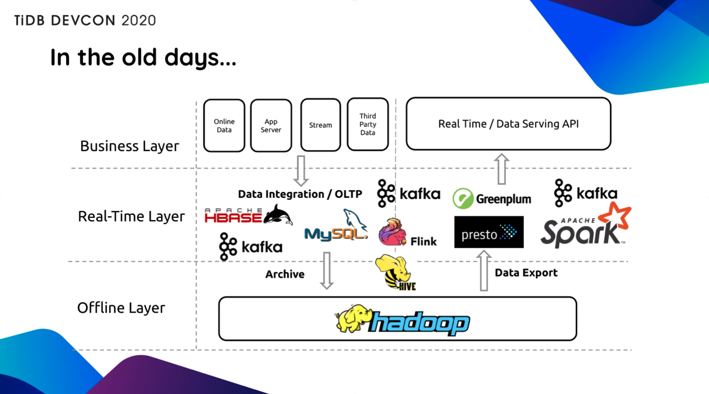

>6 月 7 日，TiDB 社区年度技术大会 [TiDB DevCon 2020](https://mp.weixin.qq.com/s/MKNy10fyg2erYyrB_r8I2w) 圆满落幕，本届大会采取线上直播的形式，汇聚了来自全球各地的 **80+** 开发者、TiDB 用户及合作伙伴分享第一手开发及实践经验，议题覆盖金融、电信、电商、物流、视频、资讯、教育、医疗等诸多行业，干货满满，目不暇接。会上我们正式发布了具有里程碑意义的 TiDB 4.0 GA 版本，并分享了技术细节及生产环境的实战效果，并为过去年在 TiDB 社区作出卓越贡献的 Contributor、Committer、Maintainer 授予了荣誉奖杯与证书。
>
>本届大会历时 2 天，共设置 7 个论坛，**29 小时**累计分享时长，直播间人气值高达 **2.3 万**，错过的小伙伴们可以继续“蹲守”本公众号近期推送，我们将陆续挑选整理部分精彩内容输出，敬请期待！

> **以下是我司联合创始人兼 CEO 刘奇的现场分享实录。**

每年我都有一个时间会特别激动，就是产品大版本发布的时候，通常也是社区年度技术大会 TiDB DevCon 举办的时间。去年 [TiDB DevCon 2019](https://mp.weixin.qq.com/s/MKNy10fyg2erYyrB_r8I2w)，我们发布了 TiDB 3.0 Beta，当然今年 TiDB 4.0 GA 也如约而至。

## Serverless

很长一段时间 TiDB 用户使用的集群规模都很大，然后就会再提出一个诉求说“怎么降低我的使用成本”。TiDB 4.0 拥有了 Serverless 能力之后，会根据用户的实际业务负载，基于 K8s 自动做弹性伸缩。

从前，当我们在上线一个系统的时候，第一件事就是 Capacity Planning，去评估一下我们大概需要多少台服务器，比如提前准备了 50 台，但是实际上线之后跑了一个月，发现 5 台机器就够了。这就导致了大量的资源浪费。如果整个系统能够在云上全自动弹性伸缩，就能避免这种资源浪费。

**更重要的是，TiDB 的弹性伸缩，意味着你永远不需要按照业务的峰值配备系统资源**。比如大家的业务会有早、晚两个明显的高峰，但实际上每个高峰持续时间通常只有 2 个小时左右，也就是说，为了这 4 个小时的高峰，而我们配置了 24 小时的最高资源配置，并为此付费，但非高峰时间的资源和成本完全是可以节省的，可能算下来，我们能够节省的成本大概在 70% 左右，甚至更高。

另外，能够弹性伸缩的 TiDB 可以应对无法预测的 Workload，没有人知道哪一个商品在什么时候会大卖，没有人知道我卖的哪一个基金在什么时候会火，这时如果我们给系统一个权限，让它能够自动根据业务当前的实际情况，扩充服务器，这对某个企业或者某个业务来说，可能是“救命之道”，比如像上图的情况，人为介入往往是太慢了，来不及了。

## Real-Time HTAP

在当今这个世界，大家希望所有的东西都要更快、更简单。但如果大家还是按照传统的方式去运用一个数据库，就不能满足这个“更快、更简单”的需求了，因为传统的方式需要经过一系列非常复杂的过程从数据库里面去提取这些变化的信息、事件、日志，再去做分析，那这个过程往往会带来比较长的延迟，这些「延迟」让我们失去了很多直接的经济价值。

在 TiDB 4.0，我们正式推出了 [TiFlash](https://pingcap.com/blog-cn/tiflash-is-getting-faster/)，TiFlash 是配合 TiDB 体系的列存引擎，它和 TiDB 无缝结合，在线 DDL、无缝扩容、自动容错等等方便运维的特点也在 TiFlash 中得到继承，同时 TiFlash 可以实时与行存保持同步。

有了 TiFlash，TiDB 4.0 在大量的复杂计算场景下，至少能够比上一个版本快 10 倍，并且我们永远不需要去操心“一致性”的问题。**不管，面临的是简单的 OLTP 类型的 Workload，还是复杂的 OLAP 类型的 Workload，它总是一致的、实时的，并且能够自动弹性扩张或伸缩。**

上面的架构图大家应该非常熟悉，几乎每一家拥有一定数据规模的公司都经历过。曾经有一个用户，他们在一个大概只有几十 T 数据规模的场景下，搭建了类似上图那样复杂的系统，就是为了能够做 OLTP 和一个报表查询。这中间不得不接入 Kafka 和 ETL，然后将这个报表查询的结果又重新序列化到 HBase 之类的存储系统里面。有没有办法去简化整个系统呢？

当我们用 TiDB 4.0 的视角去看的时候，用户已经给出了他们上线的答案。如上图所示，当我们把 TiDB 放在中间这一层，整个系统的复杂度就降低了非常多。接下来也会有用户分享他们使用 TiFlash 的经验，以及他们在架构上面做了哪些简化。

说回来，站在基础架构这一层，用户其实并不想知道这个 Workload 到底是长查询还是短查询，**站在用户的角度，只是希望尽快得到结果，尽可能减少过程的复杂度以节省成本、提高开发速度，创造更多价值。**

## Cloud-Native

我知道大家都非常期待 PingCAP 能够提供 TiDB 的云服务，现在我很高兴发布 **TiDB Cloud**，由 PingCAP 来管理，维护，优化的 TiDB 云。

**我们从四年前就开始做了这个准备，今天 TiDB 可以无缝地在“云端跳舞”。**

如果有人说：“我不想安装 TiDB，我不想去维护 TiDB”。那这个事，你也可以选择交给 PingCAP 来做。目前我们已经支持了 AWS、GCP 两个云平台（其它云平台的支持也在稳步推进），如果你正在使用这两个平台，那么你什么都不需要做，点几下鼠标就可以轻松使用 TiDB，真正的「开箱即用」。

在 TiDB 4.0 中我们提供了超过 70 个新特性，可以阅读这篇文章《[TiDB 4.0：The Leading Real-Time HTAP Database is Ready for Cloud](https://pingcap.com/blog-cn/tidb-4.0-the-leading-real-time-htap-database-is-ready-for-cloud/)》。

## Dashboard

在 TiDB 4.0 里面内置了 [Dashboard](https://pingcap.com/blog-cn/tidb-4.0-tidb-dashboard/)，非常适合像我这种很久没有写 SQL 的人，通过图形界面解决大多数问题，观察整个系统里的热点数据、慢查询，业务在数据库上具体是什么样子，通过多种不同的视图去理解业务负载等等。我们希望在 10 秒钟内就帮用户定位大部分故障和问题，下面的 Dashboard 满足了我的所有“幻想”。

## 性能：Faster and faster

性能是一个永远都会“令人兴奋”的问题。对比 3.0 版本，TiDB 4.0 整体的性能提升了 50% 左右；如果是跑聚合查询，在很多场景下能做到提升 10 倍，甚至是更高，TPC-H 的性能也提升了一倍。这个成果也来自于整个 TiDB 开源社区的贡献，去年年底我们举办了 TiDB 挑战赛 [第一季“性能挑战赛”](https://pingcap.com/blog-cn/pcp-report-202002/)，总共有 165 位社区开发者参赛，包括 23 支参赛队伍和 122 位个人参赛者，他们的参赛成果都落地到了 TiDB 产品当中。

## TiUP 一键安装部署

之前有同学吐槽说，我安装 TiDB 太麻烦了，花了几十分钟甚至一天，才把整个系统部署起来。

在 TiDB 4.0 中，我们专门写了一个工具，叫 TiUP，它是一个包管理器。通过 TiUP，大家可以在一分钟内本地把 TiDB 跑起来，一分钟就能够体验 TiDB。而部署 15 个节点的生产集群也只需要 45 秒，也就是完全做到 1 分钟内快速体验。TiUP 是一个巨大的易用性体验的提升，欢迎大家去体验。

>TiUP: A component manager for the TiDB eco-system
>
>Try TiDB (playground) within 1 minute with 1 command
>
>$ curl https://tiup-mirrors.pingcap.com/install.sh | sh  && tiup playground nightly --monitor
>
>Deploy a production cluster in 45 seconds

**TiUP 对用户来说是一个巨大的易用性体验的提升，欢迎大家去体验。**

## Security matters! 

随着 TiDB 在全球的应用规模越来越大，越来越多的用户在更加严肃的场景里使用 TiDB，因此我们也提供了大家非常关注的安全特性，来符合各个国家对安全和隐私的合规要求。目前所有 TiDB 通讯组件的通讯过程都是全部加密的，所有存储的数据都支持透明加密，包括 PingCAP 或者任何一家云厂商，都不能侵犯到 TiDB 用户的数据隐私与安全。当 TiDB 跑在这个云上时，没有人能够看到数据库，没有人能够从中截获到通讯过程的数据。

## 实战效果如何？

相信有人会有疑问，讲了这么多，TiDB 4.0 是否真的准备好了？能不能上生产环境？有没有实战数据分享？

上图知乎的已读服务，前几天知乎刚升级到 TiDB 4.0 的最大的一个内部集群。整个集群容量有 1 PB，目前的存储数据量已经达到了 471TB。

我第一次看到这个数据的时候还是非常震惊的，不仅仅是因为数据规模，还震惊和感动于孙晓光老师（知乎，TiKV Maintainer）对 4.0 的信心，他们在 5 月 28 日 4.0 GA 版本正式发布的第4天，就已升级。当然，看到这个结果，我的信心也更强了，**TiDB 不仅仅支撑这么大数据规模，更重要的是让知乎已读服务的整个系统计算能力有了很大的提升，极大改善了整个系统的延迟。**

从上图可以看到，TiDB 4.0 与上一个版本相比，降低了 40% 的延迟，换句话说，如果在维持相同的延迟的情况下，大约能够降低 40% 的成本。

## Why is TiDB so Popular ?

过去的一年，我也会经常被问到一个问题，为什么 TiDB 如此的流行？为什么 TiDB 能够走遍全世界？为什么能够得到这么多用户的使用和赞赏（当然也有吐槽，用户的吐槽也让我们很积极、很有动力去改进，去快速迭代）？

其实这一切不仅仅是 PingCAP 的功劳，而是整个开源社区的功劳，PingCAP 只是 Community 的一部分。正是因为有全球各地的开发者参与贡献，比如美国的 Square、Azure、Zoom、法国的 Dailymotion、日本的 PayPay 等等，给我们提意见、提需求，提 PR 贡献代码，一起打磨、一起成就了今天的 TiDB ，组成了现在庞大的 TiDB 开源社区。

在 4.0 发布的时候，我们也做了一个词云，看了看 TiDB 代码贡献者所属的组织，并且按照组织的贡献程度，画了一张图出来，我们才发现原来有这么多的组织，在 TiDB Community 中持续贡献：

同时，经常会让我感到惊喜的是社区的创造性。比如 TiDB Contributor 刘东坡把贡献排名前 100 的 Contributor 做了可视化的展示：

https://rustin-liu.github.io/Ti2020/

**这位小伙伴也在本届 TiDB DevCon 的开发者社区专题论坛中分享了参与社区的心路历程，我们也希望更多人能够像这位小伙伴一样，在 TiDB 社区中有所收获，更在贡献中感受到乐趣&归属感。**

另外，不管你是谁，只要你想参与 TiDB 的打造或者想使用 TiDB，我们都为你准备好了：

* 如果你在用 TiDB 过程中，遇到任何问题，你都可以去 AskTUG（https://asktug.com）提问，有超过 2700 个会员，他们都在 AskTUG 中分享实战经验或者踩过的坑，或许你遇到的问题，在这里搜索一下就能得到解答。

* 如果你还想进一步再深入的学习 TiDB，我们也推出了 PingCAP University（https://university.pingcap.com）线上及线下的培训课程。最后大家也可以验证一下自己的学习效果，也可以去参加认证考试（如下图所示）。

在过去的几个月里，TiDB 社区伙伴们也做了一些比较疯狂的事情。比如，我们花了 48 小时写了一本书[《TiDB 4.0 in Action》](https://pingcap.com/blog-cn/tidb-in-action-finish/)（阅读地址：book.tidb.io）。或许乍一听觉得很神奇，48 小时怎么可能能写一本书呢？但大家去看一下作者的数量就能理解了，这本书有 100 多位作者，每个人写一小节，就是 100 小节，48 小时轻松搞定。**当然这个事情也不是轻松促成的，它的实现其实是整个社区长时间的知识&精神力量的积累。**

如果看到这里，你雄心勃勃，还想再精进一步，想写一个属于自己的分布式数据库。没问题，我们还准备了 Talent Plan 课程，可以根据课程规划一步步 build 一个分布式数据库的计算层、存储层，这门课程还会有来自全球各地的导师帮你 Review 代码和作业，目前暂时支持中文和英文。

## Bonus: Chaos Mesh™!

最后聊一聊我们在混沌工程方面的实践，在软件领域有一个常识是，“现实中所有可以预见的故障，最后都必然会发生”，系统的复杂性是无法逃避的、必须要面对的，也是我们必须要去解决的。**在今天，整个系统的复杂性已经不仅仅局限于数据库了，而是延展到了整个业务的全链路，最终落脚在系统为用户提供的服务质量。**

如上图所示，Amazon 和 Netflix 两家公司的微服务可视化之后的样子，不能简单用蜘蛛网来比喻，它实际上比蜘蛛网还要复杂得多。所以我们需要一套系统，去模拟现实中所有可能发生的故障，并且让这个故障不断的发生，未雨绸缪地增强系统的鲁棒性。

因此，我们在开发 TiDB 的整个过程中，构建了一套系统 **Chaos Mesh**。它会做什么？

比如，它可以模拟磁盘坏掉。在我们的测试环境中，磁盘每分钟坏一次，网络每分钟都会产生隔离。尽管这种情况在现实世界中极少出现，但是一旦出现就会形成灾难性的故障。而模拟磁盘坏掉只是 Chaos Mesh 可以提供的众多功能之一。

[Chaos Mesh](https://github.com/pingcap/chaos-mesh) 将帮助大家在业务的全链路上，做完整的、所有可能出现的故障测试。以往大家凭经验所说的 “有 99.99% 或者有 99.999% 的几率系统能够正常运行”，都包含了一些“运气”成分在其中。因为，我们用 Chaos Mesh 去测试了各种故障情况，会发现某个系统要做到“99.99% 或者 99.999% 正常运行”是非常非常少见的、极其困难的一件事。**在 TiDB 的开发过程中，我们同步使用了 Chaos Mesh 来测试 TiDB，TiDB 4.0 在测试用户中的反馈非常好，一部分也要归功于 Chaos Mesh “疯狂摧残式”的测试。当然我们也非常欢迎大家使用 Chaos Mesh 测试和打磨自己的系统。**

## 结语

**实际上，TiDB 发展到今天，已经不仅仅是一个数据库产品，它已经是很多系统的基石，作为一个基础设施的存在**。大家在使用之前，也可以参考其他人的成熟经验或者解决方案，TiDB DevCon 2020 上有 80+ TiDB 用户&合作伙伴分享一手实践经验，不管你来自哪个行业，比如金融、电商、物流、新零售、出行、电信、医疗、能源、制造业、高科技、教育、视频、资讯；还是应用在不同的使用场景，比如实时分析、数据汇聚、Data Mart，元数据存储、日志审计、日志统计分析，还有 IM 等等。所有你想看了解的行业参考，你想了解的场景实践，我们已经准备好了。后续 TiDB DevCon 2020 部分视频&文字回顾将陆续整理输出，敬请期待。

---

感谢社区伙伴们的热情参与和支持，未来我们继续携手同行，走向开源世界的星辰大海！关注 PingCAP 微信公众号，在后台回复“**DevCon2020**”获取部分经过讲师授权后整理的 PPT 资料。

>TiDB DevCon 是 PingCAP 团队面向 TiDB 社区推出的技术会议，每年在北京举办。本届 DevCon 在 6 月 6 ～ 7 日举办，以线上直播的方式，为大家展示 TiDB 近一年的产品技术蜕变，分享最新的海内外生态进展，并邀请了来自全球的 80+ 位开发者、用户及合作伙伴，分享他们的实战经验和开源思考，覆盖金融、制造业、电信、电商、物流、能源、快消、新零售、云计算等多个领域。