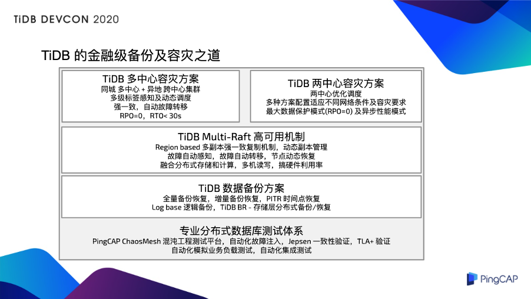
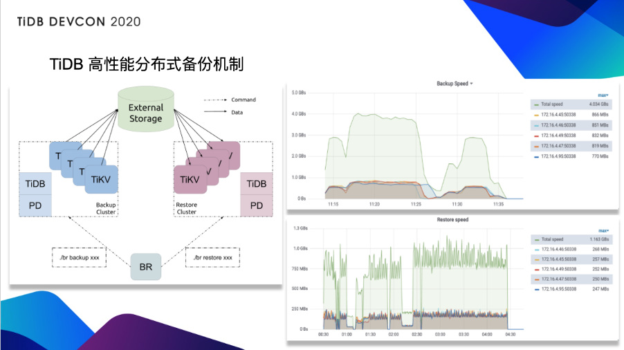
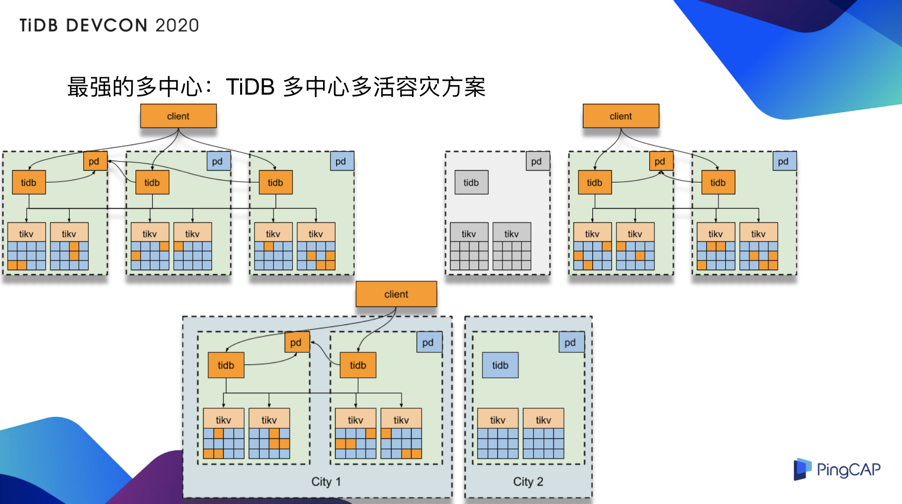
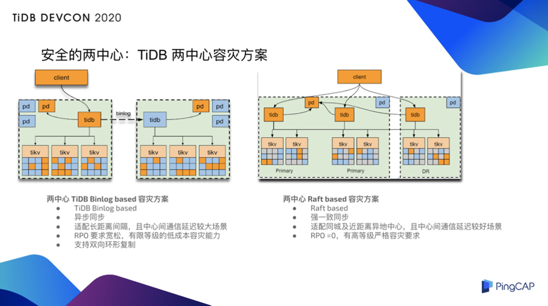

>作者简介：余军，PingCAP 解决方案事业部总经理。

对于金融企业来说，尤其是银行、证券、保险这些行业，在一个 IT 系统运行支撑业务的过程当中，考虑到硬件的故障、网络的故障，等一切可能会对业务产生影响的突发故障。那么，在过去漫长的 IT 发展的过程当中，大量的技术被应用在关于如何解决组件级的高可用，整个服务的容灾和灾备，包括如何保证整体业务的连续性。

在金融行业来说，数据库作为最核心的基础组件之一，要求它能够安全运行和保障数据安全，这是一个刚需。另外，数据库服务本身的高可用，是我们实现整个对外数据服务连续性的最重要的基石。在这些基础上，光有高可用还是不够的，我们需要考虑到机房级的、数据中心级的、站点级的灾难导致的对业务的影响。配套的容灾技术，以及对应事件的方案，应运而生。在过去的二、三十年里面，关于容灾和技术的技术手段、软件工具，包括各种各样的方案、管理方法，在不断的展现。

## 传统数据库支撑关键计算的高可用/容灾方案短板

回到传统的数据库领域，在过去至少三四十年的时间里，我们都是在使用集中式的数据库，比如大家非常熟悉的 Oracle、DB2 包括曾经很辉煌的 Sybase、Informix 等等。这些数据库都是以大家所熟知的“ IOE”的架构来实现数据服务的。

在这些技术体系下，在长期的技术发展过程当中，也有产生对应的高可用和容灾的方案，比如说大家非常熟悉的 Oracle RAC，比如说我们在 DB2 上，经常会用到的 HACMP，还有曾经大名鼎鼎的 Veritas VCS，MC/SG，以及红帽的 RHCS , Pacemaker/Corosync 等实现单机数据库高可用的。

这些技术都是通过数据库，建主从的实例，然后共享数据库的数据文件，放在高端的数据的存储上。这种集中架构的话，它总体是比较稳定的，但是随着 IT 应用场景的不断发展，到今天为止，我们在考虑数据库的时候，除了要考虑它的可靠性之外，还需要考虑它如何应对海量的数据处理，海量的并发请求。**那么我们需要必须寻求扩展，而集中式的结构，它没有办法做横向扩散。此外的话，这种传统的数据库的高可用方式，非常依赖于外部的组件，就是前面说的这些独立的厂商提供的相关的高可用和容灾组件。**

进入到开源数据库的阶段，大家所熟知的 MySQL 和  PostgreSQL，它们也会有对应的高可用的解决方案，比如 MySQL 它最常见的就是通过它的 Binlog 复制建立起来主从队，然后在数据库之外，我们采取类似像 MHA 这样的一个 SwitchManager 的工具，包括 PG 的话，它有 PAF、RepMgr、Ptroni 这样的技术。

**在这样的技术场景中，其实在可用性和容灾方面，还是有很多的问题**，比如说复制的时候的采用的异步复制，增强的半同步复制以及国内好多互联网公司定制的 MySQL，PG 的同步方案，在多节点，跨地域容灾灾备场景中的一致性的问题，始终是一个很大的挑战。特别是在容灾的场景当中，超过 1000 公里以上的站点距离间隔，用上述复制的方式，用独立的 SwitchManager 的故障切换机制，是不是能够保证在千公里以上的容灾的可靠性是很大一个疑问。

**此外，主从复制的模式资源利用率比较低**。到现在为止，我们还有在主从复制基础上，再往前走一步，提高高可用性的一些保障机制，比如说大家都熟知的组同步，像 Codership 之前做的 Galera，像包括 MariaDB Galera Cluster 和 Percona XtraDB Cluster，都把 Galera 组件放在产品当中。包括现在 MySQL 新版本中的复制技术实现了组同步 MGR。但是这些方向又有它的问题，比如说它的性能损耗非常显著，然后在多写场景的冲突的处理复杂性，以及整个集群的扩展规模，受到这样的限制。

## 分布式数据库备份容灾的挑战

所以，从单机数据库进入到分布式数据库的领域，问题的挑战就更加大了。集中来看的话，就是比如说我们最常见的两个传统的分布式的数据库的架构：MySQL、PG 加上主从复制核心组件，再加一个高可用的外部组件实现 Failover/Switchover，然后再加分库分表中间件。那么这样的方案，在传统的分布式架构当中，它的核心的可用性的技术限制和天花板没有变化。它还是如前文所说的：主从复制加上一个数据库外部组件实现 Failover/Switchover 。

**然后，在分布式数据库架构里，我们需要非常认真的去考虑，分布式数据库的伸缩能力和它怎么样去跟高可用及容灾的要求达到平衡。甚至还要想怎么样再去做进一步的优化，这是比较困难和有挑战的。**

另外，在互联网应用场景中， 访问量和数据量非常的大，业务逻辑相对简单。**但是在银行、保险、证券等这样的传统关键金融场景当中，业务的逻辑是非常复杂的。针对于这样的传统高可用及灾备容灾方案，它与应用进行适配，往往要做一些面向应用的反向适配，应用还需要为此进行调整与妥协**。比如说两地三中心的场景当中，应用适配的难度更加大，所以改造过程当中的适配过程和反向适配的风险，也是一个经常让金融行业的 IT 从业人员非常头痛的一件事情。

最严峻的一个事情，当在这样的传统灾备容灾方案为基底的一套系统在运行的过程当中，真的发生了非预期的重大故障和灾难突发的时候，怎么样保证数据的严格安全，以及如何保证在故障发生以后，对于部分组件，对于机房级的灾难，对于中心级的灾难，在灾难发生的时候，要保证对业务的最小影响，也就是我们经常听到的，RPO 和 RTO 这样的要求。那么在这个过程当中，怎么样最大程度减少人工的干预？因为，**在灾难发生的时候，人的干预是必须的，但是人的反应也是比较迟钝的。所以，怎么样通过一个技术手段，在整个方案的能力上，能够去高效执行灾难恢复的处理工作？**

## TiDB 的金融级备份及容灾之道

TiDB 经常这么多年的积累和逐渐完善，在整个分布式数据库的容灾和灾备的领域，我们达到了金融生产级的要求。那么在整个 TiDB 的备份与灾备、容灾的体系里，我们主要是由以下几个方面来组成的。

**第一个是我们默认的，也是我们推荐的，多中心的容灾方案，同城的两中心，异地的一中心，或者扩展到三地五中心模式**。这个方案也是 TiDB 最早原生的核心方案。通过多级标签的感知，能够实现服务器级、机架级、机房级、站点级的故障转移。能达到 RPO 等于 0，以及我们的故障影响时间小于 30 秒，也就是 RTO 小于 30 秒的一个刚性指标。

这一套方案，目前我们在国内和国外，已经有了不少用户，尤其是金融行业的用户，在关键场景投产使用了。这其中也是经受过了很多的考验，比如说，同城光纤的抖动，同城到异地之间的通讯线路出现问题，以及机房里面多个节点同时出现了故障，随着在生产环境上持续运行时间的变长，这些问题都暴露出来了。通过 TiDB 的多中心的容灾方案，非常可靠地避免了这些故障对业务的影响，保障了业务连续性及数据安全。

除此之外，在国内的话，从北到南，我们的运营商的线路也是非常的复杂。对于有些用户来说，从投资成本、业务的重要性、客户网络的物理条件来说，没有办法去构成同城多中心加异地的的容灾架构，他可能只能选择两中心的方案，那么在这个过程当中的话，TiDB 经过这几年对这个方面的积累，我们现在已经有了**两中心的容灾方案**，并且，在这个方案里面，我们有多种配置来适应不同的网络条件。即便是在两中心方案当中，我们也能达到 RPO 等于 0 的保护模式。当然也有一些用户的场景，他的网络线路可能延迟非常高，且用户要求有一个托底的容灾方案，同时对于数据的一致性可以有略微的放松和让步，在这个过程当中，**我们也会通过配置来为其提供异步同步的模式，来帮助其实现托底的容灾方案，最大程度保障服务的连续性和数据安全。**

以上是我们交付给用户的多种金融生产级的灾备容灾的方案，它背后的支撑是由核心的 **TiDB 的 Multi Raft 的高可用机制**，以及一系列针对跨中心的调度、数据的调度管理、故障的自动转移判断等这一整套后台的保障技术机制来实现的。

另外，对于数据业务来说，除了在线的热的故障转移、切换等。我们对于数据库的数据本身，也提供了完善的数据备份方案，除了全量的备份、增量、恢复时间点 (PITR ) 之外，**我们在数据的备份模式上面，也提供了包括基于日志的传统逻辑备份。并且，在去年我们也推出了 TiDB BR 工具和备份方案，直接从数据库的 TiDB 存储引擎 TiKV 层上，直接实现备份和恢复，备份与恢复非常高的效率。**

但光有上述方案是不不够的，PingCAP 对于自身产品的要求是非常严格的，既然是要达到金融生产级的要求，除了要有对应的技术方案、对应的技术实现之外，必须为产品本身提供专业的分布式测试的体系和手段。每一个 TiDB 的版本，在我们的内部，都会通过极其严格及复杂的分布式数据库测试。为此，我们也专门根据混沌工程，设计开发了自己的一套测试平台，并且在最近把它开源了，这套工具叫做 [Chaos Mesh®️](https://pingcap.com/blog-cn/chaos-mesh/)，可以帮助用户更好的检测分布式系统的可用性和鲁棒性。

在 TiDB 内部测试的整条链路上，我们有非常完善的对于可靠性和一致性和安全方面的测试保障。包括自动化故障注入，包括我们引入的 Jepsen 的一致性验证，包括我们对于一些最核心的算法，引入了 TLA+ 的验证。还有我们每天在数据中心，在我们测试环境，不停跑的自动化模拟的业务负载以及各种各样的集成测试。我们相信只要是人写出来的软件，一定是会有问题的，一定会有 Bug，不可能做到完全没有问题。**所以，在这个过程当中，需要的保障手段，除了高可用和软件架构本身设计的机制之外，先进的、完善的、强大的产品测试体系和可靠性 验证能力，也是最重要的保障手段之一。**

## TiDB 灾备与容灾的核心机制

TiDB 容灾的核心机制是我们的 Raft ，相信各位关注 TiDB 的朋友也通过我们的公众号、官网，包括社区里面，听到过小伙伴们提供的分享。Raft 是基于日志与状态机的一种一致性的算法。我们基于它，在 TiDB 里实现了 Multi Raft 的机制。它能够非常可靠的管理我们的数据与数据的副本，在 TiDB 里面，整个数据对我们的业务来说是自动的透明打散的，然后它会以一个一个 Region 的数据组织方式，在不同的存储节点上面进行自动存储和建立 Raft 副本。

通过 Multi Raft 这样的一个机制，我们可以在不同的主机，不同的机房，不同的园区，一套数据库不同的节点上，产生它的第二、第三副本，甚至更多的副本。这个副本是动态可调的，并且我们可以保证，TiDB 上执行的所有的联机交易事务，在数据变更发生时都可以达到多数的一致，**也就是说在一个实施规划和部署正确的 TiDB 集群里面，在一个多中心的灾备容灾 TiDB 集群中，任何的主机，所在的机架、机房，乃至数据中心的失效，包括数据中心间的网络故障，通过 Multi Raft 机制以及 TiDB 的高可用调度机制，都可以完善的去保障，对我们的业务影响最小，同时，非常严格的保证了数据的绝对安全。**

在 Raft 这个机制上，TiDB 的研发团队也做了大量的优化工作。比如说跨数据中心，包括跨区域的运维方式。另外，我们在 Raft 机制上面，也提供了很多的比如说新的一些增强化，像 Lazy Peer、像 Learner、像 Joint consensus 等机制的研发。

## TiDB 高性能分布式备份机制

刚刚我还提到一个叫 [TiDB BR](https://pingcap.com/blog-cn/cluster-data-security-backup/) 的工具，它是一个在存储层实现高性能分布式数据备份恢复的工具。所以，大家由下图可以看到，我们的测试中的备份速度、恢复速度，都是非常惊人的。而且随着节点数量的增加，在数据量一定的前提下，备份/恢复的性能都会有接近线性的增长：

## 最强的多中心：TiDB 多中心多活容灾方案

在多中心里面，前面提到，我们通过 Multi Raft 的机制，以及相关的工程优化，实现了跨中心的容灾方案。比如说，对于长距离的异地中心，我们在同城设了两个中心，通过光纤连接，异地的话，通常租用比如运营商的 MSTP 类型的线路，构成一个三中心的结构，通过 TiDB 内置的容灾和灾备的相关的一系列的机制与手段，可以构建出非常强健的容灾的架构。**任何中心级失效，都会由另外两个中心来立刻进行故障的转移，以及对外继续提供正常的数据库服务。**

## 安全的两中心：TiDB 两中心容灾方案

前面也提到，有些用户的网络，比如说一个中心在上海，一个在北京，延迟是非常大。因为高等级、低延迟线路的租用使用成本非常高。综合考虑成本及所需要保护的业务的关键性等级，不少用户会做一个权衡。部分用户最终希望核心数据库，只需要完成一个主从站点的容灾和灾备就可以了。

通过 TiDB Binlog 模式能够去适配和满足对多中心网络通信成本敏感且对服务/数据防护能力略低的容灾需求的用户，我们会用两中心的 **TiDB Binlog based 方案**，它是异步同步模式，能够适配两个中心长距离间隔其网络延迟较大，比如延迟大于 30~40 毫秒的。采纳这样方案的用户对于 RPO 的要求就比较宽松了，该模式是一个异步同步，当灾难发生的时候，我们已经在 TiDB 的工程优化上尽可能通过多种机制来减少数据丢失的可能，但是从根本上来说，还是会存在一定数据丢失的情况。**该方案提供给用户低成本的保障能力，同时还提供了比较灵活的可选拓扑，比如双向的环形复制等。**

也有用户希望在两中心的方案里，需要有一个强一致保障的方案。所以我们研发了两中心的 **Raft based 容灾方案**，它可以在同城或者接近同城距离的两中心环境中，且中心间网络条件比较好的情况下，实现严格的强一致同步。**这个方案可以达到 RPO 等于 0 的保障要求，也就是数据不丢失前提下的一个高等级的容灾要求。**

## 结语

最后，我们一直持续在花非常多的精力和投入，研究如何让 TiDB 变得更强，更安全，更可靠。能够达到更好的金融级的数据服务的支撑能力水平，依托于我们整个工程研发团队、 QA 测试团队，以及我们所打造和拥有的强大的测试体系、TiDB 产品的容灾灾备一系列高可用及灾备容灾机制，我们能够为银行、保险、证券等金融客户提供完善的、可靠的、放心的、金融级的分布式数据库服务。

>本文整理自余军在 [TiDB DevCon 2020](https://pingcap.com/community-cn/devcon2020/) 上的演讲，大会相关视频回顾可以关注官方 Bilibli 账号 [TiDB_Robot](https://space.bilibili.com/86485707) 。
