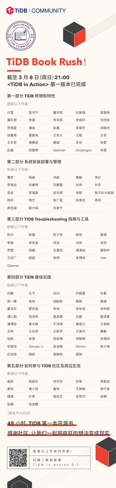

[TiDB Book Rush!](https://pingcap.com/blog-cn/tidb-book-rush-write-a-book-in-48-hours/) 从上周五晚 21:00 开始，历时 48 小时，共有 102 位来自社区的作者参与，截止周日 21:00，总计产生了 421 次 Commit，199 个 PR，最终开源电子书 <TiDB in Action> 第一版诞生 🎉

感谢社区的力量，让我们一起将疯狂的想法变成现实！

扫描下方海报中的二维码即可查看 <TiDB in Action> 电子书详情～

>如果您觉得不过瘾，或者还在为没能赶上 TiDB Book Rush 而有些遗憾，可以参与 TiDB User Group (TUG) 推出的 TiDB SOP 、运维手册等系列文档，让零基础新用户快速上手，让老用户轻松线上运维。TUG 非常期待您的加入，每一位 TiDB 用户都会因您的指引而顺利上线～
>
>**感兴趣的朋友点击 [这里](http://pingcaptidb.mikecrm.com/bPlTRHh?iro=1) 报名～**