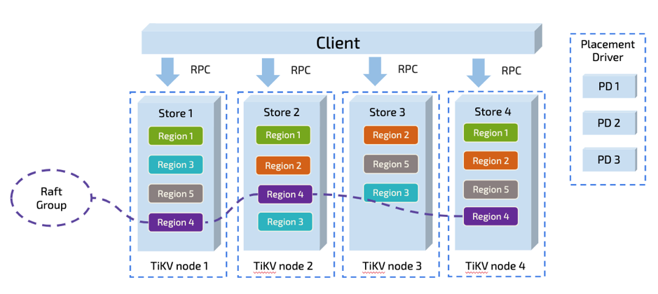
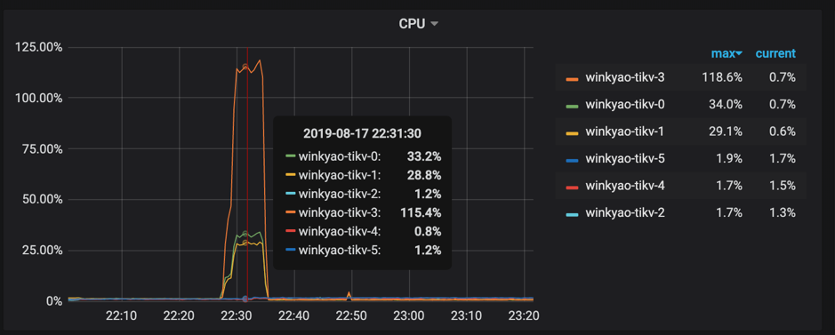
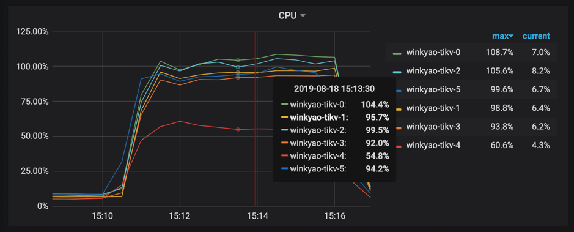

本文通过阐述一个高并发批量写入数据到 TiDB 的典型场景中，TiDB 中常见的问题，给出一个业务的最佳实践，避免业务在开发的时候陷入 TiDB 使用的 “反模式”。

## 面向的对象

本文主要面向对 TiDB 有一定了解的读者，读者在阅读本文之前，推荐先阅读讲解 TiDB 原理的三篇文章（[讲存储](https://pingcap.com/blog-cn/tidb-internal-1)，[说计算](https://pingcap.com/blog-cn/tidb-internal-2)，[谈调度](https://pingcap.com/blog-cn/tidb-internal-3)），以及 [TiDB Best Practice](https://pingcap.com/blog-cn/tidb-best-practice/)。

## 场景

高并发批量插入场景，通常存在于业务系统中的批量任务中，例如清算以及结算等业务。它存在以下显著的特点：

*   数据量大

*   需要短时间内将历史数据入库

*   需要短时间内读取大量数据

这就对 TiDB 提出了一些挑战：

*   写入/读取能力是否可以线性水平扩展

*   数据在持续大并发写入，性能是否稳定不衰减

对于分布式数据库来说，除了本身的基础性能之外，最重要的就是充分利用所有节点能力，避免出现单个节点成为瓶颈。

## TiDB 数据分布原理

如果要解决以上挑战，需要从 TiDB 数据切分以及调度的原理开始讲起。这里只是作简单的说明，详细请大家参见：[说调度](https://pingcap.com/blog-cn/tidb-internal-3/)。

TiDB 对于数据的切分，按 Region 为单位，一个 Region 有大小限制（默认 96M）。 Region 的切分方式是范围切分。每个 Region 会有多副本，每一组副本，称为一个 Raft-Group。由 Leader 负责执行这块数据的读 & 写（当然 TiDB 即将支持 [Follower-Read](https://zhuanlan.zhihu.com/p/78164196)）。Leader 会自动地被 PD 组件均匀调度在不同的物理节点上，用以均分读写压力。



<div class="caption-center">图 1 TiDB 数据概览</div>


只要业务的写入没有 AUTO_INCREMENT 的主键或者单调递增的索引（也即没有业务上的写入热点，更多细节参见 [TiDB 正确使用方式](https://zhuanlan.zhihu.com/p/25574778)）。从原理上来说，TiDB 依靠这个架构，是可以线性扩展读写能力，并且可以充分利用分布式的资源的。这一点上 TiDB 尤其适合高并发批量写入场景的业务。

但是软件世界里，没有银弹。具体的事情还需要具体分析。我们接下来就通过一些简单的负载来探讨 TiDB 在这种场景下，需要如何被正确的使用，才能达到此场景理论上的最佳性能。

## 简单的例子

有一张简单的表：

```
CREATE TABLE IF NOT EXISTS TEST_HOTSPOT(
      id                   BIGINT PRIMARY KEY,
      age                INT,
      user_name  VARCHAR(32),
      email 	 VARCHAR(128)
)
```

这个表结构非常简单，除了 id 为主键以外，没有额外的二级索引。写入的语句如下，id 通过随机数离散生成：

```
INSERT INTO TEST_HOTSPOT(id, age, user_name, email) values(%v, %v, '%v', '%v');
```

负载是短时间内密集地执行以上写入语句。

到目前为止，似乎已经符合了我们上述提到的 TiDB 最佳实践了，业务上没有热点产生，只要我们有足够的机器，就可以充分利用 TiDB 的分布式能力了。要验证这一点，我们可以在实验环境中试一试（实验环境部署拓扑是 2 个 TiDB 节点，3 个 PD 节点，6 个 TiKV 节点，请大家忽略 QPS，这里的测试只是为了阐述原理，并非 benchmark）：


<div class="caption-center">图 2 监控截图</div>


客户端在短时间内发起了 “密集” 的写入，TiDB 收到的请求是 3K QPS。如果没有意外的话，压力应该均摊给 6 个 TiKV 节点。但是从 TiKV 节点的 CPU 使用情况上看，存在明显的写入倾斜（tikv - 3 节点是写入热点）：



<div class="caption-center">图 3 监控截图</div>


<div class="caption-center">图 4 监控截图</div>


[Raft store CPU](https://pingcap.com/docs-cn/v3.0/reference/key-monitoring-metrics/tikv-dashboard/) 代表 raftstore 线程的 CPU 使用率，通常代表着写入的负载，在这个场景下 tikv-3 是 raft 的 leader，tikv-0 跟 tikv-1 是 raft 的 follower，其他的 tikv 节点的负载几乎为空。

从 PD 的监控中也可以印证这一点：


<div class="caption-center">图 5 监控截图</div>

## 反直觉的原因

上面这个现象是有一些违反直觉的，造成这个现象的原因是：刚创建表的时候，这个表在 TiKV 只会对应为一个 Region，范围是:

```
[CommonPrefix + TableID, CommonPrefix + TableID + 1)
```

对于在短时间内的大量写入，它会持续写入到同一个 Region。


<div class="caption-center">图 6 TiKV Region 分裂流程</div>


上图简单描述了这个过程，持续写入，TiKV 会将 Region 切分。但是由于是由原 Leader 所在的 Store 首先发起选举，所以大概率下旧的 Store 会成为新切分好的两个 Region 的 Leader。对于新切分好的 Region 2，3。也会重复之前发生在 Region 1 上的事情。也就是压力会密集地集中在 TiKV-Node 1 中。

在持续写入的过程中， PD 能发现 Node 1 中产生了热点，它就会将 Leader 均分到其他的 Node 上。如果 TiKV 的节点数能多于副本数的话，还会发生 Region 的迁移，尽量往空闲的 Node 上迁移，这两个操作在插入过程，在 PD 监控中也可以印证：


<div class="caption-center">图 7 监控截图</div>

在持续写入一段时间以后，整个集群会被 PD 自动地调度成一个压力均匀的状态，到那个时候才会真正利用整个集群的能力。对于大多数情况来说，这个是没有问题的，这个阶段属于表 Region 的预热阶段。

但是对于高并发批量密集写入场景来说，这个却是应该避免的。

那么我们能否跳过这个预热的过程，直接将 Region 切分为预期的数量，提前调度到集群的各个节点中呢？

## 解决方法

TiDB 在 v3.0.x 版本以及 v2.1.13 以后的版本支持了一个新特性叫做 [Split Region](https://pingcap.com/docs-cn/v3.0/reference/sql/statements/split-region/#split-region-%E4%BD%BF%E7%94%A8%E6%96%87%E6%A1%A3)。这个特性提供了新的语法：

```
SPLIT TABLE table_name [INDEX index_name] BETWEEN (lower_value) AND (upper_value) REGIONS region_num

SPLIT TABLE table_name [INDEX index_name] BY (value_list) [, (value_list)]
```

读者可能会有疑问，为何 TiDB 不自动将这个切分动作提前完成？大家先看一下下图：


<div class="caption-center">图 8 Table Region Range</div>


从图 8 可以知道，Table 行数据 key 的编码之中，行数据唯一可变的是行 ID （rowID）。在 TiDB 中 rowID 是一个 Int64 整形。那么是否我们将 Int64 整形范围均匀切分成我们要的份数，然后均匀分布在不同的节点就可以解决问题呢？

答案是不一定，需要看情况，如果行 id 的写入是完全离散的，那么上述方式是可行的。但是如果行 id 或者索引是有固定的范围或者前缀的。例如，我只在 [2000w, 5000w) 的范围内离散插入，这种写入依然是在业务上没有热点的，但是如果按上面的方式切分，那么就有可能在开始也还是只写入到某个 Region。

作为通用的数据库，TiDB 并不对数据的分布作假设，所以开始只用一个 Region 来表达一个表，等到真实数据插入进来以后，TiDB 自动地根据这个数据的分布来作切分。这种方式是较通用的。

所以 TiDB 提供了 Split Region 语法，来专门针对短时批量写入场景作优化，下面我们尝试在上面的例子中用以下语句提前切散 Region，再看看负载情况。

由于测试的写入是在正数范围内完全离散，所以我们可以用以下语句，在 Int64 空间内提前将表切散为 128 个 Region：

```
SPLIT TABLE TEST_HOTSPOT BETWEEN (0) AND (9223372036854775807) REGIONS 128;
```

切分完成以后，可以通过 `SHOW TABLE test_hotspot REGIONS;` 语句查看打散的情况，如果 SCATTERING 列值全部为 0，代表调度成功。

也可以通过 [table-regions.py](https://github.com/pingcap/tidb-ansible/blob/dabf60baba5e740a4bee9faf95e77563d8084be1/scripts/table-regions.py) 脚本，查看 Region 的分布，已经比较均匀了：

```
[root@172.16.4.4 scripts]# python table-regions.py --host 172.16.4.3 --port 31453 test test_hotspot
[RECORD - test.test_hotspot] - Leaders Distribution:
  total leader count: 127
  store: 1, num_leaders: 21, percentage: 16.54%
  store: 4, num_leaders: 20, percentage: 15.75%
  store: 6, num_leaders: 21, percentage: 16.54%
  store: 46, num_leaders: 21, percentage: 16.54%
  store: 82, num_leaders: 23, percentage: 18.11%
  store: 62, num_leaders: 21, percentage: 16.54%
```

我们再重新运行插入负载：




<div class="caption-center">图 9 监控截图</div>


<div class="caption-center">图 10 监控截图</div>


<div class="caption-center">图 11 监控截图</div>


可以看到已经消除了明显的热点问题了。

当然，这里只是举例了一个简单的表，还有索引热点的问题。如何预先切散索引相关的 Region？

这个问题可以留给读者，通过 [Split Region 文档](https://pingcap.com/docs-cn/v3.0/reference/sql/statements/split-region/#split-region-%E4%BD%BF%E7%94%A8%E6%96%87%E6%A1%A3) 可以获得更多的信息。


### 更复杂一些的情况

如果表没有主键或者主键不是 int 类型，用户也不想自己生成一个随机分布的主键 ID，TiDB 内部会有一个隐式的 _tidb_rowid 列作为行 id。在不使用 SHARD_ROW_ID_BITS 的情况下，_tidb_rowid 列的值基本上也是单调递增的，此时也会有写热点存在。（查看什么是 [SHARD_ROW_ID_BITS](https://pingcap.com/docs-cn/v3.0/reference/configuration/tidb-server/tidb-specific-variables/#shard-row-id-bits)）

要避免由 _tidb_rowid 带来的写入热点问题，可以在建表时，使用 SHARD_ROW_ID_BITS  和 PRE_SPLIT_REGIONS 这两个建表 option（查看什么是 [PRE_SPLIT_REGIONS](https://pingcap.com/docs-cn/v3.0/reference/sql/statements/split-region/#pre-split-regions)）。

SHARD_ROW_ID_BITS 用来把 _tidb_rowid 列生成的行 ID 随机打散，pre_split_regions 用来在建完表后就预先 split region。注意：pre_split_regions 必须小于等于 shard_row_id_bits。

示例：

```
create table t (a int, b int) shard_row_id_bits = 4 pre_split_regions=·3; 
```

*   SHARD_ROW_ID_BITS = 4 表示 tidb_rowid 的值会随机分布成 16 （16=2^4） 个范围区间。

*   pre_split_regions=3 表示建完表后提前 split 出 8 (2^3) 个 region。

在表 t 开始写入后，数据写入到提前 split 好的 8 个 region 中，这样也避免了刚开始建表完后因为只有一个 region 而存在的写热点问题。

 
## 参数配置

### 关闭 TiDB 的 Latch 机制

TiDB 2.1 版本中在 SQL 层引入了 [latch 机制](https://pingcap.com/docs-cn/v3.0/reference/configuration/tidb-server/configuration-file/#txn-local-latches)，用于在写入冲突比较频繁的场景中提前发现事务冲突，减少 TiDB 跟 TiKV 事务提交时写写冲突导致的重试。对于跑批场景，通常是存量数据，所以并不存在事务的写入冲突。可以把 TiDB 的 latch 关闭，以减少细小内存对象的分配：

```
[txn-local-latches]
enabled = false
```

