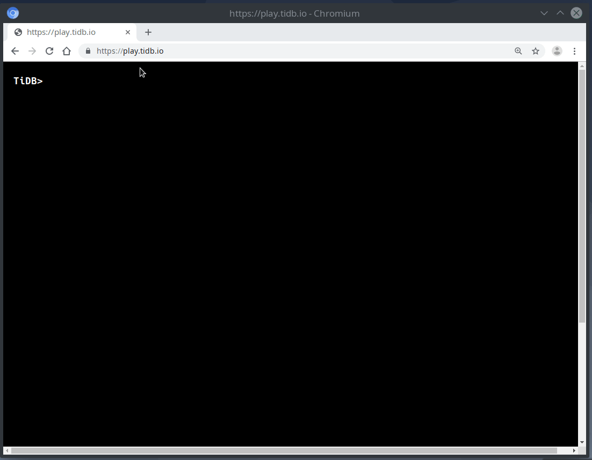
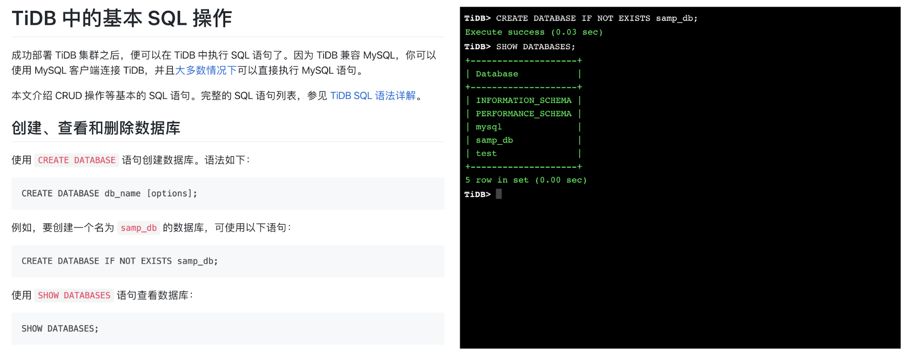

一直以来我都有个梦想：

希望有一个数据库能够弹性扩展（分布式）到成百上千节点的规模，易于学习和理解，可以运行在私有云、公有云、Multi-Cloud、Kubernetes，也能够跑在嵌入式设备（比如树莓派）上，更酷的是也能够直接运行在浏览器里，而且不需要任何浏览器扩展（Extension），变成「口袋数据库」，就像那部电影《蚁人》。

**今天，这一切都变成了现实：今天的 [TiDB](https://github.com/pingcap/tidb) 可以直接运行在浏览器本地。打开浏览器，你可以直接创建数据库，对数据进行增删改查。关掉浏览器，一切都消失了，干净绿色环保——**

首先在笔记本浏览器打开 [play.pingcap.com](https://play.pingcap.com)（这里用的是 MacOS 上面的 Chrome，不确定其它浏览器是否正常），可能需要几秒来加载页面，然后就能看到熟悉的 Shell 了。现在来试试几个 SQL 语句吧！由于 TiDB 基本兼容 MySQL 协议和语法，因此我们可以用熟悉的 MySQL 风格操作，如下图所示：

图 1 在浏览器上运行 TiDB

**是不是很酷？无痛体验 SQL 的时代到了。**

**更酷的是，这一切都运行在浏览器本地，删库再也不用跑路了 😈**

有了这些，那么是时候给在线学习 SQL 教程的网站加点功能了，比如在文字教程时，同步运行 SQL 语句。这里有个简单的 [演示](https://tour.pingcap.com/)：

图 2 SQL 教程网站演示

**那么在浏览器里面运行数据库还有哪些好处呢？**

还记得你安装配置数据库的痛苦吗？从此以后，每个人随时随地都可以拥有一个数据库，再也没有痛苦的安装过程，再也不用痛苦的配置参数，随时享受写 SQL 的快感。也许我们不再需要 indexdb 了，SQL 是更高级的 API，TiDB 使得「一次编写、到处运行」变成了现实。

当然，你一定很好奇这一切是怎么实现的：

+ 首先要感谢 Go team 让 Go 语言支持了 WebAssembly（Wasm），这是近期最让我兴奋的特性之一，它让在浏览器里运行 Go 语言编写的应用程序成为了现实；

+ 然后感谢 PingCAP 的开源分布式数据库 TiDB。我们把 TiDB 编译成 Wasm，在浏览器里直接运行生成的 Wasm 文件，这就使得在浏览器里运行一个数据库成为了现实。如果没有记错，TiDB 好像是 Go 语言编写的第一个可以在浏览器里面运行的 SQL 数据库；

+ 特别感谢参加 [TiDB Hackathon 2019](https://github.com/pingcap/presentations/blob/master/hackathon-2019/hackathon-2019-projects.md) 的选手和大家各种有趣的想法，尤其感谢 Ti-cool 团队，在他们的努力下这一切变成了现实，该项目获得了 Hackathon 二等奖，现场评委团老师们也感到眼前一亮，对它的快速落地充满了期待！​

>“TiDB-Wasm 极大降低了用户体验 TiDB 能力和初步验证 SQL 兼容性的门槛，使用体验就像 golang playground 一样流畅，Wasm 的出现也为 TiDB 文档中心的建设提出了新的思路，也许不久的将来，TiDB 用户可以像 golang 一样，在阅读文档的同时，就能够在页面上尝试实际操作的体验。我们也期待 Wasm 能够持续发展，实现 TiKV 的沙箱化运行，提供更贴近真实运行场景的 playground，甚至在自动化运维管理方向上贡献更新奇思路。”
>
>——李凯（美团 | 数据库团队负责人）
>
>“刚看到这个项目的时候真的眼前一亮，这是一个非常酷的创意，而且真的对 DBA 运维管理 TiDB 有非常大的帮助，个人强烈希望这个项目能尽快落地支持！
>
>目前我们公司使用 TiDB 时，有很大一部分是由现在业务改造接入，但是面临的一个很重要的问题是 应用原来都是基于 MySQL 开发，虽然 TiDB 在 SQL 语法兼容上做了很多的工作，但是仍然未能 100% 覆盖，所以业务切换前我们都必须要进行 SQL 语法兼容性测试及数据准确性校验。由于 TiDB 的部署都是在线上服务器，基于数据安全，我们的生产和办公网环境是隔离的，要实现上面的需求，目前我们有如下几种方式：a) 研发同学自己写脚本连接查看；b)DBA 登录集群协助验证；c)开发专用查询平台支持。目前这这几种方式都不够安全且效率低下。随着我们维护的 TiDB 集群越来越多，DBA 的对这种低效工作不堪其烦，急需相关工具支持，而 TiDB-Wasm 无疑会解决这种问题，所以希望官方能够重视这个项目，并尽快落地实现。”
>
>——于伯伟（58集团 | 数据库高级经理）
>
>
>“Wasm 是一个神奇的技术，也许诞生初期的目的只是为了解决 js 运行速度以及其他语言如何操作 html 的问题，但现在大家在用这种技术广泛尝试各种可能。TiDB-Wasm 就是一个很好的尝试，不仅大幅度降低了新人使用 TiDB 的难度、也给文档展示提供了神奇的操作环境、还能大幅度降低应用开发者本机调试环境的构建难度。相信这个思路能给其他服务端的软件一个很好的启发。”
>
>——李道兵（京东云 | 高级总监）
>
>“很多用户希望初步了解 TiDB 但是苦于找不到简单即用的线下环境，这导致他们还未入门就已经放弃。TiDB-Wasm 有望彻底解决这个问题。基于 TiDB-Wasm，用户可以方便的开启 session 来探索 TiDB 的特性和功能，调试 TiDB 的行为，以及对比 TiDB 与 MySQL 等数据库在 SQL 语法、加锁行为、事务隔离等级等细节上的差异，从而帮助用户更深入的理解 TiDB。对官方而言，甚至可以把路由、计算、存储层的扩容缩容、迁移等最佳实践集成到该平台并可视化该过程，从而给用户更真实、直观的感受。这将是一款令人激动的产品，它将促进 TiDB 社区更加繁荣，也将让所有 TiDB 用户受益！”
>
>——赵应钢（美团点评 | 分布式数据库平台开发和运维负责人，研究员）
>
>“TiDB-Wasm 这个项目成功地将 TiDB 移植到了 Wasm，证明了 TiDB 编译到 Wasm 的可行性，同时也反映了 WebAssembly 已走向成熟，相信后面会有更多项目移植到浏览器里运行。目前项目还处于 demo 阶段，后续如果将项目继续落地，在上面添加更多功能，比如使用 indexedDB 让数据持久化，比如使用 webrtc 之类的技术让不同浏览器中的 TiDB 可以进行 P2P 通讯，实现分布式浏览器数据库，我非常期待这些实现。”
>
>——侯圣文（贝壳找房 | 数据技术总监）
>
>“TiDB-Wasm 让我看到了 TiDB 的更多可能性。Wasm 本身是一个很有野心和想象力的技术，极大的扩展了前端的能力，可能大家都玩过类似 go playgound, rust playground 这类 web 的可交互体验平台，TiDB-Wasm 更进一步让用户甚至在离线环境下就能直接体验，可谓最极致的易用。从实用角度上来看，除了能成为一个浏览器中的 REPL 供配合文档快速体验和实验之外，TiDB-Wasm 甚至未来还可以作为 js 的 localStorage API 的很好的补充，为 js 生态提供一个 SQLite 之外的高性能本地数据库……当然，在体验上仍然有很多可以优化的地方，例如给 binary 瘦身，加入集群模式支持等。总体来说这是一个很好玩的项目。”
>
>——黄东旭（PingCAP | 联合创始人兼 CTO）
>
>“这个项目可以说集新颖性和实用性于一身，用一种很巧妙的方式，将数据库这样硬核的基础架构和炫酷的前端领域搭上关系，接下来二者就可以碰撞出各种火花。最直接的用法是大大降低用户体验 TiDB 的成本，只需要一个浏览器页面和等待下载 Binary 的时间，完全不需要安装部署，就可以体验 TiDB 基本的功能，无论是嵌入到文档中快速运行实例还是作为 Playgroud 网站让用户自由发挥，都非常合适。再扩展想一下，TiDB 可以看作 MySQL 的替代品，那么很多 MySQL 的教学网站也可以用这个 Wasm 来提升教学体验。当然，Demo 中演示的 SQL 教学只是最基本的玩法，有了这个东西，我们可以说：恭喜前端圈有了一个 JS 版本的 MySQL。相信前端的同学能把它玩出花来。一句话总结：这绝对是一个叫好又叫座的项目。”
>
>——申砾（PingCAP | Engineering VP）

**接下来我们可以试试更多有趣的想法：**

+ 让更多的在线 SQL 教程都可以直接运行。
+ 让 TiDB 运行在 Go Playground 上，或许需要 Go team 的帮助。
+ 支持持久化数据库，我们已经有了云计算、边缘计算，为什么不能有浏览器计算呢？
+ ……

还有好多想法我们将在接下来的文章里介绍。如果你有新的、有趣的想法，欢迎 [联系我们](mailto:info@pingcap.com)。

**下一篇文章将由 Ti-cool 团队成员介绍整个项目的实现原理和后续改进工作，敬请期待！如果你已经等不及了，可以在这里直接看 [源码实现](https://github.com/pingcap/tidb/pull/13069)，祝大家玩得开心！**
