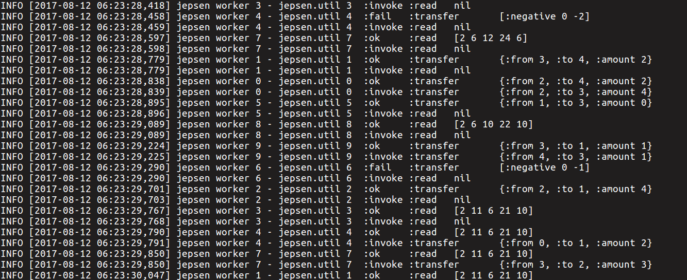
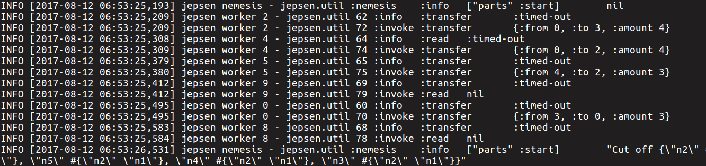
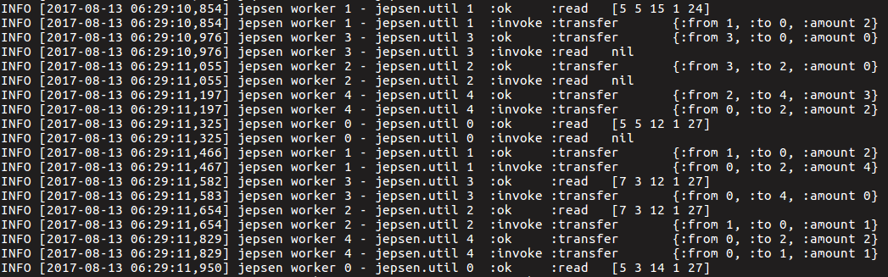
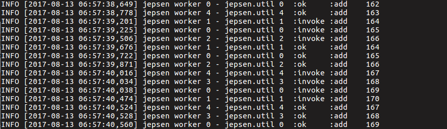
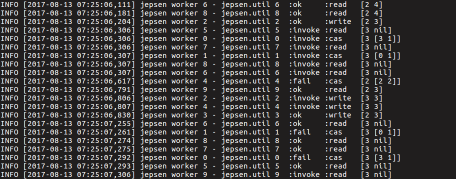

本篇文章主要介绍 TiDB 是如何使用分布式一致性验证框架 [Jepsen](https://github.com/jepsen-io/jepsen) 进行一致性验证的。

## 什么是 Jepsen

Jepsen 是由 [Kyle Kingsbury](https://aphyr.com/about) 采用函数式编程语言 Clojure 编写的验证分布式系统一致性的测试框架，作者使用它对许多著名的分布式系统（etcd, cockroachdb...）进行了“攻击”（一致性验证），并且帮助其中的部分系统找到了 bug。这里一系列的[博客](https://aphyr.com/tags/jepsen)展示了作者的验证过程以及对于一致性验证的许多思考。

## Jepsen 如何工作
Jepsen 验证系统由 6 个节点组成，一个控制节点（control node），五个被控制节点（默认为 n1, n2, n3, n4, n5），控制节点将所有指令发送到某些或全部被控制节点，这些指令包括底层的 shell 命令到上层的 SQL 语句等等。Jepsen 提供了几个核心 API 用于验证分布式系统：

+ **DB**

    DB 封装了所验证的分布式系统下载、部署、启动和关闭命令，核心函数由 setup 和 teardown 组成，在 TiDB 的 Jepsen 测试中，setup 负责下载 TiDB 并且依次启动 Placement Driver、TiKV 和 TiDB；teardown 负责关闭整个 TiDB 系统并且删除日志。

+ **Client**

    Client 封装了每一个测试所需要提供的客户，每个 client 提供两个接口：setup 和 invoke，setup 负责对 TiDB 进行连接，而 invoke 则包含了测试中 client 对 TiDB 调用的 sql 语句，具体语句依测试而定。

+ **Checker**

    Checker 用于对测试生成的历史进行验证，判断测试结果是否符合预期，历史的格式如下图所示：

    

+ **Nemesis**

    Nemesis 用于对系统引入故障，比如常见的网络分区、网络延时、节点宕机，在 TiDB 的测试中，有以下几种 nemesis：

    ```
    parts：网络分区
    majority-ring：每个节点都看到不同的 majority
    start-stop：对某些节点进行 SIGSTOP
    start-kill：对某些节点进行 SIGKILL
    ```

    下图展示了 parts nemesis 引入测试中后某些语句执行时出现了 time-out 的错误。

    

+ **Generator**

    Generator 是 Jepsen 中的事件发生器，它将 Client 和 Nemesis 的操作交织在一起，为整个测试生成具体的执行语句。

## TiDB 中的 Jepsen 测试

TiDB 中的 Jepsen 测试有 3 个，分别是 bank、set 和 register 测试。

#### Bank Test

银行测试用于验证快照隔离。这个测试模拟了一个银行系统中的各种转账，每个银行系统的初始可以是这样的：

```
[1 10]
[2 10]
[3 10]
[4 10]
[5 10]
```

1-5 分别代表账户名称，而 10 代表账户余额。测试会随机生成转账信息：

```
[1 2 5]
```

代表将金额 5 从账户 1 转入账户 2 这个操作。与此同时，测试会随机读取所有账户的存款信息，例如某一时刻账户的存款信息可能是这样的：

```
[8 14 2 11 15]
```

下面是测试进行中的某次截图：



在快照隔离下，所有的转账都必须保证每一时刻所有账户的总金额是相同的。TiDB 在即使引入了各种 nemesis 的情况下仍旧顺利地通过了测试。

#### Set Test

这个测试从不同节点并发的将不同的数插入一张表中，并且进行一次最终的表读取操作，用于验证所有返回成功的插入值一定会出现在表中，然后所有返回失败的插入值一定不在表中，同时，因为 nemesis 的引入，对于那些返回 time-out 的插入值，它们可能出现也可能不会出现在表中，这属于正常情况。

下面是测试进行中的某次截图：



同样，TiDB 通过了测试。

#### Register Test

这个测试很好理解，建一个表，然后插入一条值，然后我们把这个值看做是一个寄存器，然后在测试中并发地从各个节点对其进行 read、write 和 cas 操作。



然后利用 Jepsen 产生的一系列操作历史（如上图）进行 Linearizability 一致性验证。这个算法是 Jepsen 的核心，也是 Jepsen 被业界所熟知的原因之一，所以花时间去深入学习了下，我会在另一篇文章具体介绍这个算法。


### 写在最后

每次 TiDB 更新代码，我们都会内部触发 CI 来执行 Jepsen，通过 Jepsen 来保证 TiDB 的数据一致性。如果你对分布式测试，一致性验证感兴趣，欢迎参与开发。

TiDB Jepsen：[https://github.com/pingcap/jepsen/tree/master/tidb](https://github.com/pingcap/jepsen/tree/master/tidb)
