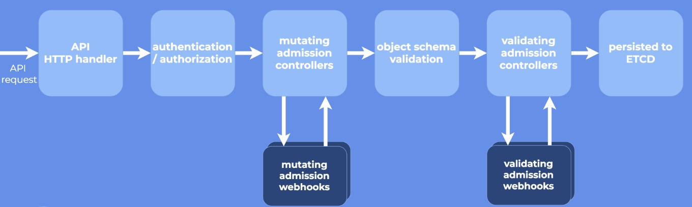
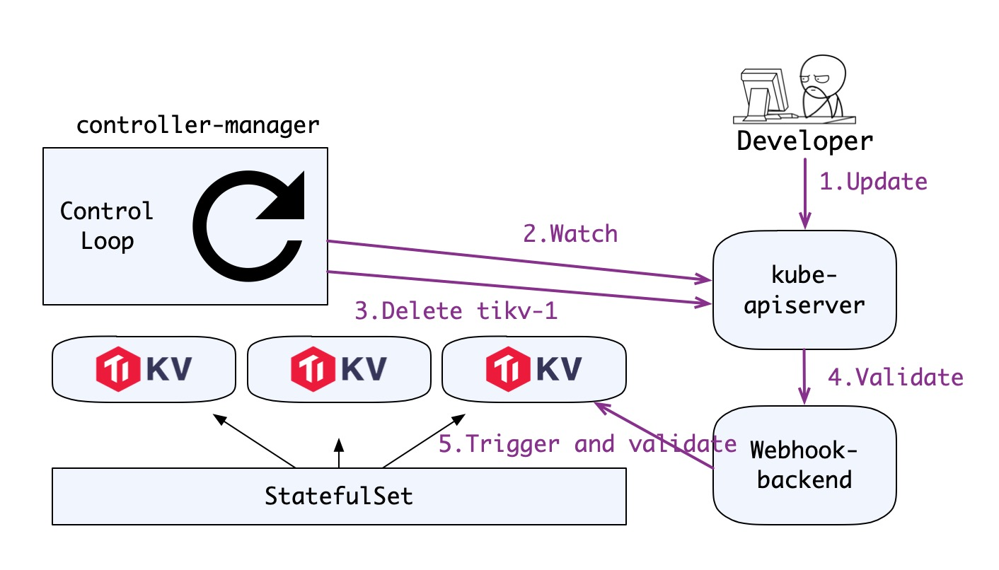

一直以来我对优雅地停止 Pod 这件事理解得很单纯：不就利用是 [PreStop hook](https://kubernetes.io/docs/concepts/containers/container-lifecycle-hooks/#container-hooks) 做优雅退出吗？但最近发现很多场景下 PreStop Hook 并不能很好地完成需求，这篇文章就简单分析一下“优雅地停止 Pod”这回事儿。

## 何谓优雅停止？

优雅停止（Graceful shutdown）这个说法来自于操作系统，我们执行关机之后都得 OS 先完成一些清理操作，而与之相对的就是硬中止（Hard shutdown），比如拔电源。

到了分布式系统中，优雅停止就不仅仅是单机上进程自己的事了，往往还要与系统中的其它组件打交道。比如说我们起一个微服务，网关把一部分流量分给我们，这时：

- 假如我们一声不吭直接把进程杀了，那这部分流量就无法得到正确处理，部分用户受到影响。不过还好，通常来说网关或者服务注册中心会和我们的服务保持一个心跳，过了心跳超时之后系统会自动摘除我们的服务，问题也就解决了；这是硬中止，虽然我们整个系统写得不错能够自愈，但还是会产生一些抖动甚至错误。
- 假如我们先告诉网关或服务注册中心我们要下线，等对方完成服务摘除操作再中止进程，那不会有任何流量受到影响；这是优雅停止，将单个组件的启停对整个系统影响最小化。

按照惯例，SIGKILL 是硬终止的信号，而 SIGTERM 是通知进程优雅退出的信号，因此很多微服务框架会监听 SIGTERM 信号，收到之后去做反注册等清理操作，实现优雅退出。

## PreStop Hook

回到 Kubernetes（下称 K8s），当我们想干掉一个 Pod 的时候，理想状况当然是 K8s 从对应的 Service（假如有的话）把这个 Pod 摘掉，同时给 Pod 发 SIGTERM 信号让 Pod 中的各个容器优雅退出就行了。但实际上 Pod 有可能犯各种幺蛾子：

- 已经卡死了，处理不了优雅退出的代码逻辑或需要很久才能处理完成。
- 优雅退出的逻辑有 BUG，自己死循环了。
- 代码写得野，根本不理会 SIGTERM。

因此，K8s 的 Pod 终止流程中还有一个“最多可以容忍的时间”，即 grace period（在 Pod 的 `.spec.terminationGracePeriodSeconds` 字段中定义），这个值默认是 30 秒，我们在执行 `kubectl delete` 的时候也可通过 `--grace-period` 参数显式指定一个优雅退出时间来覆盖 Pod 中的配置。而当 grace period 超出之后，K8s 就只能选择 SIGKILL 强制干掉 Pod 了。

很多场景下，除了把 Pod 从 K8s 的 Service 上摘下来以及进程内部的优雅退出之外，我们还必须做一些额外的事情，比如说从 K8s 外部的服务注册中心上反注册。这时就要用到 PreStop Hook 了，K8s 目前提供了 `Exec` 和 `HTTP` 两种 PreStop Hook，实际用的时候，需要通过 Pod 的 `.spec.containers[].lifecycle.preStop` 字段为 Pod 中的每个容器单独配置，比如：

```yaml
spec:
  contaienrs:
  - name: my-awesome-container
    lifecycle:
      preStop:
        exec:
          command: ["/bin/sh"，"-c"，"/pre-stop.sh"]
```

`/pre-stop.sh` 脚本里就可以写我们自己的清理逻辑。

最后我们串起来再整个表述一下 Pod 退出的流程（[官方文档里更严谨哦](https://kubernetes.io/docs/concepts/workloads/pods/pod/#termination-of-pods)）：

1. 用户删除 Pod。
2.
    - 2.1. Pod 进入 Terminating 状态。
    - 2.2. 与此同时，K8s 会将 Pod 从对应的 service 上摘除。
    - 2.3. 与此同时，针对有 PreStop Hook 的容器，kubelet 会调用每个容器的 PreStop Hook，假如 PreStop Hook 的运行时间超出了 grace period，kubelet 会发送 SIGTERM 并再等 2 秒。
    - 2.4. 与此同时，针对没有 PreStop Hook 的容器，kubelet 发送 SIGTERM。
3. grace period 超出之后，kubelet 发送 SIGKILL 干掉尚未退出的容器。

这个过程很不错，但它存在一个问题就是我们无法预测 Pod 会在多久之内完成优雅退出，也无法优雅地应对“优雅退出”失败的情况。而在我们的产品 [TiDB Operator](https://github.com/pingcap/tidb-operator) 中，这就是一个无法接受的事情。

## 有状态分布式应用的挑战

为什么说无法接受这个流程呢？其实这个流程对无状态应用来说通常是 OK 的，但下面这个场景就稍微复杂一点：

[TiDB](https://github.com/pingcap/tidb) 中有一个核心的分布式 KV 存储层 [TiKV](https://github.com/tikv/tikv)。TiKV 内部基于 Multi-Raft 做一致性存储，这个架构比较复杂，这里我们可以简化描述为一主多从的架构，Leader 写入，Follower 同步。而我们的场景是要对 TiKV 做计划性的运维操作，比如滚动升级，迁移节点。

在这个场景下，尽管系统可以接受小于半数的节点宕机，但对于预期性的停机，我们要尽量做到优雅停止。这是因为数据库场景本身就是非常严苛的，基本上都处于整个架构的核心部分，因此我们要把抖动做到越小越好。要做到这点，就得做不少清理工作，比如说我们要在停机前将当前节点上的 Leader 全部迁移到其它节点上。

得益于系统的良好设计，大多数时候这类操作都很快，然而分布式系统中异常是家常便饭，优雅退出耗时过长甚至失败的场景是我们必须要考虑的。假如类似的事情发生了，**为了业务稳定和数据安全，我们就不能强制关闭 Pod，而应该停止操作过程，通知工程师介入。** 这时，上面所说的 Pod 退出流程就不再适用了。

## 小心翼翼：手动控制所有流程

这个问题其实 K8s 本身没有开箱即用的解决方案，于是我们在自己的 Controller 中（TiDB 对象本身就是一个 CRD）与非常细致地控制了各种操作场景下的服务启停逻辑。

抛开细节不谈，最后的大致逻辑是在每次停服务前，由 Controller 通知集群进行节点下线前的各种迁移操作，操作完成后，才真正下线节点，并进行下一个节点的操作。

而假如集群无法正常完成迁移等操作或耗时过久，我们也能“守住底线”，不会强行把节点干掉，这就保证了诸如滚动升级，节点迁移之类操作的安全性。

但这种办法存在一个问题就是实现起来比较复杂，我们需要自己实现一个控制器，在其中实现细粒度的控制逻辑并且在 Controller 的控制循环中不断去检查能否安全停止 Pod。

## 另辟蹊径：解耦 Pod 删除的控制流

复杂的逻辑总是没有简单的逻辑好维护，同时写 CRD 和 Controller 的开发量也不小，能不能有一种更简洁，更通用的逻辑，能实现“保证优雅关闭（否则不关闭）”的需求呢？

有，办法就是 [ValidatingAdmissionWebhook](https://kubernetes.io/docs/reference/access-authn-authz/admission-controllers/#validatingadmissionwebhook)。

这里先介绍一点点背景知识，Kubernetes 的 apiserver 一开始就有 AdmissionController 的设计，这个设计和各类 Web 框架中的 Filter 或 Middleware 很像，就是一个插件化的责任链，责任链中的每个插件针对 apiserver 收到的请求做一些操作或校验。举两个插件的例子：

- `DefaultStorageClass`，为没有声明 storageClass 的 PVC 自动设置 storageClass。
- `ResourceQuota`，校验 Pod 的资源使用是否超出了对应 Namespace 的 Quota。

虽然说这是插件化的，但在 1.7 之前，所有的 plugin 都需要写到 apiserver 的代码中一起编译，很不灵活。而在 1.7 中 K8s 就引入了 [Dynamic Admission Control](https://kubernetes.io/docs/reference/access-authn-authz/extensible-admission-controllers/) 机制，允许用户向 apiserver 注册 webhook，而 apiserver 则通过 webhook 调用外部 server 来实现 filter 逻辑。1.9 中，这个特性进一步做了优化，把 webhook 分成了两类: `MutatingAdmissionWebhook` 和 `ValidatingAdmissionWebhook`，顾名思义，前者就是操作 api 对象的，比如上文例子中的 `DefaultStroageClass`，而后者是校验 api 对象的，比如 `ResourceQuota`。拆分之后，apiserver 就能保证在校验（Validating）之前先做完所有的修改（Mutating），下面这个示意图非常清晰：



<div class="caption-center">示意图</div>

而我们的办法就是，利用 `ValidatingAdmissionWebhook`，在重要的 Pod 收到删除请求时，先在 webhook server 上请求集群进行下线前的清理和准备工作，并直接返回拒绝。这时候重点来了，Control Loop 为了达到目标状态（比如说升级到新版本），会不断地进行 reconcile，尝试删除 Pod，而我们的 webhook 则会不断拒绝，除非**集群已经完成了所有的清理和准备工作**。

下面是这个流程的分步描述：



<div class="caption-center">流程图</div>

1. 用户更新资源对象。
2. controller-manager watch 到对象变更。
3. controller-manager 开始同步对象状态，尝试删除第一个 Pod。
4. apiserver 调用外部 webhook。
5. webhook server 请求集群做 tikv-1 节点下线前的准备工作（这个请求是幂等的），并查询准备工作是否完成，假如准备完成，允许删除，假如没有完成，则拒绝，整个流程会因为 controller manager 的控制循环回到第 2 步。

好像一下子所有东西都清晰了，这个 webhook 的逻辑很清晰，就是要保证所有相关的 Pod 删除操作都要先完成优雅退出前的准备，完全不用关心外部的控制循环是怎么跑的，也因此**它非常容易编写和测试**，非常优雅地满足了我们“保证优雅关闭（否则不关闭）”的需求，目前我们正在考虑用这种方式替换线上的旧方案。

## 后记

其实 [Dynamic Admission Control](https://kubernetes.io/docs/reference/access-authn-authz/extensible-admission-controllers/) 的应用很广，比如 Istio 就是用 `MutatingAdmissionWebhook` 来实现 envoy 容器的注入的。从上面的例子中我们也可以看到它的扩展能力很强，而且常常能站在一个正交的视角上，非常干净地解决问题，与其它逻辑做到很好的解耦。

当然了，Kubernetes 中还有 [非常多的扩展点](https://kubernetes.io/docs/concepts/extend-kubernetes/extend-cluster/)，从 kubectl 到 apiserver，scheduler，kubelet（device plugin，flexvolume），自定义 Controller 再到集群层面的网络（CNI），存储（CSI）可以说是处处可以做事情。以前做一些常规的微服务部署对这些并不熟悉也没用过，而现在面对 TiDB 这样复杂的分布式系统，尤其在 Kubernetes 对有状态应用和本地存储的支持还不够好的情况下，得在每一个扩展点上去悉心考量，做起来非常有意思，因此后续可能还有一些 [TiDB Operator](https://github.com/pingcap/tidb-operator) 中思考过的解决方案分享。
