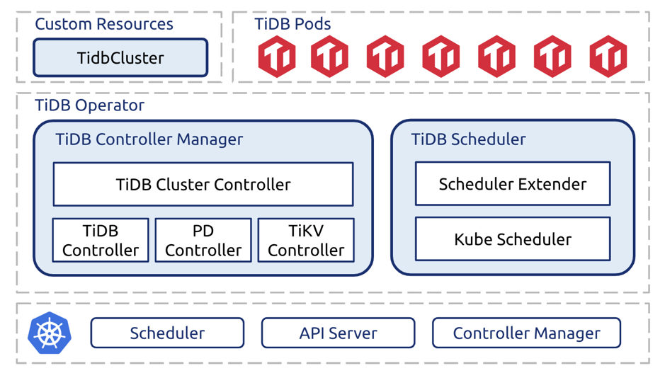

去年八月份，我们 [开源了 TiDB Operator](https://pingcap.com/blog-cn/tidb-operator-introduction/) 项目，以实现 TiDB 在 Kubernetes 上的部署和运维。开源后到现在的近一年内，我们一方面基于用户反馈不断打磨项目的易用性，另一方面通过严苛的稳定性测试持续提升可靠性。今天，我们自豪地宣布 TiDB Operator 1.0 GA 正式发布！

TiDB Operator architecture

**TiDB Operator 是 Kubernetes 上的 TiDB 集群自动运维系统。提供包括部署、升级、扩缩容、备份恢复、配置变更的 TiDB 全生命周期管理。借助 TiDB Operator，TiDB 可以无缝运行在公有云或私有部署的 Kubernetes 集群上。**

1.0 是 TiDB Operator 的首个 GA 版本，具备以下核心亮点。

## 核心亮点

### 1. 简化 TiDB 运维管理

TiDB 是一个复杂的分布式系统，它的部署和运维需要比较深入的领域知识，这带来了颇高的学习成本和负担。TiDB Operator 则通过自定义资源对象（Custom Resource）、自定义控制器（Custom controller）和调度器扩展（Scheduler extender）为 Kubernetes 注入 TiDB 的专业运维知识，允许用户以 Kubernetes 的声明式 API 风格来管理 TiDB 集群。具体来说，用户只需要描述集群规格，TiDB Operator 就会不断调整 Kubernetes 中的资源，驱动实际集群满足该描述。**在这种模式下，TiDB 集群会自动完成服务的健康检查、故障转移，而部署、升级、扩缩容等操作则能通过修改集群的规格定义“一键”完成，极大简化了 TiDB 集群的运维管理。**

更重要的是，标准化的集群管理 API 允许用户完成内部工具链或 PaaS 平台与 TiDB 集群管理的深度整合，真正赋能用户玩转 TiDB。

### 2. 稳定可靠

作为数据库，TiDB 往往处于整个系统架构中的最核心位置，对于稳定性有着严苛要求。这同样也是对 TiDB Operator 的要求。为了确保所有自动化运维操作的稳定可靠，我们为 TiDB Operator 专门设计了稳定性测试，在施加较大读写负载的同时，不断进行各类运维操作并模拟主机、容器、磁盘、网络、Kubernetes 组件和 TiDB Operator 组件的各类故障，观察在这些场景下 TiDB Operator 的行为是否符合预期。通过 7 * 24 小时不间断运行稳定性测试，我们发现并修复了诸多极端的边界情况。在 1.0 发布前，TiDB Operator 稳定性测试已经稳定运行数月。

### 3. 多云支持

**1.0 提供了面向 AWS、谷歌云和阿里云的 Terraform 部署脚本。** 这些脚本能帮助大家在十几分钟内创建一个 Kubernetes 集群，并在该集群上部署一个或更多生产可用的 TiDB 集群。在后续的管理过程中，Terraform 脚本会在操作 TiDB 集群的同时对相关的云资源进行操作。比如，当扩容一个 TiDB 集群时，Terraform 脚本就会自动创建更多的云服务器来承载集群扩容后的资源需求。

## 体验 TiDB Operator

大家可以通过 Terraform 在 AWS（[部署文档](https://pingcap.com/docs-cn/v3.0/how-to/deploy/tidb-in-kubernetes/aws-eks/)）、谷歌云（[部署文档](https://pingcap.com/docs-cn/v3.0/how-to/deploy/tidb-in-kubernetes/gcp-gke/)）、阿里云（[部署文档](https://pingcap.com/docs-cn/v3.0/how-to/deploy/tidb-in-kubernetes/alibaba-cloud/)）上快速部署 TiDB Operator 以及下属的 TiDB 集群，也可以参考 [通用 Kubernetes 部署文档](https://pingcap.com/docs-cn/v3.0/how-to/deploy/tidb-in-kubernetes/general-kubernetes/) 在任何 Kubernetes 集群上部署并体验 TiDB Operator。

对于 Pre GA 版本的用户，请参考 [1.0 Release Note](https://github.com/pingcap/tidb-operator/blob/master/CHANGELOG.md) 了解 1.0 的变更内容和升级指南。

## 致谢

感谢所有 TiDB Operator 的贡献者（[https://github.com/pingcap/tidb-operator/graphs/contributors](https://github.com/pingcap/tidb-operator/graphs/contributors)），1.0 能够走到 GA 离不开每一位贡献者的努力！

**最后欢迎大家为 TiDB Operator [提交 issue](https://github.com/pingcap/tidb-operator/issues) 或参考[贡献文档](https://github.com/pingcap/tidb-operator/blob/master/docs/CONTRIBUTING.md)开始提交代码，TiDB Operator 期待大家的参与和反馈！**
