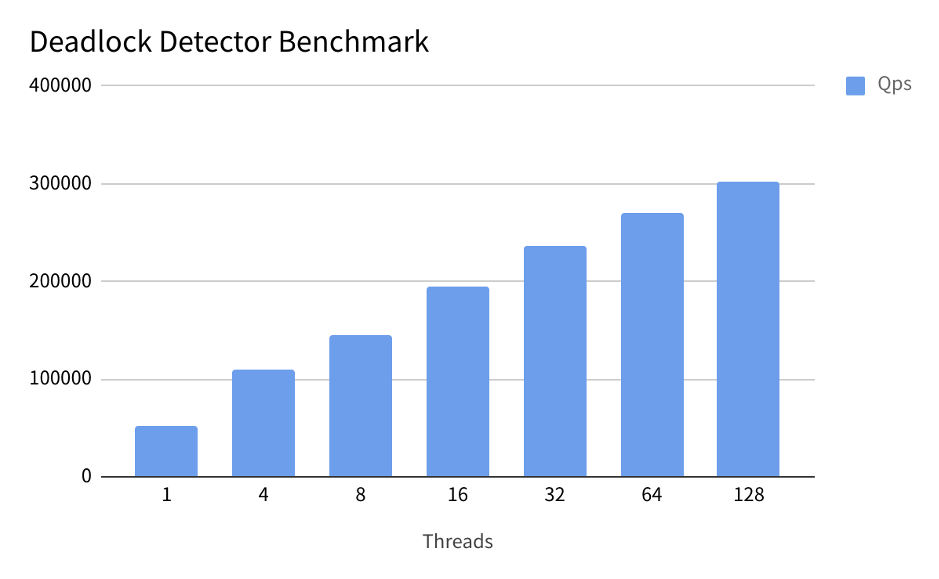

## 概述

事务是关系数据库的核心功能之一，TiDB 的设计和实现从一开始就支持分布式事务。为了让 TiDB 的使用方式更加贴近传统单机数据库，更好的适配用户场景，之前发布的 TiDB 3.0 版本已经在乐观事务模型的基础上，实现了悲观事务模型。本文将详细介绍 TiDB 的分布式悲观事务模型及其实现，以及我们在即将发布的 4.0 版本中所做的进一步探索和优化，并和 MySQL 悲观事务的行为进行对比，欢迎大家尝试并反馈意见。

## 事务模型回顾

TiDB 第一版的分布式事务方案采用基于 Percolator 的[乐观事务模型](https://pingcap.com/blog-cn/percolator-and-txn/)，支持快照隔离的事务 [隔离级别](https://pingcap.com/docs-cn/stable/reference/transactions/transaction-isolation/)，其实现要点主要包括：

* Percolator 是乐观事务，提交时才会检测冲突并写入数据。TiDB 会把事务的所有修改缓存在内存中，提交时再写入 TiKV。

* 为了保证分布式事务的原子性，Percolator 采用了 2PC，分为 Prewrite + Commit：
	* Prewrite：对事务修改的每个 key 都会检测冲突并写入 lock。每个事务有一个 primary lock 代表了事务的状态。
	* Commit：Prewrite 成功后，执行 Commit。先同步 Commit primary lock，成功后事务提交成功，其他 secondary locks 会异步 Commit。

* 保证快照隔离级别：
	* 事务开始时获取 `start ts`，Commit 阶段获取 commit ts，同时也是数据的版本号。
	* 事务只能读到 `max{data.commit_ts < txn.start_ts}` 的版本。
	* Prewrite 加的锁会阻塞能看到该锁的事务的读，原因是写下该 lock 的事务可能已经获取了 `commit ts`，且 `commit ts` 小于看到锁的事务的 `start ts`。
	* Prewrite 时若发现数据有新的提交 `(data.commit_ts > txn.start_ts)`，则发生了 Write Conflict，需要重试。


可以看到，TiDB 的 SQL 引擎作为事务的协调者，本身不存储状态信息，需要控制整个事务两阶段提交的推进，也同时需要处理提交过程中出现的异常。

使用乐观事务模型时，可能存在的问题

* 同一语句重试可能会得到不同的结果，如 affected rows。

* 冲突严重且重试代价大的场景性能差，失败率高。

* 单机数据库多采用悲观事务模型，用户应用可能基于悲观事务模型实现，或者说乐观事务模式在一些场景中增加了应用侧的适配工作量。

## 悲观事务模型

TiDB 从 3.0 版本开始在乐观事务基础上实现了悲观事务，其核心设计思想为，在 Prewrite 之前增加了 Acquire Pessimistic Lock 阶段，其要点为：

* 每个 DML 都会加悲观锁，锁写到 TiKV 里，同样会通过 raft 同步。

* 悲观事务在加悲观锁时检查各种约束，如 Write Conflict、key 唯一性约束等。

* 悲观锁不包含数据，只有锁，只用于防止其他事务修改相同的 key，不会阻塞读，但 Prewrite 后会阻塞读（和 Percolator 相同）。

* 提交时同 Percolator，悲观锁的存在保证了 Prewrite 不会发生 Write Conflict，保证了提交一定成功。


## 如何加锁

在分布式的场景下，TiDB 加锁流程和其他数据库很不同，需要解决相应的问题：

* 其他数据库一般是在读的时候直接加上锁，然后再修改。
* TiDB 在执行完 DML 后才能得到会修改的 key，这时才会加锁。


也就是说，读数据和加锁也是通过“两步”完成的。TiDB 悲观事务模型只支持行锁，但不会对每个要修改的 key 都加锁。在 TiDB 里，一行数据会对应多个 key，比如一个 row key + 多个索引 key，在一些场景只锁 row key 就能满足隔离级别的要求，能够减少加锁的个数。

## 悲观锁不阻塞读的原因

悲观事务提交仍要走一遍完整的 Percolator 两阶段提交流程，只有当所有悲观锁被 Prewrite 成 Percolator 的锁才会到 Commit 阶段。所以遇到了悲观锁，则该事务一定还没获取 `commit ts`，所以不会阻塞读。**这个设计可以说是整个悲观事务模型中最为关键和精妙的一部分**。

## For Update Ts

乐观事务在 Prewrite 时检查约束，悲观事务需要在 Acquire Pessimistic Lock 时检查所有约束，否则到提交时仍有可能报错。目前约束只有：

1. Write Conflict：MySQL 的 DML 会基于最新已提交数据，若发生 Write Conflict TiDB 要重试该 DML，直到没有 Write Conflict。
2. key 唯一性约束：uk 或者 pk 不能存在，这个检查下推到了 TiKV 里。

从上面乐观事务模型里也得知了事务只能读到 `start ts` 之前的最新的数据，如何才能基于最新已提交的数据执行 DML 呢？在悲观事务里，事务除了 `start ts` 和 `commit ts` 外，增加了 `for update ts`，名字来源于 MySQL 用 `select for update` 会读到最新的数据。悲观事务会用 `for update ts` 读和检查 Write Conflict，效果等同于可更新的 `start ts`，当悲观事务执行 DML 发现 Write Conflict 时，就会更新 `for update ts `再重试这个 DML（Write Conflict 错误中会携带 `conflict commit ts`，若有效则会用它来更新 `for update ts`，否则会从 pd 获取 ts 来更新），**就将乐观事务整个事务的重试转变成了悲观事务里单个语句的重试**。


在每个 DML 执行前还会从 pd 获取 ts 更新 `for update ts`，原因是如果是新插入的 row，用之前的 `for update ts` 会读不到，也就触发不了 Write Conflict，行为就和 MySQL 不同了。

用 `max ts` 当然也能读到最新的数据，还减少了从 pd 获取 ts 的消耗，那么为什么不用呢？原因是 TiDB 是先有结果后加锁，有可能在执行 DML 后加锁之前数据被其他事务修改了，`for update ts` 保证了执行和加锁的原子性，确保了 `for update` 语义当前读的特性。

## 等锁机制


TiKV 侧会对需要加锁的请求进行统一管理，如果请求加锁的 key 已经被锁住，请求会进入等锁队列。当等锁超过一定时长（如innodb_lock_wait_timeout），TiDB 会不再继续重试加锁和等待，向用户侧返回等锁超时的错误信息，用户可以根据业务场景和冲突程度，进行配置。

## 唤醒机制

若多个事务等待相同锁，会先唤醒 start ts 最小的事务，其他事务会在 TiKV 配置参数 `wake-up-delay-duration` 后同时唤醒；若该锁再被释放，会唤醒 start ts 第二小的，其他事务再往后推 `wake-up-delay-duration`，以此类推。为了防止一直被推导致饥饿或其他问题，单次等锁时间最大仍是 `wait-for-lock-timeout。wake-up-delay-duration` 的作用是让加锁更加有序同时减少无用的竞争，事务被唤醒时，返回给 TiDB 的是 `Write Conflict`，然后 TiDB 再重试。唤醒后不立刻加锁的原因是重试后可能不需要再加该锁了，即重试之后语句所需要的加锁的 key 个数可能会发生变化。

## 分布式死锁检测

等锁就有可能发生死锁，TiDB 采用的是全局死锁检测来解决死锁：在整个 TiKV 集群中，有一个死锁检测器 leader。当要等锁时，其他节点会发送检测死锁的请求给 leader。


当要等锁时，如果该锁不是事务加的第一个锁就要检测死锁。死锁检测请求中会携带如下信息：

```
message WaitForEntry {
	// The transaction id that is waiting.
	uint64 txn = 1;
	// The transaction id that is being waited for.
	uint64 wait_for_txn = 2;
	// The hash value of the key is being waited for.
	uint64 key_hash = 3;
}
```

目前死锁检测算法为：

* 维护全局的 `wait-for-graph`，该图保证无环。
* 每个请求会尝试在图中加一条 `txn -> wait_for_txn` 的 edge，若新加的导致有环则发生了死锁。
* 死锁回滚的事务选择具有不确定性，可能会跟 RPC 请求的先后相关。

死锁检测节点承担了整个集群的死锁检测任务，对性能要求很高，目前死锁检测的性能测试结果如下，完全能够满足集群的需求。



## Pipelined 加锁优化

TiDB 执行一个悲观事务时，每条 DML 语句确定需要修改的 Key 后，会向 TiKV 发起对这些 Key 的加锁操作。TiDB 需要等待此次加锁成功后，才继续向后执行 DML。整体流程呈现串行执行的逻辑，通过将TiKV 加锁操作和日志同步操作进行一定程度的 Pipelined 优化，可以减少执行 DML 步骤所需要的时间，提升整体性能，降低延迟。

## 支持 Read Committed 隔离级别

为了适应更多用户场景需求，TiDB 在悲观事务中新增实现了 Read Committed 隔离级别，其语义和 Oracle 的 Read Committed 隔离级别保持一致。该模式仅在悲观事务模式下生效，通过系统变量进行开关。用户在使用悲观事务模型时，可以根据自身需要选择。

## MySQL 兼容性

由于只支持行锁模式，TiDB 在加锁行为和表现上和 MySQL 有一定的区别，下面将和 MySQL 默认 Reptable Read 隔离级别的行为进行比较，阐述它们的行为不同之处。

innodb 在 read 的过程中进行加锁，之后返回给 server 层进行处理，加锁方式主要分为:

* 主键等值过滤条件，加 rowkey 对应的行锁。
* 唯一索引等值过滤条件，加 rowkey 和 unique index 对应的行锁。
* 二级索引，加二级索引 rowkey 和 index key 对应的行锁。
* 对于 RR，加 gap lock。


current read 这里，根据可用索引条件，对于匹配的行进行加锁，然后返回当前数据给 server 层进行处理。对于 RC 隔离级别，或者使用 semi-consistent read 类似机制下，innodb 会立即释放掉不相关的 lock，减少加锁数量，提升并发能力。而对于 RR，为了满足可重复读语义，不会释放掉已经加上的锁，加锁数量会更多。

带来的行为差异:

* 过滤条件没有索引可用的加锁行为不同，MySQL 会锁全表，TiDB只会对读到的行加锁。
* 过滤条件二级索引可用的加锁行为不同，MySQL 可能会锁住所有的二级索引对应的行，TiDB 只会锁住匹配的行。
* TiDB 当前读不包含可重复读语义，无法避免 P3 Phantom，也不会因此阻塞 insert或者其他相关联 DML，MySQL 会加更多的锁来保证可重复读。
* TiDB 中执行 DML  过程中包如果包含 embedded select，对应的行不会被加锁，MySQL 则会进行加锁。

如果应用对于上述 MySQL 加锁行为有强依赖，在使用 TiDB 的过程中仍然需要进行适配。

## 总结与展望

本文首先回顾了 TiDB 乐观事务模型，并基于此介绍了即将发布的 TiDB 4.0 版本中悲观事务的实现方式。包括加锁逻辑，等锁唤醒机制，死锁检测机制，加锁优化等。介绍了 TiDB 4.0 中悲观事务的一些优化策略，以及4.0版本支持的一致性读隔离级别。对于 TiDB 和 MySQL 悲观事务模型的实现方式和行为差异进行了对比。

悲观事务模型在 TiDB 4.0 中将默认开启，未来还将会持续进行迭代和优化，感兴趣的小伙伴可以更多的关注和试用 info@pingcap.com。
