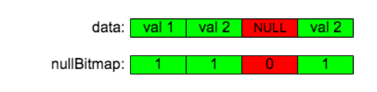
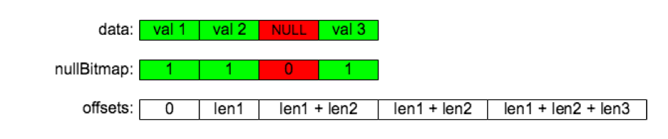
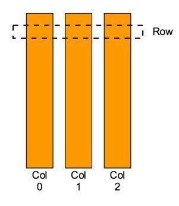
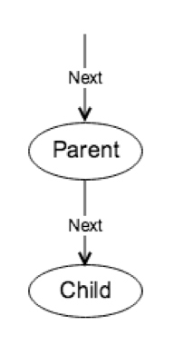
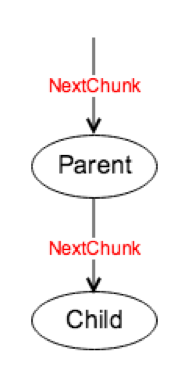

## 什么是 Chunk

TiDB 2.0 中，我们引入了一个叫 [Chunk](https://github.com/pingcap/tidb/blob/source-code/util/chunk/chunk.go#L32) 的数据结构用来在内存中存储内部数据，用于减小内存分配开销、降低内存占用以及实现内存使用量统计/控制，其特点如下：

*   只读

*   不支持随机写

*   只支持追加写

*   列存，同一列的数据连续的在内存中存放

Chunk 本质上是 [Column](https://github.com/pingcap/tidb/blob/source-code/util/chunk/chunk.go#L320) 的集合，它负责连续的在内存中存储同一列的数据，接下来我们看看 Column 的实现。

### 1. Column

Column 的实现参考了 Apache Arrow，点击查看 [Column 的代码](https://github.com/pingcap/tidb/blob/source-code/util/chunk/chunk.go#L320)。根据所存储的数据类型，我们有两种 Column：

* 定长 Column：存储定长类型的数据，比如 `Double`、`Bigint`、`Decimal` 等

* 变长 Column：存储变长类型的数据，比如 `Char`、`Varchar` 等

哪些数据类型用定长 Column，哪些数据类型用变长 Column 可以看函数 [addColumnByFieldType](https://github.com/pingcap/tidb/blob/source-code/util/chunk/chunk.go#L90) 。

Column 里面的字段非常多，这里先简单介绍一下：

* length
  
  用来表示这个 Column 有多少行数据。

* nullCount

  用来表示这个 Column 中有多少 `NULL` 数据。

* nullBitmap

  用来存储这个 Column 中每个元素是否是 `NULL`，需要特殊注意的是我们使用 0 表示 `NULL`，1 表示非 `NULL`，和 Apache Arrow 一样。

* data

  存储具体的数据，不管定长还是变长的 Column，所有的数据都存储在这个 byte slice 中。

* offsets

  给变长的 Column 使用，存储每个数据在 data 这个 slice 中的偏移量。

* elemBuf

  给定长的 Column 使用，当需要读或者写一个数据的时候，使用它来辅助 encode 和 decode。

#### 1.1  追加一个定长的非 NULL 值

追加一个元素需要根据具体的数据类型调用具体的 append 方法，比如： [appendInt64](https://github.com/pingcap/tidb/blob/source-code/util/chunk/chunk.go#L378 )、[appendString](https://github.com/pingcap/tidb/blob/source-code/util/chunk/chunk.go#L404 ) 等。

一个定长类型的 Column 可以用如下图表示:

我们以 [appendInt64](https://github.com/pingcap/tidb/blob/source-code/util/chunk/chunk.go#L378 ) 为例来看看如何追加一个定长类型的数据：

*   使用 `unsafe.Pointer` 把要 append 的数据先复制到 [elemBuf](https://github.com/pingcap/tidb/blob/source-code/util/chunk/chunk.go#L326) 中；

*   将 [elemBuf](https://github.com/pingcap/tidb/blob/source-code/util/chunk/chunk.go#L326) 中的数据 append 到 [data](https://github.com/pingcap/tidb/blob/source-code/util/chunk/chunk.go#L325) 中；

*   往 [nullBitmap](https://github.com/pingcap/tidb/blob/source-code/util/chunk/chunk.go#L323 ) 中 append 一个 1。

上面第 1 步在 `appendInt64` 这个函数中完成，第 2、3 步在 [finishAppendFixed](https://github.com/pingcap/tidb/blob/source-code/util/chunk/chunk.go#L372) 这个函数中完成。其他定长类型元素的追加操作非常相似，感兴趣的同学可以接着看看 [appendFloat32](https://github.com/pingcap/tidb/blob/source-code/util/chunk/chunk.go#L388)、[appendTime](https://github.com/pingcap/tidb/blob/source-code/util/chunk/chunk.go#L414) 等函数。

#### 1.2  追加一个变长的非 NULL 值

而一个变长的 Column 可以用下图表示：

我们以 [appendString](https://github.com/pingcap/tidb/blob/source-code/util/chunk/chunk.go#L404 ) 为例来看看如何追加一个变长类型的数据：

* 把数据先 append 到 [data](https://github.com/pingcap/tidb/blob/source-code/util/chunk/chunk.go#L325) 中；

* 往 [nullBitmap](https://github.com/pingcap/tidb/blob/source-code/util/chunk/chunk.go#L323 ) 中 append 一个 1；

* 往 [offsets](https://github.com/pingcap/tidb/blob/source-code/util/chunk/chunk.go#L324) 中 append 当前 [data](https://github.com/pingcap/tidb/blob/source-code/util/chunk/chunk.go#L325) 的 size 作为下一个元素在 data 中的起始点。

上面第 1 步在 [appendString](https://github.com/pingcap/tidb/blob/source-code/util/chunk/chunk.go#L404) 这个函数中完成，第 2、3 步在 [finishAppendVar](https://github.com/pingcap/tidb/blob/source-code/util/chunk/chunk.go#L398) 这个函数中完成。其他变长类型元素的追加操作也是非常相似，感兴趣的同学可以接着看看 [appendBytes](https://github.com/pingcap/tidb/blob/source-code/util/chunk/chunk.go#L409)、[appendJSON](https://github.com/pingcap/tidb/blob/source-code/util/chunk/chunk.go#L449) 等函数。

#### 1.3  追加一个 NULL 值

我们使用 [appendNull](https://github.com/pingcap/tidb/blob/source-code/util/chunk/chunk.go#L362) 函数来向一个 Column 中追加一个 `NULL` 值：

*   往 [nullBitmap](https://github.com/pingcap/tidb/blob/source-code/util/chunk/chunk.go#L323 ) 中 append 一个 0；

*   如果是定长 Column，需要往 data 中 append 一个 [elemBuf](https://github.com/pingcap/tidb/blob/source-code/util/chunk/chunk.go#L326) 长度的数据，用来占位；

*   如果是变长 Column，不用往 data中 append 数据，而是往 [offsets](https://github.com/pingcap/tidb/blob/source-code/util/chunk/chunk.go#L324) 中 append 当前 data 的 size 作为下一个元素在 data 中的起始点。

### 2. Row

如上图所示：Chunk 中的 [Row](https://github.com/pingcap/tidb/blob/source-code/util/chunk/chunk.go#L456) 是一个逻辑上的概念：Row 中的数据存储在 Chunk 的各个 Column 中，同一个 Row 中的数据在内存中没有连续存储在一起，我们在获取一个 Row 对象的时候也不需要进行数据拷贝。提供 Row 的概念是因为算子运行过程中，大多数情况都是以 Row 为单位访问和操作数据，比如聚合，排序等。 

Row 提供了获取 Chunk 中数据的方法，比如 [GetInt64](https://github.com/pingcap/tidb/blob/source-code/util/chunk/chunk.go#L472)、[GetString](https://github.com/pingcap/tidb/blob/source-code/util/chunk/chunk.go#L496)、[GetMyDecimal](https://github.com/pingcap/tidb/blob/source-code/util/chunk/chunk.go#L563) 等，前面介绍了往 Column 中 append 数据的方法，获取数据的方法可以由 append 数据的方法反推，代码也比较简单，这里就不再详细介绍了。

### 3. 使用

目前 Chunk 这个包只对外暴露了 Chunk, Row 等接口，而没有暴露 Column，所以，写数据调用的是在 Chunk 上实现的对 Column 具体函数的 wrapper，比如 [AppendInt64](https://github.com/pingcap/tidb/blob/source-code/util/chunk/chunk.go#L230)；读数据调用的是在 Row 上实现的 Getxxx 函数，比如 [GetInt64](https://github.com/pingcap/tidb/blob/source-code/util/chunk/chunk.go#L472)。

## 执行框架简介

### 1. 老执行框架简介

在重构前，TiDB 1.0 中使用的执行框架会不断调用 Child 的 [Next](https://github.com/pingcap/tidb/blob/source-code/executor/executor.go#L191) 函数获取一个由 Datum 组成的 Row（和刚才介绍的 Chunk Row 是两个数据结构），这种执行方式的特点是：每次函数调用只返回一行数据，且不管是什么类型的数据都用 Datum 这个结构体来封装。

这种方法的优点是：简单、易用。缺点是：

*   如果处理的数据量多，那么框架上的函数调用开销将会非常大；

*   Datum 占用的无效内存太大，内存浪费比较多（存一个 8 字节的整数需要 56 字节）；

*   Datum 没有重用，golang 的 gc 压力大；

*   每个 Operator 一次只输出一行数据，要进行更加缓存友好的计算、更充分的利用 CPU 的 pipeline 非常困难；

*   Datum 中的 interface 类型的数据，统计它的内存使用量比较困难。

### 2. 新执行框架简介

在重构后，TiDB 2.0 中使用的执行框架会不断调用 Child 的 [NextChunk](https://github.com/pingcap/tidb/blob/source-code/executor/executor.go#L198) 函数，获取一个 [Chunk](https://github.com/pingcap/tidb/blob/source-code/util/chunk/chunk.go#L32) 的数据。

这种执行方式的特点是：

* 每次函数调用返回一批数据，数据量由一个叫 `tidb_max_chunk_size` 的 session 变量来控制，默认是 1024 行。因为 TiDB 是一个混合 TP 和 AP 的数据库，对于 AP 类型的查询来说，因为计算的数据量大，1024 没啥问题，但是对于 TP 请求来说，计算的数据量可能比较少，直接在一开始就分配 1024 行的内存并不是最佳的实践（有个 [github issue](https://github.com/pingcap/tidb/issues/6489) 讨论这个问题，欢迎感兴趣的同学来讨论和解决）。

* Child 把它产出的数据写入到 Parent 传下来的 [Chunk](https://github.com/pingcap/tidb/blob/source-code/util/chunk/chunk.go#L32) 中。

这种执行方式的好处是：

* 减少了框架上的函数调用开销。比如同样输出 1024 行结果，现在的函数调用次数将会是以前的 1/1024。

* 内存使用更加高效。Chunk 中的数据组织非常紧凑，存一个 8 字节的整数几乎就只需要 8 字节，没有其他额外的内存开销了。

* 减轻了 golang 的 gc 压力。Chunk 占用的内存可以不断地重复利用，不用频繁的申请新内存，从而减轻了 golang 的 gc 压力。

* 查询的执行过程更加缓存友好。如我们之前所说，Chunk 按列来组织数据，在计算的过程中我们也尽量按列来计算，这样既能让一列的数据尽量长时间的待在 Cache 中，减轻 Cache Miss 率，也能充分利用起 CPU 的 pipeline。这一块在后续的源码分析文章中会有详细介绍，这里就不再展开了。

*   内存监控和控制更加方便。Chunk 中没有使用任何 interface，我们能很方便的直接获取一个 Chunk 当前所占用的内存的大小，具体可以看这个函数：[MemoryUsage](https://github.com/pingcap/tidb/blob/source-code/util/chunk/chunk.go#L63)。关于 TiDB 内存控制，我们也会在后续文章中详细介绍，这里也不再展开了。

### 3.  新旧执行框架性能对比

采用了新的执行框架后，OLAP 类型语句的执行速度、内存使用效率都有极大提升，从 [TPC-H 对比结果](https://github.com/pingcap/docs-cn/blob/becd9e76878c9cf507aa626ce96de9dc6c0f85fc/v2.1/benchmark/tpch.md) 看，性能有数量级的提升。

