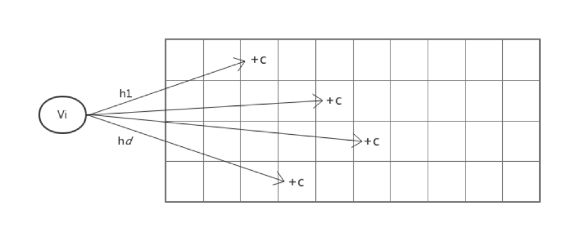

在 TiDB 里，SQL 优化的过程可以分为逻辑优化和物理优化两个部分，在物理优化阶段需要为逻辑查询计划中的算子估算运行代价，并选择其中代价最低的一条查询路径作为最终的查询计划。这里非常关键的一点是如何估算查询代价，本文所介绍的统计信息是这个估算过程的核心模块。

这部分内容非常复杂，所以会分成两篇文章来介绍。本篇文章介绍统计信息基本概念、TiDB 的统计信息收集/更新机制以及如何用统计信息来估计算子代价。上篇侧重于介绍原理，下篇会结合原理介绍 TiDB 的源码实现。  

## 统计信息是什么

为了得到查询路径的执行代价，最简单的办法就是实际执行这个查询计划，不过这样子做就失去了优化器的意义。不过，优化器并不需要知道准确的代价，只需要一个估算值，以便能够区分开代价差别较大的执行计划。因此，数据库常常会维护一些实际数据的概括信息，用以快速的估计代价，这便是统计信息。

在 TiDB 中，我们维护的统计信息包括表的总行数，列的等深直方图，Count-Min Sketch，Null 值的个数，平均长度，不同值的数目等等。下面会简单介绍一下直方图和 Count-Min Sketch。

### 直方图简介

直方图是一种对数据分布情况进行描述的工具，它会按照数据的值大小进行分桶，并用一些简单的数据来描述每个桶，比如落在桶里的值的个数。大多数数据库都会选择用直方图来进行区间查询的估算。根据分桶策略的不同，常见的直方图可以分为等深直方图和等宽直方图。

在 TiDB 中，我们选择了等深直方图，于 1984 年在 [Accurate estimation of the number of tuples satisfying a condition](https://dl.acm.org/citation.cfm?id=602294) 文献中提出。相比于等宽直方图，等深直方图在最坏情况下也可以很好的保证误差。所谓的等深直方图，就是落入每个桶里的值数量尽量相等。举个例子，比方说对于给定的集合 {1.6, 1.9, 1.9, 2.0, 2.4, 2.6, 2.7, 2.7, 2.8, 2.9, 3.4, 3.5}，并且生成 4 个桶，那么最终的等深直方图就会如下图所示，包含四个桶 [1.6, 1.9]，[2.0, 2.6]，[2.7, 2.8]，[2.9, 3.5]，其桶深均为 3。

### Count-Min Sketch 简介  

Count-Min Sketch 是一种可以处理等值查询，Join 大小估计等的数据结构，并且可以提供很强的准确性保证。自 2003 年在文献 [An improved data stream summary: The count-min sketch and its applications](http://dimacs.rutgers.edu/~graham/pubs/papers/cm-full.pdf) 中提出以来，由于其创建和使用的简单性获得了广泛的使用。    

Count-Min Sketch 维护了一个 d*w 的计数数组，对于每一个值，用 d 个独立的 hash 函数映射到每一行的一列中，并对应修改这 d 个位置的计数值。如下图所示：

这样在查询一个值出现了多少次的时候，依旧用 d 个 hash 函数找到每一行中被映射到的位置，取这 d 个值的最小值作为估计值。

直方图和 CM-Sketch 是常用的两种数据概要手段，想了解更多相关技术，可以参考 《Synopses for Massive Data: Samples,Histograms, Wavelets, Sketches》。

## 统计信息创建

通过上面的描述，我们知道统计信息主要需要创建和维护的是直方图和 Count-Min Sketch。

通过执行 analyze 语句，TiDB 会收集上述所需要的信息。在执行 analyze 语句的时候，TiDB 会将 analyze 请求下推到每一个 Region 上，然后将每一个 Region 的结果合并起来。对于 Count-Min Sketch，其创建和合并都比较简单，在这里略去不讲。以下主要介绍列和索引的直方图的创建。  

### 列直方图的创建

在创建直方图的时候，需要数据是有序的，而排序的代价往往很高，因此我们在 TiDB 中实现了抽样算法，对抽样之后的数据进行排序，建立直方图，即会在每一个 Region 上进行抽样，随后在合并结果的时候再进行抽样。    

在 sample.go 中，我们实现了蓄水池抽样算法，用来生成均匀抽样集合。令样本集合的容量为 S，在任一时刻 n，数据流中的元素都以 S/n 的概率被选取到样本集合中去。如果样本集合大小超出 S，则从中随机去除一个样本。举个例子，假如样本池大小为 S = 100 ，从头开始扫描全表，当读到的记录个数 n < 100 时，会把每一条记录都加入采样池，这样保证了在记录总数小于采样池大小时，所有记录都会被选中。而当扫描到的第 n = 101 条时，用概率 P = S/n = 100/101 决定是否把这个新的记录加入采样池，如果加入了采样池，采样池的总数会超过 S 的限制，这时需要随机选择一个旧的采样丢掉，保证采样池大小不会超过限制。    

采样完成后，将所有的数据排序，由于知道采样过后总的行数和直方图的桶数，因此就可以知道每个桶的深度。这样就可以顺序遍历每个值 V：

* 如果 V 等于上一个值，那么把 V 放在与上一个值同一个桶里，无论桶是不是已经满，这样可以保证每个值只存在于一个桶中。

* 如果不等于，那么判断当前桶是否已经满，如果不是的话，就直接放入当前桶，否则的话，就放入下一个桶。

### 索引直方图的创建

在建立索引列直方图的时候，由于不能事先知道有多少行的数据，也就不能确定每一个桶的深度，不过由于索引列的数据是已经有序的，因次可以采用如下算法：在确定了桶的个数之后，将每个桶的初始深度设为 1，用前面列直方图的创建方法插入数据，这样如果到某一时刻所需桶的个数超过了当前桶深度，那么将桶深扩大一倍，将之前的每两个桶合并为 1 个，然后继续插入。    

在收集了每一个 Region 上分别建立的直方图后，还需要把每个 Region 上的直方图进行合并。对于两个相邻 Region 上的直方图，由于索引是有序的，因此前一个的上界不会大于后一个的下界。不过为了保证每个值只在一个桶里，我们还需要先处理一下交界处桶的问题，即如果交界处两个桶的上界和下界相等，那么需要先合并这两个桶。如果直方图合并之后桶的个数超过了限制，那么只需要把两两相邻的桶合二为一。  

## 统计信息维护

在 2.0 版本中，TiDB 引入了动态更新机制（2.0 版本默认没有打开， 2.1-beta 版本中已经默认打开），可以根据查询的结果去动态调整统计信息。对于直方图，需要调整桶高和桶的边界；对于 CM Sketch，需要调整计数数组，使得估计值和查询的结果相等。  

### 桶高的更新

在范围查询的时候，涉及的桶都有可能对最终的结果贡献一些误差。因此，一种更新的方法便是假定所有桶贡献的误差都是均匀的，即如果最终估计的结果为 E，实际的结果为 R，某一个桶的估计结果为 b = 桶高 h * 覆盖比例 r，那么就可以将这个桶的桶高调整为 (b / r) * (R / E) = h * (R / E)。不过如果可以知道落在每一个桶范围中的实际结果，便可以不去假定所有桶贡献的误差都是均匀的。    

为了知道落在每一个桶范围中的实际结果，需要先把查询的范围按照直方图桶的边界切分成不相交的部分，这样 TiKV 在执行查询的时候，可以统计出每一个范围中实际含有的行数目。这样我们便可以按照类似于前述的方法调整每一个桶，不过这个时候不需要假定每个桶贡献的误差都是均匀的，因为我们可以准确知道每一个桶贡献的误差。  

### 桶边界的更新

在用直方图估计的时候，对于那些只被查询范围覆盖了一部分的桶，主要的误差来自连续平均分布假设。这样桶边界更新的主要目便是使得查询的边界能尽量的落在与桶的边界不远的地方。桶边界的更新主要方法包括分裂和合并。    

对于分裂，需要解决的问题是哪些桶需要分裂，分裂成几个，分裂的边界在哪里：

* 哪些桶需要分裂，分裂成几个：如果决定了每一次更新最多分裂 10 个桶，那么如果一个桶上落入了 10% 的查询点，那个这个桶就可以分裂一次，如果落入了 20% 的查询点，那么这个桶就可以分裂两次，以此类推。

* 分裂的边界：由于目标是使得查询的边界能尽量的落在与桶的边界不远的地方，那么如果这个桶要分裂 N 次，就需要选择不超过 N 个查询点，使得剩下的查询点与这 N 个查询点的最近距离之和最小。不过这种方法比较复杂，我们也可以采用比较简单的方法，即假定每个不同的查询点之间的距离都是相等的，这样只需要每隔几个点取一个作为边界就可以。

分裂完成后，我们还要去合并桶。首先分裂得来的桶是不能合并的；除此之外，考虑连续的两个桶，如果第一个桶占合并后桶的比例为 r，那么令合并后产生的误差为 abs(合并前第一个桶的高度 - r * 两个桶的高度和) / 合并前第一个桶的高度，就只需要去合并误差最小的那些连续的桶。  

### Count-Min Sketch 的更新

  CM Sketch 的更新比较简单，对于某一个等值查询的反馈结果 x，其估计值是 y，那么我们只需要将这个值涉及到的所有点加上 c = x-y。

## 统计信息使用

在查询语句中，我们常常会使用一些过滤条件，而统计信息估算的主要作用就是估计经过这些过滤条件后的数据条数，以便优化器选择最优的执行计划。在 [理解 TiDB 执行计划](https://pingcap.com/docs-cn/v3.0/reference/performance/understanding-the-query-execution-plan/#span-id-explain-output-format-explain-输出格式-span) 这篇文档中，介绍到 explain 输出结果中会包含的一列 count，即预计当前 operator 会输出的数据条数，便是基于统计信息以及 operator 的执行逻辑估算而来。

在这个部分中，我们会先从最简单的单一列上的过滤条件开始，然后考虑如何处理多列的情况。  

### 范围查询

对于某一列上的范围查询，TiDB 选择了常用的等深直方图来进行估算。

在前面介绍等深直方图时，我们得到了一个包含四个桶 [1.6, 1.9]，[2.0, 2.6]，[2.7, 2.8]，[2.9, 3.5]，其桶深均为 3 的直方图。假设我们得到了这样一个直方图，并且想知道落在区间 [1.7, 2.8] 范围内的有多少值。把这个区间对应到直方图上，可以看到有两个桶是被完全覆盖的，即桶 [2.0, 2.6] 和桶 [2.7，2.8]，因此区间 [2.0, 2.8] 内一共有 6 个值；但是第一个桶只被覆盖了一部分，那么问题就变成了已经知道区间 [1.6, 1.9] 范围内有 3 个值，怎样估算 [1.7, 1.9] 内有多少个值呢？一个常用的方法是假设这个范围的值是连续且均匀的，那么我们就可以按照查范围占桶的比例去估算，也就是 (1.9 - 1.7) / (1.9 - 1.6) * 3 = 2。    

不过这里还有一个问题是估算的时候要去算比例，这对于数值类型很简单，对于其他类型，比方说字符串类型怎么办呢？一个方法是把字符串映射成数字，然后计算比例，具体可以参见 [statistics/scalar.go](https://github.com/pingcap/tidb/blob/source-code/statistics/scalar.go)。

### 等值查询

对于类似查询等于某个值的这样的等值查询，直方图就捉襟见肘了。一般常用的估计方法是假设每个值出现的次数都相等，这样就可以用（总行数/不同值的数量）来估计。不过在 TiDB 中，我们选择了 Count-Min Sketch 的来进行等值查询的估算。    

由于 Count-Min Sketch 估计的结果总是不小于实际值，因此在 TiDB 中，我们选择了文献 [New estimation algorithms for streaming data: Count-min can do more](http://webdocs.cs.ualberta.ca/~drafiei/papers/cmm.pdf) 中提出了一种 Count-Mean-Min Sketch，其与 Count-Min Sketch 在更新的时候是一样的，区别在与查询的时候：对于每一行 i，若 hash 函数映射到了值 j，那么用 `(N - CM[i, j]) / (w-1)`（N 是总共的插入的值数量）作为其他值产生的噪音，因此用 `CM[i,j] - (N - CM[i, j]) / (w-1)` 这一行的估计值，然后用所有行的估计值的中位数作为最后的估计值。

### 多列查询

上面两个小节介绍了 TiDB 是如何对单列上的查询条件进行估计的，不过实际的查询语句中往往包含多个列上的多个查询条件，因此我们需要考虑如何处理多列的情况。在 TiDB 中，selectivity.go 中的 `Selectivity` 函数实现了这个功能，它是统计信息模块对优化器提供的最重要的接口。    

在处理多列之间的查询条件的时候，一个常见的做法是认为不同列之间是相互独立的，因此我们只需要把不同列之间的过滤率乘起来。不过，对于索引上的可以用来构造索引扫描的范围的过滤条件，即对于一个 `(a, b, c)` 这样的索引，类似 `(a = 1 and b = 1 and c < 5)` 或者 `(a = 1 and b = 1)` 这样的条件，将索引中的值编码后，就可以用前面提到的方法进行估算，这样就不需要假定列之间是相互独立的。    

因此，`Selectivity` 的一个最重要的任务就是将所有的查询条件分成尽量少的组，使得每一组中的条件都可以用某一列或者某一索引上的统计信息进行估计，这样我们就可以做尽量少的独立性假设。    

在 `Selectivity` 中，首先计算了每一列和每一个索引可以覆盖的过滤条件，并用一个 `int64` 来当做一个 bitset，将该列可以覆盖的过滤条件的位置置为 1。接下来的任务就是选择尽量少的 bitset，来覆盖尽量多的过滤条件，在这一步中，我们使用了贪心算法，即每一次在还没有使用的 bitset 中，选择一个可以覆盖最多尚未覆盖的过滤条件。最后一步便是用前面提到的方法对每一个列和每一个索引上的统计信息进行估计，并用独立性假设将它们组合起来当做最终的结果。
