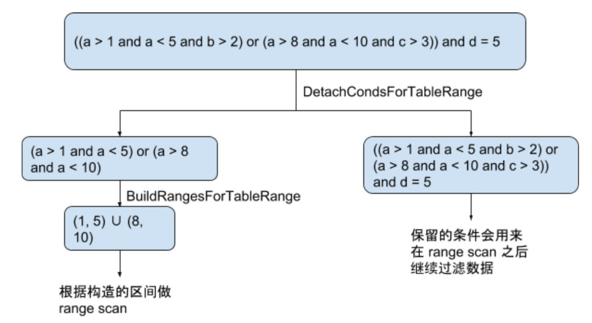
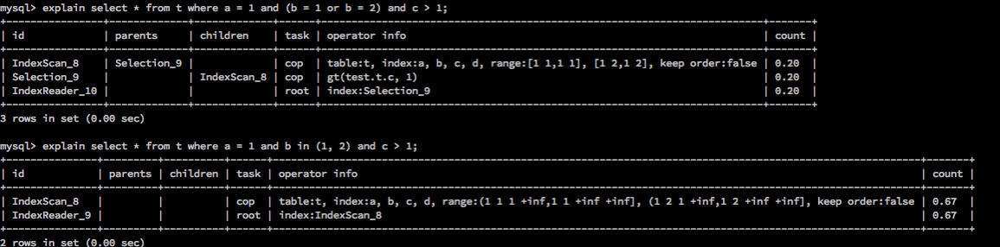
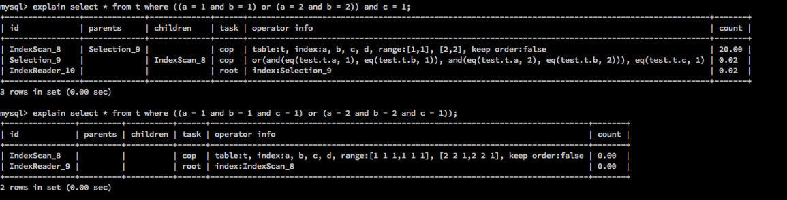

## 简述

在数据库中处理查询请求时，如果可以尽早的将无关数据过滤掉，那么后续的算子就可以少做无用功，提升整个 SQL 的执行效率。过滤数据最常用的手段是使用索引，TiDB 的优化器也会尽量采用索引过滤的方式处理请求，利用索引有序的特点来提升查询效率。比如当查询条件为 `a = 1` 时，如果 a 这一列上有索引，我们就可以利用索引很快的把满足 `a = 1` 的数据拿出来，而不需要逐行检查 a 的值是否为 1。当然是否会选择索引过滤也取决于代价估算。

索引分为单列索引和多列索引（组合索引），筛选条件也往往不会是简单的一个等值条件，可能是非常复杂的条件组合。TiDB 是如何分析这些复杂条件，来得到这些条件在对应的索引上的逻辑区间范围（range），就是本文要介绍的内容。

**关于 TiDB 如何构建索引，如何存储索引数据，希望读者能够有基本的了解（参考阅读：[三篇文章了解 TiDB 技术内幕 - 说计算](https://pingcap.com/blog-cn/tidb-internal-2/) ）。**

这里是一个例子，展示这里所说的索引范围计算是做什么的，建表语句和查询语句如下：

```
CREATE TABLE t (a int primary key, b int, c int);
select * from t where ((a > 1 and a < 5 and b > 2) or (a > 8 and a < 10 and c > 3)) and d = 5;
```

计算索引逻辑区间范围的流程如下：



从上图可以看出，整个流程分为从 Filter 中抽取可用索引的表达式以及利用选出的表达式构造数据范围两个步骤，接下来分别描述。

## 抽取表达式

这个步骤是从 Filter 中将能够用上索引的表达式选出来。由于单列索引和多列索引在处理逻辑上有很大的不同，所以会分单列索引和多列索引两中情况进行讲解。

### 单列索引

单列索引的情况相对来说比较简单。很多满足 Column op Constant 形式的简单表达式都可以用来计算 range，单个表达式的判断逻辑在 [checker.go](https://github.com/pingcap/tidb/blob/source-code/util/ranger/checker.go) 的 conditionChecker 中。而对于包含了 AND 或者 OR 的复杂情况，我们可以按照下述规则进行处理： 

1. AND 表达式无关的 filter 并不会影响其可以计算 range 的子项。所以直接舍去无关的表示即可。以流程图中的一个子表达式 `a > 1 and a < 5 and b > 2` 为例，我们只要将 `b > 2` 扔掉，保留 `a > 1 and a < 5` 即可。

2. OR 表达式中，每个子项都要可以用来计算 range，如果有不可以计算 range 的子项，那么这整个表达式都不可用来计算 range。以 `a = 1 or b = 2` 为例，`b = 2` 这一子项不可以用来计算 a 的 range，所以这个表达式整体上无法计算 a 的 range。而如果是 `a > 1 or ( a < 2 and b = 1)`，根据 1 中的规则，第二个子项会留下 `a < 2` 的部分，可以用来计算 a 的 range，因此整个表达式会返回 `a > 1 and a < 2` 来供接下来计算 range 的部分处理。

这里补充说明一点，TiDB 的主键在实现方式上限定了只有整数类型的单列主键会把主键值当做 RowID，然后编码成 RowKey，和这行数据存储在一起。其他类型的单列主键会作为普通的 unique key 看待，当查询的列包含索引上没有的列时，需要一次查索引 + 一次扫表。所以我们将这种整数类型作为主键的索引处理逻辑单独抽取出来，其入口函数为 [DetachCondsForTableRange](https://github.com/pingcap/tidb/blob/source-code/util/ranger/detacher.go#L329) 。其中对 AND 表达式和 OR 表达式的处理入口分别为 [detachColumnCNFConditions](https://github.com/pingcap/tidb/blob/source-code/util/ranger/detacher.go#L28) 和 [detachColumnDNFConditions](https://github.com/pingcap/tidb/blob/source-code/util/ranger/detacher.go#L61)。这两个函数也用来处理其他类型的主键或者索引的的 range 计算。

### 多列索引

多列索引的情况较单列索引而言会复杂一些，因为在处理 OR 表达式中列与列之间的关系需要考虑更多情况。TiDB 中为了简化 ranger 的逻辑，目前只考虑下列情况：

1. AND 表达式中，只有当之前的列均为点查的情况下，才会考虑下一个列。

	e.g. 对于索引 (a, b, c)，有条件 `a > 1 and b = 1`，那么会被选中的只有 `a > 1`。对于条件 `a in (1, 2, 3) and b > 1`，两个条件均会被选到用来计算 range。

	由于非点查的部分只会涉及到一个列，所以可以直接复用 `detachColumnCNFConditions`。

2. OR 表达式中，每个子项会视为 AND 表达式分开考虑。与单列索引的情况一样，如果其中一个子项无法用来计算索引，那么该 OR 表达式便完全无法计算索引。

多列索引处理的入口函数为 [DetachCondAndBuildRangeForIndex](https://github.com/pingcap/tidb/blob/source-code/util/ranger/detacher.go#L270)，AND 表达式和 OR 表达式的处理入口分别为 [detachCNFCondAndBuildRangeForIndex](https://github.com/pingcap/tidb/blob/source-code/util/ranger/detacher.go#L142) 和 [detachDNFCondAndBuildRangeForIndex](https://github.com/pingcap/tidb/blob/source-code/util/ranger/detacher.go#L214)。（由于多列索引对 range 的处理相对单列索引而言会复杂一些，所以没有拆分为 DetachCondition 和 BuildRange 两部分，而是由 DetachCondAndBuildRangeForIndex 处理。）

由于逻辑进行到了简化，因此目前 TiDB 的 ranger 存在无法正确处理的情况。比如：

* `a = 1 and (b = 1 or b = 2) and c > 1`。对于这个式子，当 (a, b ,c) 为索引时，如上述所言，由于 `(b = 1 or b = 2)` 形式上是 OR 表达式的情况，而非点查。所以会在 b 列停止，不会考虑 `c > 1` 的情况。所以目前为了兼容 TiDB 的逻辑，遇到这种情况尽量改写为 `a = 1 and b in (1, 2) and c > 1` 的形式。



* 类似的如 `((a = 1 and b = 1) or (a = 2 and b = 2)) and c = 1` 形式的式子，前段 OR 表达式实际上为点查的行为，但是由于是 OR 连接起来的式子，所以在 TiDB 的逻辑中作为范围查询处理，因此 `c = 1` 不会作为索引的计算条件处理。而这时改写为 `(a, b) in ((1, 1)`,  `(2, 2)) and c = 1` 的形式也不会使 `c = 1` 选入索引计算的条件，原因是多列 in 的函数会被 TiDB 改写为 OR 连接的形式，所以 `((a = 1 and b = 1) or (a = 2 and b = 2))` 和 `(a, b) in ((1, 1),  (2, 2))` 在 TiDB 中是完全一致的行为。针对这种情况，目前的办法只有将这些条件都放入 OR 的子项中，针对这里用到的例子，那就是要改写为 `((a = 1 and b = 1 and c = 1) or (a = 2 and b = 2 and c = 1))`。



## 计算逻辑区间

这一步骤中，利用上一步抽取出来的表达式估算出数据的逻辑区间范围，后续会根据这个逻辑区间以及数据编码方式构造物理区间进行数据访问。我们仍然分为单列索引和多列索引两个情况来介绍。

### 单列索引

这种情况下，输入的表达式为 Column op Constant 形式的简单表达式由 OR 以及 AND 连接而成。我们对每一个具体的操作符，都设计了一段对应的计算 range 的逻辑，当遇到 AND 或者 OR 时，会对两个区间求交或者求并。在 point.go 中有一个 [builder](https://github.com/pingcap/tidb/blob/source-code/util/ranger/points.go#L146) 的结构体用来处理上述逻辑。

在这个阶段我们记录 range 时用 rangePoint 的结构来存储 range。

```go
// Point is the end point of range interval.
type point struct {
	value types.Datum
	excl  bool // exclude
	start bool
}
```

每个 point 代表区间的一个端点，其中的 excl 表示端点为开区间的端点还是闭区间的端点。start 表示这个端点是左端点还是右端点。

builder 中每个 buildFromXXX 的方法都是计算一个具体函数的 range 的方法。比如 [buildFromIn](https://github.com/pingcap/tidb/blob/source-code/util/ranger/points.go#L299) 便是处理 [in 函数](https://dev.mysql.com/doc/refman/5.7/en/comparison-operators.html#function_in) 的方法。可以看到它首先对 in 函数的值列表的每个值都构造了一个 rangPoint 的单点区间，然后对这些区间放在一个 slice 中做排序以及去重。最终将去重后的结果输出。

在 pointer.go 中还包含其他各类的函数的处理，具体可以翻阅源代码。

除了对具体函数的处理外，pointer.go 中还有区间交和区间并的操作。[intersection](https://github.com/pingcap/tidb/blob/source-code/util/ranger/points.go#L484) 和 [union](https://github.com/pingcap/tidb/blob/source-code/util/ranger/points.go#L488) 分别代表区间交和区间并。两个函数的逻辑均通过 merge 方法进行处理，通过传入一个 flag 来区分。merge 函数做了如下两个假设：

* a, b 两个区间均已经做过去重

* 单个区间序列内部不会有重叠的部分

merge 函数使用 inRangeCount 来记录当前位置被 a, b 两个区间序列覆盖的情况。区间求并的情况时，只要 a, b 两个区间序列中有一个区间序列覆盖便可以作为解输出，被两个区间同时覆盖的端点必然是属于一个更大的区间的内部不需要输出。所以当 inRangeCount 为 1 时，即为需要输出的区间端点。

当区间求交时，需要两个序列都覆盖到才是可以输出的端点，所以当 inRangeCount 为 2 时，即为需要输出的区间端点。

在得到最后的区间端点序列后，由 [points2TableRanges](https://github.com/pingcap/tidb/blob/source-code/util/ranger/ranger.go#L174) 转化为对外暴露的 range 结构，由 [BuildTableRange](https://github.com/pingcap/tidb/blob/source-code/util/ranger/ranger.go#L224) 输出到 plan package。

```go
// NewRange represents a range generated in physical plan building phase.
type NewRange struct {
	LowVal  []types.Datum
	HighVal []types.Datum

	LowExclude  bool // Low value is exclusive.
	HighExclude bool // High value is exclusive.
}
```

在现在的 TiDB 中，单列索引和多列索引使用了相同的 range 结构，所以这里的端点值为 slice 的形式。

### 多列索引

对于多列索引，当其为 AND 表达式时，根据前述我们可以知道，其形式必为索引前缀列上的等值条件再加上关于前缀之后一个列的复杂条件组成。所以我们只需要按顺序处理点查的等值条件部分，将点查的区间依次 append 到 NewRange 中的 LowVal 和 HighVal 两个 Slice 中即可（[appendPoints2Ranges](https://github.com/pingcap/tidb/blob/master/util/ranger/ranger.go#L133)）。处理到最后一列时，将之前的 NewRange 按最后非点查列所计算得到的区间个数拷贝一下，再依次 append 即可。具体代码可见 [buildCNFIndexRange](https://github.com/pingcap/tidb/blob/master/util/ranger/ranger.go#L282)。

对于 OR 表达式的情况，由于此时 range 已经无法转回 point 的结构。所以这里重新实现了一下区间并的操作。实现的形式便是比较常见的将区间按左端点排序，在依次扫过区间的同时，记录当前所有重叠过的区间的最右右端点来进行做区间并的算法。区间并的具体的实现可见 [unionRanges](https://github.com/pingcap/tidb/blob/master/util/ranger/ranger.go#L357) 方法。

## Future Plan

* 目前 TiDB 对单列索引的处理在逻辑上已经非常完备，在实际表现上可能由于没有对部分函数实现计算 range 的逻辑而有遗漏。这部分会根据情况进行优化。

* 如上文提到的，目前 TiDB 为了简化 ranger 的逻辑，对多列索引做了一些假设。未来会尝试去掉或者弱化这些假设，或者在前期对 SQL 进行更充分的改写使得 SQL 不会触发这些假设，来提供更加强大的功能，免于手动 rewrite 的麻烦。

* 目前 TiDB 对简单式子的形式的检查限定在了 Column op Constant 的形式。所以诸如 `from_unixtime(timestamp_col) op datetime_constant` 形式的条件是无法计算索引的，也需要手动 rewrite 为 `timestamp_col op timestamp_constant` 才可以使用到索引。这部分也会考虑进行改进以提升用户体验。
