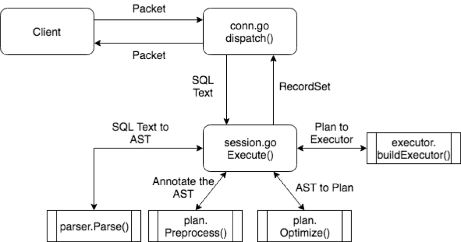

## 概述
上一篇文章讲解了 TiDB 项目的结构以及三个核心部分，本篇文章从 SQL 处理流程出发，介绍哪里是入口，对 SQL 需要做哪些操作，知道一个 SQL 是从哪里进来的，在哪里处理，并从哪里返回。

SQL 有很多种，比如读、写、修改、删除以及管理类的 SQL，每种 SQL 有自己的执行逻辑，不过大体上的流程是类似的，都在一个统一的框架下运转。

## 框架

我们先从整体上看一下，一条语句需要经过哪些方面的工作。如果大家还记得上一篇文章所说的三个核心部分，可以想到首先要经过协议解析和转换，拿到语句内容，然后经过 SQL 核心层逻辑处理，生成查询计划，最后去存储引擎中获取数据，进行计算，返回结果。这个就是一个粗略的处理框架，本篇文章会把这个框架不断细化。

对于第一部分，协议解析和转换，所有的逻辑都在 server 这个包中，主要逻辑分为两块：一是连接的建立和管理，每个连接对应于一个 Session；二是在单个连接上的处理逻辑。第一点本文暂时不涉及，感兴趣的同学可以翻翻代码，看看连接如何建立、如何握手、如何销毁，后面也会有专门的文章讲解。对于 SQL 的执行过程，更重要的是第二点，也就是已经建立了连接，在这个连接上的操作，本文会详细讲解这一点。

对于第二部分，SQL 层的处理是整个 TiDB 最复杂的部分。这部分为什么复杂？原因有三点：

1. SQL 语言本身是一门复杂的语言，语句的种类多、数据类型多、操作符多、语法组合多，这些『多』经过排列组合会变成『很多』『非常多』，所以需要写大量的代码来处理。

2. SQL 是一门表意的语言，只是说『要什么数据』，而不说『如何拿数据』，所以需要一些复杂的逻辑选择『如何拿数据』，也就是选择一个好的查询计划。

3. 底层是一个分布式存储引擎，会面临很多单机存储引擎不会遇到的问题，比如做查询计划的时候要考虑到下层的数据是分片的、网络不通了如何处理等情况，所以需要一些复杂的逻辑处理这些情况，并且需要一个很好的机制将这些处理逻辑封装起来。这些复杂性是看懂源码比较大的障碍，所以本篇文章会尽量排除这些干扰，给大家讲解核心的逻辑是什么。

这一层有几个核心概念，掌握了这几个也就掌握了这一层的框架，请大家关注下面这几个接口：

+ [Session](https://github.com/pingcap/tidb/blob/source-code/session.go#L62)

+ [RecordSet](https://github.com/pingcap/tidb/blob/source-code/ast/ast.go#L136)

+ [Plan](https://github.com/pingcap/tidb/blob/source-code/plan/plan.go#L30)

+ [LogicalPlan](https://github.com/pingcap/tidb/blob/source-code/plan/plan.go#L140)

+ [PhysicalPlan](https://github.com/pingcap/tidb/blob/source-code/plan/plan.go#L190)

+ [Executor](https://github.com/pingcap/tidb/blob/source-code/executor/executor.go#L190) 

下面的详细内容中，会讲解这些接口，用这些接口理清楚整个逻辑。

对于第三部分可以认为两块，第一块是 KV 接口层，主要作用是将请求路由到正确的的 KV Server，接收返回消息传给 SQL 层，并在此过程中处理各种异常逻辑；第二块是 KV Server 的具体实现，由于 TiKV 比较复杂，我们可以先看 Mock-TiKV 的实现，这里有所有的 SQL 分布式计算相关的逻辑。
接下来的几节，会对上面的三块详细展开描述。

### 协议层入口

当和客户端的连接建立好之后，TiDB 中会有一个 Goroutine 监听端口，等待从客户端发来的包，并对发来的包做处理。这段逻辑在 server/conn.go 中，可以认为是 TiDB 的入口，本节介绍一下这段逻辑。 首先看 [clientConn.Run()](https://github.com/pingcap/tidb/blob/source-code/server/conn.go#L413)，这里会在一个循环中，不断的读取网络包：

```
	445:	data, err := cc.readPacket()
```
然后调用 dispatch() 方法处理收到的请求：

```
	465:		if err = cc.dispatch(data); err != nil {
```

接下来进入 [clientConn.dispatch()](https://github.com/pingcap/tidb/blob/source-code/server/conn.go#L571)方法：

```
	func (cc *clientConn) dispatch(data []byte) error {
```

这里要处理的包是原始 byte 数组，里面的内容读者可以参考 [MySQL 协议](https://dev.mysql.com/doc/internals/en/client-server-protocol.html)，第一个 byte 即为 Command 的类型：

```
		580: 	cmd := data[0]
```

然后根据 Command 的类型，调用对应的处理函数，最常用的 Command 是 [COM_QUERY](https://dev.mysql.com/doc/internals/en/com-query.html#packet-COM_QUERY)，对于大多数 SQL 语句，只要不是用 Prepared 方式，都是 COM_QUERY，本文也只会介绍这个 Command，其他的 Command 请读者对照 MySQL 文档看代码。 对于 Command Query，从客户端发送来的主要是 SQL 文本，处理函数是 [handleQuery()](https://github.com/pingcap/tidb/blob/source-code/server/conn.go#L849):

```
	func (cc *clientConn) handleQuery(goCtx goctx.Context, sql string) (err error) {
```

这个函数会调用具体的执行逻辑：

```
	850:  rs, err := cc.ctx.Execute(goCtx, sql)
```

这个 Execute 方法的实现在 server/driver_tidb.go 中，

```
	func (tc *TiDBContext) Execute(goCtx goctx.Context, sql string) (rs []ResultSet, err error) {
		rsList, err := tc.session.Execute(goCtx, sql)
```

最重要的就是调用 tc.session.Execute，这个 session.Execute 的实现在 session.go 中，自此会进入 SQL 核心层，详细的实现会在后面的章节中描述。

经过一系列处理，拿到 SQL 语句的结果后会调用 writeResultset 方法把结果写回客户端：

```
		857:		err = cc.writeResultset(goCtx, rs[0], false, false)
```

### 协议层出口

出口比较简单，就是上面提到的 [writeResultset](https://github.com/pingcap/tidb/blob/source-code/server/conn.go#L909) 方法，按照 MySQL 协议的要求，将结果（包括 Field 列表、每行数据）写回客户端。读者可以参考 MySQL 协议中的 [COM_QUERY Response](https://dev.mysql.com/doc/internals/en/com-query-response.html) 理解这段代码。

接下的几节我们进入核心流程，看看一条文本的 SQL 是如何处理的。我会先介绍所有的流程，然后用一个图把所有的流程串起来。

### Session

Session 中最重要的函数是 [Execute](https://github.com/pingcap/tidb/blob/source-code/session.go#L742)，这里会调用下面所述的各种模块，完成语句执行。注意这里在执行的过程中，会考虑 Session 环境变量，比如是否 `AutoCommit`，时区是什么。

### Lexer & Yacc

这两个组件共同构成了 Parser 模块，调用 Parser，可以将文本解析成结构化数据，也就是抽象语法树 （AST）：

```
	session.go 699: 	return s.parser.Parse(sql, charset, collation)
```

在解析过程中，会先用 [lexer](https://github.com/pingcap/tidb/blob/source-code/parser/lexer.go) 不断地将文本转换成 token，交付给 Parser，Parser 是根据 [yacc 语法](https://github.com/pingcap/tidb/blob/source-code/parser/parser.y)生成，根据语法不断的决定 Lexer 中发来的 token 序列可以匹配哪条语法规则，最终输出结构化的节点。 例如对于这样一条语句 `SELECT * FROM t WHERE c > 1;`，可以匹配 [SelectStmt 的规则](https://github.com/pingcap/tidb/blob/source-code/parser/parser.y#L3936)，被转换成下面这样一个数据结构：

```
	type SelectStmt struct {
		dmlNode
		resultSetNode
	
		// SelectStmtOpts wraps around select hints and switches.
		*SelectStmtOpts
		// Distinct represents whether the select has distinct option.
		Distinct bool
		// From is the from clause of the query.
		From *TableRefsClause
		// Where is the where clause in select statement.
		Where ExprNode
		// Fields is the select expression list.
		Fields *FieldList
		// GroupBy is the group by expression list.
		GroupBy *GroupByClause
		// Having is the having condition.
		Having *HavingClause
		// OrderBy is the ordering expression list.
		OrderBy *OrderByClause
		// Limit is the limit clause.
		Limit *Limit
		// LockTp is the lock type
		LockTp SelectLockType
		// TableHints represents the level Optimizer Hint
		TableHints []*TableOptimizerHint
	}
```
其中，`FROM t` 会被解析为 `FROM` 字段，`WHERE c > 1` 被解析为 `Where` 字段，`*` 被解析为 `Fields` 字段。所有的语句的结构够都被抽象为一个 `ast.StmtNode`，这个接口读者可以自行看注释，了解一下。这里只提一点，大部分 ast 包中的数据结构，都实现了 `ast.Node` 接口，这个接口有一个 `Accept` 方法，后续对 AST 的处理，主要依赖这个 Accept 方法，以 [Visitor 模式](https://en.wikipedia.org/wiki/Visitor_pattern)遍历所有的节点以及对 AST 做结构转换。

### 制定查询计划以及优化

拿到 AST 之后，就可以做各种验证、变化、优化，这一系列动作的入口在这里：

```
	session.go 805: 			stmt, err := compiler.Compile(goCtx, stmtNode)
```

我们进入 [Compile 函数](https://github.com/pingcap/tidb/blob/source-code/executor/compiler.go#L37)，可以看到三个重要步骤：

+ `plan.Preprocess`: 做一些合法性检查以及名字绑定；

+ `plan.Optimize`：制定查询计划，并优化，这个是最核心的步骤之一，后面的文章会重点介绍；

+ 构造 `executor.ExecStmt` 结构：这个 [ExecStmt](https://github.com/pingcap/tidb/blob/source-code/executor/adapter.go#L148) 结构持有查询计划，是后续执行的基础，非常重要，特别是 Exec 这个方法。

### 生成执行器

在这个过程中，会将 plan 转换成 executor，执行引擎即可通过 executor 执行之前定下的查询计划，具体的代码见 [ExecStmt.buildExecutor()](https://github.com/pingcap/tidb/blob/source-code/executor/adapter.go#L318)：

```
	executor/adpter.go 227:  e, err := a.buildExecutor(ctx)
```

生成执行器之后，被[封装在一个 `recordSet` 结构中](https://github.com/pingcap/tidb/blob/source-code/executor/adapter.go#L260)：

```
		return &recordSet{
			executor:    e,
			stmt:        a,
			processinfo: pi,
			txnStartTS:  ctx.Txn().StartTS(),
		}, nil
```


这个结构实现了 [`ast.RecordSet`](https://github.com/pingcap/tidb/blob/source-code/ast/ast.go#L136) 接口，从字面上大家可以看出，这个接口代表了查询结果集的抽象，我们看一下它的几个方法：

```
	// RecordSet is an abstract result set interface to help get data from Plan.
	type RecordSet interface {
		// Fields gets result fields.
		Fields() []*ResultField
	
		// Next returns the next row, nil row means there is no more to return.
		Next(ctx context.Context) (row types.Row, err error)
	
		// NextChunk reads records into chunk.
		NextChunk(ctx context.Context, chk *chunk.Chunk) error
	
		// NewChunk creates a new chunk with initial capacity.
		NewChunk() *chunk.Chunk
	
		// SupportChunk check if the RecordSet supports Chunk structure.
		SupportChunk() bool
	
		// Close closes the underlying iterator, call Next after Close will
		// restart the iteration.
		Close() error
	}
```

通过注释大家可以看到这个接口的作用，简单来说，可以调用 Fields() 方法获得结果集每一列的类型，调用 Next/NextChunk() 可以获取一行或者一批数据，调用 Close() 可以关闭结果集。

### 运行执行器

TiDB 的执行引擎是以 Volcano 模型运行，所有的物理 Executor 构成一个树状结构，每一层通过调用下一层的 Next/NextChunk() 方法获取结果。 举个例子，假设语句是 `SELECT c1 FROM t WHERE c2 > 1;`，并且查询计划选择的是全表扫描+过滤，那么执行器树会是下面这样：


大家可以从图中看到 Executor 之间的调用关系，以及数据的流动方式。那么最上层的 Next 是在哪里调用，也就是整个计算的起始点在哪里，谁来驱动这个流程？ 有两个地方大家需要关注，这两个地方分别处理两类语句。 第一类语句是 Select 这种查询语句，需要对客户端返回结果，这类语句的执行器调用点在[给客户端返回数据的地方](https://github.com/pingcap/tidb/blob/master/server/conn.go#L909)：

```
			row, err = rs.Next(ctx)
```

这里的 `rs` 即为一个 `RecordSet` 接口，对其不断的调用 `Next()`，拿到更多结果，返回给 MySQL Client。 第二类语句是 Insert 这种不需要返回数据的语句，只需要把语句执行完成即可。这类语句也是通过 `Next` 驱动执行，驱动点在[构造 `recordSet` 结构之前](https://github.com/pingcap/tidb/blob/source-code/executor/adapter.go#L251)：

```
		// If the executor doesn't return any result to the client, we execute it without delay.
		if e.Schema().Len() == 0 {
			return a.handleNoDelayExecutor(goCtx, e, ctx, pi)
		} else if proj, ok := e.(*ProjectionExec); ok && proj.calculateNoDelay {
			// Currently this is only for the "DO" statement. Take "DO 1, @a=2;" as an example:
			// the Projection has two expressions and two columns in the schema, but we should
			// not return the result of the two expressions.
			return a.handleNoDelayExecutor(goCtx, e, ctx, pi)
		}
```

## 总结

上面描述了整个 SQL 层的执行框架，这里用一幅图来描述整个过程：



通过这篇文章，相信大家已经了解了 TiDB 中语句的执行框架，整个逻辑还是比较简单，框架中具体的模块的详细解释会在后续章节中给出。下一篇文章会用具体的语句为例，帮助大家理解本篇文章。


