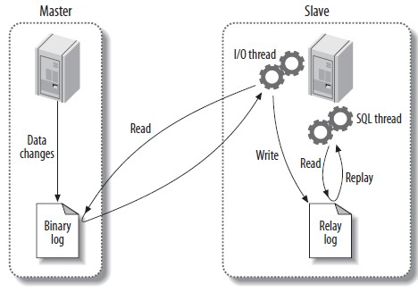

TiDB 是一个完全分布式的关系型数据库，从诞生的第一天起，我们就想让它来兼容 MySQL 语法，希望让原有的 MySQL 用户 (不管是单机的 MySQL，还是多机的 MySQL Sharding) 都可以在基本不修改代码的情况下，除了可以保留原有的 SQL 和 ACID 事务之外，还可以享受到分布式带来的高并发，高吞吐和 MPP 的高性能。

对于用户来说，简单易用是他们试用的最基本要求，得益于社区和 PingCAP 小伙伴们的努力，我们提供基于 Binary 和 基于 Kubernetes 的两种不同的一键部署方案来让用户可以在几分钟就可以部署起来一个分布式的 TiDB 集群，从而快速地进行体验。
当然，对于用户来说，最好的体验方式就是从原有的 MySQL 数据库同步一份数据镜像到 TiDB 来进行对比测试，不仅简单直观，而且也足够有说服力。实际上，我们已经提供了一整套的工具来辅助用户在线做数据同步，具体的可以参考我们之前的一篇文章：[TiDB 作为 MySQL Slave 实现实时数据同步](https://pingcap.com/blog-cn/tidb-as-mysql-slave/), 这里就不再展开了。后来有很多社区的朋友特别想了解其中关键的 Syncer 组件的技术实现细节，于是就有了这篇文章。


首先我们看下 Syncer 的整体架构图, 对于 Syncer 的作用和定位有一个直观的印象。


从整体的架构可以看到，Syncer 主要是通过把自己注册为一个 MySQL Slave 的方式，和 MySQL Master 进行通信，然后不断读取 MySQL Binlog，进行 Binlog Event 解析，规则过滤和数据同步。从工程的复杂度上来看，相对来说还是非常简单的，相对麻烦的地方主要是 Binlog Event 解析和各种异常处理，也是容易掉坑的地方。


为了完整地解释 Syncer 的在线同步实现，我们需要有一些额外的内容需要了解。

### MySQL Replication
我们先看看 MySQL 原生的 Replication 复制方案，其实原理上也很简单：

1）MySQL Master 将数据变化记录到 Binlog (Binary Log),
2) MySQL Slave 的 I/O Thread 将 MySQL Master 的 Binlog 同步到本地保存为 Relay Log
3）MySQL Slave 的 SQL Thread 读取本地的 Relay Log，将数据变化同步到自身



#### MySQL Binlog

MySQL 的 Binlog 分为几种不同的类型，我们先来大概了解下，也看看具体的优缺点。

1）Row
MySQL Master 将详细记录表的每一行数据变化的明细记录到 Binlog。
优点：完整地记录了行数据的变化信息，完全不依赖于存储过程，函数和触发器等等，不会出现因为一些依赖上下文信息而导致的主从数据不一致的问题。
缺点：所有的增删改查操作都会完整地记录在 Binlog 中，会消耗更大的存储空间。


2）Statement
MySQL Master 将每一条修改数据的 SQL 都会记录到 Binlog。
优点：相比 Row 模式，Statement 模式不需要记录每行数据变化，所以节省存储量和 IO，提高性能。
缺点：一些依赖于上下文信息的功能，比如  auto increment id，user define function, on update current_timestamp/now 等可能导致的数据不一致问题。


3）Mixed
MySQL Master 相当于 Row 和 Statement 模式的融合。
优点：根据 SQL 语句，自动选择 Row 和 Statement 模式，在数据一致性，性能和存储空间方面可以做到很好的平衡。
缺点：两种不同的模式混合在一起，解析处理起来会相对比较麻烦。

#### MySQL Binlog Event
了解了 MySQL Replication 和 MySQL Binlog 模式之后，终于进入到了最复杂的 MySQL Binlog Event 协议解析阶段了。


在解析 MySQL Binlog Eevent 之前，我们首先看下 MySQL Slave 在协议上是怎么和 MySQL Master 进行交互的。

**Binlog dump**

首先，我们需要伪造一个 Slave，向 MySQL Master 注册，这样 Master 才会发送 Binlog Event。注册很简单，就是向 Master 发送 `COM_REGISTER_SLAVE` 命令，带上 Slave 相关信息。这里需要注意，因为在 MySQL 的 replication topology 中，都需要使用一个唯一的 server id 来区别标示不同的 Server 实例，所以这里我们伪造的 slave 也需要一个唯一的 server id。

**Binlog Event**

对于一个 Binlog Event 来说，它分为三个部分，header，post-header 以及 payload。
MySQL 的 Binlog Event 有很多版本，我们只关心 v4 版本的，也就是从 MySQL 5.1.x 之后支持的版本，太老的版本应该基本上没什么人用了。


Binlog Event 的 header 格式如下：

```
4 bytes timestamp
1 bytes event type
4 bytes server-id
4 bytes event-size
4 bytes log pos
2 bytes flags
```
header 的长度固定为 19，event type 用来标识这个 event 的类型，event size 则是该 event 包括 header 的整体长度，而 log pos 则是下一个 event 所在的位置。


这个 header 对于所有的 event 都是通用的，接下来我们看看具体的 event。


`FORMAT_DESCRIPTION_EVENT`

在 v4 版本的 Binlog 文件中，第一个 event 就是 `FORMAT_DESCRIPTION_EVENT`，格式为:

```
2 bytes         binlog-version
string[50]      mysql-server version
4 bytes         create timestamp
1 byte          event header length
string[p]       event type header lengths
```

我们需要关注的就是 event type header length 这个字段，它保存了不同 event 的 post-header 长度，通常我们都不需要关注这个值，但是在解析后面非常重要的ROWS_EVENT 的时候，就需要它来判断 TableID 的长度了, 这个后续再说明。


`ROTATE_EVENT`

而 Binlog 文件的结尾，通常（只要 Master 不当机）就是 `ROTATE_EVENT`，格式如下:

```
Post-header
8 bytes            position


Payload
string[p]          name of the next binlog
```


它里面其实就是标明下一个 event 所在的 binlog filename 和 position。这里需要注意，当 Slave 发送 Binlog dump 之后，Master 首先会发送一个 `ROTATE_EVENT`，用来告知 Slave下一个 event 所在位置，然后才跟着 `FORMAT_DESCRIPTION_EVENT`。


其实我们可以看到，Binlog Event 的格式很简单，文档都有着详细的说明。通常来说，我们仅仅需要关注几种特定类型的 event，所以只需要写出这几种 event 的解析代码就可以了，剩下的完全可以跳过。


`TABLE_MAP_EVENT`

上面我们提到 Syncer 使用 Row 模式的 Binlog，关于增删改的操作，对应于最核心的ROWS_EVENT ，它记录了每一行数据的变化情况。而如何解析相关的数据，是非常复杂的。在详细说明 ROWS_EVENT 之前，我们先来看看 TABLE_MAP_EVENT，该 event 记录的是某个 table 一些相关信息，格式如下:

```
post-header:
    if post_header_len == 6 {
  		4 bytes table id
    } else {
  		6 bytes table id
    }
  	2 bytes flags


payload:
  1 byte              schema name length
  string              schema name
  1 byte              [00]
  1 byte              table name length
  string              table name
  1 byte              [00]
  lenenc-int          column-count
  string.var_len[length=$column-count] column-def
  lenenc-str          column-meta-def
  n bytes             NULL-bitmask, length: (column-count + 8) / 7
```


table id 需要根据 post_header_len 来判断字节长度，而 post_header_len 就是存放到 `FORMAT_DESCRIPTION_EVENT` 里面的。这里需要注意，虽然我们可以用 table id 来代表一个特定的 table，但是因为 Alter Table 或者 Rotate Binlog Event 等原因，Master 会改变某个 table 的 table id，所以我们在外部不能使用这个 table id 来索引某个 table。


`TABLE_MAP_EVENT` 最需要关注的就是里面的 column meta 信息，后续我们解析 ROWS_EVENT 的时候会根据这个来处理不同数据类型的数据。column def 则定义了每个列的类型。


`ROWS_EVENT`

`ROWS_EVENT` 包含了 insert，update 以及 delete 三种 event，并且有 v0，v1 以及 v2 三个版本。
`ROWS_EVENT` 的格式很复杂，如下：

```
header:
  if post_header_len == 6 {
		4                    table id
  } else {
		6                    table id
  }
  2                        flags
  if version == 2 {
		2                    extra-data-length
		string.var_len       extra-data
  }

body:
lenenc_int            number of columns
string.var_len        columns-present-bitmap1, length: (num of columns+7)/8
if UPDATE_ROWS_EVENTv1 or v2 {
	string.var_len     columns-present-bitmap2, length: (num of columns+7)/8
}

rows:
string.var_len       nul-bitmap, length (bits set in 'columns-present-bitmap1'+7)/8
string.var_len       value of each field as defined in table-map

if UPDATE_ROWS_EVENTv1 or v2 {
	string.var_len       nul-bitmap, length (bits set in 'columns-present-bitmap2'+7)/8
	string.var_len       value of each field as defined in table-map
}
... repeat rows until event-end
```

`ROWS_EVENT` 的 table id 跟 `TABLE_MAP_EVENT` 一样，虽然 table id 可能变化，但是 `ROWS_EVENT` 和 `TABLE_MAP_EVENT` 的 table id 是能保证一致的，所以我们也是通过这个来找到对应的 `TABLE_MAP_EVENT`。
为了节省空间，`ROWS_EVENT` 里面对于各列状态都是采用 bitmap 的方式来处理的。

首先我们需要得到 columns present bitmap 的数据，这个值用来表示当前列的一些状态，如果没有设置，也就是某列对应的 bit 为 0，表明该 `ROWS_EVENT` 里面没有该列的数据，外部直接使用 null 代替就成了。

然后就是 null bitmap，这个用来表明一行实际的数据里面有哪些列是 null 的，这里最坑爹的是 null bitmap 的计算方式并不是 (num of columns+7)/8，也就是 MySQL 计算 bitmap 最通用的方式，而是通过 columns present bitmap 的 bits set 个数来计算的，这个坑真的很大。为什么要这么设计呢，可能最主要的原因就在于 MySQL 5.6 之后 Binlog Row Image 的格式增加了 minimal 和 noblob，尤其是 minimal，update 的时候只会记录相应更改字段的数据，比如我一行有 16 列，那么用 2 个 byte 就能搞定 null bitmap 了，但是如果这时候只有第一列更新了数据，其实我们只需要使用 1 个 byte 就能记录了，因为后面的铁定全为 0，就不需要额外空间存放了。bits set 其实也很好理解，就是一个 byte 按照二进制展示的时候 1 的个数，譬如 1 的 bits set 就是1，而 3 的 bits set 就是 2，而 255 的 bits set 就是 8 了。


得到了 present bitmap 以及 null bitmap 之后，我们就能实际解析这行对应的列数据了，对于每一列，首先判断是否 present bitmap 标记了，如果为 0，则跳过用 null 表示，然后在看是否在 null bitmap 里面标记了，如果为 1，表明值为 null，最后我们就开始解析真正有数据的列了。

但是，因为我们得到的是一行数据的二进制流，我们怎么知道一列数据如何解析？这里，就要靠 `TABLE_MAP_EVENT` 里面的 column def 以及 meta 了。
column def 定义了该列的数据类型，对于一些特定的类型，譬如 `MYSQL_TYPE_LONG`, `MYSQL_TYPE_TINY` 等，长度都是固定的，所以我们可以直接读取对应的长度数据得到实际的值。但是对于一些类型，则没有这么简单了。这时候就需要通过 meta 来辅助计算了。

譬如对于 `MYSQL_TYPE_BLOB` 类型，meta 为 1 表明是 tiny blob，第一个字节就是 blob 的长度，2 表明的是 short blob，前两个字节为 blob 的长度等，而对于 `MYSQL_TYPE_VARCHAR` 类型，meta 则存储的是 string 长度。当然这里面还有最复杂的 `MYSQL_TYPE_NEWDECIMAL`，  `MYSQL_TYPE_TIME2` 等类型，关于不同类型的 column 解析还是比较复杂的，可以单独开一章专门来介绍，因为篇幅关系这里就不展开介绍了，具体的可以参考官方文档。

搞定了这些，我们终于可以完整的解析一个 `ROWS_EVENT` 了：）


`XID_EVENT`
在事务提交时，不管是 Statement 还是 Row 模式的 Binlog，都会在末尾添加一个 `XID_EVENT` 事件代表事务的结束，里面包含事务的 ID 信息。


`QUERY_EVENT`

`QUERY_EVENT` 主要用于记录具体执行的 SQL 语句，MySQL 所有的 DDL 操作都记录在这个 event 里面。


### Syncer
介绍完了 MySQL Replication 和 MySQL Binlog Event 之后，理解 Syncer 就变的比较容易了，上面已经介绍过基本的架构和功能了，在 Syncer 中， 解析和同步 MySQL Binlog，我们使用的是我们首席架构师唐刘的 go-mysql 作为核心 lib，这个 lib 已经在 github 和 bilibili 线上使用了，所以是非常安全可靠的。所以这部分我们就跳过介绍了，感兴趣的话，可以看下 github 开源的代码。这里面主要介绍几个核心问题：


#### MySQL Binlog 模式的选择
在 Syncer 的设计中，首先考虑的是可靠性问题，即使 Syncer 异常退出也可以直接重启起来，也不会对线上数据一致性产生影响。为了实现这个目标，我们必须处理数据同步的可重入问题。
对于 Mixed 模式来说，一个 insert 操作，在 Binlog 中记录的是 insert SQL，如果 Syncer 异常退出的话，因为 Savepoint 还没有来得及更新，会导致重启之后继续之前的 insert SQL，就会导致主键冲突问题，当然可以对 SQL 进行改写，将 insert 改成 replace，但是这里面就涉及到了 SQL 的解析和转换问题，处理起来就有点麻烦了。另外一点就是，最新版本的 MySQL  5.7 已经把 Row 模式作为默认的 Binlog 格式了。所以，在 Syncer 的实现中，我们很自然地选择 Row 模式作为 Binlog 的数据同步模式。


#### Savepoint 的选取
对于 Syncer 本身来说，我们更多的是考虑让它尽可能的简单和高效，所以每次 Syncer 重启都要尽可能从上次同步的 Binlog Pos 的地方做类似断点续传的同步。如何选取 Savepoint 就是一个需要考虑的问题了。
对于一个 DML 操作来说(以 Insert SQL 操作举例来看)，基本的 Binlog Event 大概是下面的样子：

```
TABLE_MAP_EVENT
QUERY_EVENT   → begin
WRITE_ROWS_EVENT
XID_EVENT
```

我们从 MySQL Binlog Event 中可以看到，每个 Event 都可以获取下一个 Event 开始的 MySQL Binlog Pos 位置，所以只要获取这个 Pos 信息保存下来就可以了。但是我们需要考虑的是，TABLE_MAP_EVENT 这个 event 是不能被 save 的，因为对于 `WRITE_ROWS_EVENT` 来说，没有 TABLE_MAP_EVENT 基本上没有办法进行数据解析，所以为什么很多人抱怨 MySQL Binlog 协议不灵活，主要原因就在这里，因为不管是 TABLE_MAP_EVENT 还是 WRITE_ROWS_EVENT 里面都没有 Schema 相关的信息的，这个信息只能在某个地方保留起来，比如 MySQL Slave，也就是 MySQL Binlog 是没有办法自解析的。

当然，对于 DDL 操作就比较简单了，DDL 本身就是一个 `QUERY_EVENT`。

所以，Syncer 处于性能和安全性的考虑，我们会定期和遇到 DDL 的时候进行 Save。大家可能也注意到了，Savepoint 目前是存储在本地的，也就是存在一定程度的单点问题，暂时还在我们的 TODO 里面。


#### 断点数据同步
在上面我们已经抛出过这个问题了，对于 Row 模式的 MySQL Binlog 来说，实现这点相对来说也是比较容易的。举例来说，对于一个包含 3 行 insert row 的 Txn 来说，event 大概是这样的：

```
TABLE_MAP_EVENT
QUERY_EVENT   → begin
WRITE_ROWS_EVENT
WRITE_ROWS_EVENT
WRITE_ROWS_EVENT
XID_EVENT
```

所以在 Syncer 里面做的事情就比较容易了，就是把每个 `WRITE_ROWS_EVENT` 结合 `TABLE_MAP_EVENT`，去生成一个 replace into 的 SQL，为什么这里不用 insert 呢？主要是 replace into 是可重入的，重复执行多次，也不会对数据一致性产生破坏。

另外一个比较麻烦的问题就是 DDL 的操作，TiDB 的 DDL 实现是完全无阻塞的，所以根据 TiDB Lease 的大小不同，会执行比较长的时间，所以 DDL 操作是一个代价很高的操作，在 Syncer 的处理中通过获取 DDL 返回的标准 MySQL 错误来判断 DDL 是否需要重复执行。


当然，在数据同步的过程中，我们也做了很多其他的工作，包括并发 sync 支持，MySQL 网络重连，基于 DB/Table 的规则定制等等，感兴趣的可以直接看我们 tidb-tools/syncer 的开源实现，这里就不展开介绍了。


欢迎对 Syncer 这个小项目感兴趣的小伙伴们在 Github 上面和我们讨论交流，当然更欢迎各种 PR：）
