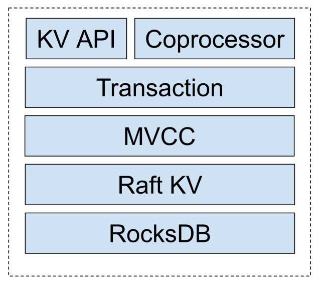
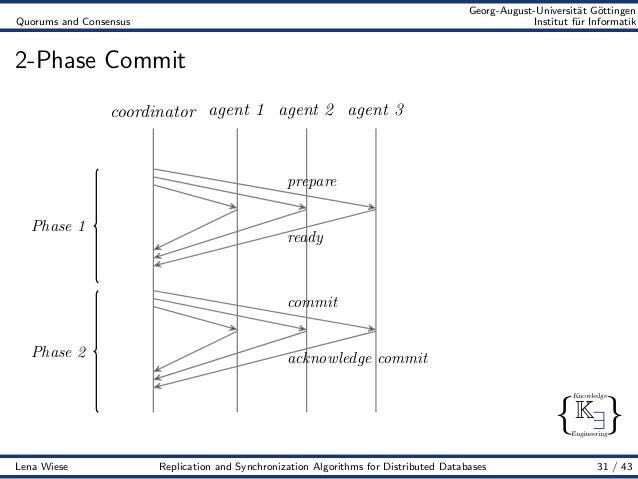

随着时代的发展，应用和数据的规模越来越大。然而在这个一切都可以水平扩展的时代，你会发现，大多数应用的最下层的关系型数据库，竟然难以找到一个优雅易用的水平扩展解决方案，一直以来不得不依赖静态 Sharding ，牺牲掉事务，然后在业务层各种 Workarounds。作为后端开发者应该深有体会。

层出不穷的 NoSQL 看似解决了数据水平扩展的问题，但是由于跨行事务的缺失和接口的局限，在很多业务中落地还是需要付出很多代价的。最近 Google 基础设施的神人 Jeff Dean 在一次采访中回顾自己作为工程师最大的后悔是什么的问题时提到，他最后悔的事情是没有在 BigTable 中加入跨行事务模型，以至于后来各种各样的团队尝试在 BigTable 上不停的造事务的轮子，但其实这个特性应该是由 BigTable 提供。同样的观点也在他后来的论文中反复提到过。

Google 2012 年在 OSDI 上发表了 Spanner，作为 BigTable 的下一代产品，最主要的特性就是支持跨行事务和在分布式场景上实现 Serializable 的事务隔离级别。我们在2015年底从零开始按照论文做 Spanner 的开源实现 TiKV，于近期[开源](https://github.com/pingcap/tikv)，和 Spanner 一样，也是一个支持分布式事务和水平扩展的 KV 数据库。一个分布式数据库涉及的技术面非常广泛， **今天我们主要探讨的是 TiKV 的 MVCC（多版本并发控制） 和 Transaction 实现。**

MVCC 其实并不是一个新的概念了，在传统的单机关系型数据库使用 MVCC 技术来规避大量的悲观锁的使用，提高并发事务的读写性能。值得注意的是 MVCC 只是一个思想，并不是某个特定的实现，它表示每条记录都有多个版本的，互相不影响，以一个 kv 数据库为例从逻辑上的一行的表示就并不是

    Record := {key, value}

而是

    Record := {key, value, version}

支持分布式 MVCC 在 KV 系统中比较著名的应该是在 BigTable。在 TiKV 中我们的整个事务模型是构建在一个分布式 MVCC 的基础之上：

可以看到，整个 TiKV 的底层本地存储是依赖了 RocksDB，RocksDB 是一个单机的嵌入式 KV 数据库，是一个 LSM Tree的实现，是 Facebook 基于 LevelDB 的修改版本，其特点是写入性能特别好，数据存储是有序的 KV Pairs，对于有序 key 的迭代的场景访问效率较高。

对于 MVCC 层，每一个 Key，在底层的 RocksDB 上都会存储同一个 Key 的多个版本，在底层存储上看来，形式如：

    MateKey                      --> key 的所有版本信息
    DataKey(key+version_1)-->Value_v1
    DataKey(key+version_2)-->Value_v2
暴露给上层的接口行为定义：

> * MVCCGet(key, version), 返回某 key 小于等于 version 的最大版本的值
> * MVCCScan(startKey, endKey, limit, version), 返回  [startKey,  endKey)  区间内的 key 小于等于 version 的最大版本的键和值，上限 limit 个
> * MVCCPut(key, value, version) 插入某个键值对，如果 version 已经存在，则覆盖它。上层事务系统有责任维护自增version来避免[read-modify-write]
(https://en.wikipedia.org/wiki/Read-modify-write)
> * MVCCDelete(key, version) 删除某个特定版本的键值对, 这个需要与上层的事务删除接口区分，只有 GC 模块可以调用这个接口

给出一个 MVCCGet 的伪代码实现：

    MVCCGet(key, version) {
          versions = kv.Get(key) // read meta
          targetVer = nil
          for ver in versions {
               if ver <= version {
                     targetVer = ver
                     break
                }
            }
            return kv.Get(mvccEncode(key, targetVer)), targetVer
        }

**核心思想是，先读取 meta key 然后通过 meta key 中找到相应的可见版本，然后再读取 data key，由于这些 key 都拥有相同的前缀，所以在实际的访问中，读放大的程度是可以接受的。**

类似的 MVCCScan 和 MVCCPut 由于篇幅的限制就不展示了，但是思想是类似的。

细心的朋友可能会发现，这个方案会遇到一个 key 的 meta key 膨胀的问题，当如果一个 key 短时间内修改过于频繁，会导致 meta key 的 value 过大，这个问题可以通过 meta 拆分的方式解决，核心的思想也比较简单，本质上就是对 meta key 建立索引，将一个 meta key 变成多个 meta key：

    Meta0 (v127 - v0) next: 0  （0表示没有后续 Meta）

第一次分裂：

    Meta0 (v128 - v96) next:1
    Meta1 (v95 - v0) next:0

第二次分裂：

    Meta0 (v224 - v192) next:2
    Meta1 (v95 - v0) next: 0
    Meta2 (v191 - v96) next:1

这样一来，即可规避过大的读放大问题。

对 TiKV 的 MVCC 模型有了基础概念之后，就可以介绍我们的分布式事务模型，总体来讲，我们的分布式事务模型本质上是一个两阶段提交的算法，其实本质上来说，在一个分布式系统中实现跨节点事务，只有两阶段提交一种办法（3PC 本质上也是 2PC 的一个优化）。

在 Spanner 中同样也是一个 2PC，但是 Google 比较创新的引入了 TrueTime API 来作为事务 ID 生成器从而实现了 Serializable 的隔离级别，具体的实现在这里就不赘述了，有兴趣的朋友可以去看 Spanner 的论文。

值得一提的是，由于 TrueTime 引入了专有的硬件（GPS 时钟和原子钟）来实现跨洲际机房的时钟同步方案，大多数业务场景其实并没有这种跨洲际机房数据同步的需求，所以我们在 TiKV 中最终选择的事务模型和 Spanner 有所区别，采用了 Google 的另一套分布式事务方案 Percolator 的模型。

Percolator 是 Google 的上一代分布式事务解决方案，构建在 BigTable 之上，在 Google 内部用于网页索引更新的业务。原理比较简单，总体来说就是一个经过优化的 2PC 的实现，依赖一个单点的授时服务 TSO 来实现单调递增的事务编号生成，提供 SI 的隔离级别。

传统的分布式事务模型中，一般都会有一个中央节点作为事务管理器，Percolator 的模型通过对于锁的优化，去掉了单点的事务管理器的概念，将整个事务模型中的单点局限于授时服务器上，在生产环境中，单点授时是可以接受的，因为 TSO 的逻辑极其简单，只需要保证对于每一个请求返回单调递增的 id 即可，通过一些简单的优化手段（比如 pipeline）性能可以达到每秒生成百万 id 以上，同时 TSO 本身的高可用方案也非常好做，所以整个 Percolator 模型的分布式程度很高。**下面我们详细介绍一下 TiKV 中事务的实现方式。**

总体来说，TiKV 的读写事务分为两个阶段：1、Prewrite 阶段；2、Commit 阶段。

客户端会缓存本地的写操作，在客户端调用 client.Commit() 时，开始进入分布式事务 prewrite 和 commit 流程。

Prewrite 对应传统 2PC 的第一阶段：

1. 首先在所有行的写操作中选出一个作为 primary row，其他的为 secondary rows
2. PrewritePrimary: 对 primaryRow 写入锁（修改 meta key 加入一个标记），锁中记录本次事务的开始时间戳。上锁前会检查：
    - 该行是否已经有别的客户端已经上锁 (Locking)
    - 是否在本次事务开始时间之后，检查versions ，是否有更新 [startTs, +Inf) 的写操作已经提交 (Conflict)

    在这两种种情况下会返回事务冲突。否则，就成功上锁。将行的内容写入 row 中，版本设置为 startTs

3. 将 primaryRow 的锁上好了以后，进行 secondaries 的 prewrite 流程：
    - 类似 primaryRow 的上锁流程，只不过锁的内容为事务开始时间 startTs 及 primaryRow 的信息
    - 检查的事项同 primaryRow 的一致
    - 当锁成功写入后，写入 row，时间戳设置为 startTs

以上 Prewrite 流程任何一步发生错误，都会进行回滚：删除 meta 中的 Lock 标记 , 删除版本为 startTs 的数据。

当 Prewrite 阶段完成以后，进入 Commit 阶段，当前时间戳为 commitTs，TSO 会保证 commitTs > startTs

**Commit 的流程是，对应 2PC 的第二阶段：**

1. commit primary: 写入 meta 添加一个新版本，时间戳为 commitTs，内容为 startTs, 表明数据的最新版本是 startTs 对应的数据
2. 删除 Lock 标记

值得注意的是，如果 primary row 提交失败的话，全事务回滚，回滚逻辑同 prewrite 失败的回滚逻辑。

如果 commit primary 成功，则可以异步的 commit secondaries，流程和 commit primary 一致， 失败了也无所谓。Primary row 提交的成功与否标志着整个事务是否提交成功。

事务中的读操作：

1. 检查该行是否有 Lock 标记，如果有，表示目前有其他事务正占用此行，如果这个锁已经超时则尝试清除，否则等待超时或者其他事务主动解锁。注意此时不能直接返回老版本的数据，否则会发生幻读的问题。
2. 读取至 startTs 时该行最新的数据，方法是：读取 meta ，找出时间戳为 [0, startTs], 获取最大的时间戳 t，然后读取为于 t 版本的数据内容。

由于锁是分两级的，Primary 和 Seconary row，只要 Primary row 的锁去掉，就表示该事务已经成功提交，这样的好处是 Secondary 的 commit 是可以异步进行的，只是在异步提交进行的过程中，如果此时有读请求，可能会需要做一下锁的清理工作。因为即使 Secondary row 提交失败，也可以通过 Secondary row 中的锁，找到 Primary row，根据检查 Primary row 的 meta，确定这个事务到底是被客户端回滚还是已经成功提交。

大致的事务提交流程介绍到这，通过 MVCC， TiKV 的事务默认隔离级别是 Repeatable Read（SI）, 也对外暴露显式的加锁的 API，用于为客户端实现 SELECT … FOR UPDATE 等隔离级别为 SSI 的语句。

大家可以看到， **本质上 TiKV 的事务模型是基于 Percolator 的思想，但是对比原论文，做了很多工程上的优化，我们将原来论文中的 L 列和 W 列去掉，通过和MVCC 的 Meta 来存储相关的事务信息。**

对于事务冲突的情况，原始的 Percolator 的论文中并没有做过多的描述，采取的策略也比较简单，读时遇到锁就等直到锁超时或者被锁的持有者清除，写时遇到锁，直接回滚然后给客户端返回失败由客户端进行重试。TiKV 采用的是乐观事务模型，只有最后 2pc 的阶段会对数据加锁，但是对于频繁冲突的场景，回滚和客户端重试的代价可能很高， TiKV 在存储节点本地添加了一个简单的 Scheduler 层，在 2PC 读写遇到锁的时候并不是粗暴的直接回滚返回，而是尝试在本地排队等一下 ，如果超时或者其他异常，再返回客户端重试，减小了网络的开销。

另外的一个问题是无效版本的清理（GC），对于在线上运行的 MVCC 系统来说，如果没有 GC 策略，那么版本将会膨胀得越来越多，而且对于 MVCC 来说，数据的删除并不是真正的删除，而是标记删除，当无用版本积累太多，会对于读性能有很大的影响。

同时GC 策略并不能简单的指定一个版本（safe point），然后删除之前的所有版本，很显然比如有一个 key 只有一个版本，这个版本就不能动，比如有一个 key 在 safe point 前的最后一个版本是 tombstone (已经删除)，而且这个 key 之后再没有被操作过，那么这个 key 的所有版本都是可以被整体删除的。

另外，在实际实现的过程中还会遇到一个问题，当 gc 一个 key 时发现 meta 中有锁（可能是由于清除 secondary lock 时客户端崩溃或者其他原因），你并不能简单删除之，因为如果这个 key 中的锁是 secondary lock，在 gc 进程去查看这个锁对应的 primary key 的对应版本是提交还是回滚时，如果 primary key 的那个版本已经被 gc 删除掉了，对于 gc 进程来说就没有办法确定该事务到底是提交还是回滚，可能出现数据误删的情况。TiKV 通过对事务的 primary key 的 meta version 进行一个特殊的标记，由于没有集中事务管理器的存在，判断一个事务的执行状态只有 primary key 的 meta 中有记录，所以在 gc 时会绕过这些 primary key 的 version 解决了这个问题，保证了数据的安全。
