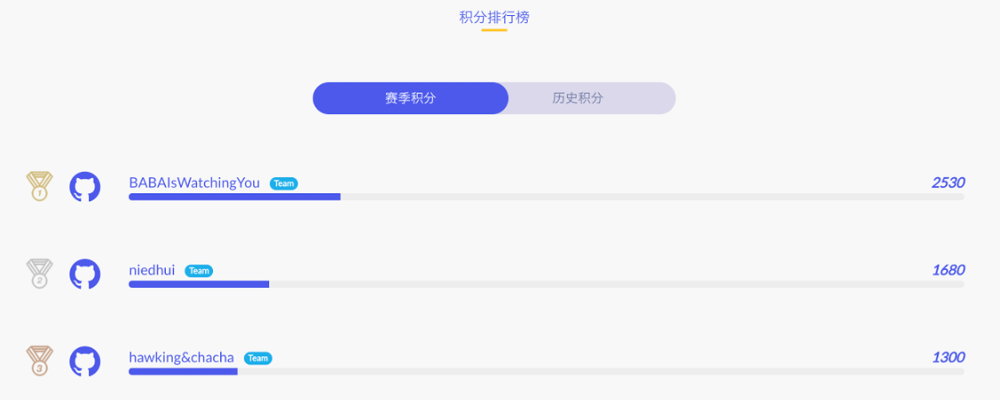
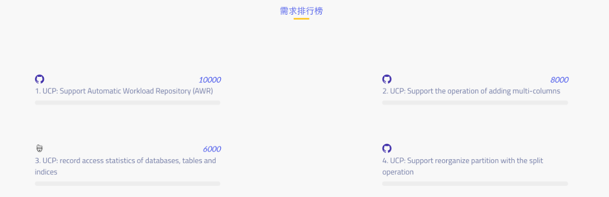

TiDB 挑战赛第二季之 [易用性挑战赛](https://mp.weixin.qq.com/s/VNtLhbOIJaAX2dEmjt8d5w) 已经开始一周了，由于有参加过上一季 [性能挑战赛](https://pingcap.com/blog-cn/pcp-report-202002/) 的老玩家强势加入，这一季挑战赛的竞争格外激烈，短短一周的时间，已有 3 支队伍获得了上千积分！

> 完整积分排行榜可以登陆 [活动官网](https://pingcap.com/community-cn/tidb-usability-challenge/) 查看。

**战况简介：**

* BABAIsWatchingYou Team 通过 [改进 Rust-Prometheus 中 Thread Local Metrics 的易用性](https://github.com/tikv/tikv/issues/7062) 获得 2530 分。

* niedhui Team 通过 [为 TiDB-Dashboard 增加 TLS 支持](https://github.com/pingcap-incubator/tidb-dashboard/issues/87) 获得 1680 分。

* hawking&chacha Team 通过 [为 RocksDB WAL 写延迟增加监控](https://github.com/tikv/tikv/issues/6541) 获得了 1300 分。

* `.*` Team 通过 [使用单独的日志文件存储 TiKV 慢查询日志](https://github.com/tikv/tikv/issues/6735) 获得了 950 分。

羡慕不如行动！我们也在这里简单分享一些捞分技巧，希望能够帮助大家快速上手，追上这些排名靠前的参赛选手们。

## 捞分技巧 1：用户投票结果中排名前三的需求有高额加分！

为鼓励大家选择用户呼声更高的任务，本次挑战赛中用户投票排名前三的需求对应的任务，会在原有积分的基础上分别额外增加 10000、8000、6000 分。比如这个排名第三的需求：[record access statistics of databases, tables and indices](https://github.com/pingcap/tidb/issues/14998)，该需求原本的积分是 1294（积分低意味着难度低哟），再加上额外的 6000，这意味着完成这个低难度的任务总共能够获得 1294 + 6000 = 7294 分，性价比非常高！

## 捞分技巧 2：Chaos Mesh Contributing Tutorial 可以帮助大家快速上手拿分

[Chaos Mesh](https://github.com/pingcap/chaos-mesh) 是一款云原生的混沌测试平台，大家经常听说的 TiDB 混沌测试工具就是它。对了，Chaos Mesh 项目后续会有大惊喜哦，真 · 潜力股（只能剧透到此了，你懂的）。

这份小小的 [Chaos Mesh Contributing Tutorial](https://yisaer.gitbook.io/chaos-mesh-contributing-tutorials/) 包含了 GitHub 协作基础、搭建 Chaos Mesh 开发环境和如何在 Chaos Mesh 中开发一个非常简单的新功能。内容不多，很快能看完。如果你之前没有参与过开源项目，可以看它；如果你有开源协作经验，但是没有参加过 Chaos Mesh 开发，也可以看它！看完小册子之后，大家就可以在 [Chaos Mesh 挑战赛题目合集](https://github.com/pingcap/chaos-mesh/projects/14) 轻松做任务、拿积分了！

## 捞分技巧 3：如果 Medium 题目太难，那就在多个 Repo 同时刷 Easy 题目

相比第一季，这次易用性挑战赛除了 TiDB、TiKV、PD 之外，有更多代码仓库释放了任务：

1.  [chaos-mesh](https://github.com/pingcap/chaos-mesh/projects/14)

2.  [Data Migration](https://github.com/pingcap/dm/projects/1)

3.  [Backup & Restore](https://github.com/pingcap/br/projects/1)

4.  [client-rust](https://github.com/tikv/client-rust/projects/3)

5.  [TiDB Dashboard](https://github.com/pingcap-incubator/tidb-dashboard/projects/17)

6.  [cherry-bot](https://github.com/pingcap-incubator/cherry-bot/projects/1)

7.  [TiDB Operator](https://github.com/pingcap/tidb-operator/projects/4)

8.  [TiUP](https://github.com/pingcap-incubator/tiup)

算上 TiDB、TiKV、PD 等总共有 10 个代码仓库参赛。按照本次比赛规则，选手在每个仓库可以通过刷 Easy 难度的任务，获得最高 200 积分。那么 10 个代码仓库就是 2000 分，积少成多，收获非常客观哦！多多练手之后再挑战 Medium 难度的任务，也会更加轻松。

## 捞分技巧 4：从一些比较简单的 Medium 任务突破

TiDB：

[通过 SQL 指纹的方式为 SQL 绑定执行计划 Hint](https://github.com/pingcap/tidb/issues/14987)：这是一个来自用户的需求，通过 SQL 指纹的方式能够极大简化创建 SQL Binding 语句的长度，提升用户体验。实现起来也并不复杂，修改 parser 文件支持语法后，再修改一下 TiDB 和创建 SQL Binding 相关的代码即可。

TiKV：

* [TiKV 日志和 RocksDB 日志统一管理](https://github.com/tikv/tikv/issues/6496)：将 RocksDB 的日志放在和 TiKV 的日志相同的目录，按照相同的方式 rotate，方便运维和查找。

* [监控 TiKV 模块内存使用](https://github.com/tikv/tikv/issues/6717)：将几个核心模块的内存使用情况进行监控，方便排查 TiKV 内存问题。

PD:

* [PD API Swagger 支持](https://github.com/pingcap/pd/issues/2169)：让 API 符合 Swagger 标准且能生成在线 API 文档，实现简单，主要工作在于梳理  API，预期 3 天左右完成。

* [限制指定小表不被合并](https://github.com/pingcap/pd/issues/2171)：这是一个来自社区的需求，需要让某些 Region 能够不被合并。选手们完成这个功能后就能知道完整的 Region Merge 调度流程了，是一个非常有意义的功能。

TiDB Operator：

* [支持 Operator CRD Java SDK](https://github.com/pingcap/tidb-operator/issues/1575)：由于 TiDB-Operator 是由 Golang 编写的，目前其 CRD 文件只有  Golang 客户端，这个任务将给 Operator CRD 创建 Java 客户端，对于扩展产品生态非常有意义。

* [优化 Operator Controller 报错信息](https://github.com/pingcap/tidb-operator/issues/1936)：目前 Operator Controller 的报错信息不能帮助我们准确定位到具体的错误发生地点，这个任务将帮助我们优化 Operator Controller 的报错信息内容，提升用户体验。

Chaos Mesh：

* [支持暂停混沌实验](https://github.com/pingcap/chaos-mesh/issues/294)：给每一个 Chaos 对象的定义中添加一个 Pause 的字段，如果被设置成 True 后，Controllers 在每次调用到对应 Reconcile 逻辑时会取消掉已经注入的错误并且跳过正常的执行逻辑。

* [拓展 NetworkChaos 支持限制网络带宽](https://github.com/pingcap/chaos-mesh/issues/303)：这个任务是对已有的 NetworkChaos 进行拓展，支持限制具体 Pods 的网络带宽，并且使用 [netlink](https://github.com/vishvananda/netlink) 工具包支持，这样可以很好的解决限制网络带宽的具体实现问题。

TiDB Dashboard：

* [日志搜索页面显示日志大小](https://github.com/pingcap-incubator/tidb-dashboard/issues/117)：前后端都要修改，但都改动不多，非常适合会写 Go 的全栈工程师。

* [生成火焰图 SVG 时不依赖于 pprof 命令行](https://github.com/pingcap-incubator/tidb-dashboard/issues/90)：Dashboard 和 pprof 都是开源 Golang 项目，代码整合一下不算难。

* [有 TiDB 节点不在线时重试 TiDB 请求](https://github.com/pingcap-incubator/tidb-dashboard/issues/131)：核心其实是用 Go 编写一个简单的 TCP 端口转发 + Health Check。

Data Migration：

* [减少 DM 依赖的 TiDB 与 etcd 的日志输出](https://github.com/pingcap/dm/issues/495)：为依赖库设置一下 log level 就可以，花一天时间就能搞定这个任务。

* [修复 remove-meta 的指定方式](https://github.com/pingcap/dm/issues/496)：将配置项修改为命令参数就能实现，性价比高。

Cherry Bot：

* [将各 Repo 的配置分为不同文件](https://github.com/pingcap-incubator/cherry-bot/issues/3)：对 config 组件进行小幅改动就可以。

* [多分支并行 auto merge](https://github.com/pingcap-incubator/cherry-bot/issues/4)：目前 PingCAP 多个开源项目（如 TiDB、TiKV 等）都在使用该功能自动 merge 经过 Reviewer 点赞的 PR。这个任务将完善这个功能，使其能够同时 merge 多个分支上的 PR。要完成它需要修改 auto merge 的主体逻辑，但因为代码模块比较独立，适合用来学习 bot。

TiUP:

* [给 Playground 添加集成测试](https://github.com/pingcap-incubator/tiup/issues/66)：只需要添加单元测试 case，对于了解代码逻辑非常有帮助。

* [支持为 Playground 中的 TiDB/TiKV/PD 指定配置](https://github.com/pingcap-incubator/tiup/issues/64)：支持这个功能可以极大的提升 TiUP 的易用性。要完成该任务需要添加一些 flags，同时在没有指定配置时使用默认配置。

* [给 Playground 组件集成 Grafana](https://github.com/pingcap-incubator/tiup/issues/63)：支持这个功能后，使用 Playground 部署的集群就有 Grafana 监控了！实现的时候可以参考集成 Prometheus。

Client-rust:

* [支持清理特定 key 的锁](https://github.com/tikv/client-rust/issues/111)：在事务冲突严重时，针对小事务只清理特定 key 的锁能大大减轻 TiKV 服务器的负担。

* [为 PD 客户端添加 Region 缓存](https://github.com/tikv/client-rust/issues/114)：使用本地缓存的 Region 信息对于提升性能和降低 PD 服务器负担有很大的帮助。TiDB 中已经有比较成熟的实现，这里只需要将 TiDB 的实现迁移到 Rust 中。

>不知道看完以上“捞分技巧”，大家有没有摩拳擦掌、准备上阵抢积分了？报名方式、参赛细则请看 [这篇文章](https://pingcap.com/blog-cn/TiDB-usability-challenge-program/)，同时也欢迎大家加入 [TiDB Community Slack Workspace](https://tidbcommunity.slack.com/join/shared_invite/enQtNzc0MzI4ODExMDc4LWYwYmIzMjZkYzJiNDUxMmZlN2FiMGJkZjAyMzQ5NGU0NGY0NzI3NTYwMjAyNGQ1N2I2ZjAxNzc1OGUwYWM0NzE)，在参赛过程中遇到任何问题，都可以直接通过 #tidb-challenge-program channel 与我们取得联系哦～

