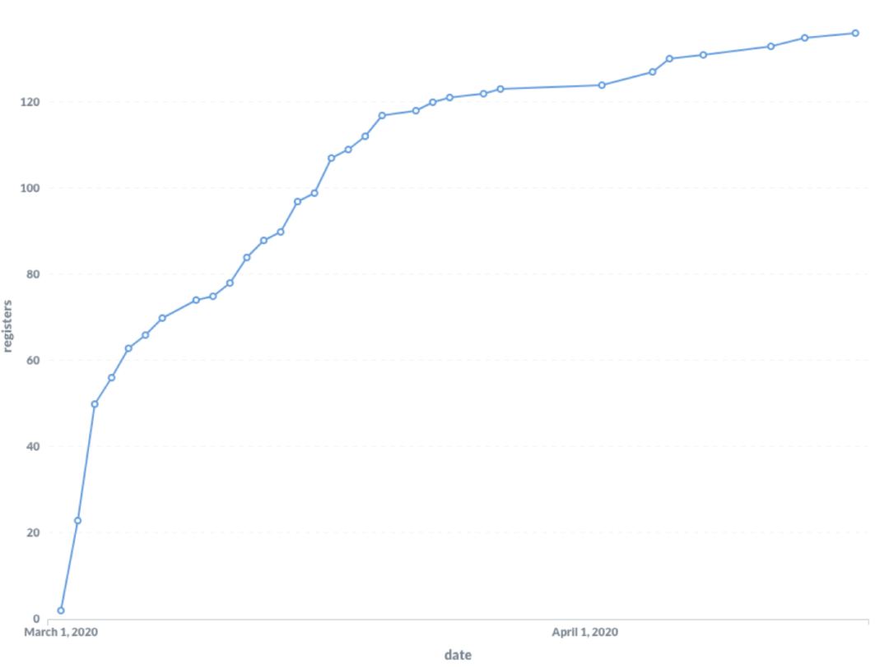
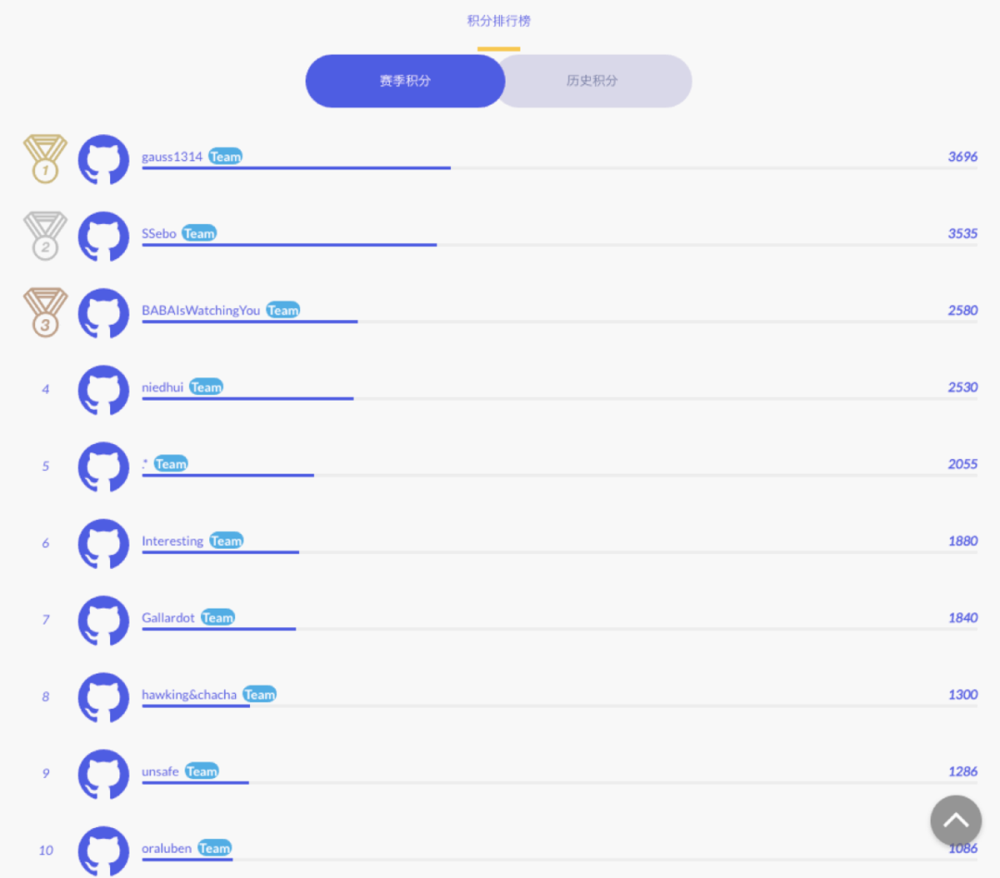
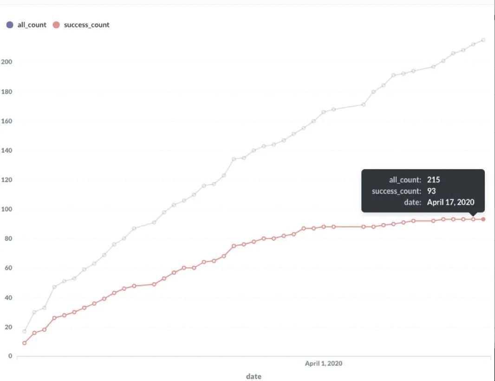

随着越来越多的同学选择使用 TiDB， TiDB 的易用性收到越来越多用户的关注，让 TiDB 变得更好用就显得越来越重要。为了能够打造一个大家心中的真正好用易用的 TiDB，我们启动了 “[我的 TiDB 听我的](https://asktug.com/t/topic/2156)” 活动，并特意征求了 TiDB User Group(TUG) 专家组的意见，选择出了 20 个最重要、最迫切的易用性需求。

三月初，围绕着这 20 个呼声最高的需求，我们在社区启动了 [TiDB 易用性挑战赛](https://pingcap.com/blog-cn/TiDB-usability-challenge-program/)。赛事开启后，大家可是百花齐放，百家争鸣。目前赛程已经过半，我们先来看看战绩吧！

首先，我们看一下本次赛季参与的团队情况：

截止今日，我们一共收到 **93 支队伍**报名（包括个人参赛队员和多人组建团队），共计 **136 位选手参赛**。目前的积分排行榜上已有 5 支队伍积分超过 2000：

**目前个人参赛者成绩比较突出**，其中：

* 状元：**gauss1314**（个人参赛者），针对 TiDB 进行了易用性优化。

* 榜眼：**SSebo** （个人参赛者），针对 TiKV 进行了易用性优化。

希望这两位同学能够再接再厉，争取突破语言和项目边界，能够同时造福多个 Repo，也希望其他团队也能早日超越这两位同学，咱也争个状元来玩玩

最后，我们来看看本赛季整体任务完成情况：

如上图所示，蓝色表示被认领的任务数，红色的表示已经完成的任务数，也就是说，截止发稿时，**共有 215 个任务被认领，其中 93 个任务已经完成**。

如此多的任务完成情况，还是让笔者十分惊喜的，要知道活动最初赛事组一共才给出了 20 个项目选项呢！下面我们一起来看看，截止目前拿分最多的项目：

[UCP：Support the operation of adding multi-columns](https://github.com/pingcap/tidb/issues/5092)

* 分数：2996

* 团队：[gauss1314](https://github.com/gauss1314)（个人参赛者）

* 仓库：TiDB

* 该项目为 20 个迫切需求之一

[UCP: Extract tidb_query into different workspaces](https://github.com/tikv/tikv/issues/5706)

* 分数：2530

* 团队：[SSebo](https://github.com/SSebo)（个人参赛者）

* 仓库：TiKV

[UCP: Support auto flush metrics](https://github.com/tikv/tikv/issues/7062)

* 分数：2530

* 团队：[BABAIsWatchingYou](https://github.com/tidb-challenge-program/register/issues/15)

* 仓库：TiKV

[UCP: Add WAL write duration metric](https://github.com/tikv/tikv/issues/6541)

* 分数：1300

* 团队：[hawking&chacha](https://github.com/tidb-challenge-program/register/issues/31)

* 仓库：TiKV

[UCP: Output slow logs to a dedicated file](https://github.com/tikv/tikv/issues/6735)

* 分数：950

* 团队：[.*](https://github.com/tidb-challenge-program/register/issues/7)

* 仓库：TiKV

[UCP: Support slow log in log searching](https://github.com/tikv/tikv/issues/7069)

* 分数：605

* 团队：[.*](https://github.com/tidb-challenge-program/register/issues/7)

* 仓库：TiKV

[UCP: Privilege check in statement summary tables](https://github.com/pingcap/tidb/issues/14889)

* 分数：300

* 团队：[blueshit](https://github.com/tidb-challenge-program/register/issues/45)

* 仓库：TiDB

[Limit the usage of storage in TiDB by total queries](https://github.com/pingcap/tidb/issues/13983)

* 分数：300

* 团队：[Yisaer](https://github.com/Yisaer)（个人参赛者）

* 仓库：TiDB

细心如你，可能已经发现，以上任务中，只有一个是在开赛给出的 20 个选项中的，也就是说，其他所有任务都是我们选手“自产自销”的哦。对于选手们的想象力和执行力，笔者大为惊叹的同时也是深深地佩服。赛事才过去一半，笔者不经好奇，接下去还会由多少的惊喜出现。

最后，不管有没有上榜，大家都不要骄傲也不要灰心，稳住，下半场刚刚开场，还有大量高分项目等你来挑战，加油！

---

TiDB 易用性挑战赛 的任务分三个等级：Easy / Medium / Hard，每个任务对应一定的积分。这次我们优化了本赛季的分级赛制：如果你是第一次参与挑战赛的新人，Easy 的任务可以直接上手；而老玩家（在该 Repo 历史积分大于 200 分）则可直接挑战 Medium 及以上难度的任务！

比赛结束后，选手可以用积分兑换丰富的奖品，除了 TiDB 限量周边（T 恤、帽衫、双肩包、办公室五件套、黑白游戏机充电宝、书签日历套装），还有 jetbrain toolbox 中任意一个软件的一年 license、PingCAP 年度大会荣誉席，甚至还有包机酒的硅谷之行！此外，完成任意一个任务的选手还可以得到“完赛纪念徽章”一枚。

**报名方式：**

发起 Issue 至 pingcap/tidb-challenge-program/register repo（通过【阅读原文】进入活动官网，点击“立即报名”即可快捷发起报名 issue）。

欢迎大家加入 [TiDB Community Slack Workspace](https://tidbcommunity.slack.com/join/shared_invite/enQtNzc0MzI4ODExMDc4LWYwYmIzMjZkYzJiNDUxMmZlN2FiMGJkZjAyMzQ5NGU0NGY0NzI3NTYwMjAyNGQ1N2I2ZjAxNzc1OGUwYWM0NzE)，参赛过程中遇到任何问题都可以直接通过 **#tidb-challenge-program channel** 与我们取得联系。

**延展阅读：**

[Hi，你有一份 TiDB 易用性挑战赛「捞分指南」请查收](https://pingcap.com/blog-cn/tidb-usability-challenge-program-guide/)

[TiDB 易用性挑战赛开启：解决用户的痛点，让 TiDB 更易用！](https://pingcap.com/blog-cn/TiDB-usability-challenge-program/)