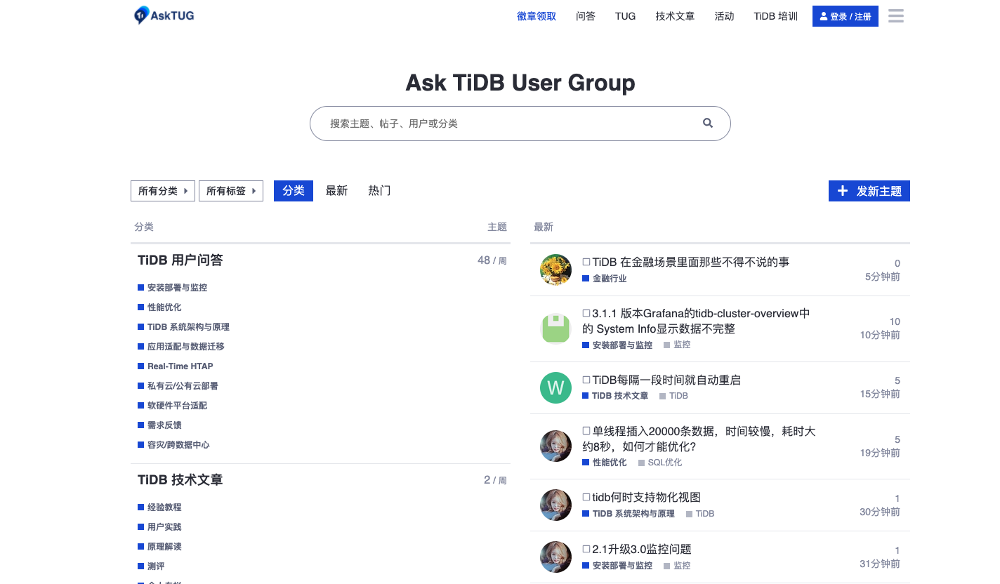
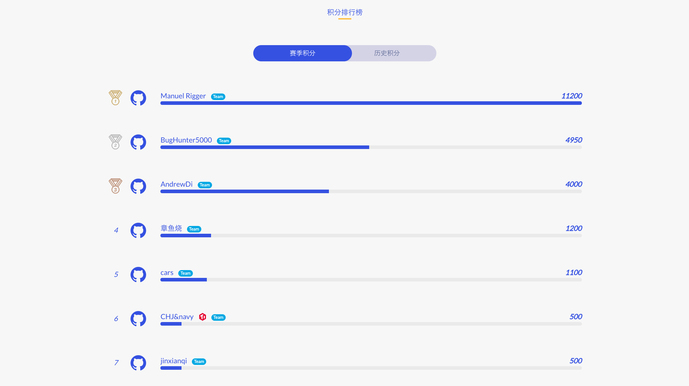

自 4.0  RC 版本发布以来，大家已经迫不及待开始尝鲜。TiDB 4.0 包含了很多重要的、有潜力的特性：

* TiUP 帮你更快的部署集群。

* TiFlash 兼顾了 OLTP 和 OLAP。

* 内置 DashBoard 大幅提高可用性。

* BR 和 TiCDC 补齐了快速备份和增量数据变化的能力。

* ……

为了鼓励大家尝鲜体验 TiDB 4.0，捉虫竞赛应运而生。如今赛程过半，我们一起来回顾下当前赛况。

## 国际友人开挂一支独秀

捉虫大赛刚一公布，来自瑞士的 Mrigger 就火线加入，提交了多个 bug。强调下 Mrigger 肯定不是“托儿”。在 Mrigger 一波提交之后，有开发同学向 TiDB Robot 诉苦，『来者何人啊？周边礼品有点兜不住了！』。不查不知道，一查吓一跳，Mrigger 就是一位专业“碰瓷”选手。他已经为 SQLite 提交了超过 170+ bug，为 CockRoachDB 提交了 50+ bug。这位苏黎世理工大学的博士后研究方向是 RDBMS 的自动化测试，这次携测试机器人出征也是势在必得。真可谓『天不怕地不怕，就怕测试开外挂』。

截止到发稿日，Mrigger 已经提交了 21 个 P1 bug，7 个 P2 bug，稳坐第一名的宝座。

值得一提的是，参考 Mrigger 发表的文章，PingCAPer 已经实现了这个测试机器人，目前正在内测中。

## 开发者社区 护场子奋起直追

在国际友人“砸场子”的时候，作为 TiDB Contributor，AndrewDi 坐不住了，他在 RC 发版后一周才开始测试，试用了 Sequence 之后，他信手拈来 2 个 bug，可见其内功之深厚。热身活动结束，AndrewDi 使出大杀器——场景测试。他开发了一套程序来暴力压测 TiDB，经过三天三夜的鏖战，TiDB 败下阵来，AndrewDi 也顺势提交了 3 个 P0 bug。

除了测出多个 bug，AndrewDi 还配合 PingCAPer 重现和定位 bug，让人真正感受到了纯粹的开源社区互动氛围。

截止发稿日，AndrewDi 坐上了捉虫竞赛的第三把交椅，同时还有更多开发者社区的小伙伴正在奋起直追，这股“较真”力量不可小觑哦～

## 用户社区开辟第二战场

AskTUG（asktug.com） 是 TiDB User Group 成员学习、分享的“聚集地”。自捉虫大赛正面战场 GitHub 开赛以来，已经有超过 50+ 的 bug report 在 AskTUG 上出现，涵盖 TiUP、TiFlash、Dashboard 等众多问题。

（TiDB Robot 再次提醒下大家，4.0 捉虫大赛的任务积分可以兑换 PCTA 的考试资格，大家不如移步 GitHub 捞一波积分哦！大赛详情可以进入 [活动官网](https://pingcap.com/community-cn/tidb-bug-hunting/) 查看）

## 在社区贡献和支持下，发布 RC1 版本

自捉虫大赛开赛以来，已有 13 个 team，24 名小伙伴报名参加了活动。我们在 github 上收到了 66 个 issue，其中 58 个 issue 有效，有效率高达 88%。59 个 issue 中包含了 P0 issue 5 个，P1 issue 32 个，效率满满。目前排在积分榜的排名情况是：

TiDB 开发者们作为追求完美的强迫症患者，从接到第一份 bug 报告后就开始了紧张的修复工作，终于在 4 月 28 日发布了 TiDB 4.0 RC1，修复了大量捉虫活动中发现的 bug。

也欢迎更多小伙伴加入到 4.0 捉虫比赛下半场，以下给参赛选手一些小 Tips：

* 提前在活动官网阅读参赛细则，在 GitHub 按要求提交 bug issues。

* 带压力的场景测试更容易发现 P0 级别（影响数据正确性或服务可用性）的问题。建议小伙伴们可以用手头的压测程序狠狠的折磨 TiDB，加上一些故障注入更好，毕竟“大力出奇迹”。

* 全链路测试。用上 TiFlash 和 BR 等工具，模拟生产环境做请求和备份恢复，可能有“奇效”。

* 跨特性测试。例如，用 Partion 的时候，多关注下执行计划，也许当时开发功能的小伙伴就没有考虑到呢？