>本文作者是 TiDB Hackathon 2019 参赛队伍 Ti-Cool 的成员，他们的项目 TiDB-Wasm 获得了二等奖。[TiDB-Wasm 项目](https://pingcap.com/blog-cn/tidb-in-the-browser-running-a-golang-database-on-wasm/) 实现了将 TiDB 编译成 Wasm 运行在浏览器里，让用户无需安装就可以使用 TiDB。

10 月 27 日，为期两天的 Hackathon 落下帷幕，我们用一枚二等奖为此次上海之行画上了圆满的句号，不枉我们风尘仆仆跑去异地参赛（强烈期待明年杭州能作为赛场，主办方也该鼓励鼓励杭州当地的小伙伴呀 :D ）。

我们几个 PingCAP 的小伙伴找到了 Tony 同学一起组队，组队之后找了一个周末进行了“秘密会晤”——Hackathon kick off。想了 N 个 idea，包括使用 unikernel 技术将 TiDB 直接跑在裸机上，或者将网络协议栈做到用户态以提升 TiDB 集群性能，亦或是使用异步 io 技术提升 TiKV 的读写能力，这些都被一一否决，原因是这些 idea 不是和 Tony 的工作内容相关，就是和我们 PingCAP 小伙伴的日常工作相关，做这些相当于我们在 Hackathon 加了两天班，这一点都不酷。本着「与工作无关」的标准，我们想了一个 idea：把 TiDB 编译成 Wasm 运行在浏览器里，让用户无需安装就可以使用 TiDB。我们一致认为这很酷，于是给队伍命名为 Ti-Cool（太酷了）。

## WebAssembly 简介

这里插入一些 WebAssembly 的背景知识，让大家对这个技术有个大致的了解。

WebAssembly 的 [官方介绍](https://webassembly.org/) 是这样的：WebAssembly（缩写为 Wasm）是一种为基于堆栈的虚拟机设计的指令格式。它被设计为 C/C++/Rust 等高级编程语言的可移植目标，可在 web 上部署客户端和服务端应用程序。

从上面一段话我们可以得出几个信息：

1.  Wasm 是一种可执行的指令格式。
2.  C/C++/Rust 等高级语言写的程序可以编译成 Wasm。
3.  Wasm 可以在 web（浏览器）环境中运行。

### 可执行指令格式

看到上面的三个信息我们可能又有疑问：什么是指令格式？

我们常见的 [ELF 文件](https://en.wikipedia.org/wiki/Executable_and_Linkable_Format) 就是 Unix 系统上最常用的二进制指令格式，它被 loader 解析识别，加载进内存执行。同理，Wasm 也是被某种实现了 Wasm 的 runtime 识别，加载进内存执行，目前常见的实现了 Wasm runtime 的工具有各种主流浏览器，nodejs，以及一个专门为 Wasm 设计的通用实现：Wasmer，甚至还有人给 Linux 内核提 feature 将 Wasm runtime 集成在内核中，这样用户写的程序可以很方便的跑在内核态。

各种主流浏览器对 WebAssembly 的支持程度：

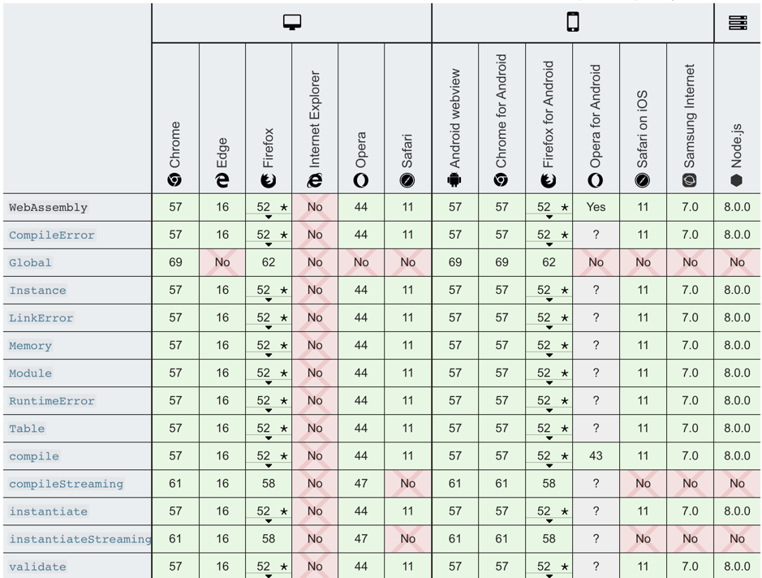

<center>图 1 主流浏览器对 WebAssembly 的支持程度</center> 

### 从高级语言到 Wasm 

有了上面的背景就不难理解高级语言是如何编译成 Wasm 的，看一下高级语言的编译流程：

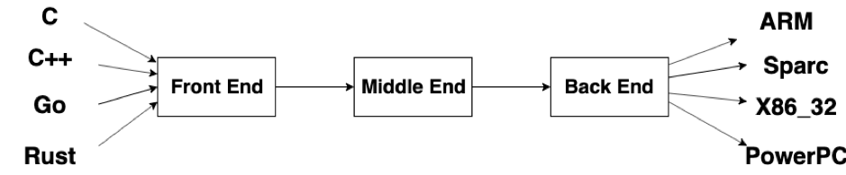

<center>图 2 高级语言编译流程</center> 

我们知道高级编程语言的特性之一就是可移植性，例如 C/C++ 既可以编译成 x86 机器可运行的格式，也可以编译到 ARM 上面跑，而我们的 Wasm 运行时和 ARM，x86_32 其实是同类东西，可以认为它是一台虚拟的机器，支持执行某种字节码，这一点其实和 Java 非常像，实际上 C/C++ 也可以编译到 JVM 上运行（参考：[compiling-c-for-the-jvm](https://stackoverflow.com/questions/4221605/compiling-c-for-the-jvm)）。

### 各种 runtime 以及 WASI

再啰嗦一下各种环境中运行 Wasm 的事，上面说了 Wasm 是设计为可以在 web 中运行的程序，其实 Wasm 最初设计是为了弥补 js 执行效率的问题，但是发展到后面发现，这玩意儿当虚拟机来移植各种程序也是很赞的，于是有了 nodejs 环境，Wasmer 环境，甚至还有内核环境。

这么多环境就有一个问题了：各个环境支持的接口不一致。比如 nodejs 支持读写文件，但浏览器不支持，这挑战了 Wasm 的可移植性，于是 WASI (WebAssembly System Interface) 应运而生，它定义了一套底层接口规范，只要编译器和 Wasm 运行环境都支持这套规范，那么编译器生成的 Wasm 就可以在各种环境中无缝移植。如果用现有的概念来类比，Wasm runtime 相当于一台虚拟的机器，Wasm 就是这台机器的可执行程序，而 WASI 是运行在这台机器上的系统，它为 Wasm 提供底层接口（如文件操作，socket 等）。

Example or  Hello World？

程序员对 Hello World 有天生的好感，为了更好的说明 Wasm 和 WASI 是啥，我们这里用一个 Wasm 的 Hello World 来介绍（例程来源：[chai2010-golang-wasm.slide#27](https://talks.godoc.org/github.com/chai2010/awesome-go-zh/chai2010/chai2010-golang-wasm.slide#27)）：

```lisp
(module
    ;; type iov struct { iov_base, iov_len int32 }
    ;; func fd_write(id *iov, iovs_len int32, nwritten *int32) (written int32)
    (import "wasi_unstable" "fd_write" (func $fd_write (param i32 i32 i32 i32) (result i32)))

    (memory 1)(export "memory" (memory 0))

    ;; The first 8 bytes are reserved for the iov array, starting with address 8
    (data (i32.const 8) "hello world\n")

    ;; _start is similar to main function, will be executed automatically
    (func $main (export "_start")
        (i32.store (i32.const 0) (i32.const 8))  ;; iov.iov_base - The string address is 8
        (i32.store (i32.const 4) (i32.const 12)) ;; iov.iov_len  - String length

        (call $fd_write
            (i32.const 1)  ;; 1 is stdout
            (i32.const 0)  ;; *iovs - The first 8 bytes are reserved for the iov array
            (i32.const 1)  ;; len(iovs) - Only 1 string
            (i32.const 20) ;; nwritten - Pointer, inside is the length of the data to be written
        )
        drop ;; Ignore return value
    )
)
```


具体指令的解释可以参考 [这里](https://pengowray.github.io/wasm-ops/html/wasm-opcodes.html)。

这里的 test.wat 是 Wasm 的文本表示，wat 之于 Wasm 的关系类似于汇编和 ELF 的关系。

然后我们把 wat 编译为 Wasm 并且使用 Wasmer（一个通用的 Wasm 运行时实现）运行：

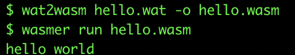

<center>图 3 Hello World</center> 

## 改造工作

恐惧来自未知，有了背景知识动起手来才无所畏惧，现在可以开启 TiDB 的浏览器之旅。

### 浏览器安全限制

我们知道，浏览器本质是一个沙盒，是不会让内部的程序做一些危险的事情的，比如监听端口，读写文件。而 TiDB 的使用场景实际是用户启动一个客户端通过 MySQL 协议连接到 TiDB，这要求 TiDB 必须监听某个端口。

**考虑片刻之后，我们认为即便克服了浏览器沙盒这个障碍，真让用户用 MySQL 客户端去连浏览器也并不是一个优雅的事情，我们希望的是用户在页面上可以有一个开箱即用的 MySQL 终端，它已经连接好了 TiDB。**

于是我们第一件事是给 TiDB 集成一个终端，让它启动后直接弹出这个终端接受用户输入 SQL。所以我们需要在 TiDB 的代码中找到一个工具，它的输入是一串 SQL，输出是 SQL 的执行结果，写一个这样的东西对于我们几个没接触过 TiDB 代码的人来说还是有些难度，于是我们想到了一个捷径：TiDB 的测试代码中肯定会有输入 SQL 然后检查输出的测试。那么把这种测试搬过来改一改不就是我们想要的东西嘛？然后我们翻了翻 TiDB 的测试代码，发现了大量的这样的用法：

```go
result = tk.MustQuery("select count(*) from t group by d order by c")
result.Check(testkit.Rows("3", "2", "2"))
```

所以我们只需要看看这个 `tk` 是个什么东西，借来用一下就行了。这是 `tk` 的主要函数：

```go
// Exec executes a sql statement.
func (tk *TestKit) Exec(sql string, args ...interface{}) (sqlexec.RecordSet, error) {
    var err error
    if tk.Se == nil {
        tk.Se, err = session.CreateSession4Test(tk.store)
        tk.c.Assert(err, check.IsNil)
        id := atomic.AddUint64(&connectionID, 1)
        tk.Se.SetConnectionID(id)
    }
    ctx := context.Background()
    if len(args) == 0 {
        var rss []sqlexec.RecordSet
        rss, err = tk.Se.Execute(ctx, sql)
        if err == nil && len(rss) > 0 {
            return rss[0], nil
        }
        return nil, errors.Trace(err)
    }
    stmtID, _, _, err := tk.Se.PrepareStmt(sql)
    if err != nil {
        return nil, errors.Trace(err)
    }
    params := make([]types.Datum, len(args))
    for i := 0; i < len(params); i++ {
        params[i] = types.NewDatum(args[i])
    }
    rs, err := tk.Se.ExecutePreparedStmt(ctx, stmtID, params)
    if err != nil {
        return nil, errors.Trace(err)
    }
    err = tk.Se.DropPreparedStmt(stmtID)
    if err != nil {
        return nil, errors.Trace(err)
    }
    return rs, nil
}
```


剩下的事情就非常简单了，写一个 Read-Eval-Print-Loop (REPL)  读取用户输入，将输入交给上面的 Exec，再将 Exec 的输出格式化到标准输出，然后循环继续读取用户输入。

### 编译问题

**集成一个终端只是迈出了第一步，我们现在需要验证一个非常关键的问题：TiDB 能不能编译到 Wasm，虽然 TiDB 是 Golang 写的，但是中间引用的第三方库没准哪个写了平台相关的代码就没法直接编译了**。

我们先按照 [Golang 官方文档](https://github.com/golang/go/wiki/WebAssembly#getting-started) 编译：

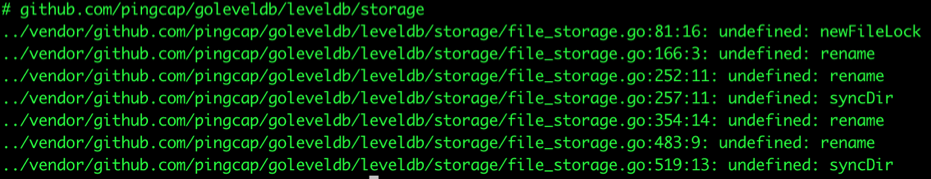

<center>图 4 按照 Golang 官方文档编译（1/2）</center> 


果然出师不利，查看 goleveldb 的代码发现，storage 包下面的代码针对不同平台有各自的实现，唯独没有 Wasm/js 的：

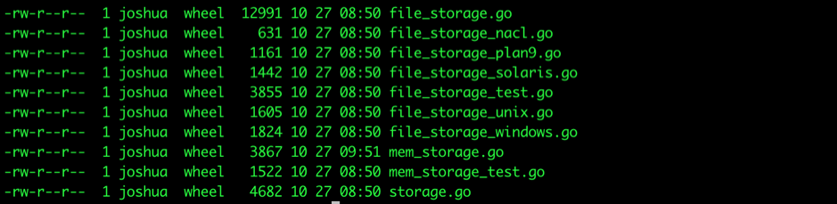

<center>图 5 按照 Golang 官方文档编译（2/2）</center> 

所以在 Wasm/js 环境下编译找不到一些函数。所以这里的方案就是添加一个 `file_storage_js.go`，然后给这些函数一个 unimplemented 的实现：

```go
package storage

import (
	"os"
	"syscall"
)

func newFileLock(path string, readOnly bool) (fl fileLock, err error) {
	return nil, syscall.ENOTSUP
}

func setFileLock(f *os.File, readOnly, lock bool) error {
	return syscall.ENOTSUP
}

func rename(oldpath, newpath string) error {
	return syscall.ENOTSUP
}

func isErrInvalid(err error) bool {
	return false
}

func syncDir(name string) error {
	return syscall.ENOTSUP
}
```


然后再次编译：

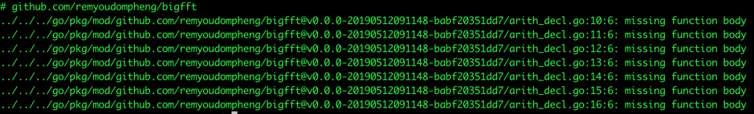

<center>图 6 再次编译的结果</center> 

emm… 编译的时候没有函数可以说这个函数没有 Wasm/js 对应的版本，没有 body 是个什么情况？好在我们有代码可以看，到 `arith_decl.go` 所在的目录看一下就知道怎么回事了：


<center>图 7 查看目录</center> 

然后 `arith_decl.go` 的内容是一些列的函数声明，但是具体的实现放到了上面的各个平台相关的汇编文件中了。

看起来还是和刚刚一样的情况，我们只需要为 Wasm 实现一套这些函数就可以了。但这里有个问题是，这是一个代码不受我们控制的第三方库，并且 TiDB 不直接依赖这个库，而是依赖了一个叫 `mathutil` 的库，然后 `mathutil` 依赖这个 `bigfft`。悲催的是，这个 `mathutil` 的代码也不受我们控制，因此很直观的想到了两种方案：

1.  给这两个库的作者提 PR，让他们支持 Wasm。

2.  我们将这两个库 clone 过来改掉，然后把 TiDB 依赖改到我们 clone 过来的库上。

方案一的问题很明显，整个周期较长，等作者接受 PR 了我们的 Hackathon 都凉凉了（而且还不一定会接受）；方案二的问题也不小，这会导致我们和上游脱钩。那么有没有第三种方案呢，即在编译 Wasm 的时候不依赖这两个库，在编译正常的二进制文件的时候又用这两个库？经过搜索发现，我们很多代码都用到了 `mathutil`，但是基本上只用了几个函数：`MinUint64`，`MaxUint64`，`MinInt32`，`MaxInt32` 等等，我们想到的方案是：

1.  新建一个 `mathutil` 目录，在这个目录里建立 `mathutil_linux.go` 和 `mathutil_js.go`。

2.  在 `mathutil_linux.go` 中 reexport 第三方包的几个函数。

3.  在 `mathutil_js.go` 中自己实现这几个函数，不依赖第三方包。

4.  将所有对第三方的依赖改到 `mathutil` 目录上。

这样，`mathutil` 目录对外提供了原来 `mathutil` 包的函数，同时整个项目只有 `mathutil` 目录引入了这个不兼容 Wasm 的第三方包，并且只在 `mathutil_linux.go` 中引入（`mathutil_js.go` 是自己实现的），因此编译 Wasm 的时候就不会再用到 `mathutil` 这个包。

再次编译，成功了！

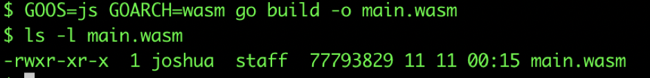

<center>图 8 编译成功</center> 

### 兼容性问题

编译出 main.Wasm 按照 Golang 的 Wasm 文档跑一下，由于目前是直接通过 os.Stdin 读用户输入的 SQL，通过 os.Stdout 输出结果，所以理论上页面上会是空白的（我们还没有操作 dom），但是由于 TiDB 的日志会打向 os.Stdout，所以在浏览器的控制台上应该能看到 TiDB 正常启动的日志才对。然而很遗憾看到的是异常栈：

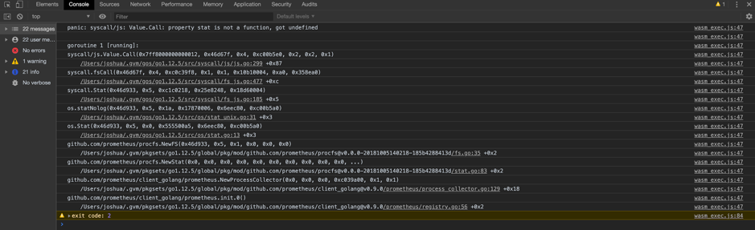

<center>图 9 异常栈</center> 

可以看到这个错是运行时没实现 os.stat 操作，这是因为目前的 Golang 没有很好的支持 WASI，它仅在 `wasm_exec.js` 中 mock 了一个 `fs`:

```js
global.fs = {
        writeSync(fd, buf) {
                ...
        },
        write(fd, buf, offset, length, position, callback) {
                ...
        },
        open(path, flags, mode, callback) {
                ...
        },
        ...
}
```

而且这个 mock 的 `fs` 并没有实现 `stat`, `lstat`, `unlink`, `mkdir` 之类的调用，那么解决方案就是我们在启动之前在全局的 `fs` 对象上 mock 一下这几个函数：

```js
function unimplemented(callback) {
    const err = new Error("not implemented");
    err.code = "ENOSYS";
    callback(err);
}
function unimplemented1(_1, callback) { unimplemented(callback); }
function unimplemented2(_1, _2, callback) { unimplemented(callback); }

fs.stat = unimplemented1;
fs.lstat = unimplemented1;
fs.unlink = unimplemented1;
fs.rmdir = unimplemented1;
fs.mkdir = unimplemented2;
go.run(result.instance);
```

然后再刷新页面，在控制台上出现了久违的日志：

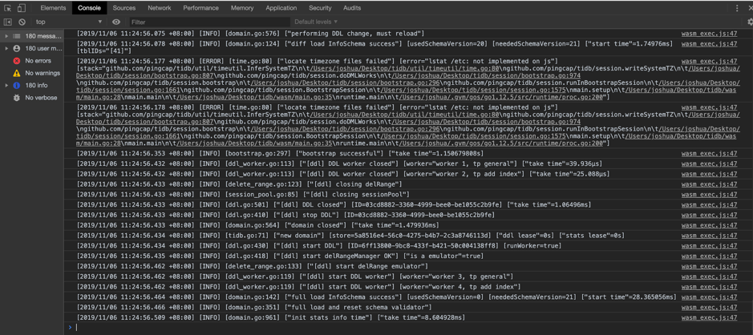

<center>图 10 日志信息</center> 

到目前为止就已经解决了 TiDB 编译到 Wasm 的所有技术问题，剩下的工作就是找一个合适的能运行在浏览器里的 SQL 终端替换掉前面写的终端，和 TiDB 对接上就能让用户在页面上输入 SQL 并运行起来了。

### 用户接口

通过上面的工作，我们现在有了一个 Exec 函数，它接受 SQL 字符串，输出 SQL 执行结果，并且它可以在浏览器里运行，我们还需要一个浏览器版本 SQL 终端和这个函数交互，两种方案：

1.  使用 Golang 直接操作 dom 来实现这个终端。

2.  在 Golang 中把 Exec 暴露到全局，然后找一个现成的 js 版本的终端和这个全局的 Exec 对接。

对于前端小白的我们来说，第二种方式成本最低，我们很快找到了 jquery.console.js 这个库，它只需要传入一个 SQL 处理的 callback 即可运行，而我们的 Exec 简直就是为这个 callback 量身打造的。

因此我们第一步工作就是把 Exec 挂到浏览器的 window 上（暴露到全局给 js 调用）：

```go
js.Global().Set("executeSQL", js.FuncOf(func(this js.Value, args []js.Value) interface{} {
    go func() {
	    // Simplified code
	    sql := args[0].String()
	    args[1].Invoke(k.Exec(sql))
    }()
    return nil
}))
```

这样就能在浏览器的控制台运行 SQL 了：

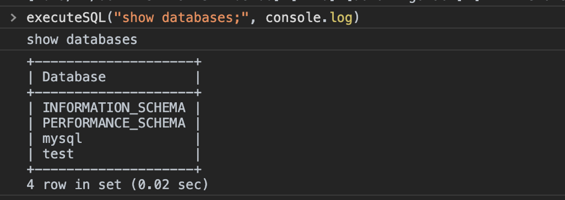

<center>图 11 在浏览器控制台运行 SQL</center> 

然后将用 jquery.console.js 搭建一个 SQL 终端，再将 executeSQL 作为 callback 传入，大功告成：

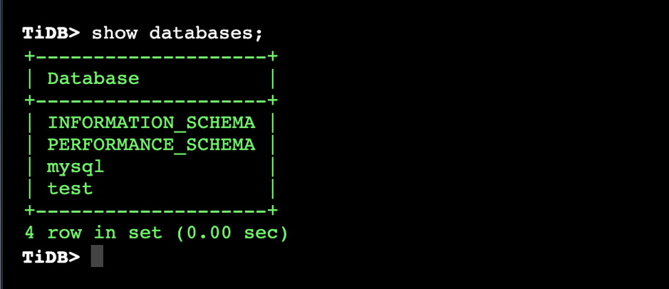

<center>图 12 搭建 SQL 终端</center> 

现在算是有一个能运行的版本了。

### 本地文件访问

还有一点点小麻烦要解决，那就是 TiDB 的 load stats 和 load data 功能。load data 语法和功能详解可以参考 [TiDB 官方文档](https://pingcap.com/docs-cn/v3.0/reference/sql/statements/load-data/)，其功能简单的说就是用户指定一个文件路径，然后客户端将这个文件内容传给 TiDB，TiDB 将其加载到指定的表里。我们的问题在于，浏览器中是不能读取用户电脑上的文件的，于是我们只好在用户执行这个语句的时候打开浏览器的文件上传窗口，让用户主动选择一个这样的文件传给 TiDB：

```go
js.Global().Get("upload").Invoke(js.FuncOf(func(this js.Value, args []js.Value) interface{} {
    go func() {
        fileContent := args[0].String()
        _, e := doSomething(fileContent)
        c <- e
    }()
    return nil
}), js.FuncOf(func(this js.Value, args []js.Value) interface{} {
    go func() {
        c <- errors.New(args[0].String())
    }()
    return nil
}))
```

load stats 的实现也是同理。

**此外，我们还使用同样的原理 “自作主张” 加入了一个新的指令：source，用户执行这个命令可以上传一个 SQL 文件，然后我们会执行这个文件里的语句。我们认为这个功能的主要使用场景是：用户初次接触 TiDB 时，想验证其对 MySQL 的兼容性，但是一条一条输入 SQL 效率太低了，于是可以将所有用户业务中用到的 SQL 组织到一个 SQL 文件中（使用脚本或其他自动化工具），然后在页面上执行 source 导入这个文件，验证结果。**

以一个 test.sql 文件为例，展示下 source 命令的效果，test.sql 文件内容如下：

```sql
CREATE DATABASE IF NOT EXISTS samp_db;

USE samp_db;

CREATE TABLE IF NOT EXISTS person (
      number INT(11),
      name VARCHAR(255),
      birthday DATE
);

CREATE INDEX person_num ON person (number);

INSERT INTO person VALUES("1","tom","20170912");

UPDATE person SET birthday='20171010' WHERE name='tom';
```

source 命令执行之后弹出文件选择框：

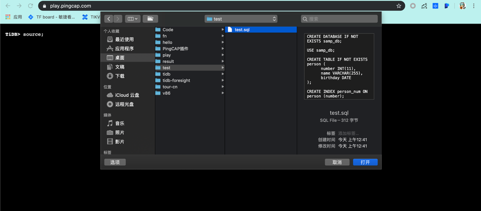

<center>图 13 source 命令执行（1/2）</center> 

选中 SQL 文件上传后自动执行，可以对数据库进行相应的修改：

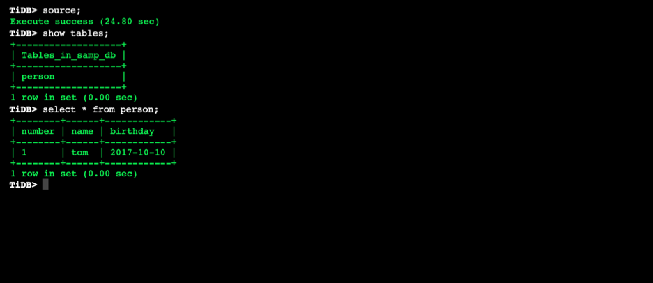

<center>图 14 source 命令执行（2/2）</center> 

## 总结与展望

总的来说，这次 Hackathon 为了移植 TiDB 我们主要解决了几个问题：

1.  浏览器中无法监听端口，我们给 TiDB 嵌入了一个 SQL 终端。

2.  goleveldb 对 Wasm 的兼容问题。

3.  bigfft 的 Wasm 兼容问题。

4.  Golang 自身对 WASI 支持不完善导致的 fs 相关函数缺失。

5.  TiDB 对本地文件加载转换为浏览器上传文件方式加载。

6.  支持 source 命令批量执行 SQL。

**目前而言我们已经将这个项目作为 TiDB Playground ([https://play.pingcap.com/](https://play.pingcap.com/)) 和 TiDB Tour ([https://tour.pingcap.com/](https://tour.pingcap.com/)) 开放给用户使用。由于它不需要用户安装配置就能让用户在阅读文档的同时进行尝试，很大程度上降低了用户学习使用 TiDB 的成本，社区有小伙伴已经基于这些自己做数据库教程了，譬如：[imiskolee/tidb-wasm-markdown](https://github.com/imiskolee/tidb-wasm-markdown)（[相关介绍文章](https://mp.weixin.qq.com/s/0Vo4apK4VdBfOs0-KyWXZA)）。**

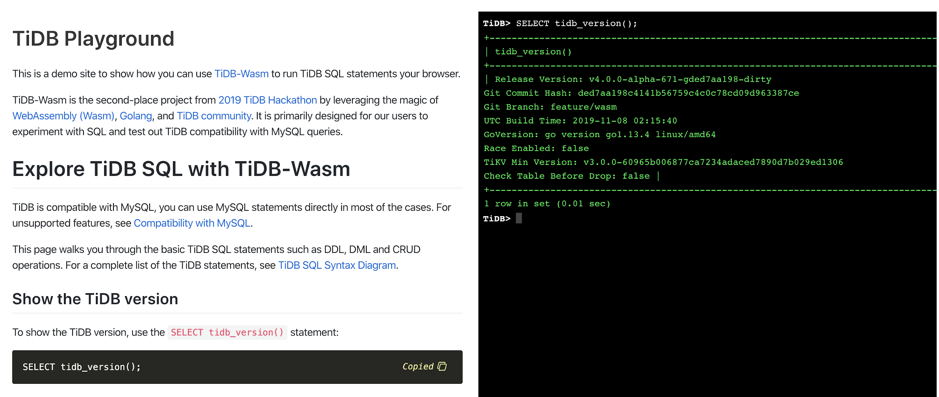

<center>图 15 TiDB Playground</center> 

由于 Hackathon 时间比较紧张，其实很多想做的东西还没实现，比如：

1.  使用 indexedDB 让数据持久化：需要针对 indexedDB 实现一套 Storage 的 interface。

2.  使用 P2P 技术（如 webrtc）对其他浏览器提供服务：未来必定会有越来越多的应用迁移到 Wasm，而很多应用是需要数据库的，TiDB-Wasm 恰好可以扮演这样的角色。

3.  给 TiDB 的 Wasm 二进制文件瘦身：目前编译出来的二进制文件有将近 80M，对浏览器不太友好，同时运行时占用内存也比较多。

欢迎更多感兴趣的社区小伙伴们加入进来，一起在这个项目上愉快的玩耍（[github.com/pingcap/tidb/projects/27](https://github.com/pingcap/tidb/projects/27)），也可以通过 [info@pingcap.com](mailto:info@pingcap.com) 联系我们。
