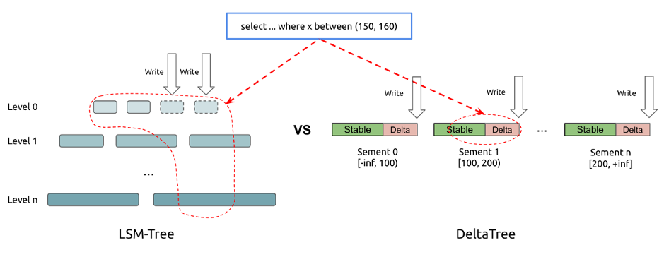
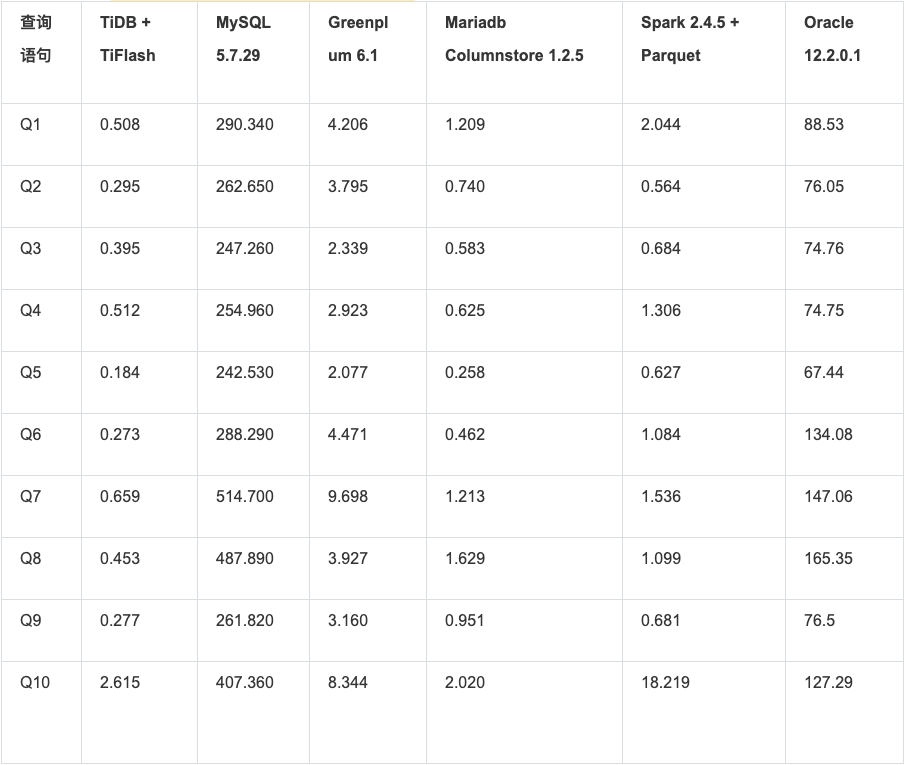
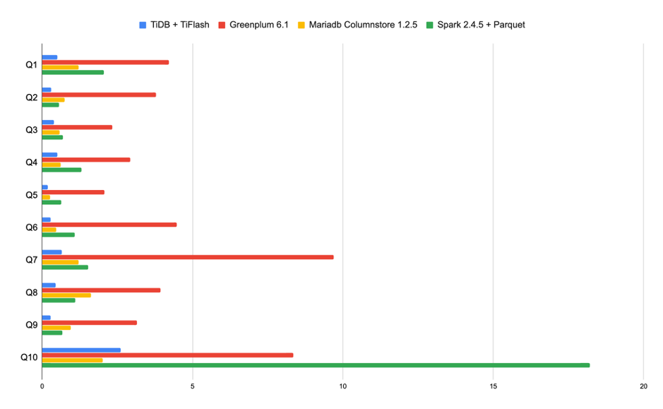

在 [上篇关于 TiFlash 的文章](https://pingcap.com/blog-cn/tidb-and-tiflash-vs-mysql-mariadb-greenplum-apache-spark/) 发布后，我们收到了很多伙伴们的反馈，大家有各种各样的疑问。包括：TiFlash 是不是 T + 1 列存数据库？为啥实时写入也很快？读压力大怎么办？节点挂了怎么办？业务怎么接入？……今天我们就来详细回复一下大家的问题，希望能对大家理解和实践 TiFlash 有所帮助。

## 并非「另一个 T + 1 列存数据库」

首先，它并不是独立的列存数据库：TiFlash 是配合 TiDB 体系的列存引擎，它和 TiDB 无缝结合，在线 DDL、无缝扩容、自动容错等等方便运维的特点也在 TiFlash 中得到继承。

其次，TiFlash 可以实时与行存保持同步。

### T + 1 问题

**「为何要列和 MySQL 的对比呢？这样是否太无聊？」**

由于 TiFlash 具备实时高频实时更新能力，因此我们在上一篇介绍中单机对单机比较了交易型数据库例如 MySQL，因为这些特点一般是行存引擎具备的优势。TiFlash 与大多数列存不同的是，它支持实时更新，并且与行存数据保持同步。

**「为何说其他列存数据库无法更新？我看到 XX 支持 Update 呀？」**

多数列存引擎并不是绝对不支持更新，而是不支持主键或唯一性约束，因此无法像交易型数据库那样快速定位单条记录并进行一致性更新，这也是你无法向它们实时同步交易库数据的原因。针对这样的设计，常用的更新方式是使用 ETL 去重和融合新老数据，然后批量导入列存，这就使得数据无法实时分析而需等待数小时甚至一天。

TiFlash 是为实时场景设计，因此我们必须支持实时更新。在这个前提下，通过良好的设计和工程实现，也借助 ClickHouse 极速的向量化引擎，TiFlash 仍然拥有不亚于甚至超出其他列存引擎的优异性能。大家可以参考 [上一篇文章中的 Benchmark](https://pingcap.com/blog-cn/tidb-and-tiflash-vs-mysql-mariadb-greenplum-apache-spark/) 。

## 为什么实时写入也很快

**「TiFlash 是列存，大家都说列存的实时写入很慢，TiFlash 呢？」**

经过业界验证的实时更新列存方案是 Delta Main 设计。简单说，就是将需要更新数据与整理好的不可变列存块分开存放，读时归并，定期 Compact，而 TiFlash 也采取了类似设计思路。TiFlash 并非是拍脑袋发明了一种可更新列存结构，而是参考了其他成熟系统设计，如 Apache Kudu，CWI 的 Positional Delta Tree 等的设计思路，TiFlash 的设计也兼具了 B+ 树和 LSM 的优势，在读写两端都有优异的性能（但牺牲了对 TiFlash 场景无用的点查性能）。由于无需考虑点查，因此 TiFlash 可以以进行惰性数据整理加速写入；由于引入了读时排序索引回写，因此哪怕 Compact 不那么频繁仍可以保持扫描高效，进一步减小写放大加速写入。



**「TiFlash 进行 OLAP 读取的时候会影响 OLTP 性能吗？」**

[上篇文章](https://pingcap.com/blog-cn/tidb-and-tiflash-vs-mysql-mariadb-greenplum-apache-spark/) 中已经展示过 TiFlash 的读取性能：




*注：为了不影响比例，上图忽略了 MySQL 和 Oracle 数据。*

下面带大家看看更新写入速度，这里做了个简单的写入测试：

* 测试配置 3 节点 6 TiKV（3 副本）+ 2 节点 TiFlash（2 副本）。

* sysbench write-only 测试。

* 以 60954.39 的 QPS 进行混合写入更新和删除。

* 同时 TiFlash 不断进行全表聚合计算。

测试结果是：

1. sysbench 运行 QPS 非常平稳，不会因为 AP 查询而抖动。

2. TiFlash 可以很好匹配 TiKV 的实时写入（包含增删改而非仅仅插入）同时提供查询。

3. 另外，我们也观测到：在查询发生时，TiFlash 副本读取时，进行一致性校对 + 追赶 + 写入的时间平均 27.31 毫秒。

实际上，在都只写 1 副本的情况下，TiFlash 的写入性能大致可以追上 2-3 个同规格 TiKV 节点，这确保了 TiFlash 在更少的资源配比下，也可以匹配 TiKV 的写入压力。

### 为何如此？

由于 TiFlash 引擎针对 AP 场景无需点查的不同设计，它相对 LSM 引擎减小了写放大比率：TiFlash 的写放大大约在 3-7 倍之间。且在写入约繁忙情况下，由于攒批效果反而越接近更小的三倍放大比率。而 LSM 结构下，RocksDB 的写放大在 10 倍左右。这个对比优势大大提高了 TiFlash 磁盘实际能承载的业务吞吐量。

## 方便敏捷的运维

### 灵活扩容

**「如果读压力也很大，你光写得够快有啥用啊？」**

虽然我们展示了 TiFlash 的写入性能，其实哪怕它的写入速度不如 TiKV，我们仍然可以单独对 TiFlash 进行扩容。不管 TiFlash 的写入性能多优秀，仍然有可能因为用户的查询读取压力过大而造成写入速度下降，这时候是否就会产生严重的复制延迟呢？会。但是 TiFlash 却可以依靠 TiDB 的体系单独扩容，如果业务压力过大，多上线几台 TiFlash 节点就可以自然分担数据和压力，用户完全无需操心扩容过程，这些都是透明且自动的。相对于同节点的行列混合设计，这样的架构无疑更灵活，且仍然保持了一致性。

### 自动恢复

**「节点挂了怎么办？」**

当 TiFlash 节点损坏下线，TiDB 体系可以保证 TiFlash 的数据自动从行存恢复副本，而补副本的过程也会考虑不对 TiKV 产生冲击。在 TiFlash 多副本的情况下，这个过程对用户也是完全透明无感知的：你只需要将补充的服务器启动上线就行。

### 无阻塞 DDL

**「TiFlash 支持 DDL 吗？」**

TiFlash 继承了 TiDB 体系的在线 DDL，尤其是它支持了更改列类型。与传统列存系统需要完全重写列格式不同，TiFlash 支持混合表结构，每个列数据块可以有独立的表结构，这使得 TiFlash 更改列类型是完全实时且无负担的：没有数据需要被立刻重写。这种设计，使得 TiFlash 可以很容易被用于数据集成场合，任何上游数据源的表结构变更可以无阻塞地被同步。

## 快速的业务接入

上述所有这些特型，使得 TiFlash 体系可以非常便捷地承载实时分析业务。考虑一下如果你有一个新业务上线，你需要将在线业务接入分析平台例如 Hadoop，你也许需要做如下事情：

1. 修改业务逻辑，在表结构中添加变更时间标记以便增量抽取。

2. 编写定时任务，从源数据库中抽取增量数据。

3. 将数据写入 Staging 表，通过和 Hive 目标表进行 JOIN 并回写以处理增量更新。

4. 很可能你还需要编写数据校验代码定期检查一致性。

5. 那么也意味着你需要编写不一致时的修复代码。

这个过程可能需要耗费数天，甚至更久，而你还需要维护整个传输链路。

在 TiDB + TiFlash 体系下，你只需要一条命令：

```
ALTER TABLE your_table SET TIFLASH REPLICA 1;
```

你就可以自动获得一份实时保持一致的列存数据镜像，进行实时分析。

**5秒（取决于你的手速） vs 数天**

即便你已经有完整的 Hadoop 数仓建设，TiFlash 配合 TiSpark，也可以轻松衔接两个平台的同时，为离线数仓提供实时能力。

## 欢迎尝鲜

TiFlash 已经在进行第一轮用户测试，并在近期开启第二批用户测试，请关注后续信息，也欢迎联系询问提前体验 maxiaoyu@pingcap.com。来信请注明如下信息：姓名，公司，业务场景，是否已经是 TiDB 用户。
