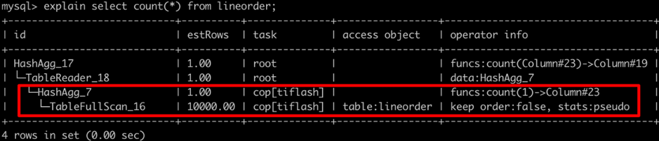
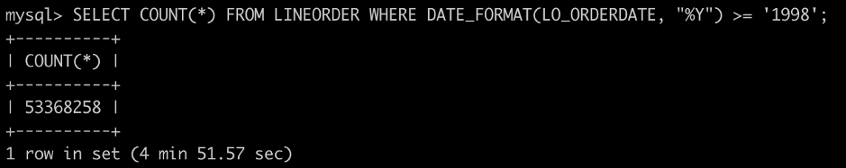
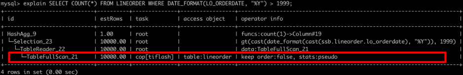
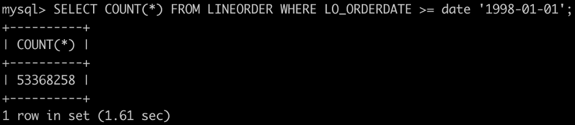
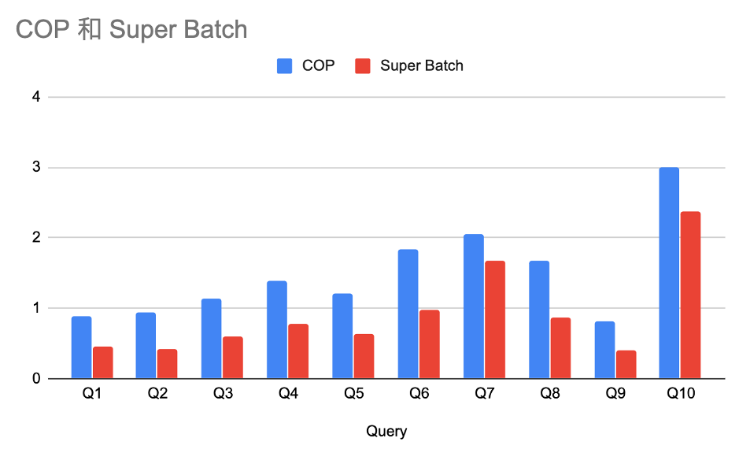
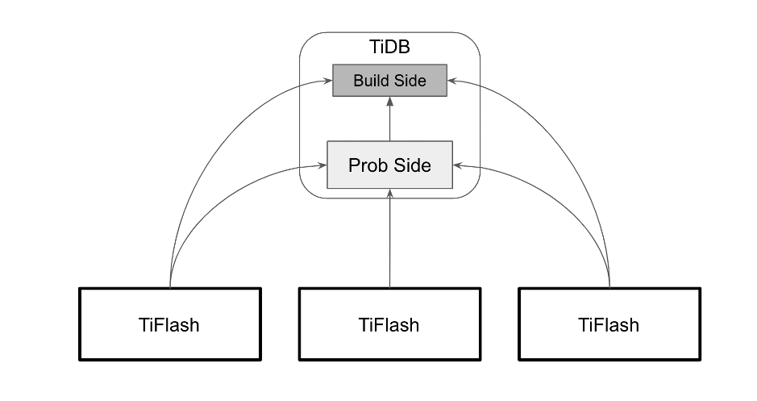
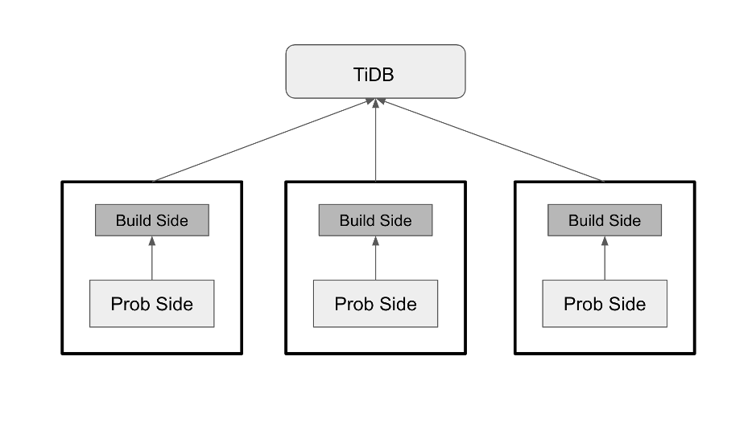
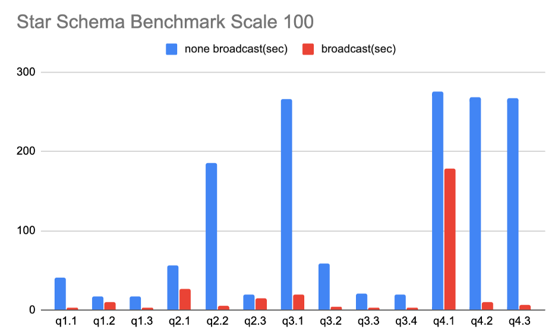

和 TiDB 一样持续听取用户反馈，持续改进，持续优化，高速迭代是这个项目的核心思路。最近几周陆续有数十家用户已经率先体验了 TiFlash，测试的过程中很多同学注意到一个现象，短短几周时间，**每次 TiFlash 的版本更新都会带来新的性能的改进，速度越来越快**，也会问到 TiFlash 越来越快的原理，所以就有了这篇深度解析。

## TiFlash 加速之谜

TiFlash 诚然本质是依靠列存加速，但它也借助了 ClickHouse 计算层的优异实现，因此它也不仅仅是列存。TiFlash 与 TiKV 一样，拥有协处理机制。简单来说，协处理器就是替 TiDB 分担计算的机制。下面我们看下这个。

```sql
SELECT COUNT(*) FROM LINEORDER;
```



看这样一个简单的 count 计算的执行计划，其中 operator info 栏目中 count(1) 的被标记为 cop[tiflash]，这表示 TiFlash 将会执行 Hash 聚合计算 count(1)，而实际需要返回给 TiDB 的数据，仅仅是聚合完之后的结果，在大多数场景下，返回的数据将会非常少。这种协处理器机制，将会由各个 TiFlash 按照 Region（数据分片）为单位分布式执行。由于 TiFlash 配备了优异的计算模块，因此这部分下推优化是 TiFlash 加速的关键因素之一。

这里就有一个关键因素：并不是所有计算都可以完全下推到 TiFlash 进行加速。

## 哪些计算无法加速？

如果有函数在 TiFlash 没有实现，那么它将阻碍计算加速。
让我们看下这样一个查询

```
SELECT COUNT(*) FROM LINEORDER WHERE DATE_FORMAT(LO_ORDERDATE, “%Y”) >= ‘1998’;
```





上面的执行计划中，TiFlash 只承担 TableFullScan 也就是扫表部分，而 count(1) 却并没有在 TiFlash 中执行。这是为何？其实原因也很简单：因为暂时 date_format 函数在 TiFlash 中并没有实现，因此从谓词过滤以及所有之后的计算都将无法加速。这也许会带来几倍甚至十几倍的速度差距。
所以遇到这样的情况该怎么办？你可以很简单改写为：

```
SELECT COUNT(*) FROM LINEORDER WHERE LO_ORDERDATE >= ‘1998-01-01’;
```



**改完这个查询从将近 5 分钟加速到 1.61 秒。**

不过这并不是我们在这里希望你默默忍受的。**我们希望你告诉联系我们，告诉我们这里下推不知道为什么不工作了，我们会帮你分析，如果有缺漏的下推，我们会迅速补上**。

## Super Batch 优化

有用户反映，当 Region 数量非常多的时候，TiFlash 的加速会放缓。这是由于当 Region 过多时，TiDB 会产生数量大量的 Region 读取请求，而造成调度延迟放大。这个效果有些类似 Hadoop 上小文件过多而造成的性能影响。我们之前给出的建议是，打开 Region Merge，并在可能的情况下将 Region 大小调至 192M 而非默认的 96M。但就算这样，仍然可能有超大表包含数千甚至上万 Region 数让性能下降。

对于这样的问题，近期我们推出了 Super Batch 优化，当开启优化时，TiDB 将会把所有需要发送到同一个 TiFlash 的请求合并，而 TiFlash 则会在内部自行进行 Raft 相关的读取容错。
通过这样的方式，TiFlash 不在对 Region 大小敏感。如下是 ontime 数据集的测试对比。



如上测试结果可以看出，多数查询有接近一倍的提速，而这只是在较小数据量下（10 亿规模以内）的结果，如果数据量进一步增加，加速效果将更为显著。

## Join 加速

有一些测试的朋友告诉我们，我的分析计算是星型模型，有不少 JOIN，执行起来似乎没有变多快。是的，以协处理器的模型，对 JOIN 类计算并不能很好加速，因为 JOIN 无法在这个框架下分担计算，进而都必须由 TiDB Server 独立承担。由于 TiDB Server 计算单元目前并不是分布式设计，因此只能单机慢慢算了。



那是否这样的场景就无法优化了呢？

只要有足够多的的用户呼声，我们就会开动脑筋 :)

经过一番努力，现在 TiFlash 实现了针对星型模型 JOIN 的优化方案：类 Broadcast Join。
通过将小表 Build Hash 动作在 TiFlash 中实现，我们得以将整个 Join 操作下推并分布式化，这个优化不止让 Join 本身得以在 TiFlash 中分布式计算，而且也让后续操作例如聚合等，都可以完整下推到 TiFlash。



而这个优化的加速效果也相当明显。我们针对标准的 Star Schema Benchmark 进行了测试，结果如下。



总共 13 条 SQL，大家可以在 [这里](https://github.com/pingcap/tidb-bench/tree/master/ssb) 找到。**大部分查询都有明显加速，其中 6 个甚至有数量级（最多 44 倍）的加速**。

相信在完整的 MPP 实现之前，这样的设计也可以满足很多用户的需求。而有些场景用不上这个优化，比如大量的大表 Join，则可以直接用 TiSpark。

## 更多沟通，更多加速

上述各个优化，都是由用户反馈而做出的针对性优化。我们也会不断快速迭代，快速演进。但是这一切的前提都是， 你的使用和反馈。与我们联系，尝试 TiFlash，在解决你问题的同时，也能与我们一起打造真正符合大家需求的产品，毕竟，TiDB 是一个以社区为本的产品。社区的前进，离不开每个用户。

## 欢迎体验

TiDB 4.0 可以使用全新的 [TiUP](https://tiup.io/) 进行部署。大家可以使用两条命令单机部署体验或者参考 [官网文档](https://pingcap.com/docs-cn/dev/reference/tiflash/deploy/#%E5%85%A8%E6%96%B0%E9%83%A8%E7%BD%B2-tiflash) 部署集群。

```
curl --proto '=https' --tlsv1.2 -sSf https://tiup-mirrors.pingcap.com/install.sh | sh 
tiup playgroud
```

*注：部分上述优化还未包含在 4.0 RC，请与我们联系参与体验。另，TiFlash 部署暂时只支持 Linux 环境。*

