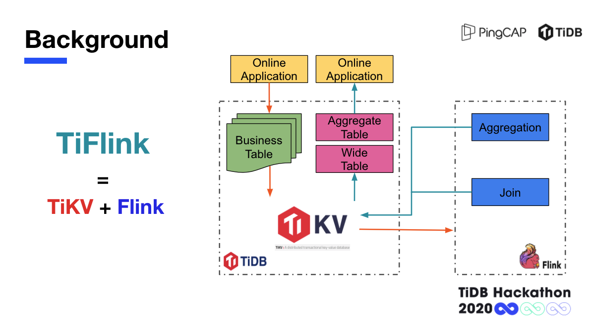
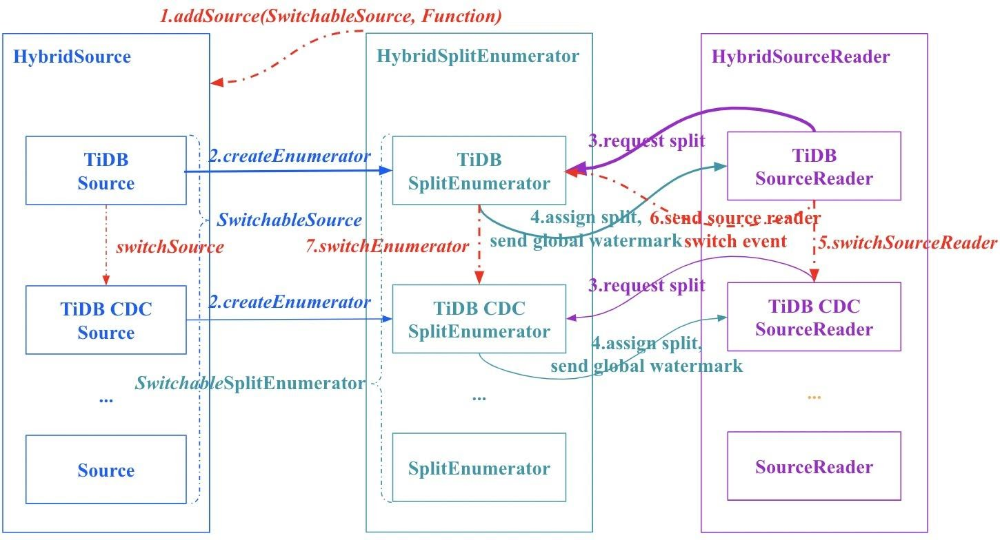

Flink 是一个低延迟、高吞吐、流批统一的大数据计算引擎，作为大数据处理领域最近冉冉升起的一颗新星，其针对数据流的分布式计算提供了数据分布、数据通信以及容错机制等功能，被普遍用于高实时性场景下的实时计算。2020 年 TiDB 与 Flink 正式开始合作，探索将 Flink 与 TiDB 结合的解决方案。令人开心的是，在今年 TiDB Hackathon 上我们就看到出现了 3 个基于 Flink 的项目。**其中，TiFlink 队伍的项目为 Flink 实现了更好的 TiKV Source、Sink 和 TiDB Catalog Reader，支持 Snapshot 读取和 Change Log 增量读取和 2 Phase Commit 写入，以实现在 TiDB 里快速创建 Materialized View 和在 Flink 里方便编写读写 TiKV 数据的批/流处理任务。** 该项目凭借超高的人气一举夺得本届大赛最佳人气奖。我们在赛后采访了 TiFlink 团队部分队员与评委李钰老师，邀请他们分享自己的 Hackathon 经验。

## 项目背景：当 TiKV 遇上 Flink

提起 TiFlink 项目的灵感，还得从队长张茄子去年在公司内部的尝试说起。他的公司有一些数据实时分析的需求，但原有的数据分析工具在单表查询时很快，一旦到 join 时就不是很好搞。当时这个项目最终没能在内部成功做出来，但想法一直都在，直到今年 Hackathon 期间，张茄子和队友们一起重新探讨了可能的方案。目前，TiDB/TiKV 提供的 Flink 集成和 Java 客户端具有如下缺陷：

- Java 客户端不支持抓取 CDC 日志，使用 TiCDC 需要通过 Kafka 转发，比较笨重和繁琐，延迟较高；

- Flink 集成的 Source 只支持批量读入，不支持批流结合（即先批量读入，后拉取 CDC 日志进行增量更新）；

- Flink 集成的 Sink 尚不支持 TwoPhaseCommit 协议，正在开发中的版本只支持各个节点单独 TwoPhaseCommit ，不支持全局同步 TwoPhaseCommit 。

张茄子观察到 Flink 有着很完善的系统，在 Flink 里有一个 Flink CDC connector，但是只有 MySQL 的，没有 TiDB 的。所以队员们就想借助这次比赛做出一个 TiDB 的 CDC connector，将其贡献到 Flink 和 TiDB 社区，这样就可以打通 TiDB 社区和 Flink 社区的合作，借助 TiKV + Flink 打造出一个 TiDB 的批流一体库。**这就是 TiFlink 的由来，通过它可以实现更好的 Flink 集成（Connector）以及提供物化视图（Materialized View）功能，显著提高 TiDB/TiKV 生态环境的 OLAP 能力。**

## 项目设计：TiFlink 流批一体库诞生了

在比赛中，为了将设想中的 TiFlink 流批一体库实现落地，队员们做出了一系列尝试：

- 为 TiKV 的 Java 客户端添加直接拉取 CDC 日志的功能，从而为实现批流一体数据处理的 Flink Source 创造条件；

- 为 Flink 开发 TiKV 兼容批读取和增量读取的 DynamicTableSource ，实现不同隔离级别的读取功能；

- 为 Flink 开发兼容 TiKV 事务模型并支持 TwoPhaseCommit 接口的 DynamicTableSink ，实现跨节点（切片，Region）一致的数据写入；

- 在上述组件的基础上，尝试实现 TiDB 上基于 Flink 的物化视图功能。

经过紧张的开发，在比赛答辩中 TiFlink 终于初见雏形，并顺利通过 DEMO 演示，TiFlink 团队为 TiKV 写了一个 DynamicTableSource，让 Flink 直接读取 TiKV snapshot 数据以及 CDC 流式变更数据，同时支持了 DynamicTableSink，能让 Flink 通过 TiKV 事务的方式将数据重新写回到 TiKV 里面。**通过这种方式，让大数据处理在 TiDB 以及 Flink 之间高效的流转。同时，TiFlink 也构建了一个 global snapshot coordinator，可以让分布式执行的 Flink 任务在以 snapshot isolation 的强一致方式来维护物化视图。**

## 因为 Hackathon 走到一起的 TiFlink

令人惊讶的是，在比赛的短短几天时间里就能做出如此完备功能的 TiFlink，其 4 名队员可以说来自天南海北。队长张茄子来自全球领先的招聘网站 Indeed ，在日本做新项目孵化；乘蜗牛追乌龟本名徐哲，在大唐电信从事流媒体服务端研发，是多届天池大赛数据库比赛骨灰级获奖选手；jiangplus 在一家 AI 和算法驱动的药物研发公司 Xtalpi，从事内部云原生机器学习平台的构建工作；SteNicholas （蒋晓峰（子懿））则在阿里云 Apache Flink 做生态相关工作。若在平时，看似分属于不同行业不同地区的四人可能永远都不会产生任何联系，但出于同样对 Hackathon 的热爱，将他们串联到了一起。

Hackathon 对张茄子来说，最大的吸引是可以将自己的 idea 讲出来，同时能够认识到拥有各种各样 idea 的朋友，大家一起分享自己的想法是一件非常开心的事情。

SteNicholas 认为 Hackathon 带来的最大收获莫过于可以用自己熟悉的 Flink 或 TiDB 做任何想做的事情，只要能把它实现，就是一件特别 cool 的事情。

而对于队伍中年纪最小的徐哲而言， Hackathon 是一次开拓自己视野的好机会，不但可以看到其他队伍提出了一些自己从未想过的 idea ，还能逼着自己在很短的时间内完成一个非常有意思的点子，完成对自我的挑战。

与以前参加过的 Hackathon 不同，TiDB Hackathon 以「∞」作为本次大赛主题，参赛队伍只要有创新的 idea ,都可以拿出来参赛，在两天的编程里疯狂 coding，将自己的 idea 落地分享。对四人来说，这样的机会怎能错过？

在进行了一番探讨和交流后，张茄子和队友们决定将 TiKV + Flink 打造流批一体库作为自己的参赛项目。

今年由于疫情原因，大家都通过线上方式进行远程协作， 2 人负责 Flink 开发工作，2 人负责 TiDB 开发工作，每隔几个小时便会沟通项目进度。队长张茄子认为对远程协作来说保持一定频次的沟通至关重要，需要确保每个人的工作内容都朝着同一个方向，不至于最后走歪。

SteNicholas 作为 TiFlink 唯一到现场参赛的队员，还通过线上向其他队员做起了现场直播，引得大家直呼羡慕。对 Hackathon 来说不能一起面对面奋斗，始终是一件非常遗憾的事情，大家都表示如果明年继续参赛，希望还能够在现场相聚。

评委李钰老师是来自 Apache Flink & Apache HBase 的 PMC，出于职业敏感，对 Flink 这类生态结合的项目特别关注：“ **今年与 Flink 相结合的项目一共有三个，有通过 Flink 给 TiDB 做联邦查询的、有用 Flink 做物化视图的，但我觉得与 Flink 集成最深的还是 TiFlink** 。比如他们做了一个原生的 Java 的 CDC，利用 Flink 本身机制实现物化视图的 Snapshot 的全局性。我个人觉得这些方面再往后走都具备落地的价值，这也是我最喜欢这个项目的原因。”

在李钰看来，如果能将 TiDB 联邦查询的项目与 TiFlink 项目结合在一起，对用户而言会产生更好的效果。现在有很多业务场景既有实时计算大数据相关的需求，又有数据库查询的需求，在这种情况下，将 TiDB+Flink 联合起来形成解决方案非常具有实用价值。例如， Flink 其实可以直接给 TiDB 提供访问 Hive 的能力。如果你既想查一个数据库里的数据，又想查一个 Hive 里的数据，就可以通过 TiDB 的这种标准 SQL 查询实现，屏蔽掉底层复杂的细节，这对于客户而言是非常具有现实价值的方案。

## 未来期待：找到初期用户

2 天的比赛时间非常有限，队员们希望在未来几个月找到一些初期用户，在用户反馈中不断完善 TiFlink 项目。队员们对此都很期待：“毕竟我们自己的想法和用户的想法还是有很多不一样的地方，比如说在一些选型、设计上的问题，我们自己没有办法解答，需要知道对用户来说哪种方式比较方便使用。**理想情况下，我们当然希望这个项目可以变成 TiDB 的一部分 ，作为一个整体被 TiDB 的用户非常方便地使用起来。**”

李钰老师特别补充道：“其实 Flink 也一直在提批流一体数仓，在用户有实时需求的情况下，批流一体数仓能够极大地节省整体 TCO 。类似的方案之前在阿里内部也有过一些技术实现，但 TiKV+Flink 是首次以开源解决方案的形式予以实现，这可以为广大用户提供更普惠的解决方案。”

除了 TiFlink ，本届大赛中也涌现出不少令人激动的项目，除了自己的队伍，还有哪些是最感兴趣的呢？几位队员明显有着自己的偏爱：

张茄子：“我比较喜欢的是几个大佬们做的那个 Index 的项目，非常具有想象力，把一些比较新的想法都融合进来了，我感觉这也是最有前景的项目之一。”

徐哲：“我最感兴趣的是 UDF 和 TiGraph 两个队伍的项目。UDF 在演示期间的展示非常酷， TiGraph 在展示期间有一个和原生的 TiDB 的性能对比，效果也非常好。他们的项目都是非常实用的想法，最后都获得了奖项，说明大家对他们也非常认可。”

## Hackathon 建议：参赛，享受比赛

作为经常参加 Hackathon 的老手，队员们也给对 Hackathon 活动感兴趣的萌新们分享了一些个人经验：张茄子建议新人一定要大胆来参赛。很多参赛选手其实也有好的点子和想法，但是他不太敢来参赛，害怕在众人面前露怯。其实大可不必，即使最终答辩效果不好，被淘汰也没什么不好意思的。不要太执着于比赛成绩，享受比赛过程就好了。你可以在这个过程中学习到很多东西，这才是最重要的收获。此外，如果想取得好成绩的话，需要提前对 TiDB 和 TiKV 进行了解和学习，获奖队伍中有很多人都是社区中的长期贡献者，事先做一些准备会更有胜算。

李钰老师认为 Hackathon 活动是一个锻炼人的好机会，对于技术人员而言非常具有价值。就像马拉松长跑一样，在平时纷繁复杂的工作之外给自己一个机会来发泄一下。**马拉松是一种对自我体力极限的锻炼， Hackathon 则是一个脑力上的锻炼。** 最简单的建议就是要先来参加，在参赛的过程中享受比赛。
