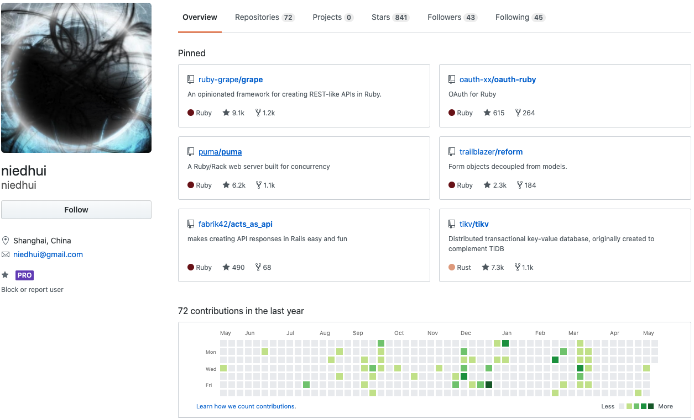
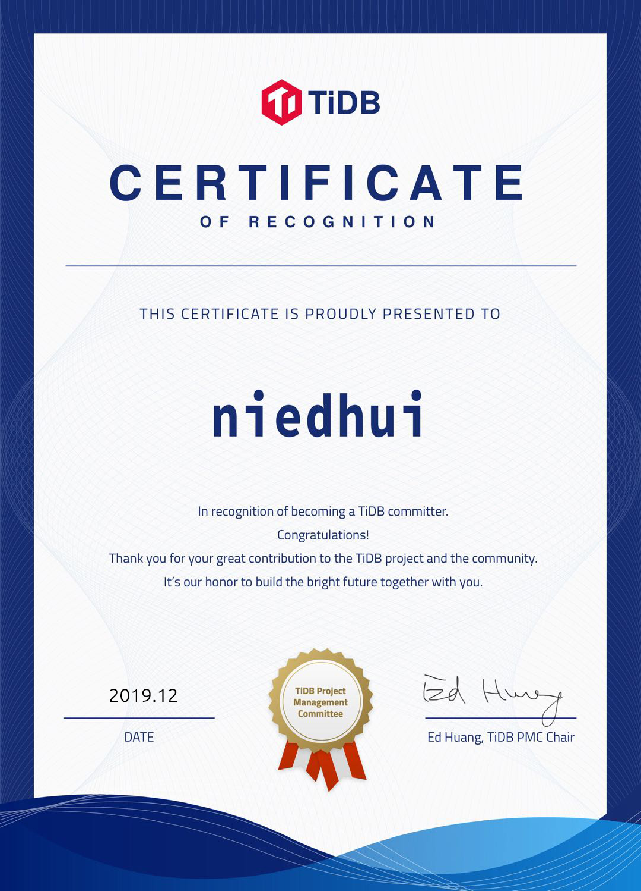

>**聂殿辉**，TiKV Committer，曾经是一个连续创业者，目前在掌门科技游戏部门带一个研发团队。他还喜欢买手办，拼高达模型。他很少发朋友圈，几乎不用手机，自嘲是老年人生活模式，但对于参与社区还是保持着一片热情。

## 有梦想，爱折腾

我大学毕业一两年之后怀着一腔热血开始参与创业，当时是公司第三位员工。最开始我们做的一个项目想对标国外的 Twitter 和 Facebook，可惜没过多久微博就出现了，于是我们的项目渐渐退出市场。2013 年开始和另外一个同事参与过众筹方面的创业，也是由于时机不太好，后来也没有继续下去。

技术人员看着内向，其实谈到技术就很好聊。压力比较大的反而是一些相关知识的疯狂补课。做众筹创业时项目偏金融，和股权相关，这方面我的知识有点脱节，为了更好的沟通因此恶补了大量金融领域的知识，这样才能和对方聊的比较顺利。

创业压力确实很大，精神一直比较紧绷，有一种责任感在肩上。创业的时候不仅仅需要把自己的技术做好，还要去考虑自己做的东西是不是对社会有价值有帮助，同时也希望在这过程中对团队有成长和帮助，虽然最后创业没成功，但我对责任的理解更加深刻了。

**但如果让我选择，我还是会去创业。创业的五年虽然很累但是很开心，有一些梦想和激情在，相信自己做的东西有价值。**

所以我看 PingCAP 这样一个创业公司时，也别有一番感受。首先，我觉得 PingCAP 做开源有一种使命感，是我见过非常彻底的开源。从我知道 TiDB 开始你们就一直在开源方面做各种各样的尝试。同时也很重视技术输出，无论是相关数据库领域还是更外围的技术领域，都能看到你们在努力分享传授知识。

其次还有一个很神奇的点，我在提 PR 的时候感觉 PingCAP 的同学上班时间都不一样，不同时间点都有人在 Review Code。

## 玩转 TiDB 开源社区

### 对开源的理解

之前工作中就使用过一些小的开源项目。TiKV 是我参与的第一个真正的大型开源项目。

**我认为开源不仅仅是在技术上开放源代码，更是一个分享的态度、一种沟通方式**。之前我会读别人的源码，后来看了《大教堂与集市》，我才开始思考原来开源是这样的。开源项目和公司内部开发会很不一样，像 Linux 组织好一群人，用很好的沟通方式把一件事做好，才是很有意思的事情。

TiDB 给我感觉很像集市的开发，把很多人聚集在一起，又保证可控的质量。对社区的沟通能力和组织能力是一个很大的考验。

### 第一次接触 TiKV

我的工作要求我对技术涉猎比较广，因为怕落伍所以我每年会了解一个开发语言。2018 年正好了解到 Rust，后来发现 Rust 确实不错，想更深入了解，所以要找一个项目去入手。后来在 GitHub 上扫到了 TiKV 这个项目，就开始去慢慢了解。

TiKV 是一个很复杂的系统，涉及的东西很多，所以当时想找到一个切入点去参与，刚好那段时间 Coprocessor 在做函数下推，这个模块相对独立，对我来说只要了解一部分就可以参与 TiKV，很适合入手，issue 的描述和 lable 也很明确，比较好切入。

之前创业做项目更看重功能的完备性、应用性，如果性能有问题可以回头再修改。但是给 TiKV 提 PR，很多是性能相关。性能在我之前的工作中不是最重要的，但因为 TiKV 太底层太核心，所以非常压榨性能，可能本身功能很简单，但很多都是性能上可以优化的点，这和我之前的工作方式很不一样。

### 深度参与社区

在参与 Coprocessor 之前我提过一个 PR，当时是 TiKV 有些依赖要升级版本，我那时对 Rust 还不了解，就想看看 TiKV 用了什么库，这样可以很快了解 Rust 生态。

印象中解决的最难的问题应该是 Row Format，这个 PR 牵扯的东西比较多，中间会穿插着一些其他的事情要去做，有很多准备工作，并且需要很好理解整个 TiKV 工作流程，TiDB 上的数据发过来怎么存，怎么解码，都是比较细节的问题。

**我对 TiDB 社区的整体印象用一句话概括就是：很专业，又很有人情味。**

专业是因为社区很系统，活动很丰富，感觉 PingCAP 投入了非常大的精力在社区，像 [挑战赛](https://pingcap.com/blog-cn/TiDB-usability-challenge-program/)，[捉虫竞赛](https://pingcap.com/blog-cn/tidb-bug-hunting-guide/)，最近也被各种刷屏。我之前扫过你们的博客，信息量非常大。

人情味是最开始看 TiKV  Review Guide，Review Guide 里提到一些规范，比如如果发现提 PR 的人掌握的知识不如你，也需要有一些耐心，让人觉得很专业又很有耐心。对参与者非常友好， Review 的环节很顺滑，对新手来说很容易有一个切入点。

对人情味的感受还来自于一次面基的经历。

有一天我突然收到 Breezewish( PingCAP 小伙伴）的信息：诶，看你 base 在上海，我也在上海，来线下面基呗？（直男就是这么直白）

于是我们约在 PingCAP 上海办公室楼下的咖啡馆，Breezewish 给我很详细的讲了 TiKV 的模块，让我对 TiKV 了解又更多了些。再后来我一点一点写的函数被 Siddon Tang（PingCAP 首席架构师）发现，他说不要老写简单的啦，来写写难一些的呗。受此激励，慢慢开始上手做了一些阶梯的任务，比如 Row Format。后来也参与社区 [性能挑战赛](https://pingcap.com/blog-cn/pcp-report-202002/) 和 [易用性挑战赛](https://pingcap.com/blog-cn/TiDB-usability-challenge-program/)。

从 Contributor 到 Reviewer 的进阶还是蛮轻松的，做的东西有认同感，到了 Committer 之后我会有一些压力，因为这个角色对项目的理解需要更深入，我也希望自己之后可以花更多时间去了解 TiKV。参与的越多，越觉得代码方面不是问题，对项目的整体把握才是最考验人的。

## 趣味问答

喜欢横屏还是竖屏？ **竖屏**

Emac 还是 Vim？ **Vim**

mac 还是 Linux？**Linux**

Firefox 还是 Chrome？**Chrome，就是太吃内存了**

喜欢用什么键盘？ **HHKB**

鼠标还是触控？ **鼠标**

甜豆花还是咸豆花？ **作为一个东北人当然吃咸豆花！**

**最后回答一下庄天翼在 [上一个采访](https://pingcap.com/blog-cn/tikv-committer-zhuangtianyi/) 中的提问：你最喜欢吃什么菜，平时做菜吗？**

我不喜欢吃肉，从记事开始就不太吃荤菜了，对吃的没啥欲望，平时也不做菜。老婆是个荒废厨艺的厨师，之前喜欢做菜，但在遇到我之后觉得做菜没有成就感了。（🤦‍♀🤦‍♂️）

>点击【[这里](http://h.qr61.cn/ozn4Ej/qSFBOOI)】添加 TiDB Robot 为好友，加群交流 TiDB 最新资讯。
>
>若对 TiDB 的使用有所疑问，也可以登录 Asktug.com 搜索或发帖交流～