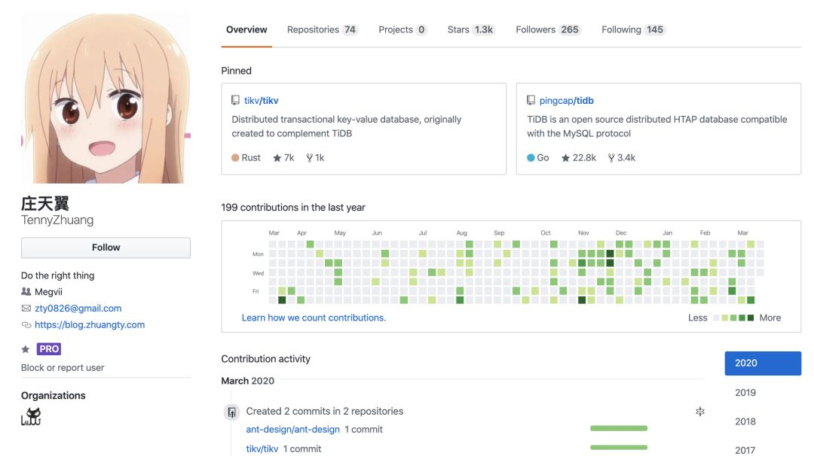
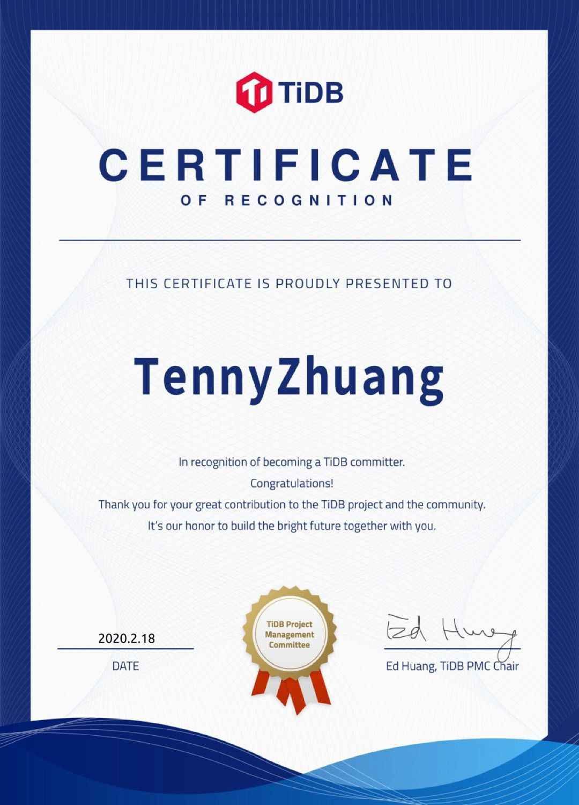

>2020 年 2 月，TiKV 项目迎来了一位新晋 Committer —— 庄天翼（GitHub ID：TennyZhuang），他 2018 年毕业于清华大学，目前在旷视科技担任分布式存储开发工程师，平时爱看动漫，工作之余也喜欢写一些代码，实现自己的想法。前天，我们正儿八经地采访了庄天翼同学，在互相努力憋笑中，愉快地掉落了以下文字……

## 传说中的“天才少年”

天翼并不是普通意义上的计算机“天才少年”。

虽然他在大四时和队友一起拿了 CCPC（中国大学生程序设计竞赛）区域赛金牌，但他第一次接触编程已经是高中了，当时并没有深入研究编程，只是觉得学起来挺喜欢。在拿到化学竞赛金牌并保送清华后他也没有选择计算机专业，而是在材料学院就读，直到大三才正式转专业到了软件学院。

为了顺利转系到软件学院，他利用课余时间修了大一和大二的计算机课程。得力于之前给学院老师留下的深刻印象，大三一开学他就成为软件学院的助教，协助老师设计课程并分享自己做这门课程的心得。

**天翼说突破舒适区，学习新的东西是一件很有成就感的事。**

“大三时学院有一门 Haskell 课程，当时作业分级，我完成了最高难度的题并且做了拓展，写了一个比较完整的 scheme 解释器，这门课拿了满分。虽然现在看来没那么厉害，但当时觉得很有成就感。”

## 理解“开源社区”

### 与开源结缘

当被问到第一次是怎么接触到开源时，天翼笑了笑说“这要定义一下开源了，一开始是学习 Git 的使用，因为本科提交作业需要版本管理，接触了 Git。当时就想要不把代码公开上传 GitHub 吧，电脑万一坏了作业也不会丢。等我到高年级时有些自己的小项目被学弟发现竟然还有些 star，这可能算是我第一个开源项目吧。后来也陆续给一些其他小的开源项目做贡献，主要是自己平时会用到。”

### 对“社区贡献”的理解

天翼对社区的理解和我们不谋而合：**只要对 Codebase 的质量有提升，就值得去提交 PR**。

“我之前给 Golang 提交过一个很小的 PR。当时我在调试 TiDB 的一个性能 regression 问题，感觉 Go 编译器在判断一个函数是否可以 inline 的调试日志里缺失了 cost 信息，于是我手动编译了 Go，在 debug 日志中添加了自己需要的信息来解决了我当时遇到的问题。很多人到这一步可能就结束了，但我还是将这行调试 log 作为一个 patch 提交给了 Golang。这个 PR 可能很小，但如果下一个 Go 开发者遇到了跟我相似的问题，也需要这行信息，他就可以省去自己完整编译一遍 Go 的时间，我觉得这就值得去提交一个 PR。我认为一个 PR 只要能提升 Codebase 的质量，就是对开源社区的贡献。”

## TiDB 社区印象

谈到对 TiDB 社区的整体印象，天翼说道，“**TiDB 社区建设是我见过开源项目中最好的。对任务的定义很明确并且每个组件都有明确的负责人。TiDB 社区对新人更友好，比如 issue 会标注难度，组建划分的很清楚，可以方便的找到适合自己的任务**。另外源码阅读系列比较有意义，我一般不看源码的实现细节，但源码阅读指南会让我更理解组件之间调用关系。”

### 参与社区

天翼是分布式存储工程师，对存储和数据库相关的项目比较感兴趣，因此 TiDB 是他参与的第一个比较正式的开源项目。当时 TiDB 还有若干篇教你“如何十分钟成为 Contributor” 的指南，于是就来试了一下。

在工作中天翼用  Go 比较多，大概是三四年前他就有接触过 Rust 了，当时就觉得这个语言设计得非常优美，但因为一直没有工程实践所以看完书之后总是容易忘记。通过贡献 TiKV，天翼有了真正的生产经验，对 Rust 特性理解也更加深刻。

**“对我来说，参与社区贡献，除了增加了 Rust 使用经验和真正用于生产的数据库开发经验，同时也认识了很多人，扩大了社交圈，让我学到了很多东西。”**

他也很喜欢参与社区的活动，在 Infra Meetup 中担任过讲师，在两届 TiDB Hackathon 和 TiDB 挑战赛并都取得了优异的成绩，可以说是收获满满。

对于 Hackathon 这样 48 小时的脑暴活动，天翼有一些小心得：“**无论拿不拿奖，idea 的实现很重要**”，比如在 2019 年的 TiDB Hackathon 上，天翼和队友完成的项目 [解决了跨数据中心场景下 TiDB 的 latency 问题](https://pingcap.com/blog-cn/geographic-data-distribution-traffic-and-latency-halved/)，使得跨地域 SQL 查询延迟下降 50%，跨节点消息数减半（即网络流量减半），实现上方法上主要从 Raft 层面来解决的，比较巧妙地提升了 Follower Read 的性能，并用 Follower Replication 减少带宽成本。这个项目获得了评审们和 TiDB 用户的好评，并且斩获了二等奖。

### 感受最深的一个 PR

天翼说在他成为 Committer 之前解决了一个很繁琐的 PR，改动了 80 多个文件 1000 多行代码。虽然难度不高，但令他印象十分深刻，“当时必须修改一个 TiDB 大部分模块都引用的公共接口，于是导致今天改完明天不合并，马上就冲突，给合并带来很大困难，我差一点就要放弃了，但又不甘心，于是我和 breezewish（PingCAP 的小伙伴）一起改动这个 PR 直到凌晨四点，PR 才通过单元测试，被 review 完。第二天上午就迅速合并了，避免了和别的 PR 产生冲突，这次合作印象很深。”

### 进阶！进阶！

从 Contributor 到 Committer，天翼在 TiDB 社区得到了成长和认可，对于如何晋升到社区下一个角色 Maintainer，他也有自己的想法。

“Maintainer 是一个要求比较高的角色。我觉得提多少 PR 或者 Review 多少 PR 都不是很关键。比如 孙晓光，他给 TiKV 提了一个独立设计的 feature，我认为这样才配得上一个 Maintainer。参与社区这个过程对我来说是很有意思的，可能在我贡献的过程中慢慢就会达到这个要求。”

## 分享一个参加挑战赛的 Tip 

在访谈最后，作为 [第一季 TiDB 挑战赛](https://pingcap.com/blog-cn/pcp-report-202002/) 的第一名，天翼为大家分享了一个小 Tip：比赛过程中时刻和 Mentor 保持同步。

“参加第一季时，我队友有一个 2000 分的 PR，写着写着废弃了，因为当时改动涉及的模块较多，且修改破坏了原本的分层设计最终没能合并。因此有接口设计变更随时和 Mentor 保持同步，及时达成一致意见，对大项目是非常重要的。如果涉及的模块较多，建议优先提交 RFC，经过多个 Reviewer 评审再开始具体工作。避免最后 Review 的时候对设计的理解有冲突而需要大量更改甚至不能合并。”

（注：天翼所在的 .* Team 也参加了第二季 TiDB 挑战赛之易用性挑战赛，已经斩获了上千积分，想在积分排行榜上与天翼“过过招”的同学，可以看看这份“捞分指南”哦）

>**最后在关麦之前……**
>
>我们请天翼对下一位采访嘉宾提一个问题。天翼说：“什么都可以问吗？” 我们：“对啊，反正不能露出的我们就会掐掉。”
>
>两个小时过后，天翼终于绞尽脑汁想出了一个问题：“**不知道下一位嘉宾平时做饭么，最喜欢吃哪道菜？**”
>
>行吧就它了（冷风吹过.gif ），话筒准备递给下一位嘉宾了！至于下一位嘉宾是谁，熟悉社区的小伙伴肯定都知道啦，先卖个关子，敬请期待～