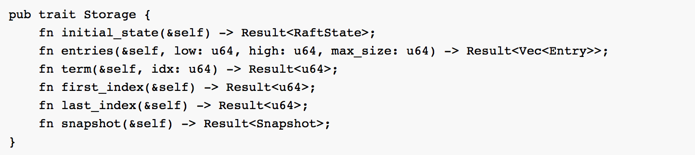
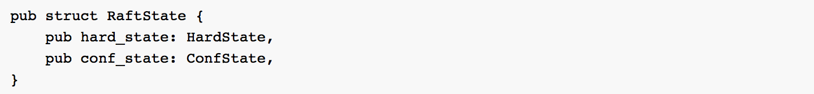
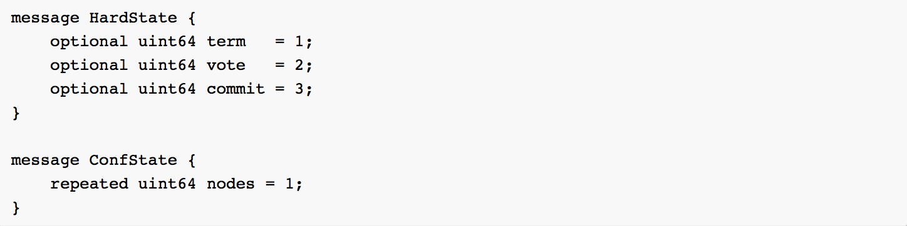
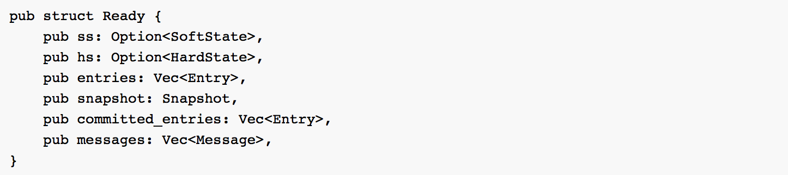

> 本系列文章主要面向 TiKV 社区开发者，重点介绍 TiKV 的系统架构，源码结构，流程解析。目的是使得开发者阅读之后，能对 TiKV 项目有一个初步了解，更好的参与进入 TiKV 的开发中。

> 需要注意，TiKV 使用 Rust 语言编写，用户需要对 Rust 语言有一个大概的了解。另外，本系列文章并不会涉及到 TiKV 中心控制服务 Placement Driver(PD) 的详细介绍，但是会说明一些重要流程 TiKV 是如何与 PD 交互的。

> TiKV 是一个分布式的 KV 系统，它采用 Raft 协议保证数据的强一致性，同时使用 MVCC + 2PC 的方式实现了分布式事务的支持。

## 架构

TiKV 的整体架构比较简单，如下：

TiKV 架构

**Placement Driver :** Placement Driver (PD) 负责整个集群的管理调度。

**Node :** Node 可以认为是一个实际的物理机器，每个 Node 负责一个或者多个 Store。

**Store :** Store 使用 RocksDB 进行实际的数据存储，通常一个 Store 对应一块硬盘。

**Region :** Region 是数据移动的最小单元，对应的是 Store 里面一块实际的数据区间。每个 Region会有多个副本（replica），每个副本位于不同的 Store ，而这些副本组成了一个 Raft group。

## Raft

TiKV 使用 Raft 算法实现了分布式环境下面数据的强一致性，关于 Raft，可以参考论文 “In Search of an Understandable Consensus Algorithm” 以及官网，这里不做详细的解释。简单理解，Raft 是一个 replication log + State Machine 的模型，我们只能通过 leader 进行写入，leader 会将 command 通过 log 的形式复制到 followers，当集群的大多数节点都收到了这个 log，我们就认为这个 log 是 committed，可以 apply 到 State Machine 里面。

TiKV 的 Raft 主要移植 etcd Raft，支持 Raft 所有功能，包括：

+ Leader election
+ Log replicationLog compaction
+ Membership changesLeader transfer
+ Linearizable / Lease read

这里需要注意，TiKV 以及 etcd 对于 membership change 的处理，跟 Raft 论文是稍微有一点不一样的，主要在于 TiKV 的 membership change 只有在 log applied 的时候生效，这样主要的目的是为了实现简单，但有一个风险在于如果我们只有两个节点，要从里面移掉一个节点，如果一个 follower 还没收到 ConfChange 的 log entry，leader 就当掉并且不可恢复了，整个集群就没法工作了。所以通常我们都建议用户部署 3 个或者更多个奇数个节点。

Raft 库是一个独立的库，用户也可以非常方便的将其直接嵌入到自己的应用程序，而仅仅只需要自行处理存储以及消息的发送。这里简单介绍一下如何使用 Raft，代码在 TiKV 源码目录的 /src/raft 下面。

### Storage

首先，我们需要定义自己的 Storage，Storage 主要用来存储 Raft 相关数据，trait 定义如下：

我们需要实现自己的 Storage trait，这里详细解释一下各个接口的含义：

initial_state：初始化 Raft Storage 的时候调用，它会返回一个 RaftState，RaftState 的定义如下：

HardState 和 ConfState 是 protobuf，定义：

在 HardState 里面，保存着该 Raft 节点最后一次保存的 term 信息，之前 vote 的哪一个节点，以及已经 commit 的 log index。而 ConfState 则是保存着 Raft 集群所有的节点 ID 信息。

在外面调用 Raft 相关逻辑的时候，用户需要自己处理 RaftState 的持久化。

**entries:** 得到 [low, high) 区间的 Raft log entry，通过 max_size 来控制最多返回多少个 entires。

**term，first_index** 和 **last_index** 分别是得到当前的 term，以及最小和最后的 log index。

**snapshot：** 得到当前的 Storage 的一个 snapshot，有时候，当前的 Storage 数据量已经比较大，生成 snapshot 会比较耗时，所以我们可能得在另一个线程异步去生成，而不用阻塞当前 Raft 线程，这时候，可以返回 SnapshotTemporarilyUnavailable 错误，这时候，Raft 就知道正在准备 snapshot，会一段时间之后再次尝试。

需要注意，上面的 Storage 接口只是 Raft 库需要的，实际我们还会用这个 Storage 存储 raft log 等数据，所以还需要单独提供其他的接口。在 Raft storage.rs 里面，我们提供了一个 MemStorage，用于测试，大家也可以参考 MemStorage 来实现自己的 Storage。

### Config

在使用 Raft 之前，我们需要知道 Raft 一些相关的配置，在 Config 里面定义，这里只列出需要注意的：

**id:** Raft 节点的唯一标识，在一个 Raft 集群里面，id 是不可能重复的。在 TiKV 里面，id 的通过 PD 来保证全局唯一。

**election_tick：** 当 follower 在 election_tick 的时间之后还没有收到 leader 发过来的消息，那么就会重新开始选举，TiKV 默认使用 50。

**heartbeat_tick:** leader 每隔 hearbeat_tick 的时间，都会给 follower 发送心跳消息。默认 10。

**applied:** applied 是上一次已经被 applied 的 log index。

**max_size_per_msg:** 限制每次发送的最大 message size。默认 1MB。

**max_inflight_msgs:** 限制复制时候最大的 in-flight 的 message 的数量。默认 256。

这里详细解释一下 tick 的含义，TiKV 的 Raft 是定时驱动的，假设我们每隔 100ms 调用一次 Raft tick，那么当调用到 headtbeat_tick 的 tick 次数之后，leader 就会给 follower 发送心跳。

### RawNode

我们通过 RawNode 来使用 Raft，RawNode 的构造函数如下：

我们需要定义 Raft 的 Config，然后传入一个实现好的 Storage，peers 这个参数只是用于测试，实际要传空。生成好 RawNode 对象之后，我们就可以使用 Raft 了。我们关注如下几个函数：

**tick:** 我们使用 tick 函数定期驱动 Raft，在 TiKV，我们每隔 100ms 调用一次 tick。

**propose:** leader 通过 propose 命令将 client 发过来的 command 写入到 raft log，并复制给其他节点。

**propose_conf_change:** 跟 propose 类似，只是单独用来处理 ConfChange 命令。

**step:** 当节点收到其他节点发过来的 message，主动调用驱动 Raft。

**has_ready:** 用来判断一个节点是不是 ready 了。

**ready:** 得到当前节点的 ready 状态，我们会在之前用 has_ready 来判断一个 RawNode 是否 ready。

**apply_conf_change:** 当一个 ConfChange 的 log 被成功applied，需要主动调用这个驱动 Raft。

**advance:** 告诉 Raft 已经处理完 ready，开始后续的迭代。

对于 RawNode，我们这里重点关注下 ready 的概念，ready 的定义如下：

**ss:** 如果 SoftState 变更，譬如添加，删除节点，ss 就不会为空。

**hs:** 如果 HardState 有变更，譬如重新 vote，term 增加，hs 就不会为空。

**entries:** 需要在 messages 发送之前存储到 Storage。

**snapshot:** 如果 snapshot 不是 empty，则需要存储到 Storage。

**committed_entries:** 已经被 committed 的 raft log，可以 apply 到 State Machine 了。

**messages:** 给其他节点发送的消息，通常需要在 entries 保存成功之后才能发送，但对于 leader 来说，可以先发送 messages，在进行 entries 的保存，这个是 Raft 论文里面提到的一个优化方式，TiKV 也采用了。

当外部发现一个 RawNode 已经 ready 之后，得到 Ready，处理如下：

1. 持久化非空的 ss 以及 hs。
2. 如果是 leader，首先发送 messages。
3. 如果 snapshot 不为空，保存 snapshot 到 Storage，同时将 snapshot 里面的数据异步应用到 State Machine（这里虽然也可以同步 apply，但 snapshot 通常比较大，同步会 block 线程）。
4. 将 entries 保存到 Storage 里面。
5. 如果是 follower，发送 messages。
6. 将 committed_entries apply 到 State Machine。
7. 调用 advance 告知 Raft 已经处理完 ready。

##### -第一部分完结-
