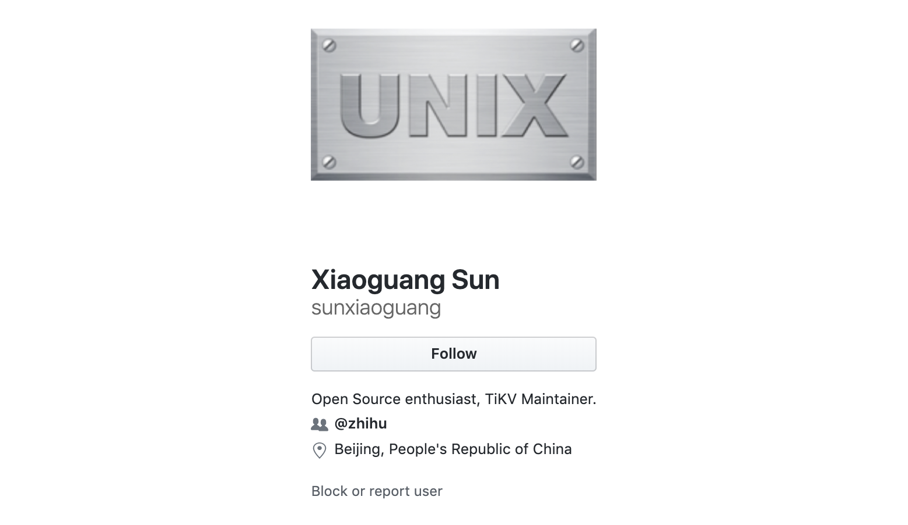

知乎技术平台团队负责人孙晓光有一个新的身份：开源分布式事务 Key-Value 数据库 TiKV项目的 Maintainer。Maintainer 是 TiDB/TiKV 开源社区的角色之一，是社区中较高级别的代码贡献者，项目的规划和设计者，拥有合并主干分支的权限。一般来说从开始贡献代码的 Contributor 成长为 Maintainer，最明显的变化是，对项目有更全局、深入的了解，对项目未来的发展也有独到、准确的见解。

孙晓光觉得，其实从 Contributor 到 Committer 再到最后成为 Maintainer 这个过程，最大的感受是自己逐渐融入到了 TiKV 社区中，真正有了归属感。今天我们就带着 TiDB/TiKV 社区伙伴们的期待，和孙晓光聊了聊，打探了一下他成为 Maintainer 的经历，以及对 TiKV 社区未来的想法。

## 初识：寻找原生的分布式存储方案

***> 与 TiKV 项目初识，其实是带着明确的目标的。***

孙晓光 2007 年毕业回国，当时国内刚开始做云，他进入一家做私有云的公司，从事私有云相关产品开发工作 7 年多时间，他坦言，这段工作经历让他个人积累了许多云相关底层系统的工作经验，这也是他对平台类技术比较感兴趣的核心原因。2017 年孙晓光加入知乎。
刚到知乎时，他负责已读服务的开发，知乎的存储层采用的还是 MySQL 分库分表技术方案。“项目上线后，就我个人而言是难以接受这种方案的，于是我就开始寻找原生的分布式存储系统来替代它。借此机会我尝试了 TiKV，在测试的过程中我发现一些性能有改善的空间，于是我就边测试边上手做了一些优化工作，最后提了一个大 PR 上去。PR 提出后，PingCAP 首席架构师唐刘很快就跟我建立了联系，慢慢的我也进入到了 TiKV 社区当中。这就是我第一次接触 TiKV 的经历。”

## 更加理解「开源社区」

***> 我对开源社区的理解更加清晰了。***

孙晓光以前也用过很多开源软件，但是当时并没有深刻理解开源的价值。**开源的第一目标应该是对别人有帮助、有价值，这个目标就已经拦住了无数的开源项目**。很多项目仅仅把代码开放出来，但是没有任何后续的支持与维护，在这样的情况下社区是无法发展的，自然也难以为他人创造价值。

“**其实当你持续的认真投入到开源后，项目和社区就会产生双向的交流，不再只是你单向的投入，社区也会给予你反哺，这时就会形成正向循环，对项目发展会起到非常大的推动作用**。我对开源的理解正是在 TiKV 社区慢慢建立起来的，TiKV 有一个非常开放友好的社区，PingCAP 和社区伙伴们热心的帮助及鼓励让我切身感受到活跃的开源社区所具有的独特魅力。在参与共建社区的过程中，我不但学习到了如何同开源社区中众多优秀的贡献者更加高效的交流，同时也对开源的价值理念和开源在基础软件领域的重大意义有了更加深入的理解。”

## 「持续贡献，长期活跃」的动力何在？

***> 硬核的项目 + 开放的氛围***

过去多年在云方向的工作经历让孙晓光坚定的相信，云是未来的趋势，而 TiKV 作为云原生架构中承载状态的基石组件，它的重要程度毋庸置疑。作为一个技术控，TiKV 这样一个既硬核口碑又很好的项目很自然地吸引着他。同时 TiKV 社区互帮互助、开放共赢的良好氛围也是孙晓光持续参与社区建设的重要动力。

“之前也为其他开源项目做过贡献，可能是这些项目对社区建设并没有投入太多精力，大部分的 PR 合并完成就没有后续了。但是在 TiKV 社区，我感受到当我参与社区后，后续会有很多追踪的动作，这会激励我保持兴趣，持续在社区中去做贡献。同时在这个过程中，我也在社区中学习了很多知识，得到了很多帮助，这也是我长期坚持在 TiKV 社区中保持活跃的一个重要原因。”

迄今为止，孙晓光已经为 TiDB/TiKV 项目贡献了 18 个 PR，[推动了 TiKV  重要功能 Follower Read 的开发和落地](https://pingcap.com/blog-cn/zhihu-the-story-of-contributing-to-tidb-community/)，这个功能同时也解决了知乎业务场景中极端热点数据访问的吞吐问题。他在一年中完成了 Contributor -> Committer -> Maitainer 的角色升级，可谓是开挂式的速度，但他并没有就此止步，而是开启了一个新的挑战。

## 新的挑战

今天 TiKV Engine SIG（SIG = Special Interest Group）正式成立，这是 TiKV 项目成立的第二个 SIG 社区组织，孙晓光将作为第一个非 PingCAP 的 SIG TechLead，将与其他 TechLead 一起，组织大家推动 TiKV Engine 的相关开发和完善。

对于 TiKV Engine SIG，孙晓光非常兴奋。

“我认为 TiKV 非常适合 SIG 这个模式，因为 TiKV 是一个非常庞大且复杂的系统，进入的门槛很高，并且它还在以飞快的速度继续演进着。在这样一个庞大的系统里，想让大家参与进来其实是非常有难度的。**但 SIG 可以为大家创造一个更容易参与的小环境，且在这个小环境中是有组织有领导的，有人会帮助大家指方向，指导大家要做什么样的事情，这样一方面降低社区参与 TiKV 建设的门槛，另外一方面也可以更好的将对特定领域有经验且感兴趣的伙伴们聚集起来，高效的推进 TiKV 每一个关键方向的前进速度。**

在我个人看来，存储引擎是 TiKV 中最关键的组件之一，它影响着整个系统的稳定性、功能特性以及性能表现。相信 Engine SIG 成立后，我们可以清晰的定义存储引擎同 TiKV 其它部分的契约，提供强大且易用的存储引擎抽象，借助 TiKV 完备的分布式能力，我们可以为 TiKV 拓展更多的领域和可能。”

TiKV Engine SIG 是主要职责是对 TiKV 的存储引擎的未来发展进行讨论和规划，并进行相关开发和维护。目前 TiKV 仅支持默认存储引擎 RocksDB，但是通过扩展接口，希望未来 TiKV 可以支持更多的存储引擎。近期 Engine SIG 的工作会围绕在对 TiKV 已有存储引擎的改进上面。

>*关于 TiKV Engine SIG  的更多信息，感兴趣的朋友们可以查看 [这篇文章](https://pingcap.com/blog-cn/tikv-engine-sig-introduction)，也可以加入 Slack [#engine-sig](https://tikv-wg.slack.com/?redir=%2Fmessages%2Fengine-sig
) 和孙晓光等社区伙伴们一起讨论。*

## 期望

作为 TiKV & TiDB 重度粉丝，孙晓光希望在未来能更好的促进「知乎」和 TiKV 社区的共建。一方面依托 TiKV 社区的进步为「知乎」的业务发展提供更好的支撑基础，同时希望能够基于「知乎」的业务场景为 TiKV 的发展提供足够大的施展空间。

“我非常希望我们的团队也能够真正参与进来，成为社区的贡献者。相信未来 TiKV 能够保持开放共赢的风格，建设更成熟更大规模的社区。我们这些社区伙伴会一起推动 TiKV 的高速持续发展，让 TiKV 成为未来有状态系统基石的第一选择。” 

>
>
>TiKV 是一个开源的分布式事务 Key-Value 数据库，支持跨行 ACID 事务，同时实现了自动水平伸缩、数据强一致性、跨数据中心高可用和云原生等重要特性。作为一个基础组件，TiKV 可作为构建其它系统的基石。目前，TiKV 已用于支持分布式 HTAP 数据库—— TiDB 中，负责存储数据，并已被多个行业的领先企业应用在实际生产环境。2019 年 5 月，CNCF 的 TOC（技术监督委员会）投票决定接受 TiKV 晋级为孵化项目。
>
>源码地址：https://github.com/tikv/tikv
>
>更多信息：https://tikv.org

