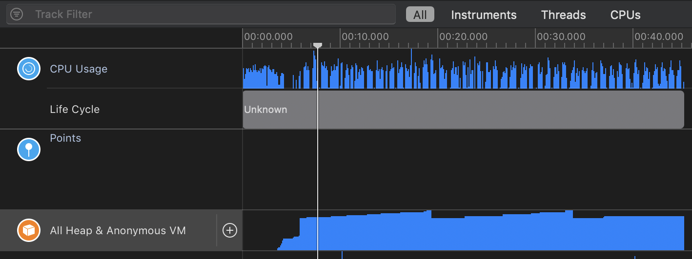
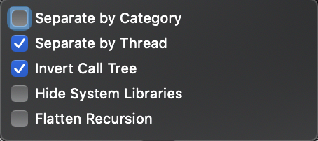
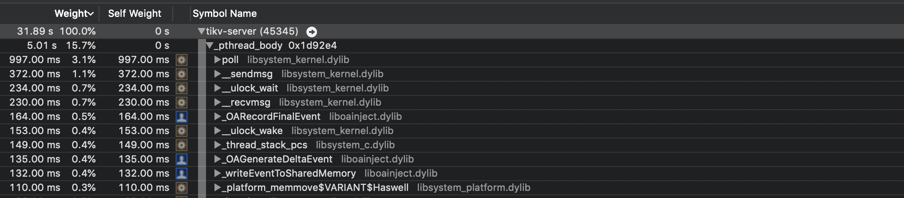
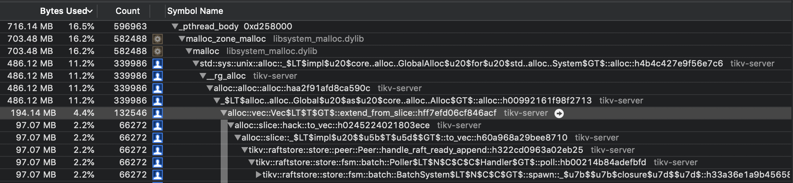
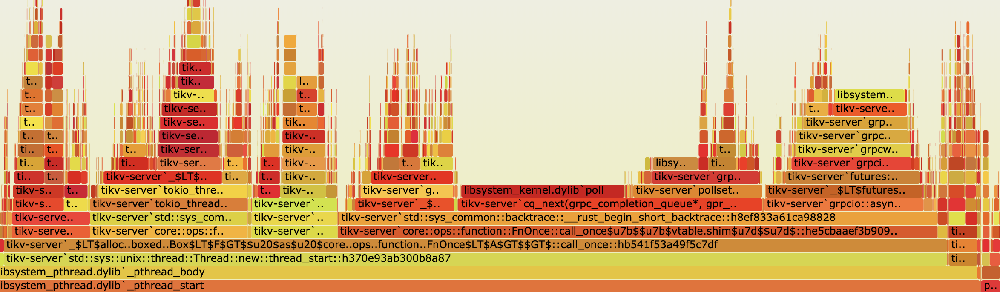
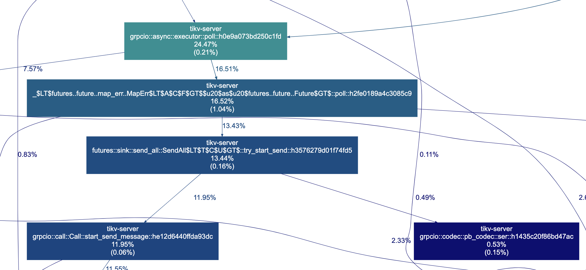
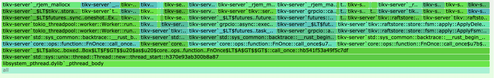
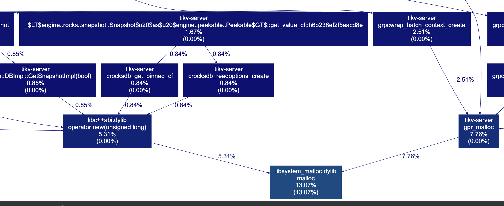

在多数时候，我们都只会在 Linux 系统上面去运行 TiKV，所以很多的调优经验都是基于 Linux 的，譬如如何使用 perf，如果使用 bcc 相关的工具，还有 ftrace 和 eBPF 这些，但在我们 team，很多同学的开发机是基于 Mac OSX，所以这里就出现了一个不方便的场景，大家在 Mac 上面给 TiKV 开发了 feature，想看看效果好不好，可能就需要登录到 Linux 服务器上面去运行，再用工具看看是否有性能问题。

多数时候，我们其实不需要进行那种超大规模压力的性能测试，很多问题通过常规量小的性能测试就能够跑出来，加上现在大家的 Mac 机器配置其实是非常的好，所以我一直觉得如果很多工作能在 Mac 上面去解决，就不需要再额外跑到服务器上面去折腾了。其实，Mac 上面早就给我们提供了非常强大的工具。

## Instruments

如果要看性能问题，Instruments 应该是第一个选择，而它的使用非常简单，我们只需要启动 Instruments，然后选择要监控的应用，以及要执行的 profiling 就可以了。通常，我都会选择 Time Profiler，以及 Allocation 这两个 profiling，一个用来看 CPU，一个用来看 memory。这里需要注意，对于 TiKV，我们需要使用 system 的 allocator，如果用 jemalloc，Instruments 是没法 probe 到的。



通常，无论 CPU 还是 memory，在 CallTree 那边我都会使用按照 thread 来，以及 Invert Call Tree，这样更方便查看一点：



下面是 CPU 和 Memory 的截图，我们能明显的看出来程序哪里使用的最多，方便我们做后续的优化：





## DTrace

可以看到，使用 Instruments 能非常方便的去 profile TiKV，后面这会作为我自己优化 TiKV 的一个常规手段，毕竟真的挺方便的。不过有时候，如果我想把相关的结果发给其他同学，使用 Instruments 就不太方便了，在之前的版本里面 Instruments 还支持导出成 CSV 格式，然后通过 Flamegraph 工具生成火焰图，但现在貌似没这个功能了。如果有的话，请麻烦联系我，至少我是没找到的。

幸好，除了 Instruments，Mac 上面还有一种更强大的方案，也就是 DTrace，其实 Instruments 很多功能都是基于 DTrace 的。关于 DTrace 的语法，大家可以自行 Google，这里不做过多讨论，没准以后我会写一个简单的 DTrace 教程。

### CPU

下面是使用 DTrace 来 profile CPU 的脚本：

```
sudo dtrace -x ustackframes=100 -n 'profile-97 /pid == $target/ { @[ustack()] = count(); } tick-60s { exit(0); }' -p $1 -o out.user_stacks
```

上面我们采样的周期是 97Hz，会记录采样的 user stack 以及对应的次数，执行 60s，然后将结果输出到文件。

然后我们在通过 Flamegraph 生成火焰图：

```
./stackcollapse.pl < out.user_stacks | ./FlameGraph/flamegraph.pl > user.svg
```

大概是下图的样子：



当然，我们也可以使用 Dot Graph，因为官方的 [gprof2dot](https://links.jianshu.com/go?to=https%3A%2F%2Fgithub.com%2Fjrfonseca%2Fgprof2dot) 工具并不支持 DTrace，所以这里需要使用我 folk 的[版本](https://links.jianshu.com/go?to=https%3A%2F%2Fgithub.com%2Fsiddontang%2Fgprof2dot%2F)。另外，还需要注意一个问题是 DTrace 的输出可能是 latin 字符，但 gprof2dot 需要使用 UTF8 的，这里我们要强制转换一下：

```
iconv -f ISO-8859-1 -t UTF-8 out.user_stacks | gprof2dot.py -f dtrace
```

生成的图类似：



### Memory

除了 CPU，另一个我比较关心的自然就是 Memory 了，不过 Memory 就要复杂一点。在前面说过，Instruments 需要 TiKV 使用 system allocator，但有时候我不想这么麻烦，还是想继续用 jemalloc，这时候 Instruments 就 probe 不到了，但用 DTrace 就可以，我们只需要显示的让 DTrace 去 probe 相关的 jemalloc 函数就行，大概脚本如下：

```
pid$1::_rjem_mallocx:entry
{
    self->trace = 1;
    self->size = arg0;
}

pid$1::_rjem_mallocx:return
/self->trace == 1/
{
    @stacks[ustack(10)] = count();
    
    self->trace = 0;
    self->size = 0;
}

pid$1::_rjem_rallocx:entry
{
    self->trace = 1;
    self->size = arg0;
}

pid$1::_rjem_rallocx:return
/self->trace == 1/
{
    @stacks[ustack(10)] = count();
    
    self->trace = 0;
    self->size = 0;
}
```

上面就是 probe 了 jemalloc 的 mallocx 和 reallocx 两个函数，`@stacks[ustack(10)] = count()` 这个是记录次数，如果想记录 mem 总的 size，可以使用 `@stacks[ustack(10)] = sum(self->size)`。

我们仍然可以通过 Flamegraph 工具以及 gprof2dot 工具来生成火焰图和 Dot Graph，命令如下：

```
iconv -f ISO-8859-1 -t UTF-8 out.mem_stacks| ./gprof2dot.py -f dtrace | dot -Tsvg -o mem_graph.svg
./FlameGraph/stackcollapse.pl < out.mem_stacks | ./FlameGraph/flamegraph.pl --color=mem  > mem.svg
```

大概生成的样子如下图：





具体可以参考 [这篇文章](https://gist.github.com/siddontang/af37155035a5d5641e6a601fef661f4c) 在 Mac 上面安装使用相关的工具。悲催的是，DTrace 虽然强大，但 Mac 最近的版本，引入了更强大的安全机制 - System Integrity Protection (SIP) ，导致很多 DTrace 的功能不能使用，所以我们要先关掉 SIP，可以参考 [这篇文章](http://jimtechstuff.blogspot.com/2015/10/dtrace-broken-under-el-capitan.html)，不过幸运的是，上面提到的 CPU 和 Memory 的 tracing 是能直接使用的，所以并不需要关闭 SIP。

## 总结

上面介绍了几个在 Mac 上面进行性能调优的手段，这已经能解决我们很多的问题了，但考虑到 Linux 和 Mac 在一些地方不一样，譬如网络编程上面，epoll 和 kqueue 的区别等，所以我们仍然需要掌握在 Linux 上面调优的方法。

如果大家仔细观察，其实会发现，无论是 DTrace，还是 SystemTap，甚至是 eBPF，它们都非常类似，所以你非常容易就能掌握这些工具，无论是 Mac 还是 Linux，对于性能问题，都能游刃有余的处理。

不过写到最后，我愈发的喜欢 Go 了，原生提供了 pprof 这个强大的工具，何必像 Rust 这么折腾了。
