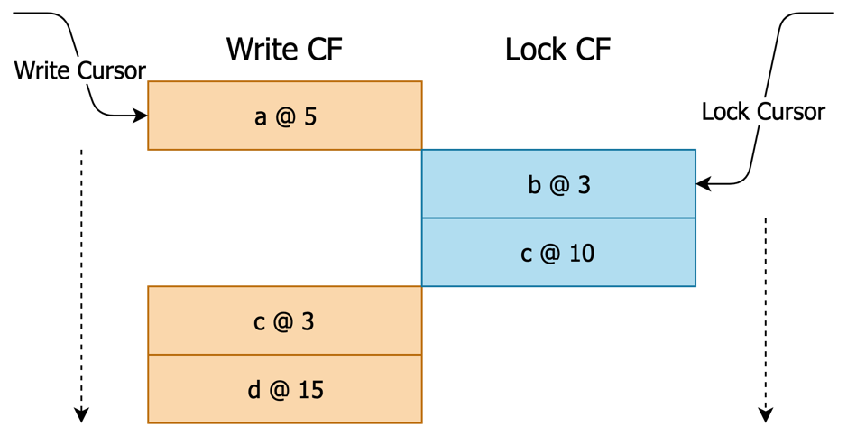
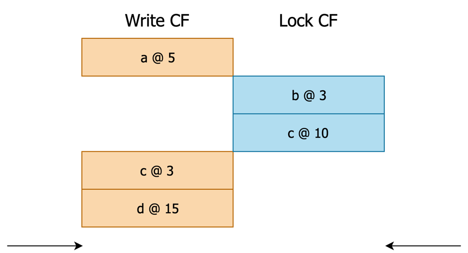
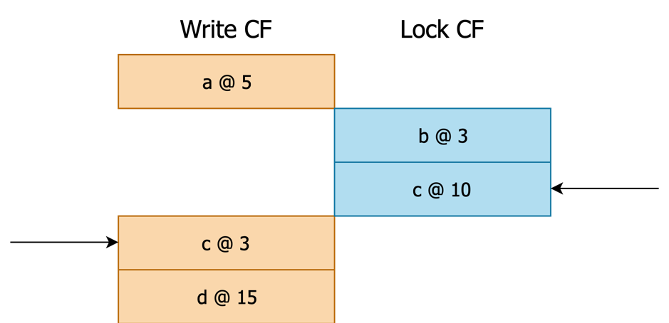
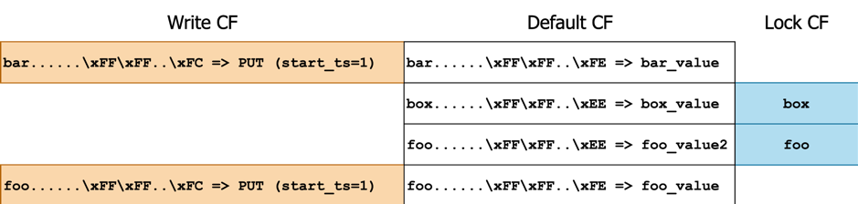
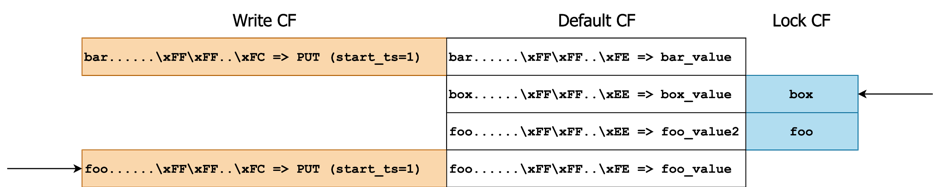
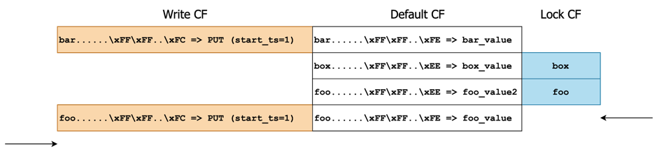

在 [《TiKV 源码解析系列文章（十二）分布式事务》](https://pingcap.com/blog-cn/tikv-source-code-reading-12/) 中，我们介绍了如何在满足事务特性的要求下进行数据写入。本文将介绍数据读取的流程。由于顺序扫（Forward Scan）比较具有代表性，因此本文只介绍顺序扫的流程，而不会介绍点查或逆序扫。点查是顺序扫的简化，相信读者理解了顺序扫的流程后能自己想出点查的实现，而逆序扫与顺序扫也比较类似，主要区别在于从后向前扫，稍复杂一些，相信大家在阅读本文后，也能自己对照着代码读懂逆序扫的实现。

## 数据格式

首先回忆一下事务写入完成后，[在 RocksDB 层面存储的具体是什么样的数据](https://tikv.org/deep-dive/distributed-transaction/percolator/#percolator-in-tikv)：

| CF | RocksDB Key | RocksDB Value |
|:----|:-------------|:---------------|
| Lock | `user_key` | `lock_info` |
| Default | `{user_key}{start_ts}` | `user_value` |
| Write | `{user_key}{commit_ts}` | `write_info` |

其中：

- 为了消除歧义，约定 User Key (`user_key`) 指 TiKV Client（如 TiDB）所写入的或所要读取的 Key，User Value (`user_value`) 指 User Key 对应的 Value。
- `lock_info` 包含 lock type、primary key、timestamp、ttl 等信息，见 [`src/storage/mvcc/lock.rs`](https://github.com/tikv/tikv/blob/1924a32376b7823c3faa0795f53e836e65eb9ff0/src/storage/mvcc/lock.rs)。
- `write_info` 包含 write type、start_ts 等信息，见 [`src/storage/mvcc/write.rs`](https://github.com/tikv/tikv/blob/1924a32376b7823c3faa0795f53e836e65eb9ff0/src/storage/mvcc/write.rs)。

## 事务样例

为了便于大家理解代码，我们假设 TiKV Client 之前进行了下面这些事务：

| 事务号  | start_ts | commit_ts | KV |
|:--------|:----------|:-----------|:----|
| #1     | 0x01     | 0x03      | `PUT foo => foo_value`, `PUT bar => bar_value` |
| #2     | 0x11     | 0x13      | `PUT foo => foo_value2`, `PUT box => box_value` |
| #3     | 0x21     | 0x23      | `DELETE abc` |
| #4     | 0x31     | 0x33      | `DELETE box` |

> 注意，TiDB 向 TiKV 写入的 Key（及上面的 user_key）并不会长成 foo、abc、box 这样，而大部分会是 `tXXXXXXXX_rXXXXXXXX` 或 `tXXXXXXXX_iXXXXXXXX` 的格式。但 Key 的格式并不影响 TiKV 的逻辑处理，所以我们这里仅采用简化的 Key 作为样例。Value 同理。

每个事务 Prewrite 并 Commit 完毕后，落到 RocksDB 上的数据类似于这样：

- 事务 #1：

    | Write Key   | Write Value | Default Key | Default Value |
    |:-------------|:-------------|:-------------|:---------------|
    | `{foo}{0x03}`  | type=PUT, start_ts=0x01 | `{foo}{0x01}`  | `foo_value`     |
    | `{bar}{0x03}`  | type=PUT, start_ts=0x01 | `{bar}{0x01}`  | `bar_value`     |

- 事务 #2：

    | Write Key     | Write Value  | Default Key  | Default Value  |
    |:--------------|:-------------|:-------------|:---------------|
    | `{foo}{0x13}`  | type=PUT, start_ts=0x11 | `{foo}{0x11}`  | `foo_value2`   |
    | `{box}{0x13}`  | type=PUT, start_ts=0x11 | `{box}{0x11}`  | `box_value`    |

- 事务 #3：

    | Write Key   | Write Value | Default Key | Default Value |
    |:-------------|:-------------|:-------------|:---------------|
    | `{abc}{0x23}` | type=DELETE, start_ts=0x21 |             |               |

- 事务 #4：

    | Write Key   | Write Value | Default Key | Default Value |
    |:-------------|:-------------|:-------------|:---------------|
    | `{box}{0x33}` | type=DELETE, start_ts=0x31 |             |               |

实际在 RocksDB 中存储的数据与上面表格里写的略微不一样，主要区别有：

1. TiKV Raft 层会修改实际写入 RocksDB 的 Key（例如增加前缀 `z`）以便进行数据区分。对于 MVCC 和事务来说这个操作是透明的，因此我们先忽略这个。

2. User Key 会被按照 Memory Comparable Encoding 方式进行编码，编码算法是以 8 字节为单位进行 Padding。这个操作确保了我们在 User Key 后面追加 `start_ts` 或 `commit_ts` 之后实际写入的 Key 能保持与 User Key 具有相同的顺序。

    例如，假设我们依次写入 `abc`、`abc\x00..\x00` 两个 User Key，在不进行 Padding 的情况下：

    | User Key         | Start Ts | 写入的 Key       |
    |:------------------|:----------|:-----------------|
    | `abc`            | 0x05     | `abc\x00\x00..\x05` |
    | `abc\x00..\x00`  | 0x10     | `abc\x00\x00..\x00\x00\x00..\x10` |

    可见，User Key 顺序是 `abc < abc\x00..\x00`，但写入的 Key 顺序却是 `abc\x00\x00..\x05 > abc\x00\x00..\x00\x00\x00..\x10`。显然，在这之后，我们若想要有序地扫数据就会面临巨大的挑战。因此需要对 User Key 进行编码：

    Example 1:

    ```text
    User Key:      abc
    Encoded:       abc\x00\x00\x00\x00\x00\xFA
                  ^^^                    ^^^^
                  Key                    Pad=5
                     ^^^^^^^^^^^^^^^^^^^^
                     Padding
    ```

    Example 2:

    ```text
    User Key:      abc\x00\x00\x00\x00\x00\x00\x00\x00
    Encoded[0..9]: abc\x00\x00\x00\x00\x00\xFF
                  ^^^^^^^^^^^^^^^^^^^^^^^
                  Key[0..8]
                                         ^^^^
                                         Pad=0
    Encoded[9..]:  \x00\x00\x00\x00\x00\x00\x00\x00\xFA
                  ^^^^^^^^^^^^                    ^^^^
                  Key[8..11]                      Pad=5
                              ^^^^^^^^^^^^^^^^^^^^
                              Padding
    ```

    编码后的 Key 无论后面再追加什么 8 字节的 Timestamp，都能保持原来的顺序。

3. TiKV 在 Key 中存储的 Timestamp（无论是 `start_ts` 还是 `commit_ts`）都是 Timestamp 取反后的结果，其目的是让较新的数据（即 Timestamp 比较大的数据）排列在较老的数据（即 Timestamp 比较小的数据）前面。扫数据的流程利用了这个特性优化性能，继续阅读本文可以有所感受。后面本文中关于时间戳的部分将写作 `{!ts}` 来反映这个取反操作。

4. TiKV 对较小（<= 64 字节）的 User Value 会进行优化，不存储在 Default CF 中，而是直接内嵌在 Lock Info 或 Write Info 中，从而加快这类 User Key 的扫的效率及写入效率。我们这个示例先暂且忽略这个优化，就当成 User Value 都很长没有进行内嵌。

## 顺序扫

顺序扫的代码位于 [`src/storage/mvcc/reader/scanner/forward.rs`](https://github.com/tikv/tikv/blob/1924a32376b7823c3faa0795f53e836e65eb9ff0/src/storage/mvcc/reader/scanner/forward.rs)。顺序扫的定义是给定 `scan_ts`、可选的下界 `lower_bound` 与可选的上界 `upper_bound`，需要依次知道在 `[lower_bound, upper_bound)` 范围内所有满足 `scan_ts`（即最新 `commit_ts <= scan_ts`）的数据。扫的过程中可以随时中止，不需要扫出范围内所有数据。

以「事务样例」为例，假设其所有事务都 Commit 后：

- scan_ts = 0x00 顺序扫 `[-∞, +∞)` 可依次扫出：(空)。
- scan_ts = 0x05 顺序扫 `[-∞, +∞)` 可依次扫出：`bar => bar_value`、`foo => foo_value`。
- scan_ts = 0x12 顺序扫 `[-∞, +∞)`，可依次扫出 `bar => bar_value`、`foo => foo_value`。
- scan_ts = 0x15 顺序扫 `[-∞, +∞)` 可依次扫出：`bar => bar_value`、`box => box_value`、`foo => foo_value2`。
- scan_ts = 0x35 顺序扫 `[-∞, +∞)` 可依次扫出：`bar => bar_value`、`foo => foo_value2`。
- scan_ts = 0x05 顺序扫 `[c, +∞)` 可依次扫出：`foo => foo_value`。

假设「事务样例」中事务 #1 已 Commit 而事务 #2 已 Prewrite 未 Commit，此时：

- scan_ts = 0x05 顺序扫 `[-∞, +∞)`，可依次扫出：`bar => bar_value`、`foo => foo_value`。
- scan_ts = 0x12 顺序扫 `[-∞, +∞)`，会先扫出 `bar => bar_value`，若还要继续扫应当返回 `box` 的锁冲突。TiDB 拿到这个错误后会等锁、清锁并重试。

## 顺序扫流程

根据上面所说的顺序扫定义及例子，在不考虑锁冲突的情况下，可以想出一个最简单的实现思路就是不断将 Write CF 的 Cursor 从 `lower_bound` 往后移动，对于各个 User Key 跳过它 `commit_ts > scan_ts` 的版本，采纳第一个 `commit_ts <= scan_ts` 的版本，根据版本 Write Info 从 Default CF 中获取 Value，即可组成返回给上层的 KV 对。

这个思路很简单，但无法处理锁冲突。在有锁冲突的情况下，顺序扫只应当对扫到的数据处理锁冲突，没扫到的数据即使有锁，也不应该影响无冲突数据的正常扫（例如用户的 SQL 中有 limit）。由于不同 User Key（及同一个 User Key 的不同版本）都可能同时散落在 Write CF 与 Lock CF 中，因此 **TiKV 的思路类似于归并排序**：同时移动 Write CF Cursor 与 Lock CF Cursor，在移动过程中这两个 Cursor 可能对应了不同的 User Key，较小的那个就是要优先处理的 User Key。如果这个 User Key 是 Lock CF 中的，说明可能遇到了锁冲突，需要返回失败或忽略。如果这个 User Key 是 Write CF 中的，说明有多版本可以供读取，需要找到最近的一个满足 `scan_ts` 要求的版本信息 Write Info，根据其内部记载的 `start_ts` 再从 Default CF 中获取 Value，从而组成 KV 对返回给上层。



<div class="caption-center">图 1 TiKV 扫数据算法示意</div>

单次迭代的具体流程为：

### 步骤 1.

首次迭代：将 Lock 及 Write CF Cursor Seek 到 `lower_bound` 处。此时它们各自指向了第一个 `>= lower_bound` 的 Key。

```rust
if !self.is_started {
    if self.cfg.lower_bound.is_some() {
        self.write_cursor.seek(
            self.cfg.lower_bound.as_ref().unwrap(),
            ...,
        )?;
        self.lock_cursor.seek(
            self.cfg.lower_bound.as_ref().unwrap(),
            ...,
        )?;
    } else {
        self.write_cursor.seek_to_first(...);
        self.lock_cursor.seek_to_first(...);
    }
    self.is_started = true;
}
```

### 步骤 2.

Lock Cursor 和 Write Cursor 分别指向的 Key 可能对应不同的 User Key（也可能指向空，代表该 CF 已没有更多数据）。比较 Lock Cursor 与 Write Cursor 可得出第一个遇到的 User Key：

```rust
let w_key = if self.write_cursor.valid()? {
    Some(self.write_cursor.key(...))
} else {
    None
};
let l_key = if self.lock_cursor.valid()? {
    Some(self.lock_cursor.key(...))
} else {
    None
};

match (w_key, l_key) { ... }
```

#### 分支 2.1.

Write Cursor 指向空，Lock Cursor 指向空：说明两个 CF 都扫完了，该直接结束了。



<div class="caption-center">图 2 进入本分支的一种情况，若 Seek 的是 e，则处于 Write Cursor 和 Lock Cursor 都指向空的状态</div>

```rust
(current_user_key_slice, has_write, has_lock) = match (w_key, l_key) {
    (None, None) => {
        // Both cursors yield `None`: we know that there is nothing remaining.
        return Ok(None);
    }
    ...
}
```

#### 分支 2.2.

Write Cursor 指向某个值 `w_key`，Lock Cursor 指向空：说明存在一个 `User Key = w_key` 的 Write Info，且没有任何 `>= Start Key` 的 Lock Info。`w_key` 即为第一个遇到的 User Key。

```rust
(current_user_key_slice, has_write, has_lock) = match (w_key, l_key) {
    ...
    (Some(k), None) => {
        // Write cursor yields something but lock cursor yields `None`:
        // We need to further step write cursor to our desired version
        (Key::truncate_ts_for(k)?, true, false)
    }
    ...
}
```

#### 分支 2.3.

Write Cursor 指向空，Lock Cursor 指向某个值 `l_key`：说明存在一个 `User Key = l_key` 的 Lock Info。`l_key` 即是第一个遇到的 User Key。

```rust
(current_user_key_slice, has_write, has_lock) = match (w_key, l_key) {
    ...
    (None, Some(k)) => {
        // Write cursor yields `None` but lock cursor yields something:
        // In RC, it means we got nothing.
        // In SI, we need to check if the lock will cause conflict.
        (k, false, true)
    }
    ...
}
```

#### 分支 2.4.

Write Cursor 指向某个值 `w_key`，Lock Cursor 指向某个值 `l_key`：说明存在一个 `User Key = l_key` 的 Lock Info、存在一个 `User Key = w_key` 的 Write Info。`l_key` 与 `w_key` 中小的那个是第一个遇到的 User Key。


<div class="caption-center">图 3 进入本分支的一种情况，若 Seek 的是 a，则处于 Write Cursor 和 Lock Cursor 都指向某个值的状态</div>

```rust
(current_user_key_slice, has_write, has_lock) = match (w_key, l_key) {
    ...
    (Some(wk), Some(lk)) => {
        let write_user_key = Key::truncate_ts_for(wk)?;
        match write_user_key.cmp(lk) {
            Ordering::Less => {
                // Write cursor user key < lock cursor, it means the lock of the
                // current key that write cursor is pointing to does not exist.
                (write_user_key, true, false)
            }
            Ordering::Greater => {
                // Write cursor user key > lock cursor, it means we got a lock of a
                // key that does not have a write. In SI, we need to check if the
                // lock will cause conflict.
                (lk, false, true)
            }
            Ordering::Equal => {
                // Write cursor user key == lock cursor, it means the lock of the
                // current key that write cursor is pointing to *exists*.
                (lk, true, true)
            }
        }
    }
}
```

### 步骤 3.

如果在步骤 2 中，第一个遇到的 User Key 来自于 Lock，则：

#### 步骤 3.1.

检查 Lock Info 是否有效，例如需要忽略 `start_ts > scan_ts` 的 lock。

```rust
let lock = {
    let lock_value = self.lock_cursor.value(...);
    Lock::parse(lock_value)?
};
match super::util::check_lock(&current_user_key, self.cfg.ts, &lock)? {
    CheckLockResult::NotLocked => {}
    CheckLockResult::Locked(e) => result = Err(e),
    CheckLockResult::Ignored(ts) => get_ts = ts,
}
```

> 我们一般以当前的时间构造 scan_ts，为什么实际看到的似乎是“未来”的 lock？原因是这个读请求可能来自于一个早期开始的事务，或这个请求被网络阻塞了一会儿，或者我们正在[读取历史数据](https://pingcap.com/docs-cn/v3.0/how-to/get-started/read-historical-data/)。

#### 步骤 3.2.

将 Lock Cursor 往后移动一个 Key，以便下次迭代可以直接从新的 Lock 继续。此时 Lock Cursor 指向下一个 Lock（也可能指向空）。

#### 步骤 3.3.

在 3.1 步骤中检查下来有效的话报错返回这个 Lock，TiDB 后续需要进行清锁操作。

### 步骤 4.

如果在步骤 2 中，第一个遇到的 User Key 来自于 Write：

> 注：Lock Cursor 与 Write Cursor 可能一起指向了同一个 User Key 的不同版本。由于我们只想忽略锁对应的版本而不是想忽略这整个 User Key，因此此时步骤 3 和步骤 4 都会被执行，如下图所示。
>
> 
>
> <div class="caption-center">图 4 一种 User Cursor 和 Lock Cursor 具有相同 User Key 的情况，Seek 的是 c</div>

走到了目前这一步，说明我们需要从 Write Info 中读取 User Key 满足 `scan_ts` 的记录。需要注意，此时 User Key 可能是存在 Lock 的，但已被判定为应当忽略。

#### 步骤 4.1.

将 Write Cursor Seek 到 `{w_key}{!scan_ts}` 处（注：参见「事务样例」中区别 3，时间戳存储时取了反，因此这里及本文其余部分都以 `!` 标记取反操作）。如果版本数很少（同时这也符合绝大多数场景），那么这个要 Seek 的 Key 很可能非常靠近当前位置。在这个情况下为了避免较大的 Seek 开销，TiKV 采取先 `next` 若干次再 `seek` 的策略：

```rust
// Try to iterate to `${user_key}_${ts}`. We first `next()` for a few times,
// and if we have not reached where we want, we use `seek()`.

// Whether we have *not* reached where we want by `next()`.
let mut needs_seek = true;

for i in 0..SEEK_BOUND {
    if i > 0 {
        self.write_cursor.next(...);
        if !self.write_cursor.valid()? {
            // Key space ended.
            return Ok(None);
        }
    }
    {
        let current_key = self.write_cursor.key(...);
        if !Key::is_user_key_eq(current_key, user_key.as_encoded().as_slice()) {
            // Meet another key.
            *met_next_user_key = true;
            return Ok(None);
        }
        if Key::decode_ts_from(current_key)? <= ts {
            // Founded, don't need to seek again.
            needs_seek = false;
            break;
        }
    }
}
// If we have not found `${user_key}_${ts}` in a few `next()`, directly `seek()`.
if needs_seek {
    // `user_key` must have reserved space here, so its clone has reserved space too. So no
    // reallocation happens in `append_ts`.
    self.write_cursor
        .seek(&user_key.clone().append_ts(ts), ...)?;
    if !self.write_cursor.valid()? {
        // Key space ended.
        return Ok(None);
    }
    let current_key = self.write_cursor.key(...);
    if !Key::is_user_key_eq(current_key, user_key.as_encoded().as_slice()) {
        // Meet another key.
        *met_next_user_key = true;
        return Ok(None);
    }
}
```

#### 步骤 4.2.

`w_key` 可能没有任何 `commit_ts <= scan_ts` 的记录，因此 Seek `{w_key}{!scan_ts}` 时可能直接越过了当前 User Key 进入下一个 `w_key`，因此需要先判断一下现在 Write Cursor 对应的 User Key 是否仍然是 `w_key`。如果是的话，说明这是我们找到的最大符合 `scan_ts` 的版本（Write Info）了，我们就可以依据该版本直接确定数据内容。若版本中包含的类型是 `DELETE`，说明在这个版本下 `w_key` 或者说 User Key 已被删除，那么我们就当做它不存在；否则如果类型是 `PUT`，就可以按照版本中存储的 `start_ts` 在 Default CF 中直接取得 User Value：Get `{w_key}{!start_ts}`。

另一方面，如果这一步 Seek 到了下一个 `w_key`，我们就不能采信这个新的 `w_key`，什么也不做，回到步骤 2，因为这个新的 `w_key` 可能比 `l_key` 大了，需要先重新看一下 `l_key` 的情况。

```rust
// Now we must have reached the first key >= `${user_key}_${ts}`. However, we may
// meet `Lock` or `Rollback`. In this case, more versions needs to be looked up.
loop {
    let write = Write::parse(self.write_cursor.value(...))?;
    self.statistics.write.processed += 1;

    match write.write_type {
        WriteType::Put => return Ok(Some(self.load_data_by_write(write, user_key)?)),
        WriteType::Delete => return Ok(None),
        WriteType::Lock | WriteType::Rollback => {
            // Continue iterate next `write`.
        }
    }

    ...
}
```

#### 步骤 4.3.

此时我们已经知道了 `w_key`（即 User Key）符合 `scan_ts` 版本要求的 Value。为了能允许后续进一步迭代到下一个 `w_key`，我们需要移动 Write Cursor 跳过当前 `w_key` 剩余所有版本。跳过的方法是 Seek `{w_key}{\xFF..\xFF}`，此时 Write Cursor 指向第一个 `>= {w_key}{\xFF..\xFF}` 的 Key，也就是下一个 `w_key`。

```rust
fn move_write_cursor_to_next_user_key(&mut self, current_user_key: &Key) -> Result<()> {
    for i in 0..SEEK_BOUND {
        if i > 0 {
            self.write_cursor.next(...);
        }
        if !self.write_cursor.valid()? {
            // Key space ended. We are done here.
            return Ok(());
        }
        {
            let current_key = self.write_cursor.key(...);
            if !Key::is_user_key_eq(current_key, current_user_key.as_encoded().as_slice()) {
                // Found another user key. We are done here.
                return Ok(());
            }
        }
    }
    // We have not found another user key for now, so we directly `seek()`.
    // After that, we must pointing to another key, or out of bound.
    // `current_user_key` must have reserved space here, so its clone has reserved space too.
    // So no reallocation happens in `append_ts`.
    self.write_cursor.internal_seek(
        &current_user_key.clone().append_ts(0),
        ...,
    )?;
    Ok(())
}
```

#### 步骤 4.4.

依据之前取得的 User Value 返回 (User Key, User Value)。

### 步骤 5.

如果没有扫到值，回到 2。

## 样例解释

上面的步骤可能过于枯燥，接下来结合「事务样例」看一下流程。假设现在样例中的事务 #1 已递交而事务 #2 prewrite 完毕但还没 commit，则这几个样例事务在 RocksDB 存储的数据类似于如下所示：



<div class="caption-center">图 5 样例事务在 RocksDB 的存储数据</div>

现在尝试以 scan_ts = 0x05 顺序扫 `[-∞, +∞)`。

- 执行步骤 1：首次迭代：将 Lock 及 Write CF Cursor Seek 到 `lower_bound` 处。

  

  <div class="caption-center">图 6 执行完毕后各个 Cursor 位置示意</div>


- 执行步骤 2：对比 Lock Cursor 与 Write Cursor，进入分支 2.4。

- 执行分支 2.4：Write Cursor 指向 `bar`，Lock Cursor 指向 `box`，User Key 为 `bar`。

- 执行步骤 3：User Key = bar 不来自于 Lock，跳过。

- 执行步骤 4：User Key = bar 来自于 Write，继续。

- 执行步骤 4.1：Seek `{w_key}{!scan_ts}`，即 Seek `bar......\xFF\xFF..\xFA`。Write Cursor 仍然是当前位置。

  

  <div class="caption-center">图 7 执行完毕后各个 Cursor 位置示意</div>


- 执行步骤 4.2：此时 Write Key 指向 bar 与 User Key 相同，因此依据 `PUT (start_ts=1)` 从 Default CF 中获取到 `value = bar_value`。

- 执行步骤 4.3：移动 Write Cursor 跳过当前 `bar` 剩余所有版本，即 Seek `bar......\xFF\xFF..\xFF`：

  

  <div class="caption-center">图 8 执行完毕后各个 Cursor 位置示意</div>


- 执行步骤 4.4：对外返回 Key Value 对 `(bar, bar_value)`。

- 若外部只需要 1 个 KV 对（例如 limit = 1），此时就可以停止了，若外部还要继续获取更多 KV 对，则重新开始执行步骤 1。

- 执行步骤 1：不是首次迭代，跳过。

- 执行步骤 2：对比 Lock Cursor 与 Write Cursor，进入分支 2.4。

- 执行分支 2.4：Write Cursor 指向 `foo`，Lock Cursor 指向 `box`，User Key 为 `box`。

  

  <div class="caption-center">图 9 执行完毕后各个 Cursor 位置示意</div>

- 执行步骤 3：User Key = box 来自于 Lock，继续。

- 执行步骤 3.1：检查 Lock Info。Lock 的 ts 为 0x11，`scan_ts` 为 0x05，忽略这个 Lock 不返回锁冲突错误。

- 执行步骤 3.2：将 Lock Cursor 往后移动一个 Key。

  

  <div class="caption-center">图 10 执行完毕后各个 Cursor 位置示意</div>

- 执行步骤 4：User Key = box 不来自于 Write，跳过，回到步骤 2。

- 执行步骤 2：对比 Lock Cursor 与 Write Cursor，进入分支 2.4。

- 执行分支 2.4：Write Cursor 指向 `foo`，Lock Cursor 指向 `foo`，User Key 为 `foo`。

  

  <div class="caption-center">图 11 执行完毕后各个 Cursor 位置示意</div>

- 执行步骤 3：User Key = foo 来自于 Lock，继续。与之前类似，锁被忽略，且 Lock Cursor 往后移动。

  

  <div class="caption-center">图 12 执行完毕后各个 Cursor 位置示意</div>

- 执行步骤 4：User Key = foo 同样来自于 Write，继续。

- 执行步骤 4.1：Seek `{w_key}{!scan_ts}`，即 Seek `foo......\xFF\xFF..\xFA`。Write Cursor 仍然是当前位置。

- 执行步骤 4.2：此时 Write Key 指向 foo 与 User Key 相同，因此依据 `PUT (start_ts=1)` 从 Default CF 中获取到 `value = foo_value`。

- 执行步骤 4.3：移动 Write Cursor 跳过当前 `foo` 剩余所有版本，即 Seek `foo......\xFF\xFF..\xFF`：

  

  <div class="caption-center">图 13 执行完毕后各个 Cursor 位置示意</div>

- 执行步骤 4.4：对外返回 Key Value 对 `(foo, foo_value)`。

- 若外部选择继续扫，则继续回到步骤 1。

- 执行步骤 1：不是首次迭代，跳过。

- 执行步骤 2：对比 Lock Cursor 与 Write Cursor，进入分支 2.1。

  

  <div class="caption-center">图 14 执行完毕后各个 Cursor 位置示意</div>

- 执行步骤 2.1：Write Cursor 和 Lock Cursor 都指向空，没有更多数据了。

## 总结

以上就是 MVCC 顺序扫数据代码的解析，点查和逆序扫流程与其类似，并且代码注释很详细，大家可以自主阅读理解。下篇文章我们会详细介绍悲观事务的代码实现。
