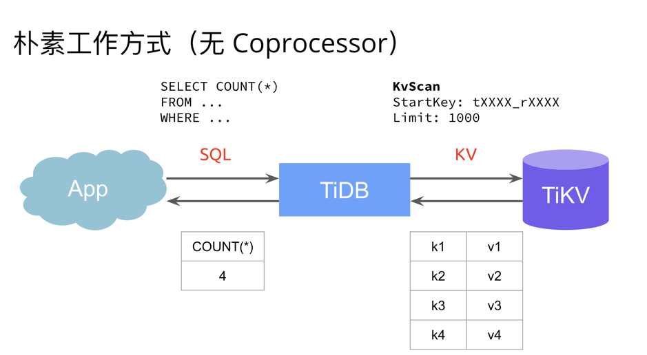
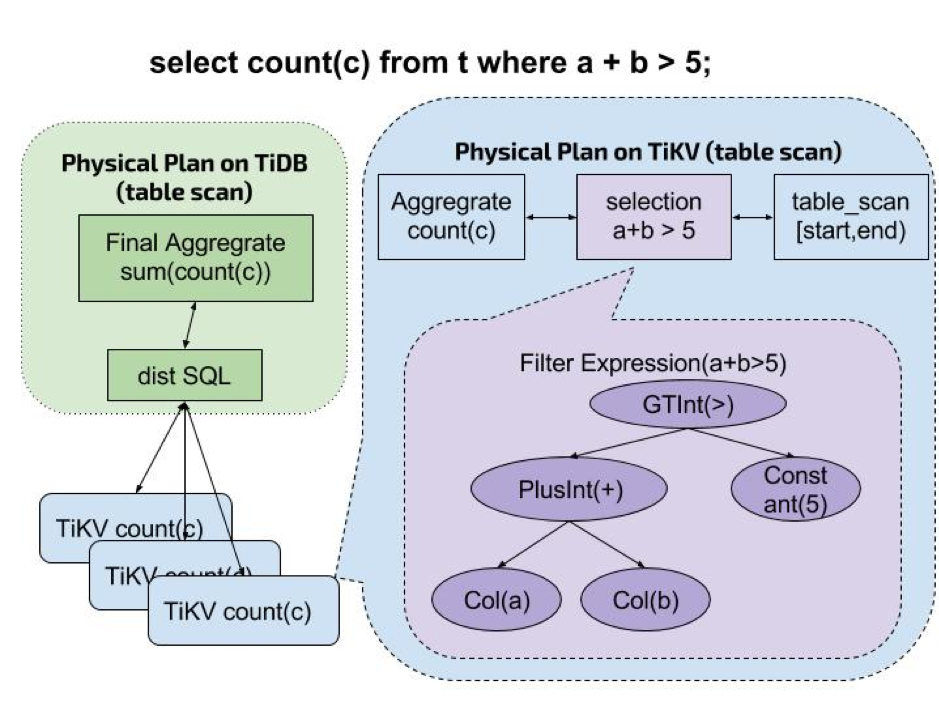
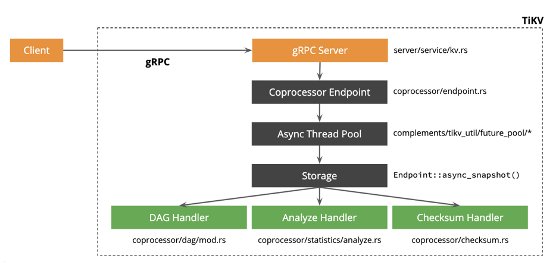
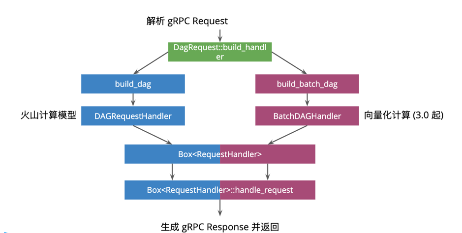
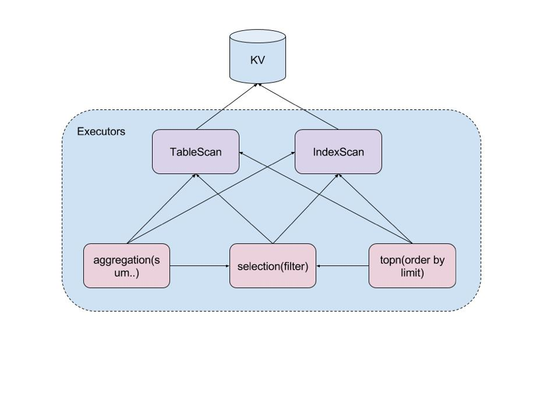
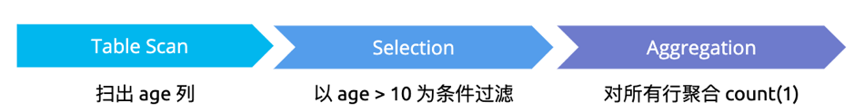

本文将简要介绍 TiKV Coprocessor 的基本原理，面向想要了解 TiKV 数据读取执行过程的同学，同时也面向想对该模块贡献代码的同学。阅读本文前，建议读者对 TiDB 整体架构有所了解，先阅读三篇文章了解 TiDB 技术内幕：[说存储](https://pingcap.com/blog-cn/tidb-internal-1/)、[说计算](https://pingcap.com/blog-cn/tidb-internal-2/)、[谈调度](https://pingcap.com/blog-cn/tidb-internal-3/)。

## 什么是 Coprocessor

熟悉 [TiDB 整体框架](https://pingcap.com/docs-cn/v3.0/overview/) 的同学可能记得，TiDB 是无状态的，数据存储在 TiKV 层。当 TiDB 在收到一个来自客户端的查询请求时，会向 TiKV 获取具体的数据信息。那么一个读请求最朴素的处理过程如下：



首先需要肯定的是这种方式固然能解决问题，但是性能如何呢？我们来一起分析一下：

1.  TiKV  将所有数据返回，网络开销太大。
2.  TiDB 需要计算所有数据，CPU 消耗很大，相对的，TiKV 却并没有什么计算，很闲。

看到以上问题后，聪明如你，可能很容易就想到，能不能让 TiKV 把自己负责的那部分数据做一次计算，再返回给 TiDB 呢？

有何不可呢？

TiKV 读取数据并计算的模块，我们定义为 Coprocessor，该概念灵感来自于 HBase，目前在 TiDB 中的实现类似于 HBase 中的 Coprocessor 的 Endpoint 部分，也可类比 MySQL 存储过程。

有了 Coprocessor 后，从宏观看一个读请求是如何下发到 TiKV 的呢？以下面的请求为例：



如图，以上查询语句在 TiDB 中处理如下：

1.  TiDB 收到查询语句，对语句进行分析，计算出物理执行计划，组织称 TiKV 的 Coprocessor 请求。
2.  TiDB 将该 Coprocessor 请求根据数据的分布，分发到所有相关的 TiKV 上。
3.  TiKV 在收到该 Coprocessor 请求后，根据请求算子对数据进行过滤聚合，然后返回给 TiDB。
4.  TiDB 在收到所有数据的返回结果后，进行二次聚合，并将最终结果计算出来，返回给客户端。

## 主要功能及处理概览

TiKV Coprocessor 处理的读请求目前主要分类三种：

+ DAG：执行物理算子，为 SQL 计算出中间结果，从而减少 TiDB 的计算和网络开销。这个是绝大多数场景下 Coprocessor 执行的任务。
+ Analyze：分析表数据，统计、采样表数据信息，持久化后被 TiDB 的优化器采用。
+ CheckSum：对表数据进行校验，用于导入数据后一致性校验。

那么 TiKV 在收到 Coprocessor 请求后，何时区分这三种请求的呢？



请求到了 TiKV 层，处理过程如下：

+ 由 gRPC server 接收并将请求分发给 Coprocessor Endpoint 进行处理。
+ Endpoint 在收到请求后，根据请求的优先级，将请求分发给对应的线程池。
+ 所有请求会先异步从存储层获取 snapshot，然后开始真正的处理阶段。
+ 根据请求的不同类型，构造不同的 Handler 进行数据的处理。

目前 Coprocessor 支持的三种接口中，后面两种接口相对比较简单，而 DAG 是里面最复杂也是最常用的，所以本文后续将重点介绍 DAG 类请求。

## DAG Request 概览

DAG 顾名思义，是由一系列算子组成的有向无环图，算子在代码中称为 Executors。

目前 DAG 请求主要实现了两种计算模型：

+ 火山模型：每个算子按行按需吐出，3.0 之后开始弃用。
+ 向量化计算模型：每个算子批量化处理数据，3.0 之后开始推广。

在目前的 TiKV master 上，处于火山模型向向量化模型的过度阶段，因而两种计算模型同时存在。TiKV 收到请求时，会优先检测是否可走向量化模型，若部分功能在向量化模型中没有实现，则走旧的计算模型，具体处理逻辑流程如下：



相关代码在：`src/coprocessor/dag/mod.rs`。

因为火山模型已在被弃用中，所以下文我们只讲向量化计算模型。

## 算子概览

在向量化计算模型中，所有算子都实现了 `BatchExecutor`接口，其主要定义了一个 `get_batch` 的函数：

```
pub trait BatchExecutor: Send {
   fn next_batch(&mut self, scan_rows: usize) -> BatchExecuteResult;
}

pub struct BatchExecuteResult {
   pub physical_columns: LazyBatchColumnVec,
   pub logical_rows: Vec<usize>,
   pub is_drained: Result<bool, Error>,
   ...
}
```

参数说明：

+ `next_batch` 中 `scan_rows` 由上层控制，由于扫的数据过多会慢，因此该数字从 32 倍增到 1024。

+ 返回值 `BatchExecuteResult` 中，由于返回了一批空数据不代表所有数据都处理完毕了，例如可能只是全被过滤，因而使用单独字段表示所有数据处理完毕。

目前 TiKV 支持的算子主要有以下几类。

### TableScan

+ 定义：根据指定主键范围扫表数据，并过滤出一部分列返回。它只会作为最底层算子出现，从底层 KV 获取数据。

+ 源码路径：`components/tidb_query/src/batch/executors/table_scan_executor.rs`

+ 案例：`select col from t`

### IndexScan

+ 定义：根据指定索引返回扫索引数据，并过滤出一部分索引列返回。它只会作为最底层算子出现，从底层 KV 获取数据。

+ 源码路径：`components/tidb_query/src/batch/executors/index_scan_executor.rs`

+ 案例：`select index from t`

### Selection

+ 定义：对底层算子的结果按照过滤条件进行过滤，其中这些条件由多个表达式组成。

+ 源码路径：`components/tidb_query/src/batch/executors/selection_executor.rs`

+ 案例：`select col from t where a+b=10`


### Limit

+ 定义：从底层算子吐出的数据中，限定返回若干行。

+ 源码路径：`components/tidb_query/src/batch/executors/limit_executor.rs`

+ 案例：`select col from t limit 10`


### TopN

+ 定义：按照给定表达式进行排序后，取出前若干行数据。

+ 源码路径：`components/tidb_query/src/batch/executors/top_n_executor.rs`

+ 案例：`select col from t order by a+1 limit 10`


### Aggregation

+ 定义：按照给定表达式进行分组、聚合。

+ 源码路径：`components/tidb_query/src/batch/executors/*_aggr_executor.rs`

+ 案例： `select count(1) from t group by score + 1`


### 混合使用各个算子

综上，各个算子之间可以按照以下方式任意组合，如下图所示：



案例：`select count(1) from t where age>10`



## 小结

由于篇幅原因，本文只是讲了一些 Coprocessor 的概要，读者对此有个概念即可。后续我们将推出该模块相关的更多更深的源码细节分析，欢迎大家继续阅读并给出建设性的改进意见。
