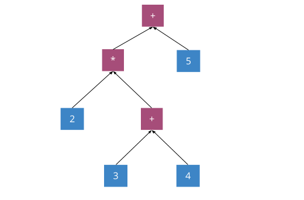
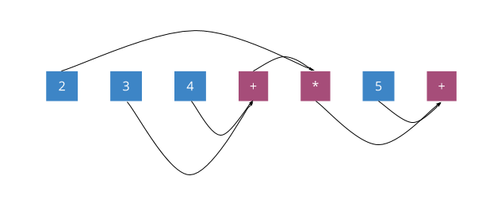
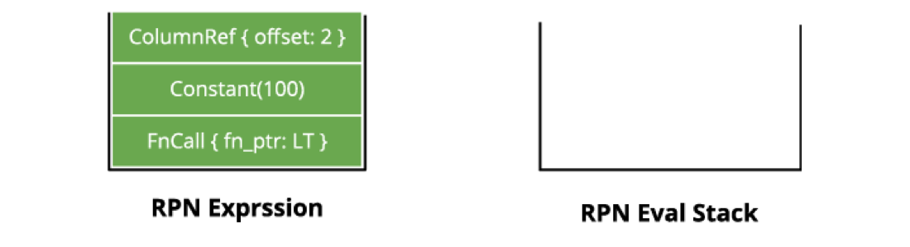
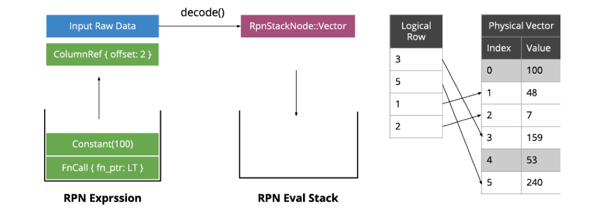
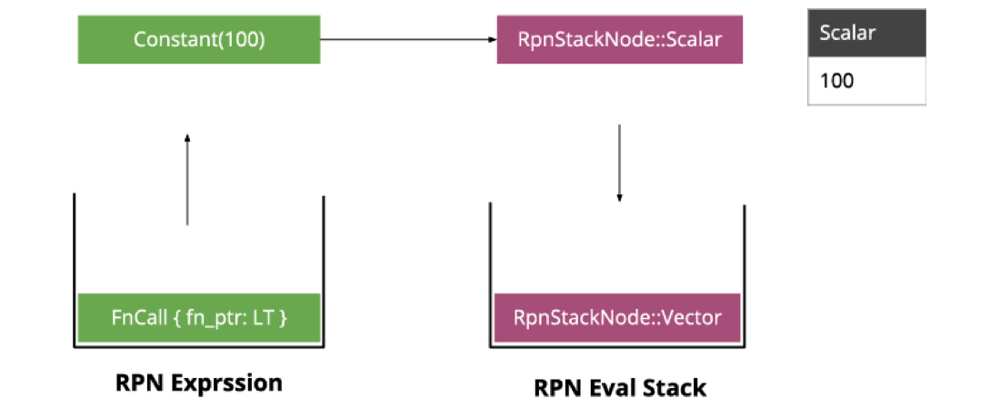
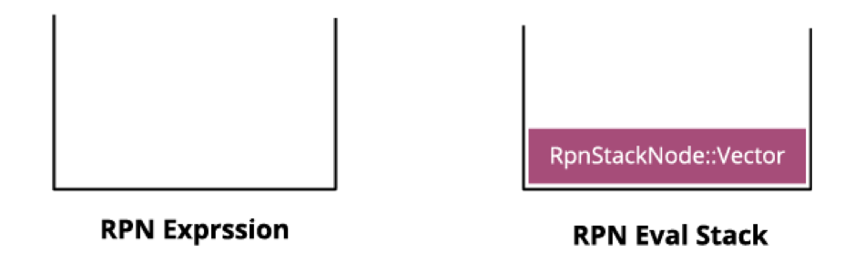
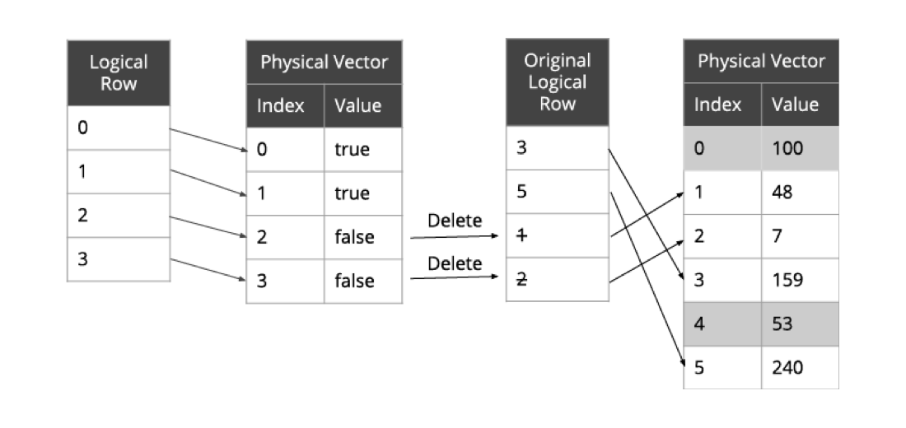

上一篇 《[TiKV 源码解析系列文章（十四）Coprocessor 概览](https://pingcap.com/blog-cn/tikv-source-code-reading-14/)》讲到了 TiDB 为了最大化利用分布式计算能力，会尽量将 Selection 算子、聚合算子等算子下推到 TiKV 节点上。本文将继续介绍 Coprocessor 中表达式计算框架的源码架构，带大家看看 SQL 中的表达式是如何在 Coprocessor 中执行的。

## 什么是表达式

比如说我们有这个 SQL 作为例子：

```sql
SELECT (count * price) AS sum FROM orders WHERE order_id < 100 
```

其中 `order_id < 10` 就是一个表达式，它有一个列输入参数： `order_id`，输出：`Bool`。

## RPN 表达式

因为 TiDB 下推的是树状结构表达式，所以我们需要选择一种树的遍历方式， 这里 Coprocessor 选择了由下而上递推的 RPN（逆波兰表示法）。RPN 是树的后序遍历，后序遍历在每个节点知道自己有几个子节点的时候等价于原本的树结构。

比如说我们有一个数学算式 `2 *（3 + 4）+ 5`：



由于数学上习惯写法是中序遍历，我们通常要加上括号消除歧义（比如加减和乘除的顺序）。通过把操作符后移 我们得到 `RPN：2 3 4 + * 5 +`，这样我们无需括号就能无歧义地遍历这个表达式：

1. 执行 RPN 的过程需要一个栈来缓存中间结果，比如说对于 `2 3 4 + * 5 +`，我们从左到右遍历表达式，遇到值就压入栈中。直到 `+` 操作符，栈中已经压入了 `2 3 4`。
  
  

2. 因为 `+` 是二元操作符，需要从栈中弹出两个值 `3 4`，结果为 `7`，重新压入栈中：

  

  

3. 此时栈中的值为 `2 7`。

  

4. 下一个是 `*` 运算符，也需要弹出两个值 `2 7`，结果为 `14` 压入栈中。

  

5. 接着压入 `5` 。

  

6. 最后 `+` 运算符弹出 `14 5`，结果为 `19 `，压入栈。

  

7. 最后留在栈里的就是表达式的结果。

## 构建 RPN 表达式

以表达式 `order_id < 10` 下推为例，其下推的树状表达式如下图所示，其中 `ColumnRef(2)` 表示列 `order_id`，`2` 表示 `order_id` 列在该表结构中对应的 offset：

  

转化为 RPN 表达式：

 

Coprocessor 中表达式的定义：

```
/// An expression in Reverse Polish notation, which is simply a list of RPN expression nodes.
///
/// You may want to build it using `RpnExpressionBuilder`.
#[derive(Debug, Clone)]
pub struct RpnExpression(Vec<RpnExpressionNode>);

/// A type for each node in the RPN expression list.
#[derive(Debug, Clone)]
pub enum RpnExpressionNode {
    /// Represents a function call.
    FnCall {
        func_meta: RpnFnMeta,
        args_len: usize,
        field_type: FieldType,
        implicit_args: Vec<ScalarValue>,
    },

    /// Represents a scalar constant value.
    Constant {
        value: ScalarValue,
        field_type: FieldType,
    },

    /// Represents a reference to a column in the columns specified in evaluation.
    ColumnRef { offset: usize },
}
```

## 执行 RPN 表达式

有了表达式后，接下来我们需要执行表达式，为此我们要使用一个栈结构来缓存中间值。由于表达式中的操作符（`RpnExpressionNode::FnCall`）不会被存入栈，我们定义了只包含值的 `RpnStackNode` 储存中间值：

```
// A type for each node in the RPN evaluation stack. It can be one of a scalar value node or a
/// vector value node. The vector value node can be either an owned vector value or a reference.
#[derive(Debug)]
pub enum RpnStackNode<'a> {
    /// Represents a scalar value. Comes from a constant node in expression list.
    Scalar {
        value: &'a ScalarValue,
        field_type: &'a FieldType,
    },

    /// Represents a vector value. Comes from a column reference or evaluated result.
    Vector {
        value: RpnStackNodeVectorValue<'a>,
        field_type: &'a FieldType,
    },
}
```

注意，Coprocessor 中表达式是向量化计算的，每次都尽量会计算多行，通常为 1024 行，即 `op([]value, []value)` 而不是 `op(value, value)`，从而减少分支并提高 Cache Locality。但运算数并不总是一个来自列的向量，还可能是用户直接指定的常量（例如 `SELECT a+1` 中 `a` 是向量，但 `1` 只是标量）。因此，`RpnStackNode` 分两种：

* 标量：由 `Constant` 生成。
* 向量：执行 `ColumnRe  f` 生成，或是 `FnCall` 调用返回的结果。

另外为了避免 Selection 算子移动大量的数据，向量使用了间接的储存方式，每个向量有真实数据和逻辑索引，只有逻辑索引中对应的真实数据才是逻辑有效的，这样 Selection 算子便可以只需改动逻辑索引而不需搬动大量的真实数据：

```
/// Represents a vector value node in the RPN stack.
///
/// It can be either an owned node or a reference node.
///
/// When node comes from a column reference, it is a reference node (both value and field_type
/// are references).
///
/// When nodes comes from an evaluated result, it is an owned node.
#[derive(Debug)]
pub enum RpnStackNodeVectorValue<'a> {
    Generated {
        physical_value: VectorValue,
        logical_rows: Arc<[usize]>,
    },
    Ref {
        physical_value: &'a VectorValue,
        logical_rows: &'a [usize],
    },
}
```

接下来我们用上面的 `order_id < 100`  作为例子看看表达式是如何执行的。

1. 首先我们准备好一个栈结构：

  

2. 接着逐一遍历表达式，第一个取出的是 `ColumnRef`，我们取出输入 Selection 算子的数据中对应 offset 的列的向量数据，并将向量压入栈：

  

3. 接着是 `Constant`，转化为标量然后压入栈：

  

4. 最后一个是 `LT` 运算符，它需要两个入参，因此我们从栈中弹出两个值作为参数调用 `LT`，`LT` 会生成一个新的向量，将结果压入栈：

  

5. 最后留在栈里的就是表达式的执行结果。

  

6. Selection 算子根据结果的布尔值过滤原输入的逻辑索引：

  

7. 这样就间接的过滤出有效数据而不用改变 Physical Vector：

  

## 实现 RPN 表达式函数

实现表达式函数（`FnCall`）是比较繁琐的。比如对于二元操作符加法， 它既可以接受其中一元输入常量，也可以接受来自列数据的向量。一种解决方法是将标量都重复填充为向量，这样所有函数运算都是向量参数，但这个方法会有额外的标量拷贝开销。为了避免这个开销，Coprocessor 直接实现了向量与标量的运算，`rpn_expr_codegen` 提供了过程宏 `#[rpn_fn]` ，我们只需定义标量逻辑，过程宏将自动生成剩下带有向量的逻辑。

下面我们来试着定义一个整数加法操作符，这里入参和返回值都为标量即可，源码的实现引入了泛型更进一步将其抽象为所有数值类型间的加法：

```
#[rpn_fn]
#[inline]
pub fn int_plus_int(
    lhs: &Option<Int>,
    rhs: &Option<Int>,
) -> Result<Option<Int>> {
    if let (Some(lhs), Some(rhs)) = (arg0, arg1) {
        lhs.checked_add(*rhs)
            .ok_or_else(|| Error::overflow("BIGINT", &format!("({} + {})", lhs, rhs)).into())
            .map(Some)
    } else {
        Ok(None)
    }
}
```

`#[rpn_fn]` 宏会分析这个操作符定义的参数数量和类型，自动生成既可以处理标量也可以处理向量的 `int_plus_int_fn_meta()`，这个函数将可以放进 `FnCall` 被用于表达式计算：

```
pub fn int_plus_int_fn_meta(
        _ctx: &mut EvalContext,
        output_rows: usize,
        args: &[RpnStackNode<'_>],
        _extra: &mut RpnFnCallExtra<'_>,
    ) -> Result<VectorValue>
{
    assert!(args.len() >= 2);

    let lhs = args[0];
    let rhs = args[1];

    let mut result: Vec<Int> = Vec::with_capacity(output_rows);

    match lhs {
        RpnStackNode::Scalar { value: ScalarValue::Int(lhs) , .. } => {
            match rhs {
                RpnStackNode::Scalar { value: ScalarValue::Int(rhs) , .. } => {
                    let value = int_plus_int(lhs, rhs);
                    result.push(result);
                }
                RpnStackNode::Vector { value: VectorValue::Int(rhs_vector) , .. } => {
                    for rhs_row in rhs_vector.logical_rows() {
                        let rhs = rhs_vector.physical_value[rhs_row];
                        let value = int_plus_int(lhs, rhs);
                        result.push(result);
                    }
                }
                _ => panic!("invalid expression")
            }
        }
        RpnStackNode::Vector { value: VectorValue::Int(lhs_vector) , .. } => {
            match rhs {
                RpnStackNode::Scalar { value: ScalarValue::Int(rhs) , .. } => {
                    for lhs in lhs_vector {
                        let value = int_plus_int(lhs, rhs);
                        result.push(result);
                    }
                }
                RpnStackNode::Vector { value: VectorValue::Int(rhs_vector) , .. } => {
                    for (lhs, rhs) in lhs_vector.logical_rows().iter().zip(rhs_vector.logical_rows()) {
                        let lhs = lhs_vector.physical_value[lhs_row];
                        let rhs = rhs_vector.physical_value[rhs_row];
                        let value = int_plus_int(lhs, rhs);
                        result.push(result);
                    }
                }
                _ => panic!("invalid expression")
            }
        }
        _ => panic!("invalid expression")
    }

    result
}
```

> 注意：TiKV 源码使用泛型展开生成逻辑代码，较为复杂，因此上面给出的这段是展开后的等价伪代码。

## 小结

以上就是 Coprocessor 表达式框架实现解析。下一篇我们将详细介绍各算子的内部实现。
