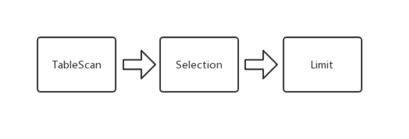
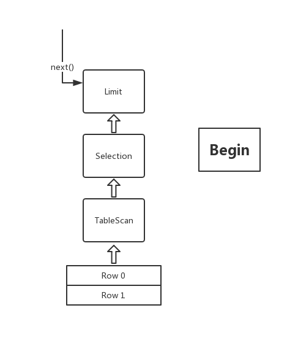
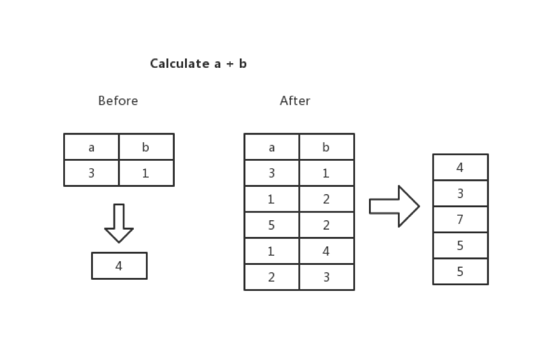
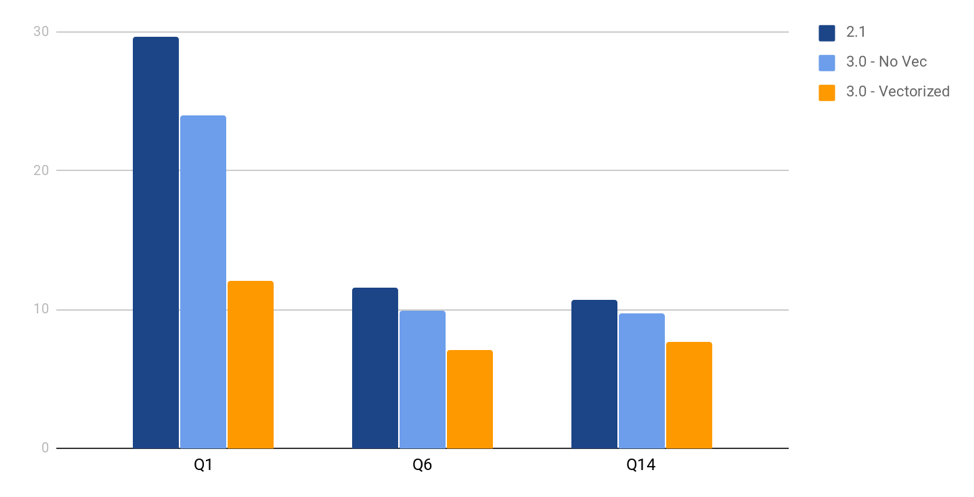
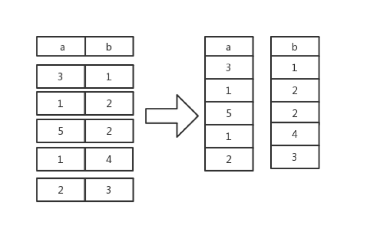
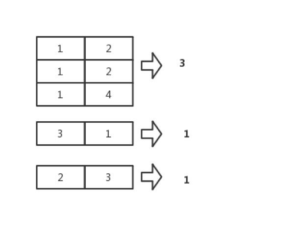

在前两篇文章 [TiKV 源码解析系列文章（十四）Coprocessor 概览](https://mp.weixin.qq.com/s/cdC7f9N9C88MJ_syNUg21g)、[TiKV 源码解析系列文章（十五）表达式计算框架中](https://mp.weixin.qq.com/s/UYcny9G5snh-MoMFm2qxsw)，讲到了 TiDB 为了最大化利用分布式计算能力，会尽量将 Selection 算子、Aggregation 算子等算子下推到 TiKV 节点上，以及下推的表达式是如何在 TiKV 上做计算的。本文将在前两篇文章的基础上，介绍下推算子的执行流程并分析下推算子的部分实现细节，加深大家对 TiKV Coprocessor 的理解。

## 什么是下推算子

以下边的 `SQL` 为例子：

```sql
select  *  from students where age >  21  limit  2
```

TiDB 在解析完这条 `SQL` 语句之后，会开始制定执行计划。在这个语句中， TiDB 会向 TiKV 下推一个可以用有向无环图（DAG）来描述的查询请求：



以上的 `DAG` 是一个由一系列算子组成的有向无环图，算子在 TiKV 中称为 `Executor` 。整个 `DAG` 描述了查询计划在 TiKV 的执行过程。在上边的例子中，一条查询 `SQL` 被翻译成了三个执行步骤：

1. 扫表

2. 选择过滤

3. 取若干行

有了基本概念后，下面我们简单介绍一下这样的查询计划在 TiKV 内部的一个执行流程。

## 下推算子如何执行

### 绕不开的火山

TiKV 执行器是基于 Volcano Model （火山模型），一种经典的基于行的流式迭代模型。现在主流的关系型数据库都采用了这种模型，例如 Oracle，MySQL 等。

我们可以把每个算子看成一个迭代器。每次调用它的 `next()` 方法，我们就可以获得一行，然后向上返回。而每个算子都把下层算子看成一张表，返回哪些行，返回怎么样的行由算子本身决定。举个例子：

假设我们现在对一张没有主键，没有索引的表 `[1]` ，执行一次全表扫描操作：

```sql
select * from t where a > 2 limit 2
```

表 `[1]`：

|  a `(int)`   | b `(int)`  |
|  ----  | ----  |
| 3  | 1 |
| 1  | 2 |
| 5  | 2 |
| 2  | 3 |
| 1  | 4 |

那么我们就可以得到这样的一个执行计划：



每个算子都实现了一个 `Executor` 的 `trait`， 所以每个算子都可以调用 `next()` 来向上返回一行。

```rust
pub trait Executor: Send {
    fn next(&mut self) -> Result<Option<Row>>;
    // ...
}
当以上的请求被解析之后，我们会在 ExecutorRunner 里边不断的调用最上层算子的 next() 方法， 直到其无法再返回行。
pub fn handle_request(&mut self) -> Result<SelectResponse> {
    loop {
        match self.executor.next()? {
            Some(row) => {
                // Do some aggregation.
            },
            None => {
                // ...
                return result;
            }
        }
    }
}
```

大概的逻辑就是：`Runner` 调用 `Limit` 算子的 `next()` 方法，然后这个时候 `Limit` 实现的 `next()` 方法会去调用下一层算子 `Selection` 的 `next()` 方法要一行上来做聚合，直到达到预设的阀值，在例子中也就是两行，接着 `Selection` 实现的 `next()` 又会去调用下一层算子的 `next()` 方法， 也就是 `TableScan`， `TableScan` 的 `next()` 实现是根据请求中的 `KeyRange`， 向下边的 `MVCC` 要上一行，然后返回给上层算子, 也就是第一行 `(3, 1)`，`Selection` 收到行后根据 `where` 字句中的表达式的值做判断，如果满足条件向上返回一行， 否则继续问下层算子要一行，此时 `a == 3 > 2`, 满足条件向上返回， `Limit` 接收到一行则判断当前收到的行数时候满两行，但是现在只收到一行，所以继续问下层算子要一行。接下来 `TableScan` 返回 `(1,2), Selection` 发现不满足条件，继续问 `TableScan` 要一行也就是 `(5,2), Selection` 发现这行满足条件，然后返回这一行，`Limit` 接收到一行，然后在下一次调用其 `next()` 方法时，发现接收到的行数已经满两行，此时返回 `None`， `Runner` 会开始对结果开始聚合，然会返回一个响应结果。

### 引入向量化的查询引擎

当前 TiKV 引入了向量化的执行引擎，所谓的向量化，就是在 `Executor` 间传递的不再是单单的一行，而是多行，比如 `TableScan` 在底层 `MVCC Snapshot` 中扫上来的不再是一行，而是说多行。自然的，在算子执行计算任务的时候，计算的单元也不再是一个标量，而是一个向量。举个例子，当遇到一个表达式：`a + b` 的时候， 我们不是计算一行里边 `a` 列和 `b` 列两个标量相加的结果，而是计算 `a` 列和 `b` 列两列相加的结果。



为什么要引入向量化模型呢，原因有以下几点：

1. 对于每行我们至少得调用 1 次 `next()` 方法，如果 `DAG` 的最大深度很深，为了获取一行我们需要调用更多次的 `next()` 方法，所以在传统的迭代模型中，虚函数调用的开销非常大。如果一次 `next()` 方法就返回多行，这样平均下来每次 `next()` 方法就可以返回多行，而不是至多一行。

2. 由于迭代的开销非常大，整个执行的循环无法被 `loop-pipelining` 优化，使得整个循环流水线被卡死，IPC 大大下降。返回多行之后，每个算子内部可以采用开销较小的循环，更好利用 `loop-pipelining` 优化。

当然向量化模型也会带来一些问题：

1. 原先最上层算子按需向下层算子拿上一行，而现在拿上多行，内存开销自然会增加。

2. 计算模型发生变化，原来基于标量计算的表达式框架需要重构 （详见上篇文章）。

但是这样并不影响向量化查询带来的显著的性能提升，下边是引入向量化模型后一个基准测试结果：（需要注意的是，Coprocessor 计算还只是 TPC-H 中的其中一部分，所以计算任务比重很大程度上决定了开不开向量化带来的提升比例）。



引入向量化模型后，原先的 `Execturor` trait 就变成了 `BatchExecutor`， 对应的 `next()` 方法就成了 `next_batch()`。 自然的 `next_batch` 不再返回一个行，而是一个 `BatchExecuteResult`，上边记录了扫上来的一张表 `physical_columns`，以及子表中哪些行应当被保留的 `logical_rows` 和一个 `is_drain` 用来表示下层算子是否已经没有数据可以返回。

```rust
pub trait BatchExecutor: Send {

    /// 获取表的 `schema`
    fn schema(&self) -> &[FieldType];

    // 向下层算子要回一张表
    fn next_batch(&mut self, scan_rows: usize) -> BatchExecuteResult;

    // ...
}

pub struct BatchExecuteResult {
    // 本轮循环 `TableScan` 扫上来的数据
    pub physical_columns: LazyBatchColumnVec,

    /// 记录 `physical_columns` 中有效的行的下标
    pub logical_rows: Vec<usize>,

    // ...

    // 表示下层算子是否已经没有数据可以返回
    pub is_drained: Result<bool>,
}
```

在接下来的文章中，我们将简单介绍一下几种典型算子的实现细节，旨在让大家更加熟悉各个算子的工作原理。

## 典型算子的实现

### `BatchTableScanExecutor` 的实现

首先我们先明确一下 `BatchTableScanExecutor` 的功能，`TableScan` 实现的 `next_batch()` 每被调用一次，它就会从底层的实现了 `Storage trait` 的存储层中扫上指定的行数，也就是 `scan_rows` 行。但是由于我们在计算的时候是采用向量化的计算模型，计算都是基于列进行的，所以我们会对扫上来的行进行一次行列转换，将表从行存格式转换成列存格式。



接下来我们看看 [`BatchTableScanExecutor`](https://github.com/tikv/tikv/blob/96c3f978f655148b1703a520cb9b2e9001dd256d/components/tidb_query/src/batch/interface.rs#L19) 现在的定义：

```rust
pub struct BatchTableScanExecutor<S: Storage>(ScanExecutor<S, TableScanExecutorImpl>);
```

从结构体的定义中我们可以看出，`BatchTableScanExecutor` 依赖于 `ScanExecutor`，而这个 `ScanExecutor` 依赖于一个实现 `Storage` 的类型和具体 `TableScanExecutorImpl`。

其中 [`ScanExecutor`](https://github.com/tikv/tikv/blob/96c3f978f655148b1703a520cb9b2e9001dd256d/components/tidb_query/src/batch/executors/util/scan_executor.rs#L38) 是一个通用的结构体，其作用是为了抽象出扫表和扫索引两种操作，这两种操作都需要依赖一个 `Storage` 而区别他们具体行为的是一个实现了 `ScanExecutorImpl` 的结构体，在上边的定义中就是：`TableScanExecutorImpl`。

```rust
pub struct ScanExecutor<S: Storage, I: ScanExecutorImpl> {
    /// 具体的扫表/扫索引实现。
    imp: I,

    /// 给定一个 `KeyRange`，扫上一行或者多行。
    scanner: RangesScanner<S>,

    // 标记是否已经扫完了所有的行。
    is_ended: bool,
}
```

`BatchTableScanExecutor` 中我们需要重点关注的是其实现的 `BatchExecutor`, 其中最为关键的就是 `next_batch()`，然而其依赖于内部 `ScanExecutor` 的 `BatchExecutor` 实现，也就是：

```rust
    fn next_batch(&mut self, scan_rows: usize) -> BatchExecuteResult {

        // 创建一个列数组
        let mut logical_columns = self.imp.build_column_vec(scan_rows);
        
        // 扫上 `scan_rows` 行， 然后按列填充到创建好的列数组中。
        let is_drained = self.fill_column_vec(scan_rows, &mut logical_columns);

        // 创建一个 `logical_rows`, 表示当前表中所有行有效。后边可能根据 `Selection` 的结果修改这个 `logical_rows`。
        let logical_rows = (0..logical_columns.rows_len()).collect();

        // 判断是否扫完传入的 `KeyRange`
        match &is_drained {
            // Note: `self.is_ended` is only used for assertion purpose.
            Err(_) | Ok(true) => self.is_ended = true,
            Ok(false) => {}
        };

        // 返回 `BatchExecuteResult`
        BatchExecuteResult {
            // ...
        }
    }
```

值得注意的是上边 `fill_column_vec` 的实现, 它大概的逻辑就是每次问 `self.scanner` 要上一个 `Key-Value` 对, 然后扔给 `self.imp.process_kv_pair` 处理，在扫表的实现中就是将 `value` 看成是一个行的 `datum` 编码，然后将每列的数据解出来然后放到建好的列数组里边去。

```rust
    fn fill_column_vec(
        &mut self,
        scan_rows: usize,
        columns: &mut LazyBatchColumnVec,
    ) -> Result<bool> {
        assert!(scan_rows > 0);

        for _ in 0..scan_rows {
            let some_row = self.scanner.next()?;
            if let Some((key, value)) = some_row {
                // 将扫上来的一行放入 `columns` 中
                self.imp.process_kv_pair(&key, &value, columns)?;
            } else {
                // 没有 `KeyRange` 可供扫描，已经完成扫表。
                return Ok(true);
            }
        }

        // 表示下层数据还没有扫完。
        Ok(false)
    }
```

**值得注意的是，现在表中的数据都是未经解码的生数据，所谓的生数据就是还不能直接参与到表达式计算的数据，这里采用的是一种 lazy decoding 的策略，只有要参与计算的时候，我们才会解码特定的列，而不是将数据扫上来就开始解码数据，将其变成能够直接参与计算的结构。**

### `BatchSelectionExecutor` 的实现

接下来要介绍的是 [`BatchSelectionExecutor`](https://github.com/tikv/tikv/blob/96c3f978f655148b1703a520cb9b2e9001dd256d/components/tidb_query/src/batch/executors/selection_executor.rs#L17) 的实现，我们首先来看看定义：

```rust
pub struct BatchSelectionExecutor<Src: BatchExecutor> {
    // ...
    
    // 数据源
    src: Src,

    // 条件表达式
    conditions: Vec<RpnExpression>,
}
```

首先， `BatchSelectionExecutor` 需要依赖一个 `Src`，一个 `BatchExecutor` 来提供数据的来源，然后是一组条件表达式，当 `BatchSelectionExecutor` 在执行的时候会对表达式进行求值，然后根据求出的值对下层数据拉上来的行做过滤聚合，然后返回过滤出的行。

观察 `BatchSelectionExecutor` 实现的 `BatchExecutor` 可以发现，其中的 `next_batch()` 方法依赖于 `handle_src_result()`：

```rust
    #[inline]
    fn next_batch(&mut self, scan_rows: usize) -> BatchExecuteResult {
        // 从下层算子那会一块数据开始过滤
        let mut src_result = self.src.next_batch(scan_rows);

        // 根据表达式的值，过滤出对应的行。
        if let Err(e) = self.handle_src_result(&mut src_result) {
            src_result.is_drained = src_result.is_drained.and(Err(e));
            src_result.logical_rows.clear();
        } else {
            // ... 
        }

        src_result
```

通过观察 `handle_src_result` 的实现，我们可以发现，它会遍历所有表达式，对其求值，表达式的值可能是一个标量，也可能是一个向量，但是我们完全是可以把标量看成是每行都一样的向量，然后根据每行的值，将其转换成 `bool`，如果该行的值为 `true`，则在 `logical_rows` 中保留他的下标。

```rust
    fn handle_src_result(&mut self, src_result: &mut BatchExecuteResult) -> Result<()> {
        let mut src_logical_rows_copy = Vec::with_capacity(src_result.logical_rows.len());
        let mut condition_index = 0;
        while condition_index < self.conditions.len() && !src_result.logical_rows.is_empty() {
            // 拷贝一份下层算子的 `logical_rows`，用做计算表达式。
            src_logical_rows_copy.clear();
            src_logical_rows_copy.extend_from_slice(&src_result.logical_rows);

            // 计算表达式的值，然后根据表达式的值去更新下层算子的 `logical_rows`。
            match self.conditions[condition_index].eval(
                &mut self.context,
                self.src.schema(),
                &mut src_result.physical_columns,
                &src_logical_rows_copy,
                // 表达式产生的结果如果是一列的话, 这里表示表达式应该输出的行数
                src_logical_rows_copy.len(),
            )? {
                RpnStackNode::Scalar { value, .. } => {
                    // 如果表达式是一个标量，根据转换成 `bool` 的值确定是否保留该列。
                    update_logical_rows_by_scalar_value(
                        &mut src_result.logical_rows,
                        &mut self.context,
                        value,
                    )?;
                }
                RpnStackNode::Vector { value, .. } => {
                    // 根据每行的结果，确定是否保留那行。
                    update_logical_rows_by_vector_value(
                    &mut src_result.logical_rows,
                    &mut self.context,
                    eval_result,
                    eval_result_logical_rows,
                    )?;
                }
            }

            condition_index += 1;
        }

        Ok(())
    }
}
```

### `BatchFastHashAggregationExecutor` 的实现

聚合算子的种类有很多种，包括：

1. `SimpleAggregation` (没有 `group by` 字句，只有聚合函数)

- => `select count(*) from t where a > 1`

2. `FastHashAggregation` (只有一个 `group by` column)

- => `select count(*) from t group by a`

3. `SlowHashAggregation` (多个 `groub by` columns, 或者表达式值不是 `Hashable` 的)

- => `select sum(*) from t group by a, b`

4. `StreamAggregation` 这种聚合算子假设输入已经按照 `group by` columns 排好序。

我们这里挑出一个比较具有代表性的算子：`BatchFastHashAggregationExecutor` 来进行分析。

首先要明确一下 `BatchFastHashAggregationExecutor` 大致的执行过程，首先我们会根据 `group by` column 里边的值给下层算子返回的表进行分组，比如：

```sql
select count(*) from t group by a
```


然后，我们会遍历每个组，然后针对每个组求出每个聚合函数的值，在这里就是：



接下来就涉及到两个重要的细节：

1. 聚合函数如何求值。

2. 如何根据 `group_by column` 对行进行分组并聚合。

后续几节我们着重介绍一下这两个细节是如何实现的。

#### 聚合函数

每个聚合函数都会实现一个 [`AggrFunction`](https://github.com/tikv/tikv/blob/96c3f978f655148b1703a520cb9b2e9001dd256d/components/tidb_query/src/aggr_fn/mod.rs#L35) 这个 trait：

```rust
pub trait AggrFunction: std::fmt::Debug + Send + 'static {
    /// The display name of the function.
    fn name(&self) -> &'static str;

    /// Creates a new state instance. Different states aggregate independently.
    fn create_state(&self) -> Box<dyn AggrFunctionState>;
}

// NOTE: AggrFunctionState 是 AggrFunctionStateUpdatePartial 的 super trait
pub trait AggrFunctionState:
    std::fmt::Debug
    + Send
    + 'static
    + AggrFunctionStateUpdatePartial<Int>
    + AggrFunctionStateUpdatePartial<Real>
    + AggrFunctionStateUpdatePartial<Decimal>
    + AggrFunctionStateUpdatePartial<Bytes>
    + AggrFunctionStateUpdatePartial<DateTime>
    + AggrFunctionStateUpdatePartial<Duration>
    + AggrFunctionStateUpdatePartial<Json>
{
    fn push_result(&self, ctx: &mut EvalContext, target: &mut [VectorValue]) -> Result<()>;
}
pub trait AggrFunctionStateUpdatePartial<T: Evaluable> {
    fn update(&mut self, ctx: &mut EvalContext, value: &Option<T>) -> Result<()>;

    fn update_repeat(
        &mut self,
        ctx: &mut EvalContext,
        value: &Option<T>,
        repeat_times: usize,
    ) -> Result<()>;

    fn update_vector(
        &mut self,
        ctx: &mut EvalContext,
        physical_values: &[Option<T>],
        logical_rows: &[usize],
    ) -> Result<()>;
}
```

聚合函数的求值过程分为三个步骤：

1. 创建并初始化状态，这一过程一般是由调用者调用：`create_state` 实现的。

2. 然后在不断遍历行/向量的过程中，我们会将行的内容传入 `update/update_repeat/update_vector` 函数(具体调用那种取决于不同的聚合函数实现)，更新内部的状态，比如遇到一个非空行，`COUNT()` 就会给自己内部计数器+1。

3. 当遍历结束之后，聚合函数就会将自己的状态通过 push_result(), 写入到一个列数组里边，这里之所以是列数组是因为聚合函数可能有多个输出列，比如 AVG()，在分布式的场景，我们需要返回两列：`SUM` 和 `COUNT`。

这个 `trait` 可以通过 `#[derive(AggrFuntion)]` 自动推导出实现，并且可以通过过程宏 `#[aggr_funtion(state = FooState::new())]` 来指定 `create_state` 创建出来的 `State` 类型。举个例子，`COUNT` 的实现：

```rust
/// The COUNT aggregate function.
#[derive(Debug, AggrFunction)]
#[aggr_function(state = AggrFnStateCount::new())]
pub struct AggrFnCount;

/// The state of the COUNT aggregate function.
#[derive(Debug)]
pub struct AggrFnStateCount {
    count: usize,
}

impl AggrFnStateCount {
    pub fn new() -> Self {
        Self { count: 0 }
    }
}

impl AggrFunctionStateUpdatePartial for AggrFnStateCount { /* .. */ }
impl AggrFunctionState for AggrFnStateCount { /* .. */ }
```

这个时候，调用 `create_state()` 的时候就会将内部状态 Box 起来然后返回。

#### 如何根据 `group by` column 分组并聚合

`BatchFastHashAggregationExecutor` 内部会有一个 `Groups` 的结构，其核心是一个 `HashTable`，根据 `group by` 表达式具体的类型作为 `key` 的类型，而 `value` 的值则是一个 `AggrFunctionState` 数组中该组对应的聚合函数状态集合的开始下标。举个例子：


`Hash` 值一样的行会被分配到同一个组中，每组会有若干个状态，聚合的过程其实就是根据每行的 `group by` column 找到其对应的分组 (HashTable::get)，然后对组内的每一个状态，根据该行的内容进行更新。最后遍历每个组，将他们的状态写入到列数组即可。

#### 将两个过程结合起来

上边两节讨论了聚合函数如何计算，如何分组以及如何对每个组做聚合的基本过程。现在我们通过代码，来探讨一下其中的具体细节。

先来看看 [`BatchFastHashAggregationExecutor`](https://github.com/tikv/tikv/blob/96c3f978f655148b1703a520cb9b2e9001dd256d/components/tidb_query/src/batch/executors/fast_hash_aggr_executor.rs#L34) 的定义:

```rust
pub struct BatchFastHashAggregationExecutor<Src: BatchExecutor>(
    AggregationExecutor<Src, FastHashAggregationImpl>,
);
```

我们发现，这个和 `BatchTableScanExecutor` 的定义十分相似，区别每个聚合算子行为的是 `AggregationExecutor` 里边实现了 `AggregationExecutorImpl` trait 的一个结构体。 我们也可以看看这个 trait 提供了哪些方法。

```rust
pub struct AggregationExecutor<Src: BatchExecutor, I: AggregationExecutorImpl<Src>> {
    imp: I,
    is_ended: bool,
    entities: Entities<Src>,
}

pub trait AggregationExecutorImpl<Src: BatchExecutor>: Send {
    // 根据 `group by` columns 和 聚合函数初始化 `entities` 中的 `schema`
    fn prepare_entities(&mut self, entities: &mut Entities<Src>);

    // 根据下层算子扫上来的数据做聚合和分组
    fn process_batch_input(
        &mut self,
        entities: &mut Entities<Src>,
        input_physical_columns: LazyBatchColumnVec,
        input_logical_rows: &[usize],
    ) -> Result<()>;

    // 将每个聚合函数的状态更新到列数组中，即写入聚合结果
    // 这里返回的是 `group by` column，在分布式场景如果不把 `group by` column 返回，`TiDB` 没有办法根据分组做二次聚合。
    fn iterate_available_groups(
        &mut self,
        entities: &mut Entities<Src>,
        src_is_drained: bool,
        iteratee: impl FnMut(&mut Entities<Src>, &[Box<dyn AggrFunctionState>]) -> Result<()>,
    ) -> Result<Vec<LazyBatchColumn>>;
}
```

上边代码中的 `Entities` 是记录源算子已经聚合函数元信息的一个结构体：

```rust
pub struct Entities<Src: BatchExecutor> {
    pub src: Src,
    
    // ...

    // 聚合后产生的 `schmea`， 包含 `group_by` columns
    pub schema: Vec<FieldType>,

    /// 聚合函数的集合
    pub each_aggr_fn: Vec<Box<dyn AggrFunction>>,

    /// 每个聚合函数输出的列大小，`COUNT` 是 1，`AVG` 是 2
    pub each_aggr_cardinality: Vec<usize>,

    /// 聚合函数里边的表达式
    pub each_aggr_exprs: Vec<RpnExpression>,

    // 每个聚合表达式输出的类型的集合
    pub all_result_column_types: Vec<EvalType>,
}
```

首先，为了观察到 `BatchFastHashAggregationExecutor` 我们需要追踪他的 `next_batch()` 的实现，在这里也就是： `AggregationExecutor::handle_next_batch`：

```rust
    fn handle_next_batch(&mut self) -> Result<(Option<LazyBatchColumnVec>, bool)> {
        // 从下层算子取回一个 `batch`
        let src_result = self
            .entities
            .src
            .next_batch(crate::batch::runner::BATCH_MAX_SIZE);

        self.entities.context.warnings = src_result.warnings;

        let src_is_drained = src_result.is_drained?;

        // 如果下层返回的数据不为空，将根据每行的结果分组并聚合
        if !src_result.logical_rows.is_empty() {
            self.imp.process_batch_input(
                &mut self.entities,
                src_result.physical_columns,
                &src_result.logical_rows,
            )?;
        }

        // 在 `FastHashAggr` 中，只有下层算子没有办法再返回数据的时候，才能认为聚合已经完成，
        // 否则我们返回一个空数据给上层算子，等待下一次 `next_batch` 被调用。
        let result = if src_is_drained {
            Some(self.aggregate_partial_results(src_is_drained)?)
        } else {
            None
        };
        Ok((result, src_is_drained))
    }
```

具体到 `FastHashAggr` 中，`process_batch_input` 就是分组并更新每组的状态。`aggregate_partial_results` 就是写入最终的状态到列数组中。

## 总结

本文简略的介绍了 TiKV 查询引擎的实现原理和几个简单算子的实现，如果大家对其他算子也感兴趣的话，可以到 [tikv/components/tidb_query/src/batch/executors](https://github.com/tikv/tikv/tree/983c626b069f2a2314d0a47009ca74033b346069/components/tidb_query/src/batch/executors) 下边找到对应的实现，本文中出现的代码都经过一定删减，欢迎大家阅读 TiKV 的源码获取更多的细节。
