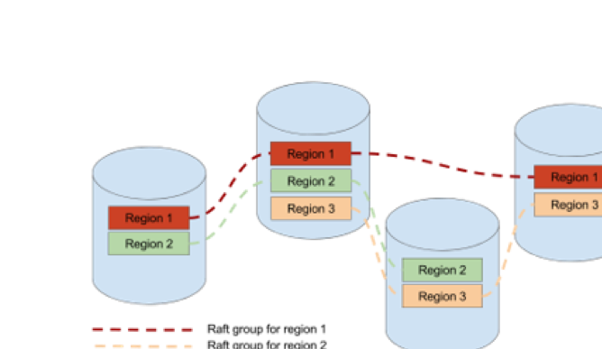
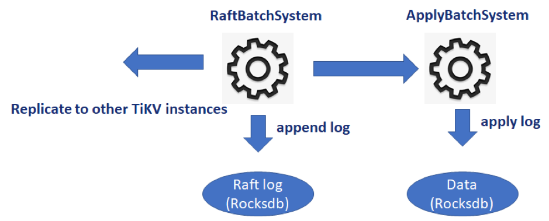

TiKV 作为一个分布式 KV 数据库，使用 Raft 算法来提供强一致性。Raft 算法提供了单一 group 的一致性，但是单一 group 无法扩展和均衡。因此，TiKV 采用了 MultiRaft 的方式基于 Raft 算法提供能兼顾一致性、扩展均衡的 KV 储存。下文以 3.0 版本代码为例，讲述 raftstore 源码中的关键定义和设计。

## MultiRaft

MultiRaft 顾名思义就是多个 Raft group。数据组织上，TiKV 将数据按范围划分成多个分片，这些分片称之为 region。每个 region 由一个 Raft group 来管理。Raft group 和 region 是一对一的关系。由下方示意图可以看到一个 Raft group 管理的多个副本分别落在不同的机器上，一个机器的数据包含了多个不同 region 的副本。通过这种组织方式，我们让 Raft group 并行起来，从而实现扩展和均衡。



## Batch System

Batch System 是 raftstore 处理的基石，是一套用来并发驱动状态机的机制。状态机的核心定义如下：

```
pub trait Fsm {
    type Message: Send;
 
    fn is_stopped(&self) -> bool;
}
```

状态机通过 PollHandler 来驱动，其定义如下：

```
pub trait PollHandler<N, C> {
    fn begin(&mut self, batch_size: usize);
    fn handle_control(&mut self, control: &mut C) -> Option<usize>;
    fn handle_normal(&mut self, normal: &mut N) -> Option<usize>;
    fn end(&mut self, batch: &mut [Box<N>]);
    fn pause(&mut self) {}
}
```

大体来看，状态机分成两种，normal 和 control。对于每一个 Batch System，只有一个 control 状态机，负责管理和处理一些需要全局视野的任务。其他 normal 状态机负责处理其自身相关的任务。每个状态机都有其绑定的消息和消息队列。PollHandler 负责驱动状态机，处理自身队列中的消息。Batch System 的职责就是检测哪些状态机需要驱动，然后调用 PollHandler 去消费消息。消费消息会产生副作用，而这些副作用或要落盘，或要网络交互。PollHandler 在一个批次中可以处理多个 normal 状态机，这些状态机在作为参数传入 end 方法时被命名为 batch，意思就是副作用会被聚合，一批批地处理。具体实现细节，后面的源码阅读章节会提到，这里就先不展开。

## RaftBatchSystem 和 ApplyBatchSystem

在 raftstore 里，一共有两个 Batch System。分别是 RaftBatchSystem 和 ApplyBatchSystem。RaftBatchSystem 用于驱动 Raft 状态机，包括日志的分发、落盘、状态跃迁等。当日志被提交以后会发往 ApplyBatchSystem 进行处理。ApplyBatchSystem 将日志解析并应用到底层 KV 数据库中，执行回调函数。所有的写操作都遵循着这个流程。
当客户端发起一个请求时，RaftBatchSystem 会将其序列化成日志，并提交给 raft。一个简化的流程如下：



从代码来看，序列化发生在 propose 过程中。

```
fn propose_normal(&mut self, req: RaftCmdRequest) -> Result<()> {
    let ctx = match self.pre_propose(poll_ctx, &mut req)?;
    let data = req.write_to_bytes()?;
    self.raft_group.propose(ctx.to_vec(), data)?;
    Ok(())
}
```

而 propose 的副作用后续会通过 Raft 库的 Ready 机制搜集，batch 处理。

```
if !self.raft_group.has_ready_since(Some(self.last_applying_idx)) {
    return None;
}
 
let mut ready = self.raft_group.ready_since(self.last_applying_idx);
self.mut_store().handle_raft_ready(ctx, &ready);
if !self.is_applying_snapshot() && !ready.committed_entries.is_empty() {
    let apply = Apply::new(self.region_id, self.term(), mem::replace(&mut ready.committed_entries, vec![]));
    apply_router
        .schedule_task(self.region_id, ApplyTask::apply(apply));
}
self.raft_group.advance_append(ready);
```

在 PeerStorage 的 handle_raft_ready 方法中，会将收集到 Ready 中的 Raft 日志收集到一个 WriteBatch 中，最终在 RaftPoller 的 end 方法中批量写入磁盘。而 Ready 中收集到的确认过的 Raft 日志，会被 `apply_router` 发送到 apply 线程中，由 ApplyBatchSystem 来处理。关于一个写入在 Raftstore 模块中从提交到确认的整条链路，将在后续的章节中更详细地探讨，这里就不作展开了。

## Split 和 Merge

TiKV 的每一个 Raft group 都是一个 Region 的冗余复制集，而 Region 数据不断增减时，它的大小也会不断发生变化，因此必须支持 Region 的分裂和合并，才能确保 TiKV 能够长时间稳定运行。Region Split 会将一段包含大量数据的 range 切割成多个小段，并创建新的 Raft Group 进行管理，如将 [a, z) 切割成 [a, h), [h, x) 和 [x, z)，并产生两个新的 Raft group。Region Merge 则会将 2 个相邻的 Raft group 合并成一个，如 [a, h) 和 [h, x) 合并成 [a, x）。这些逻辑也在 Raftstore 模块中实现。这些特殊管理操作也作为一个特殊的写命令走一遍上节所述的 Raft propose/commit/apply 流程。为了保证 split/merge 前后的写命令不会落在错误的范围，我们给 region 加了一个版本的概念。每 split 一次，版本加一。假设 region A 合并到 region B，则 B 的版本为 max(versionB, versionA + 1) + 1。更多的细节实现包括各种 corner case 的处理在后续文章中展开。

## LocalReader

对于读操作，如果和写操作混在一起，会带来不必要的延迟和抖动。所以 TiKV 实现了一个单独的组件来处理。Raft group 的 leader 会维护一个 lease 机制，对于在 lease 内收到的请求，会立刻进行读操作；lease 外的请求，会触发 lease 续期。续期是通过心跳完成的。也就是读操作不会触发写盘行为。Lease 定义如下：

```
pub struct RemoteLease {
    expired_time: Arc<AtomicU64>,
    term: u64,
}
 
pub struct Lease {
    // A suspect timestamp is in the Either::Left(_),
    // a valid timestamp is in the Either::Right(_).
    bound: Option<Either<Timespec, Timespec>>,
    max_lease: Duration,
 
    max_drift: Duration,
    last_update: Timespec,
    remote: Option<RemoteLease>,
}
```

RemoteLease 是读行为发生线程里所持有的 lease，它的状态由 Lease 来维护。Lease 自身由 RaftBatchSystem 来实际维护。bound 记录的是 lease 的失效时间，max_drift 表示允许精度误差。

## Coprocessor

虽然读写已经包含了绝大多数 KV 操作，但是我们仍然需要一些特殊机制来自定义行为。比如为了保证事务正确，region 分裂不应该将同一个 key 的 MVCC 数据拆分到不同的 region 里。这些行为由 Coprocessor 来实现。TiKV 中一共有两种 Coprocessor。之前[这篇文章](https://pingcap.com/blog-cn/tikv-source-code-reading-14/)介绍的 SQL 下推逻辑属于 Endpoint，这里主要涉及的是 Observer。Observer 的作用是监听 KV 处理过程中的各种事件，并在事件发生时执行自定义逻辑。Coprocessor 的定义如下：

```
pub trait Coprocessor {
    fn start(&self) {}
    fn stop(&self) {}
}
```

目前已经定义的 Coprocessor 包括 AdminObserver、QueryObserver、SplitCheckObserver、RoleObserver、RegionChangeObserver。拿 QueryObserver 举个例子：

```
pub trait QueryObserver: Coprocessor {
    /// Hook to call before proposing write request.
    ///
    /// We don't propose read request, hence there is no hook for it yet.
    fn pre_propose_query(&self, _: &mut ObserverContext<'_>, _: &mut Vec<Request>) -> Result<()> {
        Ok(())
    }
 
    /// Hook to call before applying write request.
    fn pre_apply_query(&self, _: &mut ObserverContext<'_>, _: &[Request]) {}
 
    /// Hook to call after applying write request.
    fn post_apply_query(&self, _: &mut ObserverContext<'_>, _: &mut Vec<Response>) {}
}
```

此 Observer 监听了 pre_propose、pre_apply 和 post_apply 三个事件。ObserverContext 里面包含了 region 信息以及是否继续处理的标记。具体实现细节由后续文章介绍，这里不展开了。

## 小结

这篇文章主要针对 TiKV 项目中 src/raftstore 里源码涉及的概念和原理做了一个大概的介绍。深入解读请留意后续的系列文章，欢迎大家关注。
