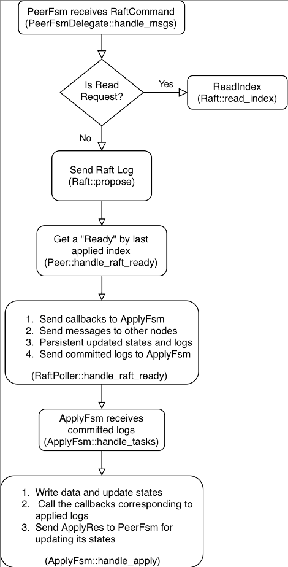

在学习了 [前面的文章](https://pingcap.com/blog-cn/tikv-source-code-reading-2/) 之后，相信大家已经对 TiKV 使用的 Raft 核心库 **raft-rs** 有了基本的了解。**raft-rs** 实现了 Raft Leader election 和 Log replication 等核心功能，而消息的发送、接收、应用到状态机等操作则需要使用者自行实现，本文将要介绍的就是 TiKV 中这些部分的处理过程。

## Raft Ready

在开始正题之前，我们先简单回顾一下 **raft-rs** 与外部代码的交互接口: Ready。 Ready 结构的 [定义](https://github.com/tikv/raft-rs/blob/afabefa23196a4a23832add0087f5a522d8ccc3b/src/raw_node.rs#L86-L110) 如下：

```
pub struct Ready {
    /// The current volatile state of a Node.
    /// SoftState will be nil if there is no update.
    /// It is not required to consume or store SoftState.
    ss: Option<SoftState>,

    /// The current state of a Node to be saved to stable storage BEFORE
    /// Messages are sent.
    /// HardState will be equal to empty state if there is no update.
    hs: Option<HardState>,

    /// States can be used for node to serve linearizable read requests locally
    /// when its applied index is greater than the index in ReadState.
    /// Note that the read_state will be returned when raft receives MsgReadIndex.
    /// The returned is only valid for the request that requested to read.
    read_states: Vec<ReadState>,

    /// Entries specifies entries to be saved to stable storage BEFORE
    /// Messages are sent.
    entries: Vec<Entry>,

    /// Snapshot specifies the snapshot to be saved to stable storage.
    snapshot: Snapshot,

    /// CommittedEntries specifies entries to be committed to a
    /// store/state-machine. These have previously been committed to stable
    /// store.
    pub committed_entries: Option<Vec<Entry>>,

    /// Messages specifies outbound messages to be sent AFTER Entries are
    /// committed to stable storage.
    /// If it contains a MsgSnap message, the application MUST report back to raft
    /// when the snapshot has been received or has failed by calling ReportSnapshot.
    pub messages: Vec<Message>,

    must_sync: bool,
}
```

Ready 结构包括了一些系列 Raft 状态的更新，在本文中我们需要关注的是：

* **hs**: Raft 相关的元信息更新，如当前的 term，投票结果，committed index 等等。

* **committed_entries**: 最新被 commit 的日志，需要应用到状态机中。

* **messages**: 需要发送给其他 peer 的日志。

* **entries**: 需要保存的日志。

## Proposal 的接收和在 Raft 中的复制

TiKV 3.0 中引入了类似 [Actor](https://en.wikipedia.org/wiki/Actor_model) 的并发模型，Actor 被视为并发运算的基本单元：当一个 Actor 接收到一则消息，它可以做出一些决策、创建更多的 Actor、发送更多的消息、决定要如何回答接下来的消息。每个 TiKV 上的 Raft Peer 都对应两个 Actor，我们把它们分别称为 `PeerFsm` 和 `ApplyFsm`。PeerFsm 用于接收和处理其他 Raft Peer 发送过来的 Raft 消息，而 `ApplyFsm` 用于将已提交日志应用到状态机。

TiKV 中实现的 Actor System 被称为 BatchSystem，它使用几个 Poll 线程从多个 Mailbox 上拉取一个 Batch 的消息，再分别交由各个 Actor 来执行。为了保证 [线性一致性](https://pingcap.com/blog-cn/linearizability-and-raft/) ，一个 Actor 同时只会在一个 Poll 线程上接收消息并顺序执行。由于篇幅所限，这一部分的实现在这里不做详述，感兴趣的同学可以在 `raftstore/fsm/batch.rs` 查看详细代码。

上面谈到，`PeerFsm` 用于接收和处理 Raft 消息。它接收的消息为 `PeerMsg`，根据消息类型的不同会有不同的处理：

```
/// Message that can be sent to a peer.
pub enum PeerMsg {
    /// Raft message is the message sent between raft nodes in the same
    /// raft group. Messages need to be redirected to raftstore if target
    /// peer doesn't exist.
    RaftMessage(RaftMessage),
    /// Raft command is the command that is expected to be proposed by the
    /// leader of the target raft group. If it's failed to be sent, callback
    /// usually needs to be called before dropping in case of resource leak.
    RaftCommand(RaftCommand),
    /// Result of applying committed entries. The message can't be lost.
    ApplyRes { res: ApplyTaskRes },
    ...
}

...

impl PeerFsmDelegate {
    pub fn handle_msgs(&mut self, msgs: &mut Vec<PeerMsg>) {
        for m in msgs.drain(..) {
            match m {
                PeerMsg::RaftMessage(msg) => {
                    self.on_raft_message(msg);
                }
                PeerMsg::RaftCommand(cmd) => {
                    self.propose_raft_command(cmd.request, cmd.callback)
                }
                PeerMsg::ApplyRes { res } => {
                    self.on_apply_res(res);
                }
                ...
            }
        }
    }
```

这里只列出了我们需要关注的几种消息类型：

* **RaftMessage**: 其他 Peer 发送过来 Raft 消息，包括心跳、日志、投票消息等。

* **RaftCommand**: 上层提出的 proposal，其中包含了需要通过 Raft 同步的操作，以及操作成功之后需要调用的 `Callback` 函数。

* **ApplyRes**: ApplyFsm 在将日志应用到状态机之后发送给 `PeerFsm` 的消息，用于在进行操作之后更新某些内存状态。

我们主要关注的是 `PeerFsm` 如何处理 Proposal，也就是 `RaftCommand` 的处理过程。在进入到 `PeerFsmDelegate::propose_raft_command` 后，首先会调用 `PeerFsmDelegate::pre_propose_raft_command` 对 peer ID, peer term, region epoch (region 的版本，region split、merge 和 add / delete peer 等操作会改变 region epoch) 是否匹配、 peer 是否 leader 等条件进行一系列检查，并根据请求的类型（是读请求还是写请求），选择不同的 Propose 策略见（ `Peer::inspect`）：

```
let policy = self.inspect(&req);
let res = match policy {
    Ok(RequestPolicy::ReadIndex) => return self.read_index(ctx, req, err_resp, cb),
    Ok(RequestPolicy::ProposeNormal) => self.propose_normal(ctx, req),
    ...
};
```

对于读请求，我们只需要确认此时 leader 是否真的是 leader 即可，一个较为轻量的方法是发送一次心跳，再检查是否收到了过半的响应，这在 raft-rs 中被称为 ReadIndex （关于 ReadIndex 的介绍可以参考 [这篇文章](https://pingcap.com/blog-cn/lease-read/) ）。对于写请求，则需要 propose 一条 Raft log，这是在 `propose_normal` 函数中调用 `Raft::propose` 接口完成的。在 propose 了一条 log 之后，Peer 会将 proposal 保存在一个名为 `apply_proposals` 的  `Vec` 中。随后一个 Batch （包含了多个 Peer）内的 proposal 会被 Poll 线程统一收集起来，放入一个名为 `pending_proposals`  的 `Vec` 中待后续处理。

在一个 Batch 的消息都经 `PeerDelegate::handle_msgs` 处理完毕之后，Poll 对 Batch 内的每一个 Peer 调用 `Peer::handle_raft_ready_append`： 

1. 用记录的 `last_applied_index` 获取一个 Ready。

2. 在得到一个 Ready 之后，`PeerFsm` 就会像我们前面所描述的那样，调用 `PeerStorage::handle_raft_ready` 更新状态（term，last log index 等）和日志。

3. 这里的状态更新分为持久化状态和内存状态，持久化状态的更新被写入到一个 `WriteBatch` 中，内存状态的更新则会构造一个 `InvokeContext`，这些更新都会被一个 `PollContext` 暂存起来。

于是我们得到了 Batch 内所有 Peer 的状态更新，以及最近提出的 `proposal`，随后 Poll 线程会做以下几件事情：

1. 将 Proposal 发送给 `ApplyFsm` 暂存，以便在 Proposal 写入成功之后调用 Callback 返回响应。

2. 将之前从各个 Ready 中得到的需要发送的日志发送给 gRPC 线程，随后发送给其他 TiKV 节点。

3. 持久化已保存在 WriteBatch 中需要更新的状态。

4. 根据 `InvokeContext` 更新 PeerFsm 中的内存状态。

5. 将已提交日志发送给 `ApplyFsm` 进行应用（见`Peer::handle_raft_ready_apply`）。

## Proposal 在 Raft 中的确认

上面我们阐述了 Region 的 Leader 在收到 proposal 之后，是调用了哪些接口将 proposal 放到 Raft 状态机中的。在这之后，这个 proposal 虽然被发往了 `ApplyFsm` 中暂存，但是 `ApplyFsm` 目前还不能 apply 它并调用关联的 `callback` 函数，因为这个 proposal 还没被 Raft 中的过半节点确认。那么，Leader 节点上的 raftstore 模块是如何处理收到的其他副本的 Raft 消息，并完成日志的确认的呢？

答案就在 `PeerFsmDelegate::on_raft_message` 函数中。在一个 Peer 收到 Raft 消息之后，会进入这个函数中进行处理，内部调用 `Raft::step` 函数更新 Raft 状态机的内存状态。之后，调用 `RawNode::ready` 函数获取 **committed_entries**，最终作为 `ApplyMsg::Apply` 任务发送给 `ApplyFsm`，由 `ApplyFsm` 执行指令，如果 proposal 是由本节点发出，还会调用 `callback 函数`（之前通过 `ApplyMsg::Proposal` 任务暂存在 `ApplyFsm` 中）以向客户端返回响应。

## Proposal 的应用

在上一部分我们提到，`PeerFsm` 会将 Proposal 以及已提交日志发送给对应的 `ApplyFsm`，它们对应的消息类型分别是 `ApplyMsg::Proposal` 和 `ApplyMsg::Apply`，下面将会讲述 `ApplyFsm` 是如何处理这两种类型的消息的。

对于 `ApplyMsg::Proposal` 的处理非常简单（见 `ApplyFsm::handle_proposal`），`ApplyFsm` 会把 Proposal 放入 `ApplyDelegate::pending_cmds` 中暂存起来，后续在应用对应的日志时会从这里找出相应的 Callback 进行调用。

而 `ApplyMsg:Apply` 中包含的是实际需要应用的日志，`ApplyFsm` 会针对这些日志进行（见 `ApplyFsm::handle_apply`）：

1. 修改内存状态，将变更的状态（last applied index 等）、数据持久化。

2. 调用 Proposal 对应的 Callback 返回响应。

3. 向 PeerFsm 发送 `ApplyRes`，其中包含了 `applied_term`、`applied_index` 等状态（用于更新 `PeerFsm` 中的内存状态）。

这里存在一个特殊情况，就是所谓的“空日志”。在 **raft-rs** 的实现中，当选举出新的 Leader 时，新 Leader 会广播一条“空日志”，以提交前面 term 中的日志（详情请见 Raft 论文）。此时，可能还有一些在前面 term 中提出的 proposal 仍然处于 pending 阶段，而因为有新 Leader 产生，这些 proposal 永远不可能被确认了，因此我们需要对它们进行清理，以免关联的 `callback` 无法调用导致一些资源无法释放。清理的逻辑参照 `ApplyFsm::handle_entries_normal` 函数。

## 总结

这里用一个流程图总结一下 TiKV 处理 Proposal 的大致流程，如下：



简言之，TiKV 使用了两个线程池来处理 Proposal，并且将一个 Raft Peer 分成了两部分：`PeerFsm` 和 `ApplyFsm`。在处理 Proposal 的过程中，首先由 `PeerFsm` 获取日志并驱动 Raft 内部的状态机，由 `ApplyFsm` 根据已提交日志修改对应数据的状态机（region 信息和用户数据）。

由于这部分代码涉及到各种 corner case 的处理，因此逻辑较为复杂，希望感兴趣的读者可以进一步从源码中获取更多细节。