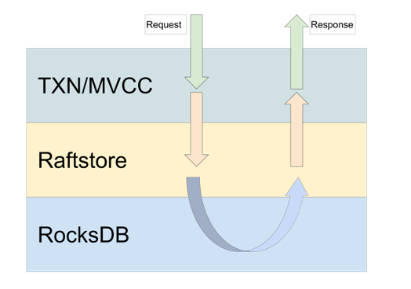

在上篇文章中，我们讲解了 [Raft Propose 的 Commit 和 Apply 情景分析](https://pingcap.com/blog-cn/tikv-source-code-reading-18/)，相信大家对 TiKV 的 Raft 写流程有了大概了解。这篇文章将尝试向大家较为完整的介绍下 TiKV 中的 Raft 读流程的实现，特别是 read index 和 lease read（或称 local read）。关于 read index 和 lease read 的介绍和理论基础，请大家参阅 [TiKV 功能介绍 - Lease Read](https://pingcap.com/blog-cn/lease-read/) 或者 Raft 论文第 6.4 节，不在这里赘述。

## 如何发起 Raft 读请求？

TiKV 的实现是分层的，不同模块负责不同事情，下图直观地介绍了 TiKV 的模块的层级关系。



TiKV 中所有 Raft 相关的逻辑都在 [Raftstore 模块](https://github.com/tikv/tikv/tree/v4.0.0-rc.1/components/raftstore)，如何发起 Raft 读请求就是说如何通过 Raftstore 发起读请求。Raftstore 对外（TXN/MVCC）提供接口叫做 [`RaftStoreRouter`](https://github.com/tikv/tikv/blob/v4.0.0-rc.1/components/raftstore/src/router.rs#L16-L57)，它提供了多方法，但能供外面发起读写请求的只有一个，叫做 `send_command`。

```
/// Routes messages to the raftstore.
pub trait RaftStoreRouter<E>: Send + Clone
where
   E: KvEngine,
{
   /// Sends RaftCmdRequest to local store.
   fn send_command(&self, req: RaftCmdRequest, cb: Callback<E>) -> RaftStoreResult<()>;
   // Other methods are elided.
}
```

所有的读写请求统一使用这个方法发起。当操作完成后，不管成功与否，都调用 `cb: Callbck<E>`，并将回复传入。

这篇文章接下来的部分将围绕图中黄色部分展开。

## 读请求有哪些？

既然这么问，肯定意味着 TiKV 中有多个不同类型的读请求。这就需要了解下 `RaftCmdRequest` 的构成了。TiKV 对外的请求都是 Protocol buffer message，`RaftCmdRequest` 定义在 [kvproto/raft_cmd.proto](https://github.com/pingcap/kvproto/blob/0f5ffe4596777255953000469d6e2a1b9b84d991/proto/raft_cmdpb.proto#L299-L306)，它包含了所有 TiKV 支持的读写请求.

```
message Request {
   CmdType cmd_type = 1;
   GetRequest get = 2;
   PutRequest put = 4;
   DeleteRequest delete = 5;
   SnapRequest snap = 6;
   PrewriteRequest prewrite = 7;
   DeleteRangeRequest delete_range = 8;
   IngestSSTRequest ingest_sst = 9;
   ReadIndexRequest read_index = 10;
}
```

上面代码中加粗的就是 TiKV 目前支持的几种读请求。

*   GetRequest：读取一个 key value 对。

*   SnapRequest：获取当前时刻 RocksDB 的 snapshot。

*   ReadIndexRequest：获取当前时刻能保证线性一致的 Raft log index。

注意：不要把 ReadIndexRequest 和 Read Index 搞混。ReadIndexRequest 是一种读的请求，ReadIndex 是一种处理读请求的方式。

## Raft 如何处理读请求？

我们以日常使用中最常见的 SnapRequest 为例，说一下 Read Index 和 Local read 的流程。

在 [TXN/MVCC 层通过 `send_command`](https://github.com/tikv/tikv/blob/v4.0.0-rc.1/src/server/raftkv.rs#L194) 发起一个读请求后，Raftstore 中对应的 PeerFsm （就是一个 Raft 状态机）会在 [`PeerFsm::handld_msgs`](https://github.com/tikv/tikv/blob/v4.0.0-rc.1/components/raftstore/src/store/fsm/peer.rs#L291-L297) 中收到该请求。

### [`PeerFsm::propose_raft_command`](https://github.com/tikv/tikv/blob/v4.0.0-rc.1/components/raftstore/src/store/fsm/peer.rs#L2378)

```
fn propose_raft_command(&mut self, mut msg: RaftCmdRequest, cb: Callback<RocksEngine>) {
    // Irrelevant code is elided.
    match self.pre_propose_raft_command(&msg) {
        Ok(Some(resp)) => {
            cb.invoke_with_response(resp);
            return;
        }
        Err(e) => {
            cb.invoke_with_response(new_error(e));
            return;
        }
        _ => (),
    }
    let mut resp = RaftCmdResponse::default();
    if self.fsm.peer.propose(self.ctx, cb, msg, resp) {
       self.fsm.has_ready = true;
    }
}
```

PeerFsm 在会将该请求传入 `PeerFsm::propose_raft_command` 做进一步处理。为了突出重点，无关代码已被删去。

1. pre_propose_raft_command：检查能否处理该请求，包括：

    a. 检查 store id，确认是否发送到发送到了对的 TiKV；

    b. 检查 peer id，确认是否发送到了对的 Peer；

    c. 检查 leadership，确认当前 Peer 是否为 leader；

    d. 检查 Raft 任期，确认当前 leader 的任期是否符合请求中的要求；

    e. 检查 peer 初始化状态，确认当前 Peer 已经初始化，有完整数据；

    f. 检查 region epoch，确认当前 Region 的 epoch 符合请求中的要求。

2. peer.propose: 当全部检查通过后，正式进入 Raft 的 Propose 环节。

### [`Peer::propose`](https://github.com/tikv/tikv/blob/v4.0.0-rc.1/components/raftstore/src/store/peer.rs#L1678-L1735)

```
pub fn propose<T: Transport, C>(
   &mut self, 
   ctx: &mut PollContext<T, C>,
   cb: Callback<RocksEngine>,
   req: RaftCmdRequest,
   mut err_resp: RaftCmdResponse,
) -> bool {
   // Irrelevant code is elided.
   let policy = self.inspect(&req);
   let res = match policy {
       Ok(RequestPolicy::ReadLocal) => {
           self.read_local(ctx, req, cb);
           return false;
       }
       Ok(RequestPolicy::ReadIndex) => return self.read_index(ctx, req, err_resp, cb),
       Ok(RequestPolicy::ProposeTransferLeader)
       | Ok(RequestPolicy::ProposeConfChange)
       | Ok(RequestPolicy::ProposeNormal) => {
           // Irrelevant code is elided.
       }
       Err(e) => Err(e),
   };
}
```

由于 RaftCmdRequest 可能包含了多种请求，加上请求间的处理方式各有不同，所以我们需要判断下该如何处理。

*   inspect：判断请求类别和处理方式。让我们聚焦到读请求，处理方式总共有两种：

	*   RequestPolicy::ReadLocal，也就是 local read，说明该 Peer 是 leader 且在 lease 内，可以直接读取数据。

	*   RequestPolicy::ReadIndex，也就是 read index，说明该 Peer 是 leader 但不在 lease 内，或者该请求明确要求使用 read index 处理。

*   self.read_local：以 local read 方式处理请求，直接读取 RocksDB。

*   self.read_index：以 read index 方式处理请求，询问一遍大多数节点，确保自己是合法 leader，然后到达或超过线性一致性的点（read index）后读取 RocksDB。

### [`Peer::inspect`](https://github.com/tikv/tikv/blob/v4.0.0-rc.1/components/raftstore/src/store/peer.rs#L2676)

```
fn inspect(&mut self, req: &RaftCmdRequest) -> Result<RequestPolicy> {
   // Irrelevant code is elided.
   if req.get_header().get_read_quorum() {
       return Ok(RequestPolicy::ReadIndex);
   }
   if !self.has_applied_to_current_term() {
       return Ok(RequestPolicy::ReadIndex);
   }
   match self.inspect_lease() {
       LeaseState::Valid => Ok(RequestPolicy::ReadLocal),
       LeaseState::Expired | LeaseState::Suspect => {
           Ok(RequestPolicy::ReadIndex)
       }
   }
}
fn inspect_lease(&mut self) -> LeaseState {
   if !self.raft_group.raft.in_lease() {
       return LeaseState::Suspect;
   }
   // None means now.
   let state = self.leader_lease.inspect(None);
   if LeaseState::Expired == state {
       self.leader_lease.expire();
   }
   state
}

```

inspect 方法也不复杂，我们住逐行看一下：

*   req.get_header().get_read_quorum()：该请求明确要求需要用 read index 方式处理，所以返回 ReadIndex。

*   self.has_applied_to_current_term()：如果该 leader 尚未 apply 到它自己的 term，则使用 ReadIndex 处理，原因见 [TiKV 功能介绍 - Lease Read](https://pingcap.com/blog-cn/lease-read/)。

*   self.raft_group.raft.in_lease()：如果该 leader 不在 raft 的 lease 内，说明可能出现了一些问题，比如网络不稳定，心跳没成功等。使用 ReadIndex 处理.

*   self.leader_lease.inspect(None)：使用 CPU 时钟判断 leader 是否在 lease 内，如果在，则使用 ReadLocal 处理.

这判断总的来说就是，如果不确定能安全地读 RocksDB 就用 read index，否则大胆地使用 local read 处理。

## 多线程 local read

细心的读者可能已经发现，是否能 local read 关键在 leader 是否在 lease 内，而判断 lease 其实是不用经过 Raft 状态机的，所以我们能不能扩展下 lease，让它能在多线程间共享，特别是在 TXN/MVCC 层，这样读请求就能绕过 Raft 直接执行了。答案是可以的，而且 TiKV 已经实现了。话不多说，直接看代码。

```
impl<E> RaftStoreRouter<E> for ServerRaftStoreRouter<E> where E: KvEngine
{
   fn send_command(&self, req: RaftCmdRequest, cb: Callback<E>) -> RaftStoreResult<()> {
       let cmd = RaftCommand::new(req, cb);
       if LocalReader::<RaftRouter<E>, E>::acceptable(&cmd.request) {
           self.local_reader.execute_raft_command(cmd);
           Ok(())
       } else {
           let region_id = cmd.request.get_header().get_region_id();
           self.router
               .send_raft_command(cmd)
               .map_err(|e| handle_send_error(region_id, e))
       }
   }
}
```

这个实现的有些取巧，我们直接把它做到 raftstore 的入口处，也就是 RaftStoreRouter 中。这里的 LocalReader 其实就是一个 cache，缓存了现有 leader 处理读请求时的一些状态。

*   acceptable(): 检查这个请求是否允许用 local read 方式处理。

*   execute_raft_command(): 尝试以 local read 方式处理该请求。

### [`LocalReader::execute_raft_command`](https://github.com/tikv/tikv/blob/v4.0.0-rc.1/components/raftstore/src/store/worker/read.rs#L298-L357)

```
pub fn execute_raft_command(&self, cmd: RaftCommand<E>) {
   // Irrelevant code is elided.
   let region_id = cmd.request.get_header().get_region_id();
   let mut executor = ReadExecutor::new(
       self.kv_engine.clone(),
       false, /* dont check region epoch */
       true,  /* we need snapshot time */
   );
   match self.pre_propose_raft_command(&cmd.request) {
       Ok(Some(delegate)) => {
           if let Some(resp) =
               delegate.handle_read(&cmd.request, &mut executor, &mut *metrics) {
               cmd.callback.invoke_read(resp);
           } else { self.redirect(cmd) }
       }
       Ok(None) => {
           if self.delegates.borrow().get(&region_id).is_some() {
               self.redirect(cmd);
           }
           let meta = self.store_meta.lock().unwrap();
           match meta.readers.get(&region_id).cloned() {
               Some(reader) => {
                   self.delegates.borrow_mut().insert(region_id, Some(reader));
               }
               None => self.redirect(cmd)，
           }
       }
       Err(e) => {
           let mut response = cmd_resp::new_error(e);
           if let Some(Some(ref delegate)) = self.delegates.borrow().get(&region_id) {
               cmd_resp::bind_term(&mut response, delegate.term);
           }
           cmd.callback.invoke_read(ReadResponse { response, snapshot: None });
           self.delegates.borrow_mut().remove(&region_id);
       }
   }
}
```

上述代码就是 Localreader 中处理请求的关键逻辑。注意为了突出重点，我们对该函数做了适当精简，完整代码请参考[链接](https://github.com/tikv/tikv/blob/v4.0.0-rc.1/components/raftstore/src/store/worker/read.rs#L298-L357)。

*   pre_propose_raft_command(): 这个函数和 PeerFsm 中的同名函数做的事情是类似的，对 lease 的检查也在这里发生，如果所有检查通过，就会返回 Ok(Some(delegate))，用来执行读请求。

*   redirect()：如果 Localreader 不确定如何处理，那它就用该方法将请求重新转发到 raftstore 中，一切以 raftstore 为准。

Localreader 中对 lease 的处理和 raftstore 略有不同，关键代码在[这里](https://github.com/tikv/tikv/blob/v4.0.0-rc.1/components/raftstore/src/store/worker/read.rs#L429-L439)和[这里](https://github.com/tikv/tikv/blob/v4.0.0-rc.1/components/raftstore/src/store/worker/read.rs#L92-L106)，至于为什么可以这么写，在这就不说了，作为课后作业留给读者思考 :-p

## 最后

read index 和 local read 的源码阅读就到这结束了，希望读者看完后能了解并掌握 TiKV 处理读请求的逻辑。
