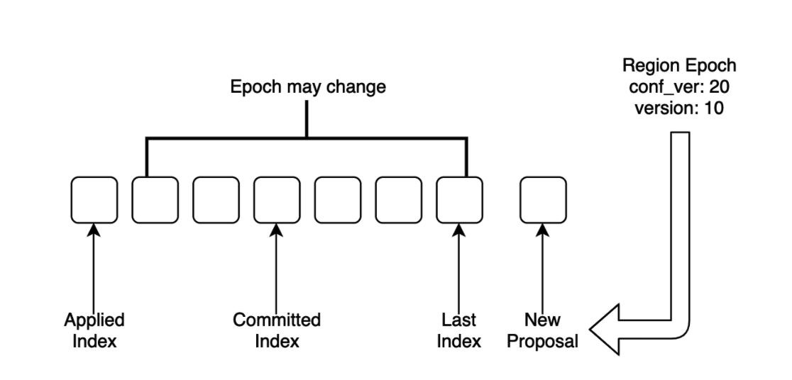

在学习了之前的几篇 **raft-rs**, **raftstore** 相关文章之后（如 [Raft Propose 的 Commit 和 Apply 情景分析](https://pingcap.com/blog-cn/tikv-source-code-reading-18/)，[Raftstore 概览](https://pingcap.com/blog-cn/tikv-source-code-reading-17/)等），**raft-rs** 以及 **raftstore** 的流程大家应该基本了解了。其中 raft-rs 解决的是单个 `Raft group`（即单个 Region） 的问题，raftstore 解决的是多个 `Raft group` （即多个 Region）的问题。Split 和 Merge 则是 raftstore 多个 `Raft group` 所独有的操作。 TiKV 中的 Split 能把一个 Region 分裂成多个 Region，Merge 则能把 Range 相邻的 2 个 Region 合成一个 Region。本文接下来要介绍的是 Split 的源码。

## Region epoch

```
message RegionEpoch {
    // Conf change version, auto increment when add or remove peer
    uint64 conf_ver = 1;
    // Region version, auto increment when split or merge
    uint64 version = 2;
}
```

我们先从 `region epoch` 讲起，上面是它的 protobuf 定义，在之前的[源码分享文章](https://pingcap.com/blog-cn/tikv-source-code-reading-18/)中提到过，它的本质就是两个版本号，更新规则如下：

1. 配置变更的时候， `conf_ver` + 1。

2. Split 的时候，原 region 与新 region 的 `version` 均等于原 region 的 `version` + 新 region 个数。

3. Merge 的时候，两个 region 的 `version` 均等于这两个 region 的 `version` 最大值 + 1。

2 和 3 两个规则可以推出一个有趣的结论：如果两个 Region 拥有的范围有重叠，只需比较两者的 `version` 即可确认两者之间的历史先后顺序，`version` 大的意味着更新，不存在相等的情况。

证明比较简单，由于范围只在 Split 和 Merge 的时候才会改变，而每一次的 Split 和 Merge 都会更新影响到的范围里 Region 的 `version`，并且更新到比原范围中的 `version` 更大，对于一段范围来说，不管它属于哪个 Region，它所在 Region 的 `version` 一定是严格单调递增的。

PD 使用了这个规则去判断范围重叠的不同 Region 的新旧。

每条 Proposal 都会在提出的时候带上 PeerFsm 的 Region epoch，在应用的时候检查该 Region epoch 的合法性，如果不合法就跳过。



上图所示，新 Proposal 的 Region epoch 是应用了 `Applied Index` 那条 Proposal 之后得到的，如果在 `Applied Index` + 1 到 `Last Index` 之间的 Proposal 有修改 Region Epoch 的操作，新 Proposal 就有可能会在应用的时候被跳过。

列举两个被跳过的情况，其他的可参照代码 `store::util::check_region_epoch`：

1. 非 Admin Request， Proposal 中的 `version` 与当前的不相等。

2. Split，Merge 的 Request，Proposal 中的 Region epoch 与当前的不相等。

## Split 触发

Split 触发的条件大体分两种：

1. PD 触发

2. TiKV 每个 Region 自行定时检查触发

PD 触发主要是指定哪些 key 去 Split，[Split Region 使用文档](https://docs.pingcap.com/zh/tidb/dev/sql-statement-split-region) 中的功能就是利用 PD 触发实现的。

每个 Region 每隔 `split-region-check-tick-interval`（默认 10s）就会触发一次 Split 检查，代码见 `PeerFsmDelegate::on_split_region_check_tick`，以下几个情况不触发检查

* 有检查任务正在进行；

* 数据增量小于阈值；

* 当前正在生成 snapshot 中并且触发次数小于定值。如果频繁 Split，会导致生成的 snapshot 可能因为 `version` 与当前不一致被丢弃，但是也不能一直不 Split，故设置了触发上限。

触发检查后，会发送任务至 `split_checker_worker`，任务运行时调用 `split_checker.rs` 中函数 `Runner::check_split`。

1. 调用 `coprocessor::new_split_checker_host` 获取 `SplitCheckerHost`，获取时会对每一个注册过的 `split_check_observers` 调用 `add_checker`，若满足触发阈值则会把它的 `split_check`加入 `SplitCheckerHost::checkers` 中，如果 `checkers` 为空则结束检查。（值得一提的是，这里的 `coprocessor` 并不是指的是计算下推的那个 `coprocessor`，而是观测 raftstore 事件，给外部提供事件触发的 `coprocessor`，它的存在可以很好的减少外部观测事件对 raftstore 代码的侵入）

2. 获取 `policy`，这里的 `policy` 只有两种，分别是 `SCAN` 和 `APPROXIMATE`，即扫描和取近似，遍历 `split_checker` 调用它们的 `policy`，只要有一个给出的 `policy` 是取近似，那么最终的结果就是取近似，反之则是扫描。

3. 获取 Split key。

	a.  若 `policy` 为扫描，调用 `scan_split_keys`，扫描读出该 Region 范围大 Column Family 的所有数据，对于每一对 KV，调用每个 `split_checker` 的 `on_kv` 计算 Split key，扫描完成后遍历 `split_checker` 的 `split_keys` 返回第一个不为空的结果。由于需要扫描存储的数据，这个策略会引入额外的 I/O。

	b.  若为取近似，调用 `approximate_split_keys`，遍历 `split_checker` 的 `approximate_split_keys`，返回第一个不为空的结果。这是通过 RocksDB 的 property 来实现的，几乎没有额外的 I/O 被引入，因而性能上是更优的策略。

4. 发送 `CasualMessage::SplitRegion` 给这个 Region。

`SplitCheckerHost` 只是聚合了`split_check` 的结果，具体实现还是在这些 `split_check` 中，它们均实现了 `SplitChecker` trait，由上文的流程叙述也都提到了这些函数。

```
pub trait SplitChecker<E> {
    /// Hook to call for every kv scanned during split.
    ///
    /// Return true to abort scan early.
    fn on_kv(&mut self, _: &mut ObserverContext<'_>, _: &KeyEntry) -> bool {
        false
    }

    /// Get the desired split keys.
    fn split_keys(&mut self) -> Vec<Vec<u8>>;

    /// Get approximate split keys without scan.
    fn approximate_split_keys(&mut self, _: &Region, _: &E) -> Result<Vec<Vec<u8>>> {
        Ok(vec![])
    }

    /// Get split policy.
    fn policy(&self) -> CheckPolicy;
}
```

`split_check` 有以下几种：

1. 检查 Region 的总或者近似 Size，代码位于 `size.rs`。

2. 检查 Region 的总或者近似 Key 数量是否超过阈值，代码位于 `key.rs`。

3. 根据 Key 范围二分 Split，代码位于 `half.rs`，除了上文讲的 PD 指定 key 来 Split，这种方式也是由 PD 触发的，目前只有通过 `pd-ctl` 和 `tikv-ctl` 的命令来手动触发。

4. 根据  Key 所属 Table 前缀 Split，代码位于 `table.rs`，配置默认关闭。

由于篇幅所限，具体的实现细节可参阅代码。

## Split 实现

Split 的实现相对简单，总的来说，Split 这个操作被当做一条 Proposal 通过 Raft 达成共识，然后各自的 Peer 分别执行 Split。

讲一下具体的流程。

在触发 Split 之后，触发方会发送一条 `CasualMessage::SplitRegion` 给这个 Region，处理代码见 `PeerFsmDelegate::on_prepare_split_region`，除了需要检查是否是 leader，还需检查 `version` 是否有变化，如有变化就拒绝触发 Split。

检查成功后，发送一条 RPC 向 PD 请求分配一些新的 ID，包含所有新 Region 的 ID 以及它所有的 Peer ID，等到 PD 回复后，构造一个类型为 `AdminCmdType::BatchSplit` 的 Proposal 提给该 Peer。代码在 pd_worker 下的 `handle_ask_batch_split`。

之后的流程就如 [Raft Propose 的 Commit 和 Apply 情景分析](https://pingcap.com/blog-cn/tikv-source-code-reading-18/) 所描述的那样，如上文所述，在应用前会判断 Region epoch 的合法性，如果不合法就需要跳过。假设它没有被跳过，接下来看这条 Proposal 应用的地方 `ApplyDelegate::exec_batch_split`。

1. 更新原 Region 的 `version`，新 Region 的 epoch 继承原 Region 的 epoch。

2. `right_derive` 为 true 的，原 Region 要分裂到右侧，为 false 则反之，依次设置每个 Region 的 start key 与 end key。

3. 对每个 Split 出来的新 Region 调用 `write_peer_state` 与 `write_initial_apply_state` 创建元数据。

在应用完成之后，ApplyFsm 会发送 `PeerMsg::ApplyRes` 给 PeerFsm, PeerFsm 处理的代码在 `PeerFsmDelegate::on_ready_split_region`

1. 如果是 leader，上报 PD 自己以及新 Region 的 meta 信息（包含范围，Region epoch 等等一系列信息）。

2. 依次创建新 Region 的 PeerFsm 和 ApplyFsm，做一些注册的工作。

3. 更新 PeerFsm 的 Region epoch。

需要注意的是，如果在应用完成落盘后宕机，这部分的工作能在重启后恢复。其实所有日志应用的设计都需要满足这个原则。

到这里 Split 的工作就完成了，等到原 Region 大多数的 Peer 都完成了 Split 的工作后，新 Region 就可以成功选出 leader 并且提供服务了。

## Split 过程中的一致性

在各机器时钟偏移不超过一定范围的前提下，某个 Region 的 Leader 持有 Raft 租约能保证这段时间不会产生其他 term 更大的 Leader，基于这个保证，使用租约可以提供[**线性一致性**](https://pingcap.com/blog-cn/linearizability-and-raft/)的本地读取功能，具体实现可以参考上一篇[源码阅读文章](https://pingcap.com/blog-cn/tikv-source-code-reading-19/)。

但是在 Split 过程中，原 Region 持有的租约并不能保证这一点。

假设 3 个副本，考虑如下情况：Split Proposal 在 2 个 Follower 上已经应用完成，同时 Leader 上还没有应用（由于 apply 是异步的，Follower 上的应用进度可能超过 Leader）。

Split 之后原 Region 的范围缩小，其余的范围属于新 Region，而新 Region 存活的 Peer 个数已经超过了 Raft 所要求的大多数副本，故可以合理的发起选举并产生 Leader，并且正常服务读写请求。此时原 Region Leader 仍然还未应用 Split Proposal，如果因为持有租约继续服务原范围的读请求，就会破坏[**线性一致性**](https://pingcap.com/blog-cn/linearizability-and-raft/)。

TiKV 处理方式是在 Split 期间不续约租约。方法是记录最后一条 Split Proposal 的 index `last_committed_split_idx`, 记录位置见 `Peer::handle_raft_ready_append`。只需判断 `last_committed_split_idx` 是否大于 `applied_index` 即可得知是否在 Split 期间(`Peer::is_splitting`)。

阅读过 `Peer::handle_raft_ready_append` 中记录 `last_committed_split_idx` 的小伙伴应该能注意这里并没有让租约立马失效，仅仅设置 index 阻止下次续约。换句话说，在 Split 期间的那次租约时间内是可以让原 Region 的 Leader 提供本地读取功能的。根据前面的分析，这样做貌似是不合理的。

原因十分有趣，对于原 Region 非 Leader 的 Peer 来说，它创建新 Region 的 Peer 是不能立马发起选举的，得等待一个 Raft 的选举超时时间，而对于原 Region 是 Leader 的 Peer 来说，新 Region 的 Peer 可以立马发起选举。Raft 的超时选举时间是要比租约时间长的，这是保证租约正确性的前提。所以在 Split 期间的那次租约时间内，在其他 TiKV 上的新 Region Peer 就算创建出来了，也不会发起选举，因此保证了不会有新数据写入，故在原 Region 上读取不会破坏[**线性一致性**](https://pingcap.com/blog-cn/linearizability-and-raft/)。

## 总结

Region Split 的基础流程比较简单，简单来说就是依赖原 Region 的 Raft 提供的可靠复制功能实现的，而与此相对的 Region Merge 由于两个 Region 属于不同的 Raft group，与 Region Split，Raft Snapshot 的相互作用，再加上网络隔离带来的影响，无疑有更大的复杂度。在之后的源码阅读文章中我们会继续讲解 Region Merge，敬请期待！
