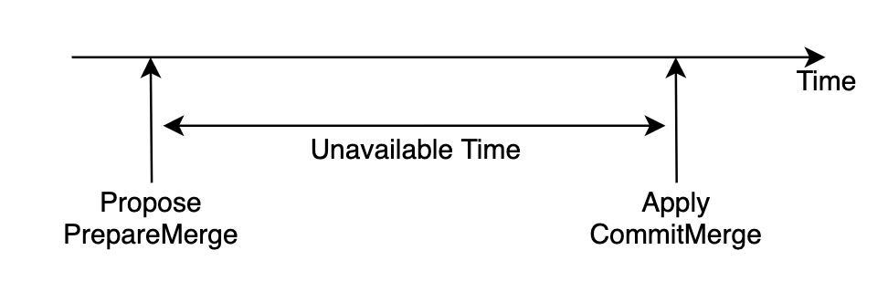

Region Merge 是 Range 相邻的两个的 Region 合并的过程，我们把一个 Region 称为 Source Region，另一个称为 Target Region，在 Merge 过程结束后，Target Region 管理的 Range 会扩大到 Source Region 的部分，Source Region 则被删除。 

在上一篇 [Region Split 源码解析](https://pingcap.com/blog-cn/tikv-source-code-reading-20/) 的结尾，我们提到了与其相对的 Region Merge 的复杂性。

> 由于两个 Region 属于不同的 Raft group，与 Region Split，Raft Snapshot 的相互作用，再加上网络隔离带来的影响，无疑有更大的复杂度。

本文接下来将会解开 Region Merge 的神秘面纱。

## Merge 的设计需求

我们希望 Merge 的设计能够满足以下几个需求：

1. 不依靠 PD 在 Merge 期间不发起其他的调度满足正确性

2. 不会因为网络隔离或者宕机引发正确性问题

3. 只要参与 Merge 的 TiKV 中 Majority 存活且能互相通信，Merge 可以继续或者回滚，不会被阻塞住（跟 Raft 保证可用性的要求一致）

4. 出于性能考虑，不对 Split/Conf Change 加额外条件限制

5. 尽量减少搬迁数据的开销

6. 尽量减少 Merge 期间服务不可用的时间

接下来我们来看一下 TiKV 的 Merge 是怎么一一满足这些需求的。

## Merge 的触发

与 Split 和 Conf Change 类似，PD 担任发起者。但是与 Split 不同的是，Merge 的触发完全是由 PD 判断的：

1. 如果 Region 的大小大于 `max-merge-region-size` （默认 20MB）或者 key 数量大于 `max-merge-region-keys` （默认 200000）不会触发 Merge。

2. 对于新 Split 的 Region 在一段时间内 `split-merge-interval`（默认 1h）不会触发 Merge。

3. 确保 Source Region 与 Target Region 的所有 Peer 都存在，该信息是通过 Region Leader 上报 PD 获得。

4. 还有一些其他的触发条件，这些属于内部机制，超出了本文的范围。

PD 在决定某个 Source Region 需要 Merge 到相邻的 Target Region 之后，之后会通过 Conf Change 把它们的 Peer 对齐到相同的 TiKV 上，再给该 Region 发送请求触发 Merge。

## Merge 的流程

PD 发送给 Source Region Leader 的请求中会带上 Target Region 的 Region 信息。该 Leader 收到请求后，会 Propose 一条 `PrepareMerge`，在真正 Propose 之前，需要检查如下几项是否满足：

1. 本地的 Target Region 的 Epoch 跟 Region 信息中的一致（Epoch 的含义可参考 [Region Split 源码解析](https://pingcap.com/blog-cn/tikv-source-code-reading-20/)），如果一致，检查是否是范围相邻 Region，是否所有对应 Peer 都在相同的 Store 上，代码见 PeerFsmDelegate `check_merge_proposal`。

2. 所有 Follower 落后的日志数目小于 `merge-max-log-gap`（默认 10）

    a. 后面步骤中有补日志的操作，需要控制落后日志的数量。

3. 从所有 Follower 上最小的 commit index 对应的日志到当前最后一条日志之间没有如下的 cmd（Leader 会维护所有 Follower 已知的 commit index）

    a. CompactLog，为了保证后面取日志的时候，日志还存在。

    b. Split/Merge/Conf Change，为了减少网络隔离时候的复杂情况，在后文讲解网络隔离的时候会具体说明。

2，3 代码见 Peer `pre_propose_prepare_merge`。

如果以上几项均满足，该 `PrepareMerge` 可以真正被 Propose 了，反之则会忽略该请求。

```
message PrepareMergeRequest {
    uint64 min_index = 1;
    metapb.Region target = 2;
}
```

其中 min_index 代表的是所有 Follower 中最小的 match index，target 存的是 PD 发送过来的 Target Region 信息。

在 `PrepareMerge` 被 Propose 之后，之后的 Proposal 在 Apply 的时候会因为 Epoch 被跳过，也就是说，这个时候 Source Region 不能服务读写请求了。

接下来看 `PrepareMerge` 被 Commit 后 Apply 的代码 ApplyDelegate `exec_prepare_merge`：

- 修改 `RegionLocalState` 中 PeerState 为 Merging。

- 修改 `RegionLocalState` 中 MergeState，存入 min_index，target，commit 信息，其中 commit 为 `PrepareMerge` 对应的 index。

```
enum PeerState {
    Normal = 0;
    Applying = 1;
    Tombstone = 2;
    Merging = 3;
}
message MergeState {
    uint64 min_index = 1;
    metapb.Region target = 2;
    uint64 commit = 3;
}
message RegionLocalState {
    PeerState state = 1;
    metapb.Region region = 2;
    MergeState merge_state = 3;
}
```

随后每一个 Source Peer 都会定时触发 merge tick，代码见 PeerFsmDelegate `on_check_merge`:

1. 比较本地 Target Peer 与 MergeState 中的 target 的 Epoch

    a. 若本地没有 Target Peer 或者前者大，这里存在两种可能性

     * PD 在期间对 Target Region 发起了调度请求（Split，Merge，Conf Change）。

     * Merge 成功了，但是本地的 Target Peer 在某些情况下不需要本地的 Source Peer 去 Apply `CommitMerge`。比如 Target Region 在 Merge 之后又进行了 Split，而本地的 Target Peer 又通过 Snapshot 恢复（与 Source Peer 的 Range 没有重叠），这种情况下 Source Peer 与 Target Peer 就会同时存在，又比如本地的 Target Peer 在随后通过 Conf Change 被移除了，但是因为被隔离了，被移除的时候没有 Apply 完所有日志（也就没有 Apply `CommitMerge`）。

     为了区分这两种情况，这里使用了一个巧妙的解法：如果有 Quorum 的 Source Peer 都发现了本地没有 Target Peer 或者 Epoch 更大，但是自己还仍然存在，则说明一定是情况 1 了（反之则继续等待），此时必须得 Rollback，代码见 PeerFsmDelegate `on_check_merge`。Rollback 的过程比较简单，只需 Propose 一条 `RollbackMerge`，等待 Apply 之后，Source Region 即可重新恢复服务。

    b. 若前者小，说明本地还未追上，继续等待。

    c. 若相等则下一步。

2. 给本地的 Target Peer Propose 一条 `CommitMerge`。

    ```
    message CommitMergeRequest {
        metapb.Region source = 1;
        uint64 commit = 2;
        repeated eraftpb.Entry entries = 3;
    }
    ```

    其中 source 是 Source Region 的信息，commit 是 MergeState 中的 commit，entries 是 index 从 MergeState 中的 min_index + 1 到 commit 的 Raft Log。

小伙伴们肯定会好奇为什么 `CommitMerge` 不只发给 Target Region 的 Leader？这其实是为了简化实现，因为定时给本地的发就不需要考虑 Target Region 的 Leader 是否切换了以及网络是否隔离的问题了。

- 非 Leader 的 Peer 收到后会静默丢弃，而 Leader 这里不用担心多次 Propose 的问题，Apply `CommitMerge` 会让 Epoch 中的 version 增加，所以在之后带有相同 Epoch 的 Proposal 都会被跳过。

接下来 Merge 的重心就转移到 Target Region 上了。

我们来看 Target Region Apply `CommitMerge` 的地方，代码见 ApplyDelegate `exec_commit_merge`：

1. 由于 Source Region 的日志可能不够，为了让数据一致，我们先发送 `CommitMerge`中的 entries 给 Source Region，等待它把日志补全并且全部 Apply 完

    - 由于牵扯到并发逻辑处理，具体流程较复杂，感兴趣的小伙伴可参见 `exec_commit_merge` 的函数注释自行阅读源码。

2. 修改 Source Region 的 Peer 状态为 Tombstone。

3. 扩大 Target Region 的 Range 范围，修改 Epoch 的 version 为 max(source_version, target_version) + 1。

至此，Merge 的过程已经完成了，原 Source Region 范围内的数据现在由 Target Region 提供读写服务。

## Merge/Split 对 Raft 算法的影响

众所周知，根据 Raft 算法本身依赖的复制状态机理论，Apply 日志是不能存在条件的，换句话说，对于任何参与者来说，只要拥有相同的日志，Apply 完之后就应该达成一致的状态。

但是我们回顾上文的 Merge 流程，仔细的小伙伴们会发现一个 Merge 成功的重要性质：

性质 1：Target Peer 在 Apply `CommitMerge` 的时候，本地一定存在对应的 Source Peer。

这是因为 Merge 的流程设计上想尽量减少开销，在 `CommitMerge` 中只存有很少一部分的日志，而绝大多数的数据只能依靠本地的 Source Peer。

- 试想如果我们让 `CommitMerge` 中带上 Source Region 的所有数据，这个问题就不复存在了

满足性质 1 也就意味着只有参与 Merge 过程的 Target Peer 才能 Apply `CommitMerge`，所以这里对 Raft 算法的影响点就集中在了 Conf Change 上。

> `raft-rs` 中的 Configuration Change (简称 Conf Change) 算法移植自 etcd/raft。该算法有两种模式，single membership change 和 joint consensus，在 Raft 论文中均有描述，但是对于 Configuration 何时生效，etcd/raft 的实现的与 Raft 论文中描述的有很大的不同。Raft 论文中描述的是在收到后就生效，而 etcd/raft 则是在 Apply 之后才生效。讨论两种方式的优缺点超出了本文的范围，不过对于 TiKV 的 Split/Merge 的实现来说，etcd/raft 的方式降低了实现的复杂度。

假设 `CommitMerge` 能成功 Apply，即不会被 Epoch 的检查所跳过，那么说明在它 Propose 的时候，那些在它之前还未 Apply 的 Proposal 里均不存在修改 Epoch 的操作，也不会有 Conf Change 的操作，所以这个时候只有在 Propose 的时候期望的那些 Target Peer 会 Apply `CommitMerge`。

而对于在 `CommitMerge` 之后的 Conf Change 来说，生效是等待 Apply 之后，此时 `CommitMerge` 已经 Apply 完了。假设有新增 Peer，为了满足性质 1，Leader 需要保证发出的 Snapshot 至少得是 Apply 了 `CommitMerge` 之后的。

Split 有类似的条件，只有参与 Split 过程的 Peer 才能 Apply `BatchSplit`。同样是依靠这三点来保证这一条件：1. Epoch 检查 2. Conf Change 在 Apply 之后生效 3. 新 Snapshot 得是 Apply 了 `BatchSplit` 之后的。

TiKV 对于保证 Snapshot 的实现比较简单，在生成 snapshot 之后，对比一下它的 Epoch 中的 conf_ver 和当前的 conf_ver，如果前者小就要重新生成。这样可以保证生成的 Snapshot 的 index 一定大于等于最后一条 Apply 的 Conf Change 的 index，所以也就大于上述情况中的 `CommitMerge` 或者 `BatchSplit` 的 index，间接保证了以上的条件。（代码见 PeerStorage `validate_snap`）

## 隔离的恢复问题

接下来我们来考虑隔离的恢复问题。这里的隔离不仅指的是网络隔离，宕机也可以认为是一种隔离，两者需要考虑的恢复问题是等价的。

如果还可以通过追日志恢复，那么就与正常流程没有区别。剩下的情况就是被 Conf Change 移除了，或者通过 Snapshot 恢复，这里我们主要讨论通过 Snapshot 恢复的问题。

回顾 Merge 流程在一开始 Propose `PrepareMerge` 之前的检查条件 3

- 检查从所有 Source Region 的 Follower 上最小的 commit index 对应的日志到当前最后一条日志之间是否没有CompactLog/Split/Merge/Conf Change。

据此，可推出性质 2：Snapshot 不用考虑多次覆盖的 Merge 的情况，即 A merge to B，B merge to C（当然 A merge to B，C merge to B 的情况还是需要考虑的）。

这一性质很好证明，如果某个隔离的 TiKV 上有 A B C 三个 Region 的 Peer，被隔离时，A merge to B 可以成功，但是 B merge to C 会被上述的检查条件 3 给挡住。

有了该性质之后，Snapshot 只需要在 Apply 前删除那些要 Merge 给自己的 Source Peer 即可。但是删除这些 Source Peer 并不能随便删，必须要确保之后 Apply Snapshot 不会失败才能删。这里隐藏着一个违反性质 1 的陷阱，发送 Snapshot 并不意味着之后一定都会发 Snapshot，由于可能只有 Leader 把日志给 Compact 了，可以构造一种情况在 Leader 给某 Peer 发送 Snapshot 之后，之后的 Leader 仍然给它发送日志，如果此时 Source Peer 已经被删除，那就无法 Apply `CommitMerge` 了，违反性质 1。

- 如何构造的问题就留给读者解答了。

在 TiKV 的实现中是先检查该 Snapshot 是否在删除 Source Peer 之后范围不冲突（代码见 PeerFsmDelegate `check_snapshot`），然后在暂停 Source Peer 运行之后，对 Source Peer RegionLocalState 中的 PeerState 设置为 Tombstone，Target Peer RegionLocalState 中的 PeerState 设置为 Applying（代码见 PeerStorage `apply_snapshot`），并且使用 RocksDB WriteBatch 原子的写入来解决该问题。

- 如果在写入之后宕机，重启后，Source Peer 状态是 Tombstone 会清理剩余的数据，Target Peer 状态是 Applying 会继续 Apply Snapshot。

## Merge 对租约的影响

在 [Region Split 源码解析](https://pingcap.com/blog-cn/tikv-source-code-reading-20/) 中提到 Split 对于 Leader 的租约是有影响的，类似的，Merge 对于租约也有影响。

Target Region 在`CommitMerge` 之后，Target Leader 就能正常的处理 Source Region 范围部分的读写请求了，由于 Source Leader 和 Target Leader 并不一定在一台 TiKV 上，Source Leader 到底要何时让租约过期才是正确的呢？

正确的时间是在 Source Leader 得知 `PrepareMerge` 已经 commit 并且准备广播该 commit 的消息之前（代码见 Peer `on_leader_commit_idx_changed`）。这是因为在其他的 Source Peer 收到该 commit 消息之后很短时间内，Merge 的过程可能已经成功了，并且 Target Leader 也已经完成了 Source Region 范围内新的写请求。此时若 Source Leader 仍然持有租约继续服务读请求，就会返回旧数据，从而违反线性一致性。

## Merge 对 Split 的影响

在 [Region Split 源码解析](https://pingcap.com/blog-cn/tikv-source-code-reading-20/) 中的 Split 实现章节我们讲到在 Apply Split 的时候会对每个新的 Region 创建元数据。这里存在一个隐蔽的前提：Split 中的新 Region 一定是第一次出现在本地的。如果该前提被打破，Split 时写入新 Region 的元数据就可能覆盖掉正在运行中的新 Region 的元数据，影响正确性。

该前提在只有 Split 的情况下是可以保证的，因为范围重叠，新 Region 是无法提前被创建出来的。但是由于 Merge 的存在，新 Region 可能会“逃脱”原 Region 的范围，从而违反该前提。

举个例子：
Region A 要 Split，新 Region 为 C，但是在 TiKV 1 上的 Region A 因为某种原因，运行缓慢，一直没有 Apply Split。

注：* 代表空

|  TiKV |  origin  | A split |
|  ----  | ----  | ----  |
|  1 | A A * | A A *  |
|  2  | A A B  | C A B  |
|  3 | A A B  | C A B  |
|  4  | ** B  | ** B  |

此时进行了 Conf Change。Region C 和 A 各自都移除了 TiKV 1 上的 Peer，也在 TiKV 4 上增加了 Peer。

|  TiKV  | conf change  | A merge to C  | B merge to C  | C split  |
|  ----  | ----  | ----  | ----  | ----  |
|  1  |  A A *  |  A A *  |  A A *  |  A A *  |
|  2  | C A B  | C C B  | C C C  | D E C  |
|  3  | C A B  | C C B  | C C C  | D E C  |
|  4  | C A B  | C C B  | C C C  | D E C  |

Region C 进行了 2 次 Merge 以及 Split 之后，再次进行 Conf Change，移除了 TiKV 4 上的 Peer，在 TiKV 1 上增加 Peer。

|  TiKV  |  conf change  |
|  ----  | ----  |
|  1  | A A C  |
|  2  | D E C  |
|  3  | D E C  |
|  4  | D E *  |

此时已经打破前提了，在 TiKV 1 上，Region C 已经在 Region A Apply `BatchSplit` 之前出现了。

可以发现该问题的触发并不容易，这是因为一些实现细节的原因，比如 Split 之后原 Region 的位置以及 Merge 在 Propose `PrepareMerge` 时的检查条件等等。

由于创建新 Peer 与 Apply Split 是在不同的线程，涉及到并发逻辑，解决该问题的实现细节比较复杂，这里就不详述了，感兴趣的小伙伴可自行阅读源码。

## 总结

我们来回顾一下之前提到的设计需求：

1. 不依靠 PD 在 Merge 期间不发起其他的调度满足正确性

    - 满足，如果 PD 在 Merge 期间进行调度，Merge 会 Rollback

2. 不会因为网络隔离或者宕机引发正确性问题

    - 满足

3. 只要参与 Merge 的 TiKV 中 Majority 存活且能互相通信，Merge 可以继续或者回滚，不会被阻塞住（跟 Raft 保证可用性的要求一致）

    - 满足

4. 出于性能考虑，不对 Split/Conf Change 加额外条件限制

    - 满足

5. 尽量减少搬迁数据的开销

    - 在 PD 搬迁副本之后，Merge 带来的额外数据仅只有一小部分日志

6. 尽量减少 Merge 期间服务不可用的时间

    - Target Region 无服务不可用时间

    - Source Region 服务不可用时间如下

      

    - PD 会选择较冷的 Region 作为 Source Region，所以一般来说这个代价是可承受的

总的来说，TiKV 的 Region Merge 的设计基本达成了目标。

从全文来看，Region Merge 的设计上对原始 Raft 算法有一定的修改，有诸多的实现细节问题，再加上与其他功能的互相影响，复杂的隔离恢复问题等等，这一切也使它成为 TiKV 中最为复杂的功能之一。由于篇幅所限，本文主要帮助读者理清 Region Merge 的主体设计思路，更多的细节就留给感兴趣的读者们自行阅读源码了。

至此 TiKV 源码阅读就暂时告一段落了，TiKV 仍然还在不断的演化发展，朝着更稳，更快，更可靠的方向前进。希望小伙伴们能够持续关注 TiKV，加入我们的 [slack](http://tikv-wg.slack.com) 频道参与讨论或者提 [issue](https://github.com/tikv/tikv/issues) 和 [pr](https://github.com/tikv/tikv/pulls)。
