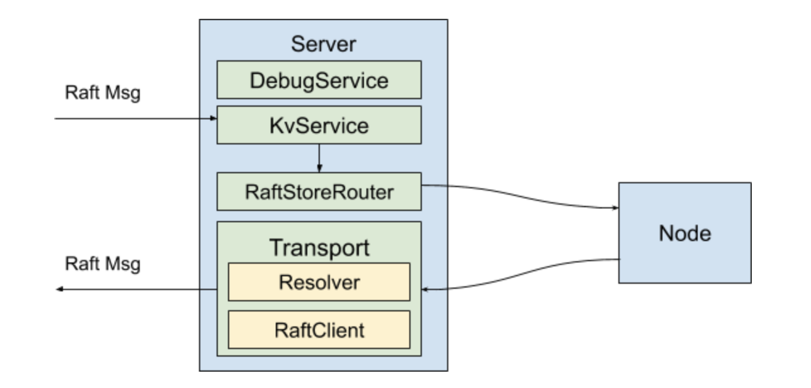

之前的 TiKV 源码解析系列文章介绍了 TiKV 依赖的周边库，从本篇文章开始，我们将开始介绍 TiKV 自身的代码。本文重点介绍 TiKV 最外面的一层——Service 层。

TiKV 的 Service 层的代码位于 `src/server` 文件夹下，其职责包括提供 RPC 服务、将 store id 解析成地址、TiKV 之间的相互通信等。这一部分的代码并不是特别复杂。本篇将会简要地介绍 Service 层的整体结构和组成 Service 层的各个组件。

## 整体结构

位于 `src/server/server.rs` 文件中的 `Server` 是我们本次介绍的 Service 层的主体。它封装了 TiKV 在网络上提供服务和 Raft group 成员之间相互通信的逻辑。`Server` 本身的代码比较简短，大部分代码都被分离到 `RaftClient`，`Transport`，`SnapRunner` 和几个 gRPC service 中。上述组件的层次关系如下图所示：



接下来，我们将详细介绍这些组件。

## Resolver

在一个集群中，每个 TiKV 实例都由一个唯一的 store id 进行标识。Resolver 的功能是将 store id 解析成 TiKV 的地址和端口，用于建立网络通信。

Resolver 是一个很简单的组件，其接口仅包含一个函数：

```rust
pub trait StoreAddrResolver: Send + Clone {
   fn resolve(&self, store_id: u64, cb: Callback) -> Result<()>;
}
```

其中 `Callback` 用于异步地返回结果。`PdStoreAddrResolver` 实现了该 trait，它的 `resolve` 方法的实现则是简单地将查询任务通过其 `sched` 成员发送给 `Runner`。而 `Runner` 则实现了 `Runnable<Task>`，其意义是 `Runner` 可以在自己的一个线程里运行，外界将会向 `Runner` 发送 `Task` 类型的消息，`Runner` 将对收到的 `Task` 进行处理。 这里使用了由 TiKV 的 util 提供的一个单线程 worker 框架，在 TiKV 的很多处代码中都有应用。`Runner` 的 `store_addrs` 字段是个 cache，它在执行任务时首先尝试在这个 cache 中找，找不到则向 PD 发送 RPC 请求来进行查询，并将查询结果添加进 cache 里。

## RaftClient

TiKV 是一个 Multi Raft 的结构，Region 的副本之间，即 Raft group 的成员之间需要相互通信，`RaftClient` 的作用便是管理 TiKV 之间的连接，并用于向其它 TiKV 节点发送 Raft 消息。`RaftClient` 可以和另一个节点建立多个连接，并把不同 Region 的请求均摊到这些连接上。这部分代码的主要的复杂性就在于连接的建立，也就是 `Conn::new` 这个函数。建立连接的代码的关键部分如下：

```rust
let client1 = TikvClient::new(channel);

let (tx, rx) = batch::unbounded::<RaftMessage>(RAFT_MSG_NOTIFY_SIZE);
let rx = batch::BatchReceiver::new(rx, RAFT_MSG_MAX_BATCH_SIZE, Vec::new, |v, e| v.push(e));
let rx1 = Arc::new(Mutex::new(rx));

let (batch_sink, batch_receiver) = client1.batch_raft().unwrap();
let batch_send_or_fallback = batch_sink
   .send_all(Reusable(rx1).map(move |v| {
       let mut batch_msgs = BatchRaftMessage::new();
       batch_msgs.set_msgs(RepeatedField::from(v));
       (batch_msgs, WriteFlags::default().buffer_hint(false))
   })).then(/*...*/);

client1.spawn(batch_send_or_fallback.map_err(/*...*/));
```

上述代码向指定地址调用了 `batch_raft` 这个 gRPC 接口。`batch_raft` 和 `raft` 都是 stream 接口。对 `RaftClient` 调用 `send` 方法会将消息发送到对应的 `Conn` 的 `stream` 成员，即上述代码的 `tx` 中，而在 gRPC 的线程中则会从 `rx` 中取出这些消息（这些消息被 `BatchReceiver` 这一层 batch 起来以提升性能），并通过网络发送出去。

如果对方不支持 batch，则会 fallback 到 `raft` 接口。这种情况通常仅在从旧版本升级的过程中发生。

## RaftStoreRouter 与 Transport

`RaftStoreRouter` 负责将收到的 Raft 消息转发给 raftstore 中对应的 Region，而 `Transport` 负责将 Raft 消息发送到指定的 store。

`ServerRaftStoreRouter` 是在 TiKV 实际运行时将会使用的 `RaftStoreRouter` 的实现，它包含一个内层的、由 raftstore 提供的 `RaftRouter` 对象和一个 `LocalReader` 对象。收到的请求如果是一个只读的请求，则会由 `LocalReader` 处理；其它情况则是交给内层的 router 来处理。

`ServerTransport` 则是 TiKV 实际运行时使用的 `Transport` 的实现（`Transport` trait 的定义在 raftstore 中），其内部包含一个 `RaftClient` 用于进行 RPC 通信。发送消息时，`ServerTransport` 通过上面说到的 Resolver 将消息中的 store id 解析为地址，并将解析的结果存入 `raft_client.addrs` 中；下次向同一个 store 发送消息时便不再需要再次解析。接下来，再通过 `RaftClient` 进行 RPC 请求，将消息发送出去。

## Node

`Node` 可以认为是将 raftstore 的复杂的创建、启动和停止逻辑进行封装的一层，其内部的 `RaftBatchSystem` 便是 raftstore 的核心。在启动过程中（即 `Node` 的 `start` 函数中），如果该节点是一个新建的节点，那么会进行 bootstrap 的过程，包括分配 store id、分配第一个 Region 等操作。

`Node` 并没有直接包含在 `Server` 之内，但是 raftstore 的运行需要有用于向其它 TiKV 发送消息的 `Transport`，而 `Transport` 作为提供网络通信功能的一部分，则是包含在 `Server` 内。所以我们可以看到，在 `src/binutil/server.rs` 文件的 `run_raft_server` 中（被 tikv-server 的 `main` 函数调用），启动过程中需要先创建 `Server`，然后创建并启动 `Node` 并把 `Server` 所创建的 `Transport` 传给 `Node`，最后再启动 `Node`。

## Service

TiKV 包含多个 gRPC service。其中，最重要的一个是 `KvService`，位于 `src/server/service/kv.rs` 文件中。

`KvService` 定义了 TiKV 的 `kv_get`，`kv_scan`，`kv_prewrite`，`kv_commit` 等事务操作的 API，用于执行 TiDB 下推下来的复杂查询和计算的 `coprocessor` API，以及 `raw_get`，`raw_put` 等 Raw KV API。`batch_commands` 接口则是用于将上述的接口 batch 起来，以优化高吞吐量的场景。当我们要为 TiKV 添加一个新的 API 时，首先就要在 kvproto 项目中添加相关消息体的定义，并在这里添加相关代码。另外，TiKV 的 Raft group 各成员之间通信用到的 `raft` 和 `batch_raft` 接口也是在这里提供的。

下面以 `kv_prewrite` 为例，介绍 TiKV 处理一个请求的流程。首先，无论是直接调用还是通过 `batch_commands` 接口调用，都会调用 `future_prewrite` 函数，并在该函数返回的 future 附加上根据结果发送响应的操作，再将得到的 future spawn 到 `RpcContext`，也就是一个线程池里。`future_prewrite` 的逻辑如下：

```rust
// 从请求体中取出调用 prewrite 所需的参数

let (cb, f) = paired_future_callback();
let res = storage.async_prewrite(/*其它参数*/, cb);

AndThenWith::new(res, f.map_err(Error::from)).map(|v| {
   let mut resp = PrewriteResponse::new();
   if let Some(err) = extract_region_error(&v) {
       resp.set_region_error(err);
   } else {
       resp.set_errors(RepeatedField::from_vec(extract_key_errors(v)));
   }
   resp
})
```

这里的 `paired_future_callback` 是一个 util 函数，它返回一个闭包 `cb` 和一个 future `f`，当 `cb` 被调用时 `f` 就会返回被传入 `cb` 的值。上述代码会立刻返回，但 future 中的逻辑在 `async_prewrite` 中的异步操作完成之后才会执行。一旦 prewrite 操作完成，`cb` 便会被调用，将结果传给 `f`，接下来，我们写在 `future` 中的创建和发送 Response 的逻辑便会继续执行。

## 总结

以上就是 TiKV 的 Service 层的代码解析。大家可以看到这些代码大量使用 trait 和泛型，这是为了方便将其中一些组件替换成另外一些实现，方便编写测试代码。另外，在 `src/server/snap.rs` 中，我们还有一个专门用于处理 Snapshot 的模块，由于 Snapshot 消息的特殊性，在其它模块中也有一些针对 snapshot 的代码。关于 Snapshot，我们将在另一篇文章里进行详细讲解，敬请期待。
