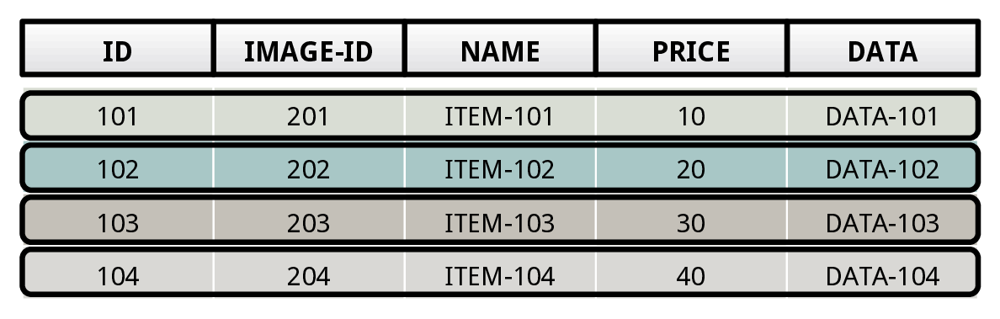
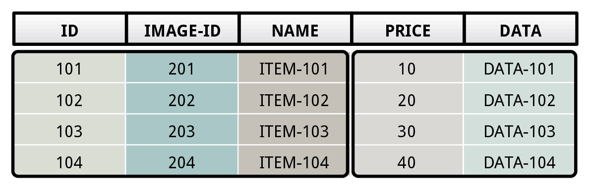
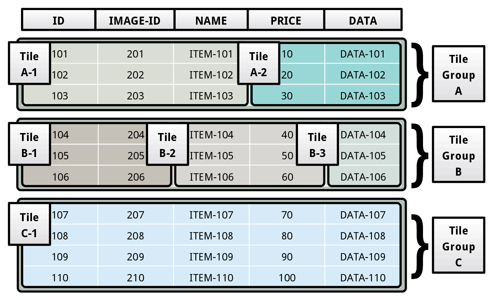
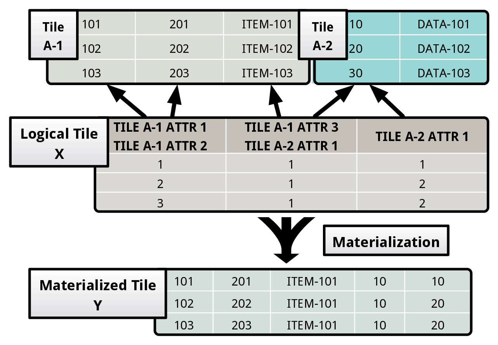
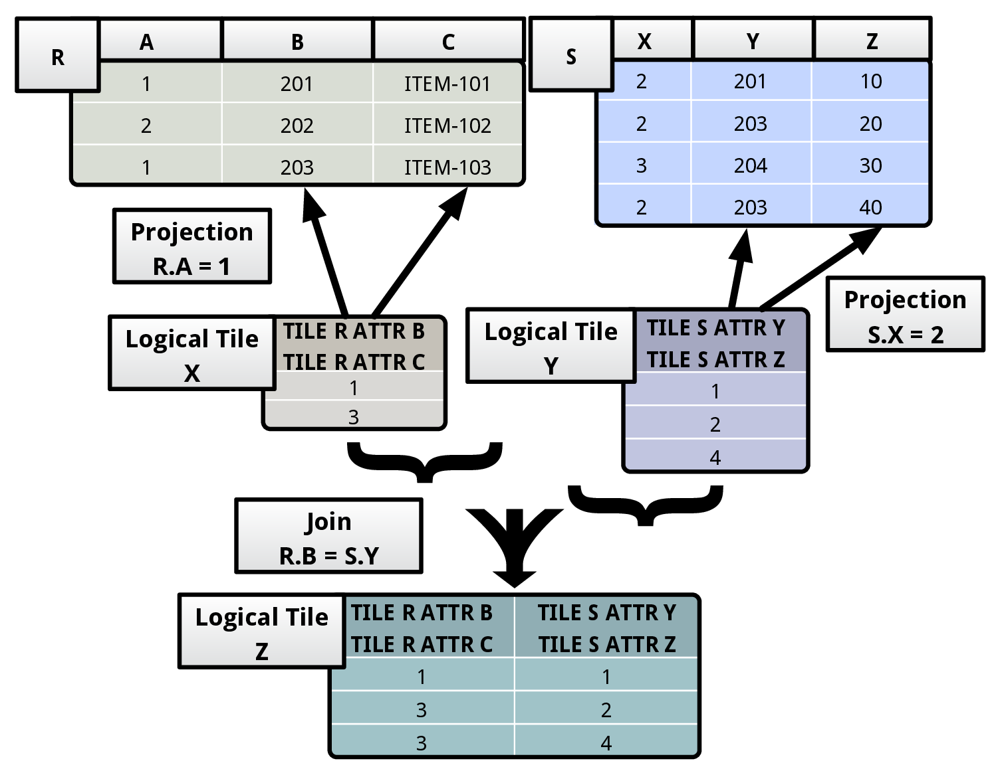

在之前的 [Kudu](http://www.jianshu.com/p/a6c0fdec3d7b) 的文章里面，我已经提到过，行列混存是一个非常有意思的研究方向，因为不同的存储方式有不同的针对应用场景，但作为技术人员，折腾是天性，所以大家都在研究如何融合行存和列存，让一个服务能尽量满足大部分应用需求，而这也是 TiDB 在努力的方向。

在 Kudu  Paper 里面说到，Kudu 首先在 mem 里面使用行存，但刷到硬盘之后，则使用的是列存，这当然是一个可以尝试的方式，但我觉得应该还有更多种的解决方式，于是找到了 CMU 的 [Peloton](https://github.com/cmu-db/peloton) 以及相关的 Paper，觉得有必要研究记录一下。

## Storage Model

很多时候，我喜欢用行存和列存，但看 Paper 的时候，发现都喜欢使用 NSM 和 DSM 来说明，这里就简单说明一下。

### NSM

NSM 是 `N-ary storage model` 的简称，当然就是通常的行存了。NSM 主要针对 OLTP 场景，因为需要高性能的随机写入，NSM 的存储方式如下：

NSM 不适用需要读取大量数据，并分析特定 column 的场景，因为 NSM 需要把整个 record 给读出来，在拿到对应的 column 数据分析，数据数据量很大，整个开销会很大。

### DSM

DSM 是 `decomposition storage model` 的简称，也就是列存。DSM 主要针对 OLAP 场景，因为需要对一些特定的 column 进行快速扫描分析，DSM 的存储方式如下：

DSM 当然就不适用与需要频繁随机更新的情况，因为任何写入，DSM 需要将 record 分开写入到不同的地方，写开销会很大。

### FSM

为了解决这个问题，就有了一个 FSM `flexible storage model` 来融合 NSM 和 DSM，在 Peloton 里面，它把这套系统叫做 HTAP (Hybrid Transactional/Analytical Processing)，

不同于 NSM 按照每行存放，以及 DSM 按照每列存放，FSM 将数据分成了多个区块，Peloton 里面叫做 Tile，上面的图显示的是两个 Tile，一个 Tile 包含了 ID，Image ID 以及 Name，而另一个 Tile 里面则是包含了 Price 和 Data。各个 Tile 里面数据是连续存放的。就是说，我们使用 Tile 来模拟了 DSM，在 Tile 里面则是 NSM。

## Tile-Based Architecture

Peloton 使用 tiles 来抽象了 storage 这一层，在上面的 FSM 例子我们可以看到，Tile 可以将一个 table 进行垂直和水平切分。Peloton 使用 physical tile 来处理实际的 storage，然后用另一个  logical tile 来隐藏了 physical tile 的实现，让外面更容易使用。

### Physical Tile

Physical tile 的最小存储单位是 tile tuple，一批 tile tuple 形成了一个 physical tile。而一批 physical tile 则组成一个 tile group。一个 table 则是有多个 tile group 组成。

在上面的例子中，table 被分成了三个 tile group (A, B, C)，每个 group 都有不同的 physical tiles。譬如 group A 就是由 tile A-1 和 A-2 组成，tile A-1 包含 table 前面三个 column ID，IMAGE-ID，和 NAME，而 tile A-2 则包含了 PRICE 和 DATA。

使用 tile group，我们可以非常方便的支持 FSM。对于新插入的数据，通常是热点数据，我们会直接放到一个 OLTP 友好的 group 中，也就是 group 里面只有一个 tile（NSM）。当数据变冷之后，我们就将当前的 tile group 转成更 OLAP 优化的布局，也就是 group 里面可能有几个 tile 了。当 group 里面每个 tile 都只有一个 column 的时候，这其实就变成了 DSM 了。

### Logical Tile

使用 physical tile 的好处在于我们可以根据不同的情况将数据切分成不同的布局，但是这对于查询并不友好，因为数据在不同的 tile 里面。为了解决这个问题，Peloton 引入了 logical tile。

Logical tile 隐藏了 physical tile 的具体实现，logical tile 的每个 column 可以指向一个或者多个 physical tiles 的 columns，每个 logical tile column 里面存储的是 tuple 在 physical tiles 里面的偏移位置。

在上面的例子中，logical tile X 指向了两个 physical tiles A-1 和  A-2。 X 的第一个 column 指向了 physical tile A-1 的 ATTR-1 和 ATTR-2。而第一个 column 里面存放的 1，2，3 则是对应的 tuple 在 tile A-1 里面的偏移。譬如 1 就对应的是 (101, 201)。

一个 logical tile column 也可以映射不同的 physical tile 的 columns。譬如上面 X 的第二个 column，就是对应的 tile A-1 的 ATTR-3 和 A-2 的 ATTR-1。当然一些 physical tile column 也可能不会有任何映射，譬如上面的 A-2 的 ATTR-2。

使用 logical tile 的好处是很明显的，主要包括：

+ Layout Transparency：logical tile 隐藏底层底层实际的存储实现，所以我们可以用不同的 engine 来满足不同的场景。
+ Vectorized Processing：使用 logical tile，我们可以一次进行一批向量处理，在一些场景下能极大的提升 CPU 性能。
+ Flexible Materialization：我们可以提前或者推迟的物化。在执行 query plan tree 的时候，甚至都能够动态去选择一个物化策略。
+ Caching Behavior：我们可以根据不同的维度去创建不同的 tile group，放到 cache 了，用来处理后续的查询。

### Logical Tile Algebra

Peloton 提供 algebra operators 来让外面更方便的使用。Operators 主要包括：

+ Bridge：Bridge operators 连接的 logical tile 和 physical tile。譬如我们可以使用 sequential scan 和 index scan operators 去访问实际的数据，然后生成对应的 logical tile。而 materialize operator 则是将实际的 logical tile 转成实际的 physical tile。
+ Metadata：Logical tile 的 metadata 存放的一些关于底层 physical tile 的信息，以及一些 bitmap 来表明哪些 rows 在执行的时候必须被检查。Metadata 的 operators 只会改变 logical tile 的 metadata，并不会改变底层的 physical tile 的数据。譬如 projection operator  如果发现上层的 query plan 并不需要一些 attributes 了，就可以在 logical tile 里面移除。
+ Mutators ：Mutator operators 会改变 table 的实际存储数据。譬如 insert operator 首先会重新构建 logical tile 的 tuple，然后在插入到对应的 table 里面，而 delete operator 则是删除 table 里面的数据，update operator 则是先在 logical tile 里面删除，在通过之前的 tuple 重新构建一个新版本的 tuple，在插入到 table。Mutators 同时也会控制 tuple 在 transaction 里面的可见性。
+ Pipeline Breakers：当我们给一个 query plan 生成对应的 query plan tree 之后，在 tree 上层的 operators 需要等待 children 的操作完成返回了，才能继续进行。譬如 join operator 需要处理多个 logical tiles，并且在这些 tiles 上面执行 predicate。首先，join operator 会构建一个 output logical tile，它的 schema 是根据输入的 logical tile 来构建的。然后 join operator 会遍历 input logical tile，如果发现满足 predicate，就将结果放到 output logical tile，下面是 join 的一个例子：

	

## Layout reorganization

虽然基于 Tile-Based Architecture 看起来很美好，但如果对于不同的 query，如果没有好的 tile 与其对应，那么其实根本就没啥用。 Peloton 采用的方法是定期对每个 table 计算出最优化的 storage layout，然后在根据这个 layout 重新组织 table。

Peloton 使用一个轻量级的 monitor 来记录每个 query 访问的 attributes，用来确定哪一些 attributes 应该在新的 physical tile 里面放在一起。通常 Peloton 会收集 query 里面的 SELECT 和 WHERE 上面的 attributes。

为了减少监控带来的开销，monitor 会随机的对 query 进行采样统计，并且 monitor 还需要保证不能只关注频繁的 transactional query，还需要关注一些不频繁的 analytical query，所以 Peloton 会也会记录 query 的 plan cost，并通过这些来给 analytical query 生成特定的 storage layout。

Peloton 使用增量的方式进行 data layout 的 reorganization。对于一个给定的 tile group，Peloton 首先会将 data 拷贝到一个新的 layout 上面，同时会原子地用一个新的 tile group 来替换。任何并发的 delete 或者 update 操作都只会更新metadata 信息。新的 tile group 会有旧的 tile group metadata 的引用。如果一个 physical tile 没有被任何 logical tile 引用，那么 Peloton 就会将其回收。

对于一个热点 tile group 来说，因为很可能一直在被 OLTP 的事务持续访问，所以 Peloton 并不会对这种 tile group 做 reorganization，只会等到数据变冷之后才会进行。因为 Peloton 使用的是通用的 MVCC 模式，所以一段时间之后，老版本的数据一定会变成冷数据，那么就可以开始 reorganization 了。Reorganization 通常就是将 layout 从 OLTP 友好的，逐渐变成 OLAP 友好的。

## 小结

上面仅仅是介绍 Peloton 的一些实现 FSM 的机制，这里并没有介绍 MVCC，transaction 这些，因为这些对于数据库产品来说都几乎是标配的东西，原理上面差不多。这里仅仅是关注的是 Peloton 是如何做到行列混存的。

简单来说，Peloton 使用 physical tile 将数据切分成了不同的单元，同时用 logical tile 来隐藏了相关的实现，并提供 algebra 让上层更方便的操作。在后台，统计 query 等信息，并定期增量的对 layout 进行 reorganization。不得不说，整个设计思路还是很巧妙的。TiKV 后面也会考虑行列混存，我们一直想同时搞定 OLTP + OLAP，但究竟采用哪些方案，还需要我们慢慢研究和思考，也欢迎对这块感兴趣的同学加入。
