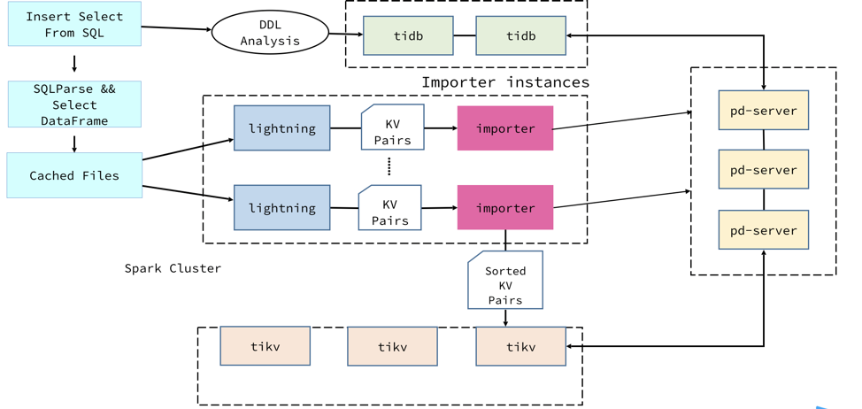

TiDB 作为 HTAP 数据库的代表在越来越多的行业得到了广泛的使用。 在这一过程中，大家最为苦恼的事情之一就是如何将海量数据以比较快的速度导入 TiDB 集群。 单纯通过 load 语句导入数据非常的慢；而目前作为数据导入速度最快的 TiDB Lightning 也因为数据源的问题也存在一些局限。 某些公司的 PoC 也因为数据导入的问题而进展缓慢。公司内部的各种 benchmark 测试也是苦恼于数据导入速度。 

可以说，天下苦数据导入速度久矣。 

基于以上背景，本次我们项目的出发点就是两个：

1. 比 TiDB Lightning 更快且能水平 Scale。

2. 不仅仅支持 MyDumper 和 CSV 作为数据源，而且能和目前的大数据生态做到完美融合。

## 项目设计

原先 TiDB Lightning 含有两个模块。 一个是 Lightning，一个是 Importer。 Lightning 负责将数据（要么是 csv 格式数据，要么是 MyDumper 格式数据 ）变成 TiKV 的 key-value pairs 写入 Importer。 Importer 则负责将这些 key-value pairs 排序并且写入至 TiKV 中；最后调用 ingest SST 接口将数据持久化写入底层 RocksDB 中。

对于当前的 TiDB Lightning 来说，有一个缺陷是 Lightning 和 Importer 都是单机部署，并且都是 CPU-bound 的，所以文档中建议 Lightning 和 Importer 分别部署在两台机器上，最好也不要和 TiKV 一起部署。这样一来 TiDB Lightning 的性能受制于单机性能，包括 IO，CPU 以及网络，导致导入性能无法发挥至最大。同时，为了导入而新起两台机器也对用户而言不太友好。

基于以上的想法，在一开始计划讨论的时候，我们希望在 TiSpark 中同时实现 Lightning + Importer 组合，利用分布式计算的优点，大家一起简单的脑洞了最初的分布式导入方案，即希望 TiSpark 能借助 Spark 集群的分布式计算，资源调度等功能来减少导入性能遇到瓶颈的可能性。用 TiSpark 的另一个好处是可以拥抱 Spark 生态，可以将其他数据源（只要 Spark 可以访问）又快又好的导入至 TiKV 中。这样在理想情况下利用 Spark 的计算资源 scale 的能力，可以大幅提高导入能力，然而在实际调研 Importer 时，我们发现虽然当前 TiKV Importer 是单机的，它的实现中却是按照 region 为单位调用 Ingest SST 接口。那么我们会很自然的想到直接将 Importer 进行多机部署，然后分发 Lightning 处理完成的任务。

到这一步时我们组其实有点慌，因为如果能直接依靠多机部署 Importer 来提高性能， 那么和 TiDB Lightning 的比较就意义不大了，好在简单计算了一下后发现 Lightning 的 CPU 瓶颈更容易达到，那么分布式 Lightning 的意义还是存在的，这一点也在最后的 Demo 以及性能测试中得到体现。

最后我们项目选择是在 TiSpark 中重新实现一遍 Lightning 的逻辑，项目也取名叫做 TiLightning。

原本的 TiDB Lightning 工作原理可以简单分为 5 个步骤:

1. 在导数据之前，tidb-lightning 会自动将 TiKV 集群切换为“导入模式” (import mode)，优化写入效率并停止自动压缩 (compaction)。

2. tidb-lightning 会在目标数据库建立库和表，并获取其元数据。

3. 每张表都会被分割为多个连续的区块，这样来自大表 (200 GB+) 的数据就可以用增量方式导入。

4. tidb-lightning 会通过 gRPC 让 tikv-importer 为每一个区块准备一个“引擎文件 (engine file)”来处理 KV 对。tidb-lightning 会并发读取 SQL dump，将数据源转换成与 TiDB 相同编码的 KV 对，然后发送到 tikv-importer 里对应的引擎文件。

5. 当一个引擎文件数据写入完毕时，tikv-importer 便开始对目标 TiKV 集群数据进行分裂和调度，然后导入数据到 TiKV 集群。

对于 TiLightning 而言，我们只是实现了分布式的 Lightning，只需实现前面 4 步。

## TiSpark Lightning 部分实现

TiSpark 在不久之前刚刚开始支持分布式写入，也称为“batch write”。Batch write 的功能赋予 TiSpark 分布式写入 TiKV 集群的功能，也相当于为 TiSpark 曾经的只读不可写的历史画上句号。在此提及这个功能的原因是 TiLightning 正是利用这个分布式写入框架来完成了分布式 Lightning 的功能。

Batch write 完成的一个非常重要的事情是，处理了 Spark 类型到 TiDB 类型的转换，这为我们的项目提供了很多便利。在 Spark 中，一切分布式数据都可以由 Resilient Distributed Dataset (RDD) 形式表示，这些数据都是以 Spark DataType 的形式出现，所以为了能转换成我们的 Importer 希望接收的 key-value pair，这个转换非常关键。另外，Batch write 调用了 Spark DataSourceAPIV2 接口，使得我们可以直接在这个基础之上进入到 Spark SQL Parser 中，从而实现使用 Spark SQL 的 Insert 语句来调用 Lightning 导入接口。

由于 Batch Write 功能已经做掉了大部分脏活累活，我们需要做的只是添加和 TiDB Lightning 相同的逻辑即可。我们以 TiDBRelation 作为起点，在由 Batch Write 所实现的 insert 接口中添加了我们 TiLightningWriter 的入口。剩余的逻辑就全在 TiLightningWrite.scala 内了，按照 TiDB Lightning 的逻辑，应该首先将 TiKV 节点改写状态至 Import Mode，然而在 TiSpark 中，由于我们有可能从 TiKV 中先取出数据，经过计算后再导入另一张表，所以在我们需要先把需要导入的数据取上来，所以为了避免出现重复计算或者其他问题，我们先将 TiKV 节点切换至 Normal Mode，取完数据并且在内存或磁盘上 cache 后，再将 tikv 由 Normal Mode 至 Import Mode。

接下来我们就需要开始做分布式 Lightning 的工作。首先我们按照 Region 大小估算导入数据会产生多少新 Region，这一点是为了更好的切分 Spark Task，以及避免数据导入后产生频繁的 region split 影响性能。接下来我们根据这个估算来切分 Spark Task，由于 TiKV 中数据是有序的，所以我们也需要排序一下，在这里由于 TiDB 中的主键 _tidb_row_id 也是唯一且增序的，所以可以直接按照这个顺序来排序。完成这步后，每一个 partition 都对应了唯一一个 Region（我们假想中的），其中的数据也是有序的，并且两个 partition 不会存在重叠部分。满足这些要求后我们可以放心进入下一步。

对于每个 partition 而言，都是一个独立的 Spark Task，到这里时我们只需要关心同一个 region 的有序数据即可，我们来看看在单机版 Lightning 中是怎么做的。 单机版 Lightning 的逻辑其实抛开 checkpoint 的逻辑是非常简单的。只是单纯的将数据文件（一般为 insert 语句或者 csv 数据）解析成为 TiKV 中的 key-value pairs。同样，每一个小的 Spark task 就需要完成单机 Lightning 的工作，首先我们对每一个 task 生成一个 uuid，并以此为依据打开一个 engine。由于时间关系我们放弃了 restore engine 的步骤，直接开始根据 partition 内的数据生成对应的 key-value pair，并通过连接 Importer 的 writeRowsV3 接口写入至 Importer 中。完成后 close engine 并 import engine 触发 ingest sst。最后依然是调用 Importer 的 cleanup engine 清理数据，整个 partition 的导入流程即完成。

完成代码之后的我们还是比较轻松的，因为我临时有事所以外出了几个小时。回来之后便开始部署集群准备 TiLightning 跟 tidb-lightning 的对比测试。之后我们虽然在部署集群上遇到了一些小困难，但感谢同时参加 Hackathon 的 DBA 同事王军帮助我们解决了不少问题，最后我们通过部署特定版本的 TiDB 集群顺利解决。

## 测试结果

我们测试场景比较简单，选择了著名决策支持性能测试数据集的 TPC-H 中的 Lineitem 作为我们的数据源。 我们分别选取了 10G 和 100 G 的测试场景，其中 lineitem 表大小分别是 6.5G 和 65G。 

我们先将数据通过 TiDB Lightning 的方式导入到 TiDB 集群中，同时可以获取 TiDB Lightning 的数据。 

之后，我们先将源表的数据读取出来并在 Spark 中缓存。 然后是调用 TiLightning 的逻辑将数据导入到目标表中。 TiLightning 中的数据不仅仅包含数据导入的时间同时还包含数据读取的时间。 

下图是我们的测试结果。 

测试的结果还是比较满意的。在 Spark 的加持下，TiLightning 比 TiDB Lightning 快了三倍。值得一提的是，TiLightning 还拥有着水平扩展的能力。只要资源充足，快出更多不是纸上谈兵。

## 未来可期

相比较 TiDB Lightining，TiLightning 在部署上更加自由，既可以选择在空闲机器上部署 Spark 集群，也可以直接使用现有的 Spark 集群，或直接使用 Spark 的 standalone 模式启动。TiLightning 目前需要手动部署一个或多个 Importer，在未来我们希望能去掉这一步，将 Importer 也整合到 TiLightning 中。

为使 TiLightning 连接并使用 Importer，我们需要先开启 TiLightning 功能，涉及具体使用细节再次不再赘述。用户可以使用 beeline，spark-shell，和 spark-submit 等等连接 Spark 集群使用 TiLightning 数据导入功能。 

和原本 TiDB Lightning 不同的是， TiLightning 并未对数据源作出任何限制。 数据可以来自于 TiDB 本身，也可以是 Hive 上的数据，甚至可以是 Oracle 的数据。 可以说，只要 Spark 可以访问的数据源都可以通过 insert 语句将数据高速插入 TiDB 中。 

一个简单的例子便是跑批。 跑批是指将数据从数据源捞出进行计算之后再次导入到 TiDB 集群中。再没有 TiLightning 的情况下，用户需要预先用 TiSpark 读取数据之后进行计算。 计算完毕之后的数据，需要通过 JDBC 连接器才能将数据导入到 TiDB 集群中。这个过程非常痛苦和漫长。 再 TiLightning 的加持下，我们可以直接将计算完的数据直接高速导入到 TiDB 集群中。 从我们的测试结果来说，这将是原来的几十倍（测试并未测试 Spark JDBC 导入到 TiDB，但是 TiDB Lightning 有相关的对比数据）。 小时级别任务将会变成分钟级别。 

再者，大数据从业者经常需要的 ETL （Extract, Transform and Load) 任务。在没有 TiLightning 之前，如果需要将数据源导入 TiDB，能做的是只有两个。
 
1. 将 ETL 的数据源转化成为 csv/mydumper 格式，进而通过 TiDB Lightning 导入。

2. 通过 Spark 的 JDBC 进行数据的插入。 

前者，需要对每一种数据源进行定制化开发。 虽然有着较快的导入数度，但是可扩展性差。 后者，虽然无需定制开发但是导入速度非常的慢。TiLightning 完美的融合了这两种方法的优点，而又规避了两种方法的缺点。 可以在不伤害可扩展性的前提同时又有着比 TiDB Lightning 更快的导入速度。 

未来，我们计划将这样特性在 TiSpark 中重新实现，并且包含 checkpoints 和 带索引表的导入。 对于目前 TiDB 的生态是一个极好的补充，解决了大数据生态系统和 TiDB 之间的鸿沟。可以说，只要是 Spark 可以访问的数据源，在未来都可以通过 TiSpark 导入 TiDB； 同时也可以由 TiSpark 将 TiDB 中的数据快速的导出到其他数据库中。 
