## 绪论
在程序员的生涯中，bug 一直伴随着我们，虽然我们期望写出完美的程序，但是再优秀的程序员也无法保证自己能够不写出 bug。因此，我们为程序编写测试，通过提前发现 bug 来提高最终交付程序的质量。我从在 PingCAP 的工作中感受到，做好数据库和做好数据库测试是密不可分的，本次分享，我们将在第一讲的事务隔离级别的基础上，对数据库事务的测试进行研究，主要讲述，在 PingCAP 我们是如何保证事务的正确性的。

因为我们保证事务正确性的方法比较多，所以本次我们会着重讲解 Jepsen 和 Elle，而其他方法则是作为补充，我也会简单说明他们的做法和优缺点。我将事务测试的方法划分为以下几个类别：

- 理论正确性的验证

- 基于不变量的正确性验证

- 对执行历史进行检查的验证

- 辅助测试手段

## 回顾 Percolator 提交协议

### Percolator

在开始讲述测试方法前，我们先对 Percolator 提交协议进行回顾，感受一下这一协议下的复杂性。Percolator 提交协议使用 2PC 的提交方式来保证事务的原子性，但是在 shared-nothing 架构下，没有一个节点有全局的事务信息，事务的状态信息被打散到了每个 Key 上，使得对于 Key 状态的处理变得更加复杂。

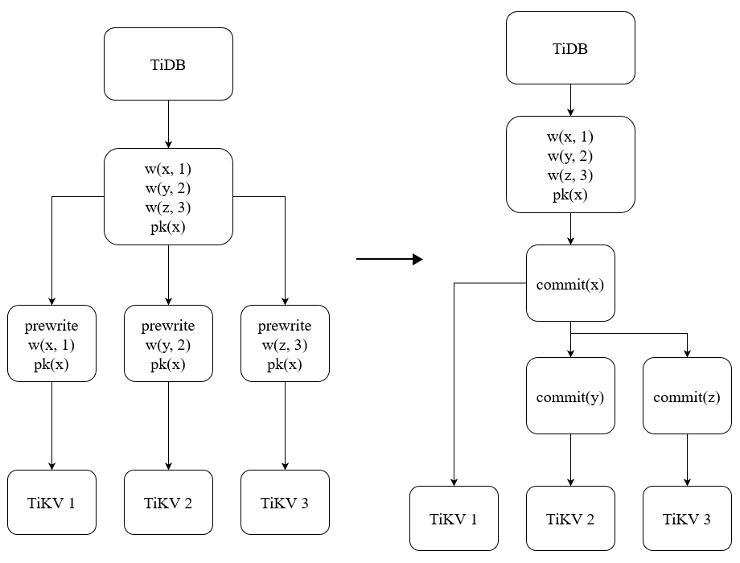

<div class="caption-center">图 1 - Percolator 下的两阶段提交</div>

图 1 是 Percolator 下的两阶段提交的流程，在 Prewrite 阶段，将数据写入到存储引擎中，这些键值对可能存储在不同的实例上，其中 Primary Key(PK) 是这个事务中的第一个 Key，是事务成功的原子性标志。Prewrite 阶段写入的数据包含了事务实际要写入的数据和事务的 PK（图中为 x），所以一旦 Prewrite 阶段完成，则说明这个事务已经写入成功。但是我们还需要 Commit 阶段来使得这一成功的事务对外可见，在 Commit 阶段中，会先 Commit PK，这一操作将事务标记为成功状态；然后 Commit 其他的 Key，让整个事务都可以被直接读取。

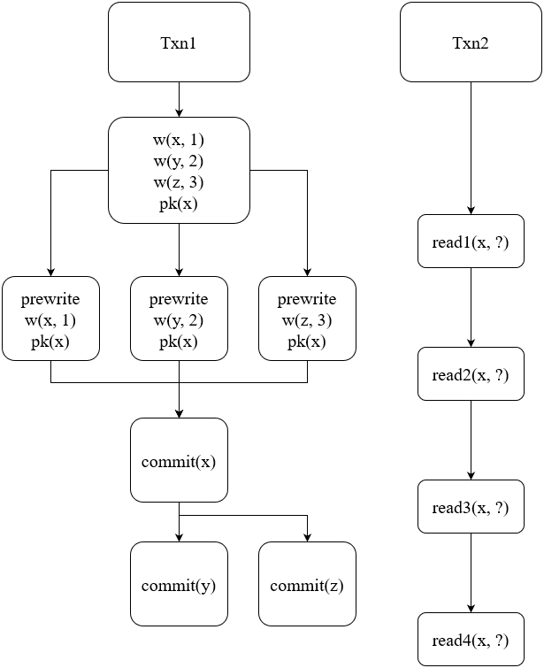

<div class="caption-center">图 2 - Percolator 下的读写关系处理</div>

但是在这一提交协议下，另一个事务可能从任意一个时间点对正在提交的事务进行读取，图 2 给出了从 4 个时间点对事务进行读取的情况。read1 时，事务还没有 prewrite，所以读取到旧的值即可；read2 时，读事务看到了 Prewrite 的结果，但是对应的 Key 还没有被 Commit，这时候会查询这一事务对应的 PK 来确认状态，但此时 PK 也还未提及，因此需要判断所读取到的事务是否过期，如果没有过期，那么等待一段时间后重试，如果已经过期，则会将这个事务 Rollback 掉；read3 和 read2 的过程相似，但是因为查到了 PK 是已经提交的状态，所以会读取到这个事务的内容，并且把这个事务中读取到的未提交的 Key 提交掉；read4 读到的 Key 都是已经提交状态的，直接读取到数据即可。

### 一个破坏原子性的 bug

原子性是事务正确性的重要保证之一，比如在一个转账事务中，如果一个事务只有一半成功了，可能就会出现一个账号扣了钱，而另一个账号没有收到钱的情况。

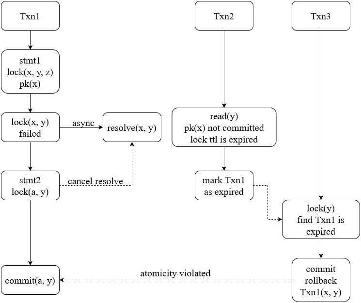

<div class="caption-center">图 3 - 原子性被破坏 bug</div>

图 3 是一个原子性被破坏的 bug，是三个事务并发执行产生的情况。Txn1 执行一条语句尝试锁住 x-z 这 3 个 Key，但是语句运行失败，其中已经上锁的 x-y 需要被异步撤销，随后第二条语句会重新选出一个主键，这里假设新主键是 a，同时也尝试对 y 加锁，此时会阻止异步清锁继续执行。Txn3 对 y 加锁时读到了 stmt1 加的锁，resolve 时发现 pk 已经被 rollback，因为错误读取了 Txn2 产生的缓存，Txn3 误 rollback 掉了 stmt2 加上的 y，导致了事务原子性的破坏。在原本的 Percolator 提交协议中，并没有包含主键更换的逻辑，而为了避免在加锁失败时重启事务，我们在实现中是有这一优化的，也因此使得所实现的事务模型更加复杂。

这里的问题是没有考虑到执行失败的语句可能会造成事务中选取出新的主键，但原始的 Percolator 提交协议并没有包括主键的更换，即是说我们在实现分布式事务的实现中所做的优化，使得这一模型变得更加复杂了。

### 理论正确性的验证

我们使用 TLA+ 对理论正确性进行验证，TLA+ 是为并行和分布式系统设计的建模语言，能够模拟出所有可能发生的情况，来保证理论的正确性。

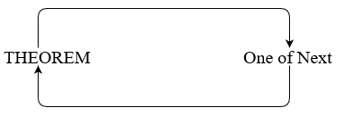

<div class="caption-center">图 4 - 形式化验证过程</div>

使用 TLA+ 对模型进行形式化验证需要先定义初始状态，然后定义 Next 过程和验证正确性的 THEOREM。Next 指的是可能会发生的过程，在一个并行系统中，虽然串行过程会逐个发生，但是并行过程发生的先后则不可被预测。图 4 是形式化验证的运行过程，执行一次 Next 过程，然后使用定义的 THEOREM 验证状态是否出现问题。因为 Next 是可能会发生的过程，所有一次 Next 调用可能会产生多种执行路径，TLA+ 会搜索所有可能的路径，确保在这个并行系统中，任意一种顺序都不会违反我们所定义的约束。

虽然 TLA+ 能够从理论上验证正确性，但这一方法也有着各种限制：

- 复杂度随过程量指数级提示，如果搜索路径过于复杂，要完成期望深度的搜索可能需要消耗大量的时间。

- 理论上的正确不能防止实现上的错误。

### 线性一致性和 Snapshot Isolation

首先我们需要明白，线性一致性和事务的隔离性是丝毫不相关的两个概念。

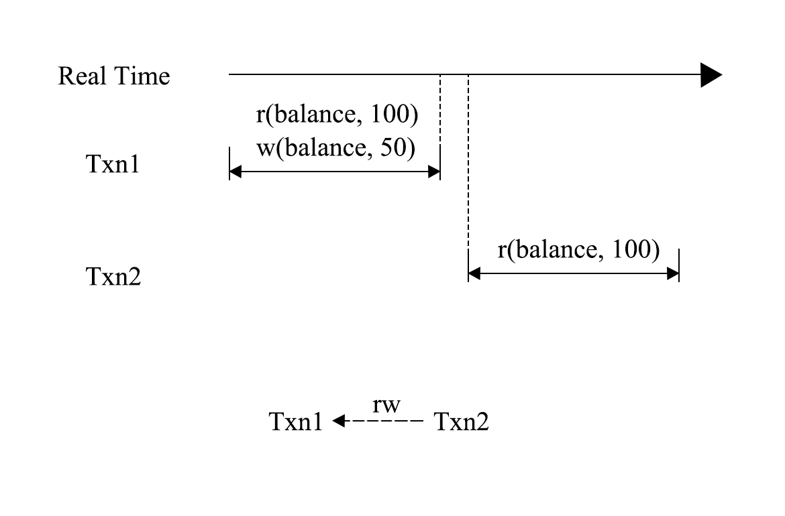

<div class="caption-center">图 5 - 非可线性化</div>

可线性化（Linearizability）原本是多处理器并行操作内存时的概念，后续被引入到数据库中来，对单个元素的事务提出了两点要求：

- 单个元素上的事务可串行化；

- 单个元素上，如果 Txn2 开启的时间点晚于 Txn1 提交完成的时间点，Txn2 在串行化的队列中一定在 Txn1 之后。

图 5 是一个可串行化但是不可线性化的例子，可串行化的执行顺序是 Txn2 -> Txn1。虽然 Txn2 开启的时间点晚于 Txn1 提交的时间点，但是在可串行化的队列中，Txn2 在 Txn1 之前。Spanner 提出了外部一致性的概念，并且认为外部一致性是强于可线性化的一致性标准，因为其对事务的先后约束能够拓展到多元素的操作上，外部一致性也被理解为一种可线性化的定义，他们约束的效果大体上相同。当我们综合考虑隔离性和一致性时，就会发现可串行化并不是理想中的完美的隔离与一致性级别，例如图 5 中，Txn1 是一个进行消费的事务，在进行消费后，还有事务读取到了消费前的余额，显然这在很多场景下是无法被接受的。Jepsen 的一致性模型中，在可串行化之上又设定了一个隔离与一致性级别。当一个数据库同时满足可串行化和可线性化时，将其称为严格可串行化（Strict Serializable）。

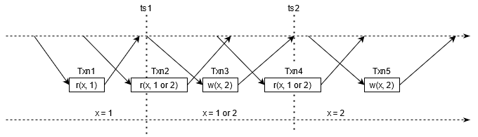

<div class="caption-center">图 6 - 可线性化与外部一致性</div>

如图 6 所示，在可线性化的执行下，Txn3 将 x 从 1 改写成 2，并且提交时间是从 ts1 到 ts2，那么对于客户端而言，早于 ts1 的时间点和晚于 ts2 的时间点是状态确认的，而在 ts1 和 ts2 之中，因为不能确定 Txn3 实际生效的时间点，所以 x 的值处于不可知的状态，读取到 1 或 2 都是允许的。

Snapshot Isolation(SI) 是一个被广泛采用的隔离级别，同时 TiDB 也是一个 SI 隔离级别的数据库，所以我们也在谈论事务测试之前，需要搞清楚 SI 隔离级别是如何使用事务间依赖进行定义的。需要注意的是，SI 是一个先射箭再画靶的隔离级别，所以我们对其的定义的目标是避免如“SI 就是事务从一个快照读”这种模糊的语言，而是要给出相对客观的靶子。

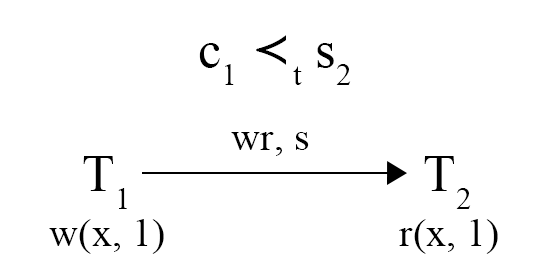

<div class="caption-center">图 7 - 偏序依赖</div>

为了定义 SI，需要引入了一个新的事务依赖，叫事务开始依赖，这一依赖反映了一个事务提交时间点和另一个事务开启时间点之间的偏序关系，偏序关系往往和其他依赖同时发生，并且具有传递性。如图 7 所示，Txn2 读取到了 Txn1 的写入，既可以说明 Txn2 的开始时间点晚于 Txn1 提交生效的时间点。需要注意的是，这里的偏序指的是数据库内部的时间点，需要和线性一致性级别综合考虑，才能从外部观测到的顺序推断出数据库内部的时间点的偏序关系，即如果图 7 中，Txn2 没有读取到 Txn1 的写入，即使连接数据库的客户端能够肯定 Txn2 是在 Txn1 完全提交后才开启的，也不能得到 c1 ≺t s2 的结论，这也有可能是数据库不提供可线性化的线性一致性。

Adya 将 SI 的隔离级别称为 PL-SI，是在 PL-2 上附加了对数据库内部时间点的约束，其包括事务开始依赖和一部分读后写依赖。

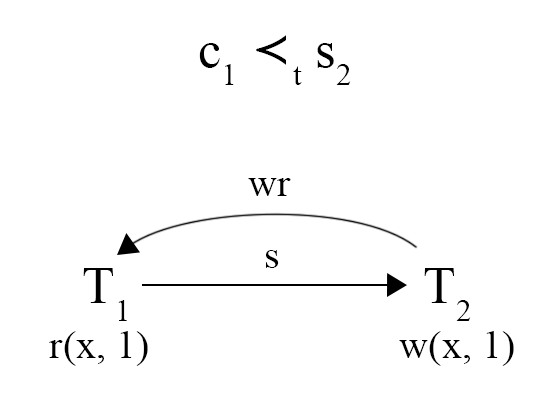

<div class="caption-center">图 8 - G-SIa 异常</div>

SI 的通俗理解是，一个事务会取有一个快照，其读操作在这个快照上进行，读取的作用范围是时间点小于等于这个快照时间点的所有写入。那么对于两个存在偏序关系的事务，如果 c1 ≺t s2，那么 Txn2 则需要读取到 Txn1 的修改，同时 Txn1 不应该读取到 Txn2 的写入内容（从偏序关系的传递性可以推导  s1 ≺t c1 ≺t s2 ≺t c2），但是图 8 中的 Txn1 却读取到了 Txn2 的写入内容，从而破坏了 SI 的语义。从另一个角度来理解，事务开始依赖和 WR 依赖和 WW 依赖一样，反映的是事务间的先后关系，当这些关系出现环的时候，他们的先后关系就无法被确认了，G-SIa(Interference) 异常指的是就是 WR, WW 和 S 依赖之间形成了环。

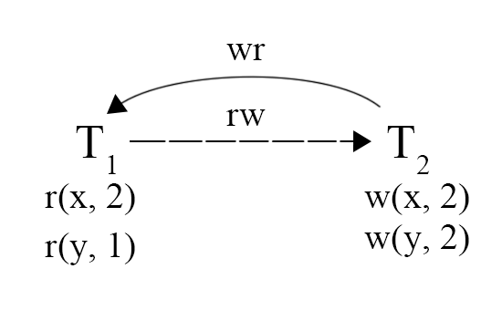

<div class="caption-center">图 9 - G-SIb 异常</div>

图 9 展示了 G-SIb(Missed Effects) 的异常现象，指的是 WR, WW, RW 和 S 依赖形成了环，但是其中只允许有一个 RW 依赖。这一现象可以理解为，一个事务没有完整的读取到另一个事务的写入，图中 Txn2 写入了两个值，但是 Txn1 只读取到一个值，另一个值读取的是旧版本，产生了 RW 依赖。之所以只允许有一个 RW 依赖，是因为一个 RW 依赖就足以检查住这种问题，而两个 RW 则会带来如 Write Skew 的误判。

PL-SI 需要在 PL-2 的基础上防止 G-SIa 和 G-SIb 的发生，这点和对标可重复读的 PL-2.99 是有些细微的差别的，请小心对待。

## Jepsen

提到事务测试，就不得不提 Jepsen。Jepsen 是 TiDB 质量保证的重要一环，除了每一次发版，在日常测试中，Jepsen 也在不间断的运行。

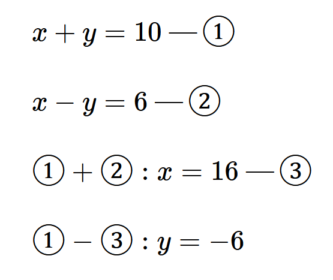

<div class="caption-center">图 10 - 约束检查的思想</div>

什么是 Jepsen，为什么 Jepsen 是有效、高效的？图 10 是作者的一些想法，如果我们要验证由 ① 和 ② 组成的方程组的求解是否正确，我们可以仔细地检查求解过程，也可以将结果代入到原式中，检查是否符合给定条件。我相信大部分人在检查方程结果的时候，都会选择后者，因为后者能够简单有效的检查出错误。而 Jepsen 的思想，就是通过设计一些“方程”，将求解交给数据库，最后通过一些约束条件检查数据库是否求解的正确。

### Bank

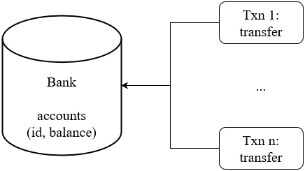

<div class="caption-center">图 10 - Jepsen Bank</div>

Jepsen Bank 是一个非常经典的测试，其模拟的情况也很简单，图 10 是这个用例运行的方式，在一张表中有许多用户和他们的余额纪录，同时会有许多事务并发的进行转账操作。Bank 的检查条件也非常简单，就是所有用户的账户总余额不变。并且在 SI 隔离级别中，任意一个快照都应该满足这一约束，如果某个快照不符合这一约束，则说明可能出现了  G-SIb(Missed Effects) 的异常现象，读者可以思考一下原因。Jepsen 会在运行过程中，定时开启事务，查询总余额，检查是否破坏约束。

Bank 是一个比较接近现实业务的测试场景，逻辑理解简单，但是因为并发构造，在实际运行过程中可能会造成大量的事务冲突，Bank 并不关心数据库如何处理这些冲突，会不会带来事务失败，大部分错误最终都会反应到余额之上。

### Long Fork

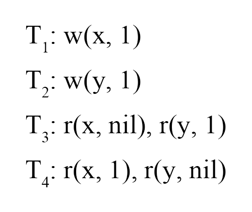

<div class="caption-center">图 11 - Jepsen Long Fork</div>

Long Fork 是一个为 SI 隔离级别设计的事务测试场景，其中有两种事务，写事务会对一个寄存器进行赋值，而读事务则会查询多个寄存器，最后分析这些读事务是否读到了破坏 PL-SI 的情况。图 11 中，Txn1 和 Txn2 是写事务，Txn3 和 Txn4 是读事务，图 11 中存在 G-SIa，破坏了 PL-SI，但是在这里我们需要做一些假设才能发现环。


<div class="caption-center">图 12 - Jepsen Long Fork</div>

图 12 是对图 11 例子的分析，根据 WR 依赖，我们可以确定 c2 ≺t s3 和 c1 ≺t s4。但是因为我们不知道 Txn3 和 Txn4 的开始时间点，所以我们需要进行假设，如果 s3 ≺t s4，则如图中左侧的假设，从偏序的传递性，可以推导出 c2 ≺t s4，于是就能发现一个由  S 依赖和 RW 依赖组成的环；如果  s4 ≺t s3，则如图中右侧所示，也能发现一个 G-SIb 异常。如果 s3 和 s4 相等，那么说明 Txn3 和 Txn4 是从会读取到同样的内容，但是实际读取到的内容却出现了矛盾，也存在异常，具体找到环的步骤就留给读者自行推导了。

### 小结

Jepsen 提供了一些通过约束检查来发现异常的方法，并且设计了一系列测试场景。有比较好的覆盖率，其优点有：

- 着眼于约束条件，简化了正确性的验证；

- 测试的效率高。

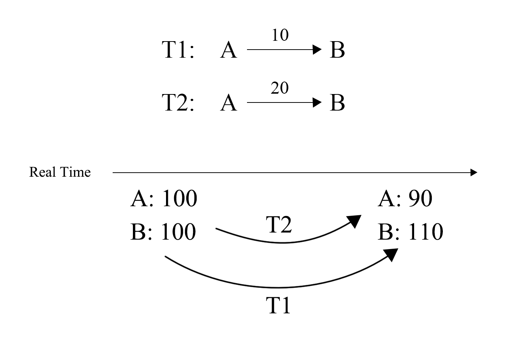

<div class="caption-center">图 13 - Missing Lost Update</div>

但是 Jepsen 也有他的不足之处，图 13 表达了一个在 Bank 下的 Lost Update 异常，T2 的转账丢失了，但是最后并不能从结果上检查出这个异常，因为余额的总和没有变。

## History Check

### 通过 BFS 进行检测

有一类测试方法是通过 history check 来进行的，其目的是为了寻找到更多的异常现象，尽可能的挖掘执行历史中的信息。「On the Complexity of Checking Transactional Consistency」这篇论文就研究了从执行历史分析事务一致性和其复杂度。

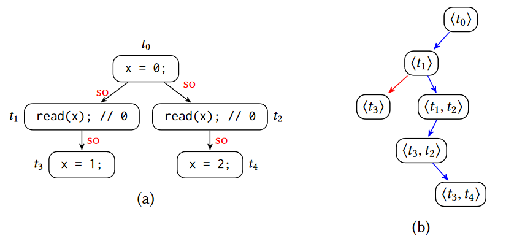

<div class="caption-center">图 14 - 可序列化的检测</div>

可串行化的检测遵循其字面意思，我们只需要找到一个执行序列，能够让所有的事务串行执行的即可，那么很自然的，只需要采用一个广度优先搜索（BFS），就可以检查是否是串行的。但是问题在于，这种方法在假设事务执行满足 Sequential Consistency 的前提下，复杂度为 O(deep^(N+3))，其中 deep 为每个线程执行事务的数量，N 为线程数。

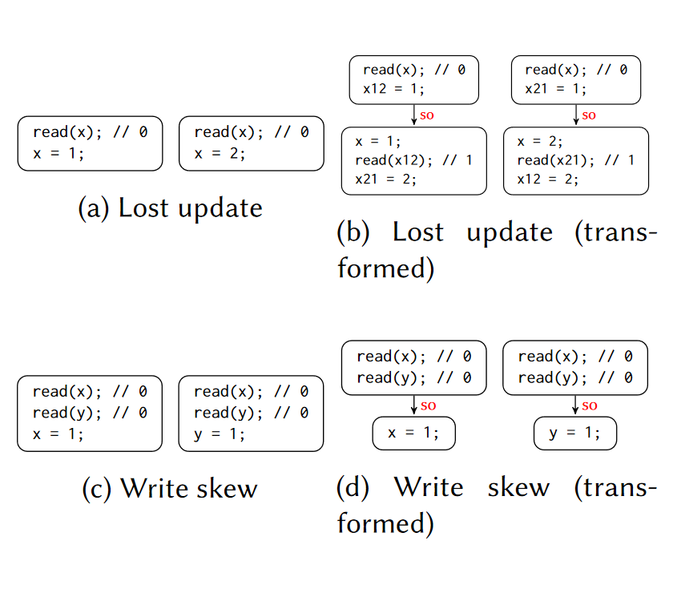

<div class="caption-center">图 15 - 通过 guard 变量转化 SI 检测</div>

检测可串行化是简单的，但是要检测一个历史序列是否符合 SI 隔离级别就无法直接进行，如图 15 所示，论文通过添加 guard 变量，从而可以通过上文提到的对可串行化的检测来判断 SI 的读写关系是否合理。以 Lost Update 为例，两个事务都对 x 进行了修改，分别写入了第一个版本和第二个版本，因此插入两个 guard 变量，将这两个事务对 x 的这两个修改串联起来，不允许其中插入对 x 的修改，只要验证图中 (b) 的执行历史能够满足可串行化的要求，就可以说明 (a) 的执行历史满足 SI 的要求。

### Elle

为了解决理解困难和复杂度高等问题，Jensen 的作者 Kyle Kingsbury 发表了名为 Elle 的事务一致性检测方法。

Elle 通过环检测和异常检测的方式，来验证事务的一致性和隔离性是否达到我们所指定的要求，它的工作方式是尽可能的找出执行历史中的异常，而非尝试找出一个可串行的执行序列，因此在效率是有着明显的优势，但相对的，这一测试方法的过程较为复杂。

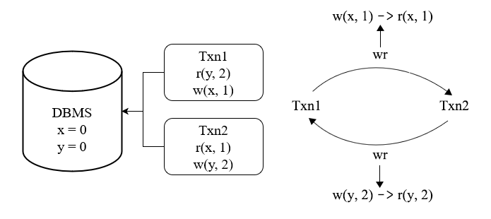

<div class="caption-center">图 16 - 简单的 G1c 检测</div>

图 16 就是检测出 G1c 的例子，根据我们在第一讲所讨论的理论，我们不需要按照可串行化的字面定义，去寻找一个执行序列，而只需要检测是否出现某些不允许出现的情况。虽然从直觉上，我们并不能肯定不出现某些异常就等同于字面上的可串行化，但是从在隔离级别定义的研究基础上来说，通过检查异常来判断是否可串行化是合理的。此外，对于事务测试而言，找到异常已经是我们所期望的结果了。

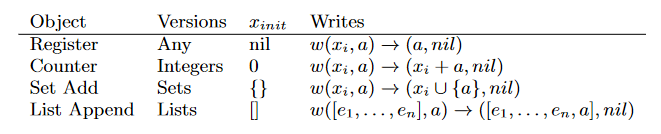

<div class="caption-center">图 17 - Elle 所设计的模型</div>

如图 17 所示，Elle 设计了四个模型，分别是寄存器、加法计数器、集合和列表，其对执行历史的检测的方法大同小异，后面会以 List Append 作为对象展开讲解。

Elle 中的事务有生成和执行两个阶段，在生成阶段，Elle 会随机产生这个事务需要读写的内容，这些预生成好的读写会在执行阶段得到结果。即一个事务在历史中会存在两条记录，生成阶段的 :invoke 和执行阶段的 :ok/:fail/:info 中的一个。

- :invoke，事务被生成，之后会被执行。

- :ok，事务执行并确定提交成功。

- :fail，确定事务没有被提交。

- :info，事务状态不一定（例如提交时出现连接错误）。

为了分析线性一致性，Elle 在分析过程中，考虑 Adya 所定义的事务间读写关系的依赖的同时，还给出了和时间相关的依赖，时间上的依赖在满足对应的线性一致性的前提下也能够反应事务的先后关系。

- Process Depend，一个线程中事务执行的先后严格遵循执行顺序，在支持 Sequential Consistency 的系统中可以使用。

- Realtime Depend，所有线程中事务执行的先后严格遵循执行时间，在支持 Linearizability 的系统中可以使用。

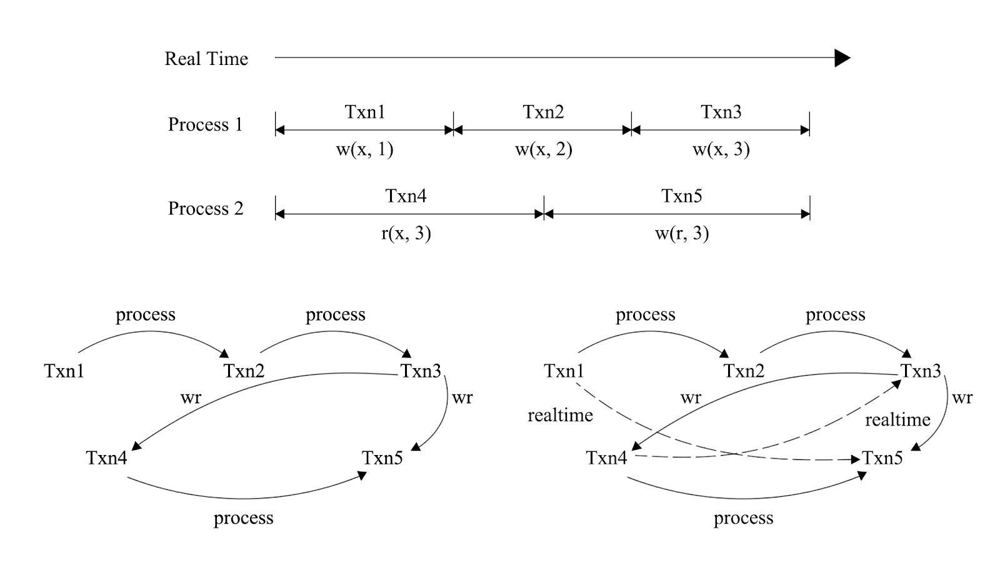

<div class="caption-center">图 18 - 对时间依赖的环检测</div>

图 18 展示了一个符合 Sequential Consistency 但不符合 Linearizability 的例子，客户端分两个线程执行事务，但是客户端知道不同线程间事务的严格顺序，注意在分布式数据库中，这些线程可能连接到的是不同的数据库节点。如果系统只满足 Sequential Consistency，那么对应的依赖图应该如左下方所示，其中并没有出现环；但是如果系统是满足 Linearizability 的，那么依赖图就会变成右下方所示，Txn3 和 Txn4 之间形成了环，换句话说，Txn4 发生在 Txn3 之前，但是却读取到了 Txn3 的写入，并且这一异常，单纯从 Adya 所定义的读写关系中是发现不了的。

接下来我们会通过几个例子来讲解，Elle 具体是如何工作和发现数据库在事务处理上的异常的。

```
{:type :invoke, :f :txn, :value [[:a :x [1 2]] [:a :y [1]]], :process 0, :time 10, :index 1}
{:type :invoke, :f :txn, :value [[:r :x nil] [:a :y [2]]], :process 1, :time 20, :index 2}
{:type :ok, :f :txn, :value [[:a :x [1 2]] [:a :y [1]]], :process 0, :time 30, :index 3}
{:type :ok, :f :txn, :value [[:r :x []] [:a :y [2]]], :process 1, :time 40, :index 4}
{:type :invoke, :f :txn, :value [[:r :y nil]], :process 0, :time 50, :index 5}
{:type :ok, :f :txn, :value [[:r :y [1 2]]], :process 0, :time 60, :index 6}
```

<div class="caption-center">例 1 - 包含 G-SIb 的执行历史
测</div>


<div class="caption-center">图 19 - G-SIb 的依赖图</div>

例 1 是一个出现 G-SIb 异常的历史，这里用 Clojure 的 edn 的格式来表示，通过 :process 属性，可以推断出第一行和第三行是 Txn1，第二行和第四行是 Txn2，第五行和第六行是 Txn3。从 Txn1 和 Txn2 从 :invoke 到 :ok 状态的 :time 属性来看，他们可能是并行的。而 Txn3 则是在这两个事务都成功提交之后才开启的，从 Txn3 读取到的 [[:r :y [2 1]] 来看，因为 List 是按照 Append 顺序排列的，所以可以判断 Txn2 发生在 Txn1 之前，但是 Txn2 又读到了 Txn1 写入之前的 x，这里产生了 RW 依赖，出现了环。在这个例子中，Elle 利用 List 的特性，找出了原本不容易判断的 WW 依赖。

```
{:type :invoke, :f :txn, :value [[:a :x [1 2]] [:a :y [1]]], :process 0, :time 10, :index 1}
{:type :invoke, :f :txn, :value [[:a :x [3]] [:a :y [2]]], :process 1, :time 20, :index 2}
{:type :ok, :f :txn, :value [[:a :x [1 2]] [:a :y [1]]], :process 0, :time 30, :index 3}
{:type :ok, :f :txn, :value [[:a :x [3]] [:a :y [2]]], :process 1, :time 40, :index 4}
{:type :invoke, :f :txn, :value [[:r :x nil]], :process 2, :time 50, :index 5}
{:type :ok, :f :txn, :value [[:r :x [1 2 3]]], :process 2, :time 60, :index 6}
{:type :invoke, :f :txn, :value [[:r :x nil]], :process 3, :time 70, :index 7}
{:type :ok, :f :txn, :value [[:r :x [1 2]]], :process 3, :time 80, :index 8}
```

<div class="caption-center">例 2 - 可能破坏 Linearizability 的执行历史</div>

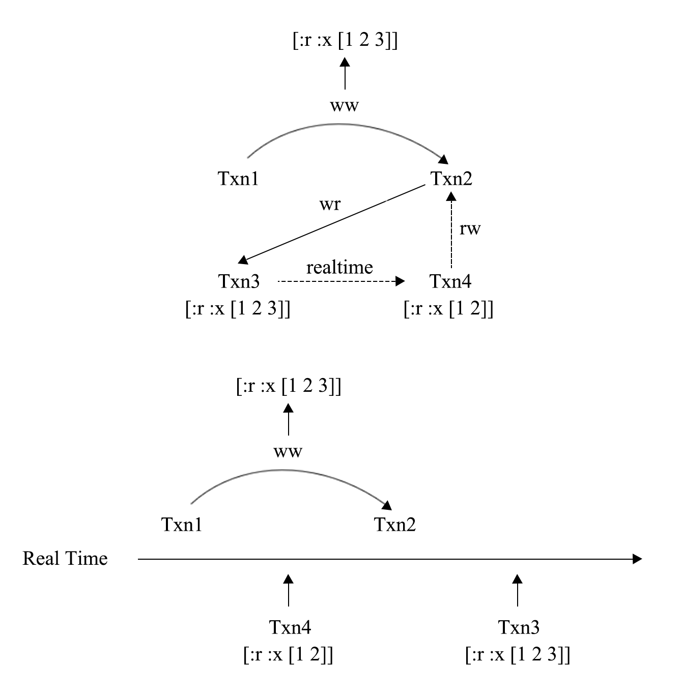

<div class="caption-center">图 20 - 可能破坏 Linearizability 的依赖图</div>

例 2 是一个可能破坏 Linearizability 的例子，从图 20 上方的依赖图来看，出现了 RW，WR 和 Realtime 依赖组成的环，即 G-SIb 现象，但是这个环里有一个 Realtime 依赖，这个系统还有可能是因为破坏了 Linearizability 而产生这个环的。破坏 Linearizability 的情况可以从图的下面更加清晰的发现，当遇到这种情况时，因为不能断言是出现了哪一种异常，Elle 会汇报可能产生的异常种类。

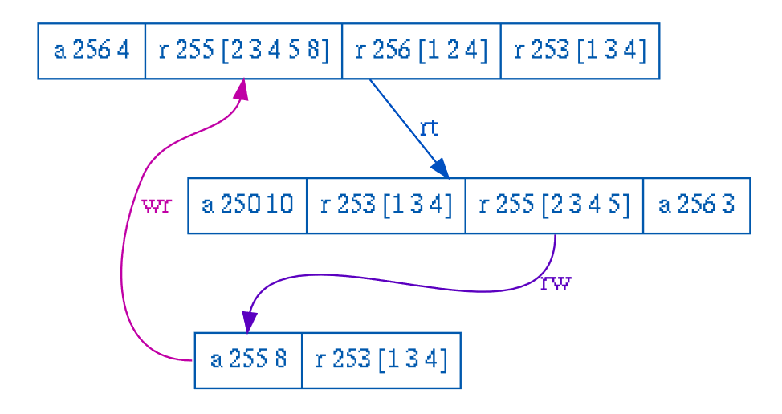

<div class="caption-center">图 21 - Elle 论文中的例子</div>

图 21 是 Elle 的论文中给出的例子，令第一行为 Txn1，第二行为 Txn2，第三行为 Txn3。Txn1 和 Txn2 之间存在 Realtime 关系，而 Txn2 对 Key 为 255 的 List 的读取中没有 Txn3 的写入，说明其中存在一个 RW 依赖，而 Txn1 则读取到了 Txn3 的写入，于是出现了和图 20 中类似的情况，这里不再展开分析了。

### MIKADZUKI

Elle 展示了依赖图在测试中的巨大作用，在 PingCAP 内部，我们尝试通过另一种方式来通过依赖图对数据库进行测试。回顾 Elle 的流程，是执行后分析执行历史，将其转化为依赖图后，判断其是否符合某个隔离级别或一致性级别。MIKADZUKI 的做法正好相反，尝试在有依赖图的情况下，生成出执行历史，对比生成的执行历史和数据库实际执行的表现，就可以发现数据库是否正常。

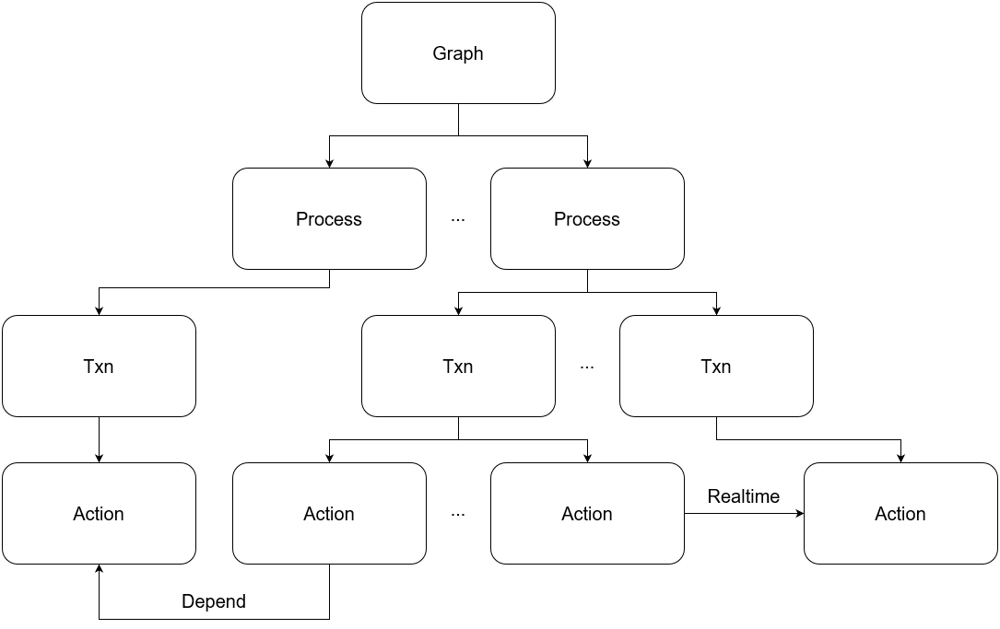

<div class="caption-center">图 22 - MIKADZUKI 依赖图层次</div>

图 22 是 MIKADZUKI 内部的图的层次，Process 中的事务会串行执行，而 Process 间的事务会并行执行。同一个 Process 下的事务，首尾之间存在 Realtime 的关系，而 Process 间的事务会生成 Depend，Depend 和 Realtime 都代表了事务执行的先后关系，所以在生成时，这两类依赖不会让事务形成环。

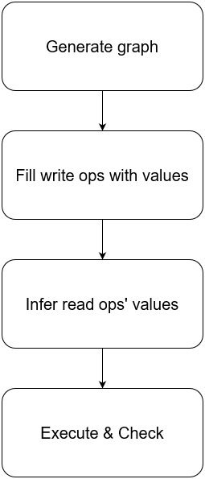

<div class="caption-center">图 23 - MIKADZUKI 的执行流程</div>

图 23 是 MIKADZUKI 的执行流程，一轮有四个阶段：

- 生成一张没有环的 Graph

- 为 Graph 中的写请求填充随机生成的读写数据，数据以 KV 形式表达，其中 Key 是主键索引或唯一索引，Value 是整行数据

- 从写请求根据事务间的依赖，推测出读请求应当读取到的结果

- 按照图的事务依赖描述，并行执行事务，如果读取到与第三步预测中不同的结果，则说明结果有误

这一测试方法帮助我们发现过一些问题，在实验后期，我们尝试添加制造成环的依赖，WW 依赖所成的环，在正常执行下会出现死锁，而死锁检测则是以往的测试方法不容易发现的，因为死锁检测卡住不会导致任何异常。

### 小结

通过对执行历史的检查，我们能够尽可能的发现异常，得益于对隔离级别和一致性的学术研究，对历史的检查复杂度大幅降低。Elle 进而设计了一些模型，能够为分析事务间关系提供线索，从而使得对完整历史的检查变得可能且有效。

## 错误注入

墨菲法则声称——任何可能发生错误的地方都会发生错误，即再小的发生错误的概率，也总有一天会发生。另一方面，测试环境的规模和数量又远小于生产环境，正常情况下，绝大部分的错误都将发生在生产环境，那么几乎所有因此引发的罕见的系统的 bug 也将发生在生产环境下，这显然是我们所不期望发生的。

为了将 bug 止于测试环境，我们会使用一些方法进行故障模拟，主要包括：

- Failpoint，为进程注入错误。

- Chaos Test，模拟外界产生的故障，更接近真实情况。

### Failpoint

Failpoint 是用于向进程中注入一些问题的测试手段，可以在编译期决定是否打开，正常发布的版本是关闭 Failpoint 的。TiDB 通过折叠代码来控制 Failpoint，TiKV 则通过宏和编译时的环境变量进行控制。通过 Failpoint，我们可以高效的模拟一些平时罕见但又存在发生可能的情况：

- 存在一些难以被访问到的代码路径，并且可能是正确性的重要保障；

- 程序可能在任意节点被 kill；

- 代码执行可能在任意一个节点 hang 住。

```
// disable
failpoint.Inject("getMinCommitTSFromTSO", nil)

// enable
failpoint.Eval(_curpkg_("getMinCommitTSFromTSO"))
```

<div class="caption-center">例3 - 打开 Failpoint</div>

例 3 是一个简单的打开 Failpoint 的例子，在关闭状态下，Inject 函数不会做任何事情，而当 Failpoint 打开后，Inject 函数就会变成 Eval 函数，此时我们可以使用 HTTP 请求去控制 Failpoint 的行为，包括：

- 人为添加 sleep；

- 让 goroutine panic；

- 暂停这个 goroutine 的执行；

- 进入 gdb 中断。

```
// disable
failpoint.Inject("beforeSchemaCheck", func() {
    c.ttlManager.close()
    failpoint.Return()
})

// enable
if _, _err_ := failpoint.Eval(_curpkg_("beforeSchemaCheck"));
    _err_ == nil {
    c.ttlManager.close()
    return
}
```

<div class="caption-center">例 4 - 利用 Failpoint 注入变量</div>

在例 4 中，TiDB 利用 Failpoint 做了更多的注入，在其中关闭了 TTL Manager，这将导致悲观锁的快速过期，并且中断事务的提交。此外，还可以借助 Failpoint 修改当前作用域下的变量。如果没有 Failpoint，这些故障情况可能极少发生，而通过 Failpoint，我们就可以快速的测试当发生故障时，是否会产生如破坏一致性的异常现象。

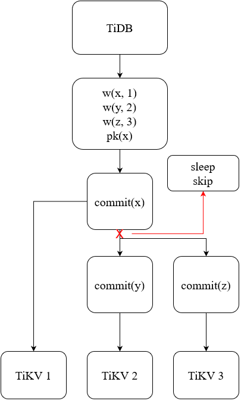

<div class="caption-center">图 24 - 对提交 Secondary Keys 的 Failpoint 注入</div>

图 24 展示了在两阶段提交中的提交阶段下，通过注入来达到延迟或者跳过 Secondary Keys 的效果，而这些情况在通常情况下是几乎不会出现的。

### Chaos Test

在一个分布式系统中，我们难以要求开发人员总是写出正确的代码，事实上大部分时候我们都不能做到完全的正确实现。如果说 Failpoint 是细粒度的控制某段代码可能会出现的现象，是演习；那么 Chaos Test 就是无差别的对系统进行破坏，是真正的战场。

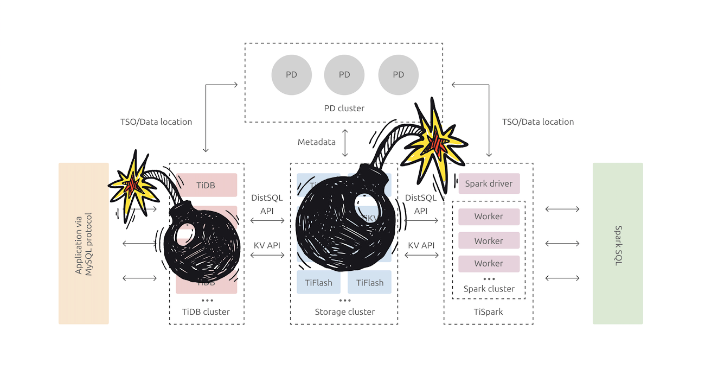

<div class="caption-center">图 25 - Chaos Test 概念图</div>

图 25 是 Chaos Test 的概念图，Chaos Test 和 Failpoint 最大的区别在于，Failpoint 仍然是开发人员所设想的可能出现异常的地方，那么开发人员在绝大多数情况下，是无法将 Failpoint 设计的全面的，Chaos Test 为这一纰漏加上了一层额外的保险。

在开发 Chaos Mesh 的过程中，我们也做了诸多尝试，例如：

- kill node

- 物理机的断电测试

- 网络延迟与丢包

- 机器的时间漂移

- IO 性能限制

Chaos Mesh 在正式发布前，Chaos Test 就在 PingCAP 被证明是有效的，我们将这些测试心得通过 Chaos Mesh 分享给社区。

## 总结

尚未提笔写这篇文章的时候，我也曾反复思考过，关于事务测试，究竟能够分享些什么？并且一度陷入觉得没有东西好说的困境。然而当我尝试说明白一些测试方法时，才后知后觉的意识到，测试是一门很深奥也容易被忽视的学问，我们在开发数据库的过程中花费了不少的心思在设计和运行测试上，本文所提及的，也只是事务测试体系的冰山一角。所有的测试，都是为了更好的产品质量，事务作为数据库的核心特性之一，更应该受到关注。Through the fire and the flames, we carry on.


