## 绪论

在基于 Percolator 提交协议的分布式数据库被提出的时期，学术研究上还出现了一种叫确定性数据库的技术，在这项技术的发展过程中也出现了各种流派。本文将讲解学术上不同的确定性事务和特点，并综合说说他们的优点和面临的问题。

本文将按照提出的顺序进行讲解：

- 确定性数据库的定义；

- 可扩展的确定性数据库 Calvin；

- 基于依赖分析的确定性数据库 BOHM & PWV；

- 重视实践的确定性数据库 Aria。

## 确定性数据库的定义

确定性数据库的确定性指的是执行结果的确定性，一言蔽之，**给定一个事务输入集合，数据库执行后能有唯一的结果。**

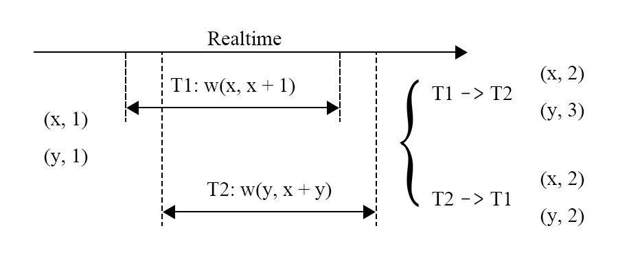

图 1 - 不存在偏序关系时的不确定性

但是这一确定性是需要基于偏序关系的，偏序关系代表的是事务在数据库系统中执行的先后顺序。图 1 中，两个事务并发执行，但是还没有被确认偏序关系，那么这两个事务的执行先后顺序还没有被确定，因此这两个事务的执行顺序也是自由的，而不同的执行顺序则会带来不同的结果。

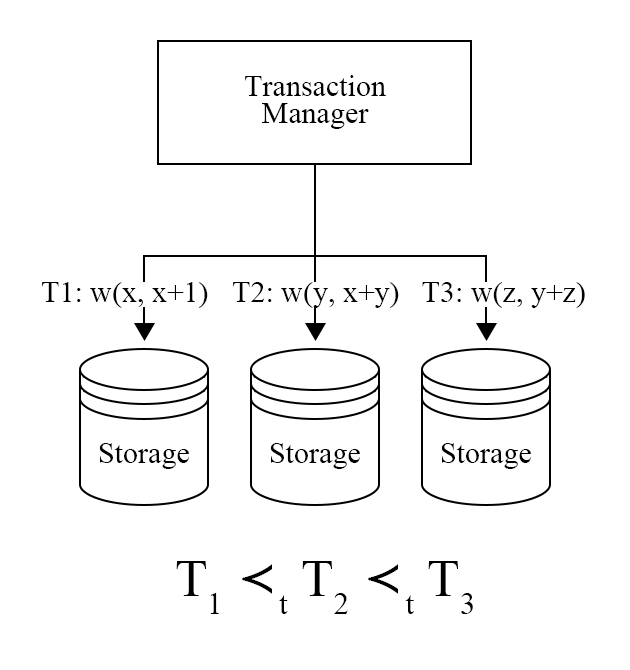

图 2 - 使用事务管理器为排序输入事务排序

图 1 中的例子说明，为了达到确定性的结果，在事务执行前，我们就需要对其进行排序，图 2 中加入了一个事务管理器，在事务被执行前，会从事务管理器之中申请一个 id，全局的事务执行可以看作是按照 id 顺序进行的，图中 T2 读到了 T1 的写入结果，T3 读到了 T2 的写入结果，因此这三个事务必须按照 T1 -> T2 -> T3 的顺序执行才能产生正确的结果。

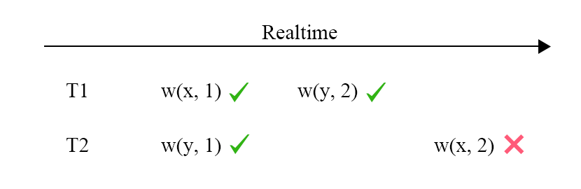

图 3 - 死锁的产生

确定性数据库的另一个优点在于能够规避死锁的产生，死锁的产生原因是交互式的事务有中间过程，图 3 是对产生过程的解释，T1 和 T2 各写入一个 Key，随后在 T1 尝试写入 T2 的 Key，T2 尝试写入 T1 的 Key 时就产生了死锁，需要 abort 其中的一个事务。设想一下如果事务的输入是完整的，那么数据库在事务开始的时候就知道事务会做哪些操作，在上面的例子中，也就能够在 T2 输入时知道 T2 和 T1 会产生写依赖的关系，需要等待 T1 执行完毕后再执行 T2，那么就不会在执行过程中才能够发现死锁的情况了。发生死锁时会 abort 哪个事务是没有要求的，因此在一些数据库中，这一点也可能产生不确定性的结果。

数据库系统中的不确定性还可能来源于多个方面，比如网络错误、io 错误等无法预料的情况，这些情况往往会表现为某些事务执行失败，在对确定性数据库的解读中，我们会讨论如果避免因这些不可预料的情况而产生不确定的结果。

确定性是一个约束非常强的协议，一旦事务的先后顺序被确定，结果就被确定了，基于这一特点，确定性数据库能够**优化副本复制协议所带来的开销**。因为能保证写入成功，在有些实现中还能够预测读的结果。但是确定性并不是银弹，**强大的协议也有着其对应的代价**，本文会在具体案例中详细分析其缺陷，以及确定性数据库所面临的困难。

## 可扩展的确定性数据库 Calvin

Calvin 提出于 2012 年，和 Spanner 出现于同一时期，尝试利用确定性数据库的特点解决解决当时数据库的扩展性问题，这一研究成果后续演变成为了 FaunaDB，一个商业数据库。

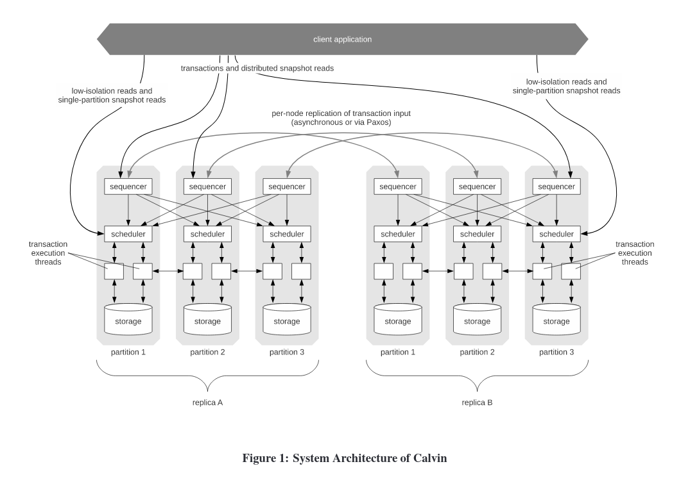

图 4 - Calvin 的架构图

图 4 是 Calvin 数据库的架构图，虽然比较复杂，但是我们主要需要解决的问题有两个：

- 在一个 replica 当中，是如何保证确定性的？

- 在 replica 之间，是如何保证一致性的？

首先看第一个问题，在一个 replica 中，节点是按照 partition 分布的，每个节点内部可以分为 sequencer，scheduler 和 storage 三个部分：

- Sequencer 负责副本复制，并在每 10ms 打包所收到的事务，发送到相应的 scheduler 之上；

- Scheduler 负责执行事务并且确保确定性的结果；

- Storage 是一个单机的存储数据库，只需要支持 KV 的 CRUD 接口即可。

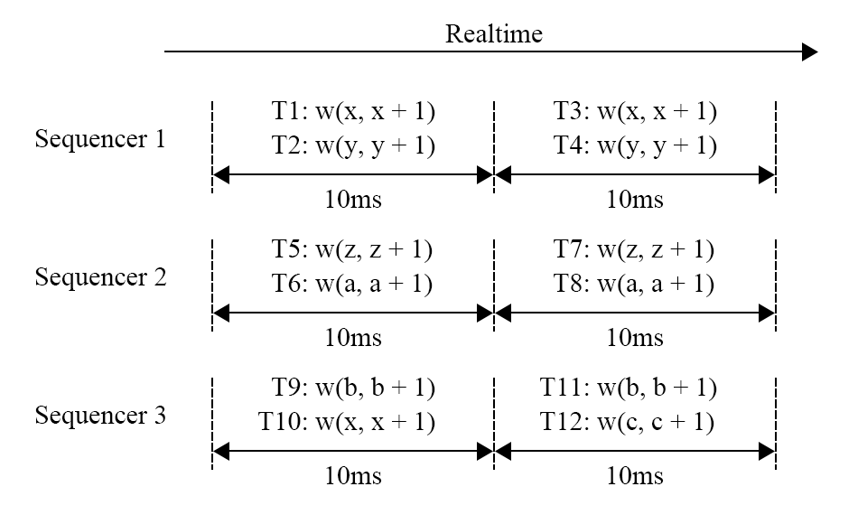

图 5 - Calvin 执行过程一

我们以一系列的事务输入来进行说明，假设有三个 sequencer，他们都接收到了一些事务，每 10ms 将事务打包成 batch。但是在第一个 10ms 中，可以看到 sequencer1 中的 T1 与 sequencer3 中的 T10 产生了冲突，根据确定性协议的要求，这两个事务的执行顺序需要是 T1 -> T10。这些事务 batch 会在被发送到 scheduler 之前通过 Paxos 算法进行复制，关于副本复制的问题我们之后再说。

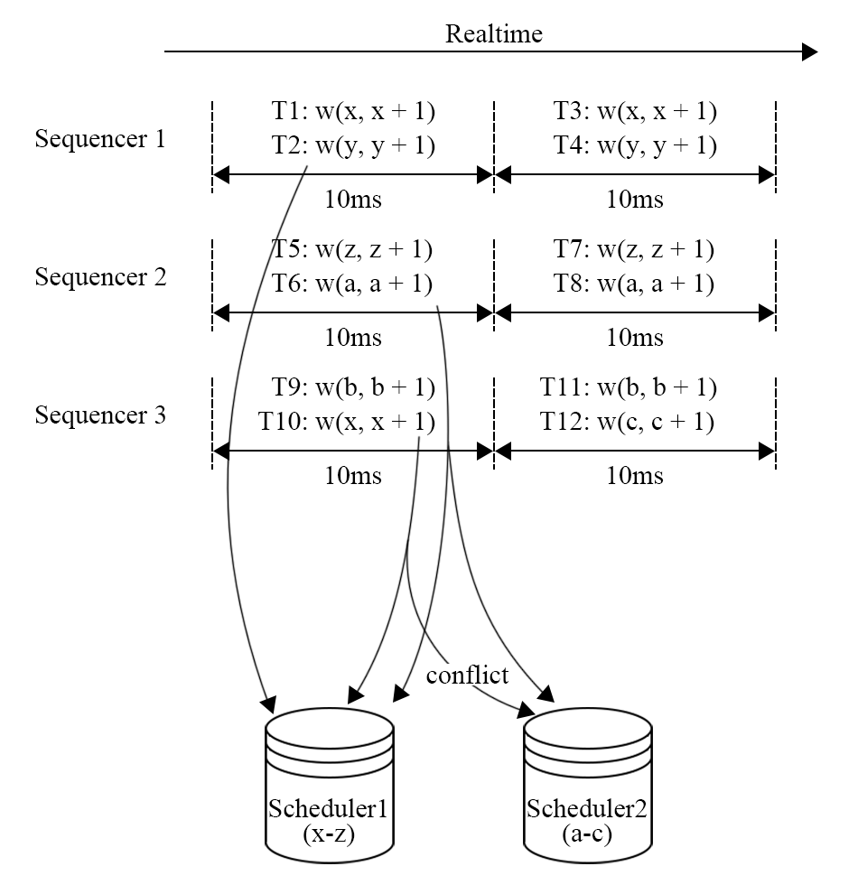

图 6 - Calvin 执行过程二

图 6 中，这些 batch 被发送到对应的 scheduler 之上，因为 T1 的 id 比 T10 更小，说明它应该被更早的执行。Calvin 会在 scheduler 上进行锁的分配，一旦这个 batch 的锁分配结束了，持有锁的事务就可以执行，而在我们的例子中，锁的分配可能有两种情况，T1 尝试获取被 T10 占有的 x 的锁并抢占，或是 T10 尝试获取被 T1 占有的锁并失败，不论哪种情况，都会是 T1 先执行而 T10 后执行的结果。

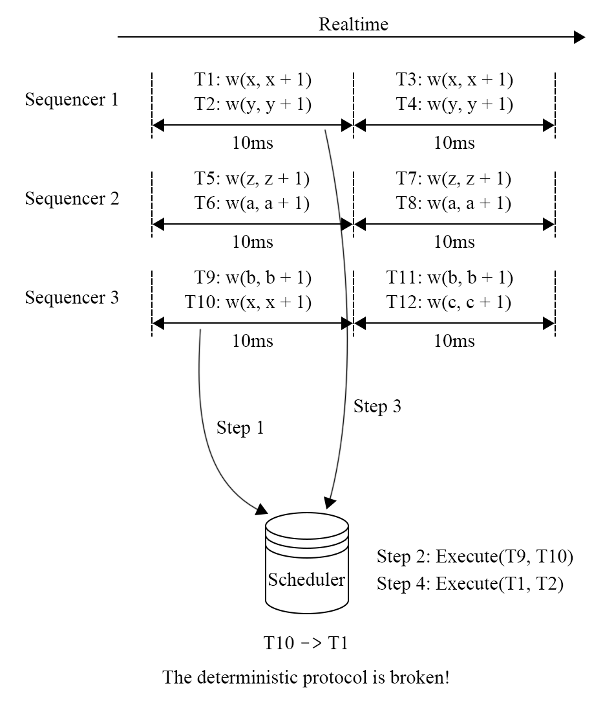

图 7 - Calvin 的不确定性问题

思考 Calvin 的执行过程，就会怀疑是否会发生图 7 这样的问题，如果 T1 在 T10 完全执行之后才被发送到 scheduler 上，那 T1 和 T10 的执行顺序还是会产生不确定性。为了解决这个问题，Calvin 有一个全局的 coordinator 角色，负责协调所有节点的工作阶段，在集群中有节点还未完成发送 batch 到 scheduler 的阶段时，所有节点不会进入下一阶段的执行。

在 SQL 层面，有些 predicate 语句的读写集合在被执行前是没有被确定的，这种情况下 Calvin 无法对事务进行分析，比如 scheduler 不知道要向哪些节点发送读写请求，也不知道如何进行上锁。Calvin 通过 OLLP 的策略来解决这一问题，OLLP 下，Calvin 会在事务进入 sequencer 的阶段发送一个试探性读来确定读写集合，如果这个预先读取到的读写集合在执行过程中发生了变化，则事务必须被重启。

我们考虑 Calvin 的一个问题，如何在 replica 之间保证一致性。在确定性协议的下，只需要保证一致的输入，就可以在多个副本之间保证执行结果的一致。其中一致的输入包括了输入的顺序。

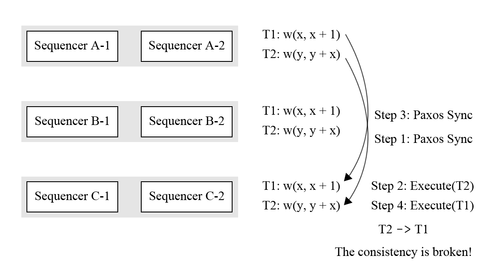

图 8 - Calvin 的不一致性问题

图 8 描述了 Calvin 中的不一致性问题，如果 T2 先于 T1 被同步到一个副本中，并且被执行了，那么副本间的一致性就遭到了破坏。为了解决这个问题，所有的副本同步都需要在一个 Paxos 组之内进行以保证**全局的顺序性**，这可能成为一个瓶颈，但是 Calvin 声称能达到每秒 500,000 个事务的同步效率。

综合来看，Calvin 和 Spanner 出现于同一年代，Calvin 尝试通过确定性协议来实现可扩展的分布式数据库并且也取得了不错的成果。本文认为 Calvin 中存在的问题有两点：

- 全局的共识算法可能成为瓶颈或者单点；

- 使用 Coordinator 来协调节点工作阶段会因为一个节点的问题影响全局。

## 基于依赖分析的确定性数据库 BOHM & PWV

在开始说 BOHM 和 PWV 之前，我们先来回顾以下依赖分析。Adya 博士**通过依赖分析（写后写、写后读和读后写）来定义事务间的先后关系**，通过依赖图中是否出现环来判断事务的执行是否破坏隔离性。这一思路也可以反过来被数据库内核所使用，**只要在执行的过程中避免依赖图中的环，那么执行的过程就是满足事先给定的隔离级别的要求的**，从这个思路出发，可以让原本无法并发执行的事务并发执行。

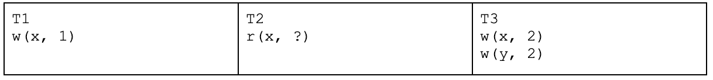

例 1 - 无法并行的并发事务

例 1 中给出了一个无法并发执行的并发事务的例子，其中 T1 和 T3 都对 x 有写入，并且 T2 需要读取到 T1 写入的 x=1，在通常的数据库系统中，这三个事务需要按照 T1 -> T2 -> T3 的顺序执行，降低了并发度。

图 9 - BOHM 的 MVCC

BOHM 通过对 MVCC 进行了一定的改造来解决这个问题，设置了每条数据的有效期和指向上一个版本的指针，图中 T100 数据的有效期是 100 <= id < 200，而 T200 数据的有效期是 200 <= id。MVCC 为写冲突的事务并发提供了可能，加上确定性事务知道事务的完整状态，BOHM 实现了写事务的并发。

PWV 是在 BOHM 之上进行的读可见性优化，让写入事务能够更早的（在完整提交之前）就被读取到，为了实现这一目标，PWV 对事务的可见性方式和 abort 原因进行了分析。

事务的可见性有两种：

- 提交可见性（Committed write visibility），BOHM 使用的策略，延迟高；

- 投机可见性（Speculative write visibility），存在连锁 abort 的风险。

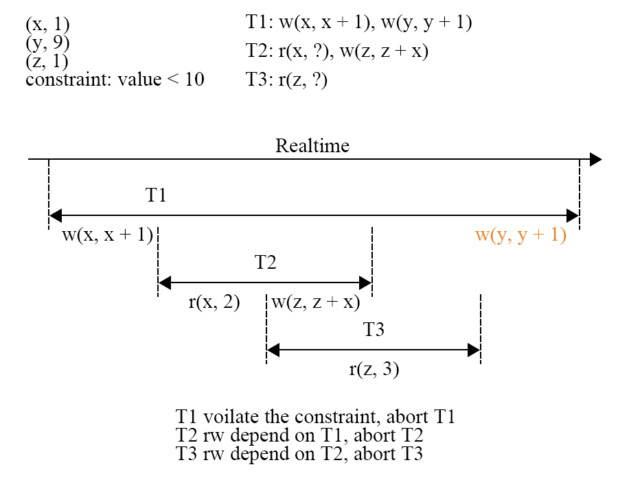

图 10 - 连锁 abort

图 10 是投机可见性的连锁 abort 现象，T1 写入的 x 被 T2 读取到，T2 的写入进一步的被 T3 读取到，之后 T1 在 y 上的写入发现违反了约束（value < 10），因此 T1 必须 abort。但是根据事务的原子性规则，T1 对 x 的写入也需要回滚，因此读取了 x 的 T2 需要跟着 abort，而读取到 T2 的 T3 也需要跟着 T2 被 abort。

在数据库系统中有两种 abort 的原因：

- 逻辑原因（Logic-induced abort），违反了约束；

- 系统原因（System-induced abort），产生了死锁、系统错误或写冲突等情况。

但是非常幸运的，**确定性数据库能够排除因系统原因产生的 abort**，那么只要确保逻辑原因的 abort 不发生，一个事务就一定能够在确定性数据库中成功提交。

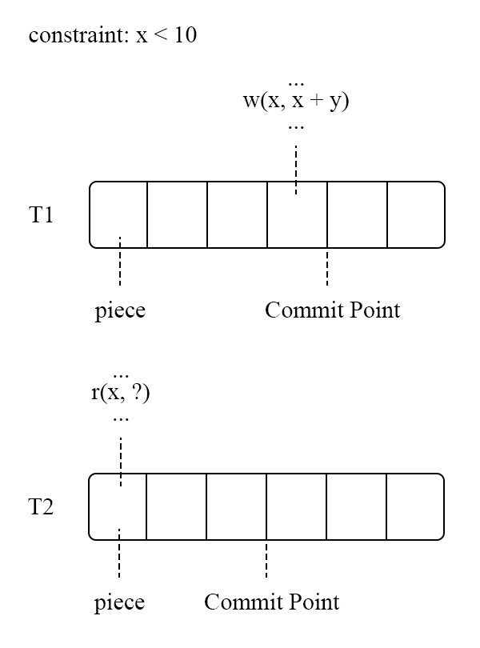

图 11 - 利用 piece 分割事务的实现

图 11 是 PWV 对事务的分割，将事务分割成以 piece 的小单元，然后寻找其中的 Commit Point，在 Commit Point 之后则没有可能发生逻辑原因 abort 的可能。图中 T2 需要读取 T1 的写入结果，只需要等待 T1 执行到 Commit Point 之后在进行读取，而不需要等待 T1 完全执行成功。

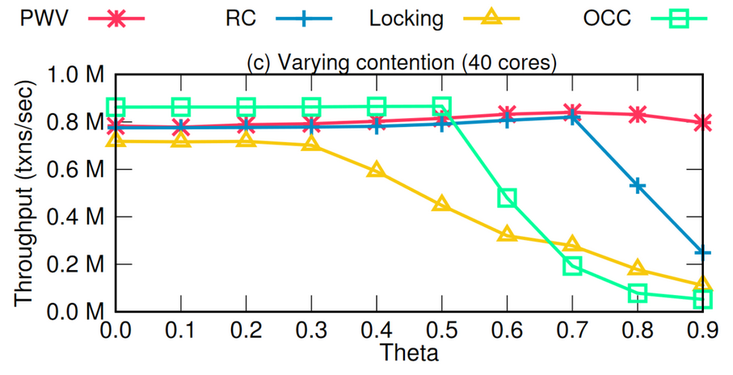

图 12 - PWV 的性能

通过对事务执行过程的进一步细分，PWV 降低了读操作的延迟，相比于 BOHM 进一步提升了并发度。图 12 中 RC 是 BOHM 不提前读取的策略，从性能测试结果能够看出 PWV 在高并发下有着非常高的收益。

BOHM 和 PWV 通过对事务间依赖的分析来获取冲突场景下的高性能，但是这一做法需要知道全局的事务信息，计算节点是一个无法扩展的单点。

## 重视实践的确定性数据库 Aria

最后我们来讲 Aria，Aria 认为现有的确定性数据库存在着诸多问题。Calvin 的实现具有扩展性，但是基于依赖分析的 BOHM 和 PWV 在这方面的表现不好；而得益于依赖分析，BOHM 和 PWV 在冲突场景下防止性能回退的表现较好，但 Calvin 在这一情况下的表现不理想。

在分布式系统中为了并发执行而进行依赖分析是比较困难的，所以 Aria 使用了一个预约机制，完整的执行过程是：

- 一个 sequence 层为事务分配全局递增的 id；

- 将输入的事务持久化；

- 执行事务，将 mutation 存在执行节点的内存中；

- 对持有这个 key 的节点进行 reservation；

- 在 commit 阶段进行冲突检测，是否允许 commit，没有发生冲突的事务则返回执行成功；

- 异步的写入数据。

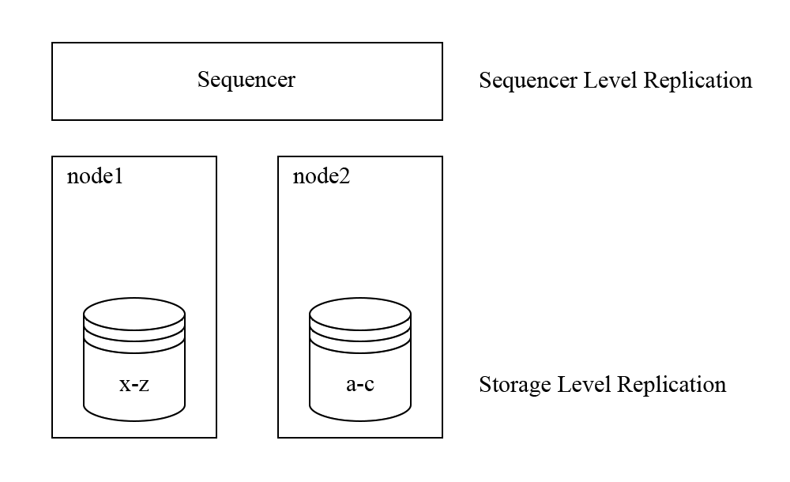

图 13 - Aria 的架构图

图 13 是 Aria 的架构图，每个节点负责存储一部分数据。Aria 的论文里并没有具体的规定复制协议在哪一层做，可以在 sequencer 层也可以在 storage 层实现，在 sequencer 层实现更能发挥优势确定性数据库的优势，在 storage 层实现能简化 sequencer 层的逻辑。

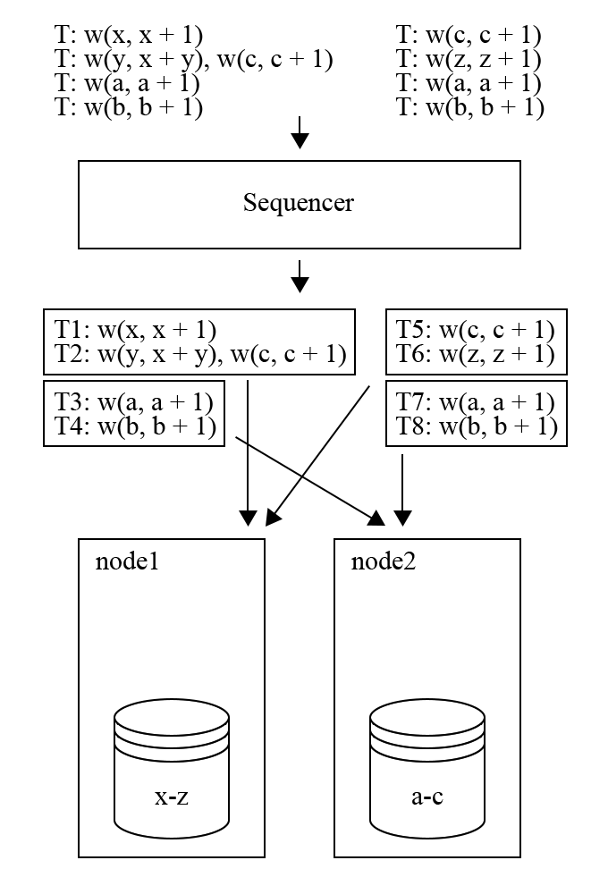

图 14 - Aria 执行过程一

图 14 中，输入事务在经过 sequencer 层之后被分配了全局递增的事务 id，此时执行结果就已经是确定性的了。经过 sequencer 层之后，事务被发送到 node 上，T1 和 T2 在 node1 上，T3 和 T4 在 node2 上。

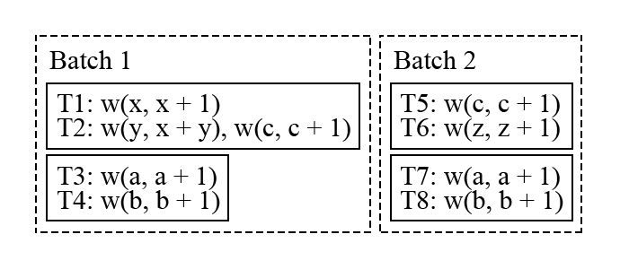

图 15 - Aria 执行过程二

图 15 中，假设 T1 和 T2 在 node1 上被打包成了一个 batch，T3 和 T4 在 node2 上被打包成了一个 batch。在执行时，batch 中的事务执行结果会放在所属 node 的内存中，然后进行下一步。

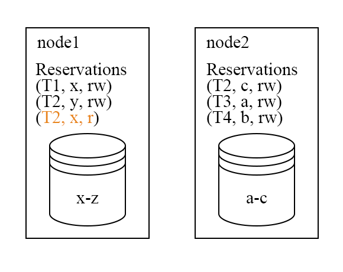

图 16 - Aria 执行过程三

图 16 是 batch1 中的事务进行 reservation 的结果，需要注意的是执行事务的 node 不一定是拥有这个事务数据，但 reservation 的请求会发送到拥有数据的 node 上，所以 node 一定能知道和自身所存储的 Key 相关的所有 reservation 信息。在 commit 阶段，会发现在 node1 上 T2 的读集合与 T1 的写集合冲突了，因此 T2 需要被 abort 并且放到下一个 batch 中进行执行。对于没有冲突的 T1，T3 和 T4，则会进入写入的阶段。因为在 sequencer 层已经持久化了输入结果，所以 Aria 会先向客户端返回事务执行成功并且异步进行写入。

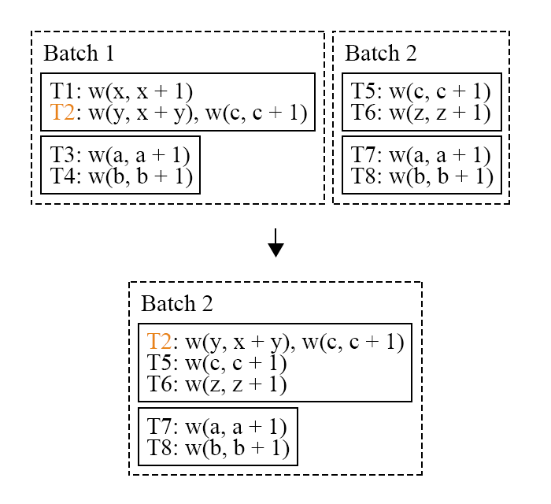

图 17 - Aria 执行过程四

图 17 是 T2 被推迟执行的结果，T2 加入到了 batch2 之中。但是在 batch2 中，T2 享有最高的执行优先级（在 batch 中的 id 最小），不会无限的因为冲突而被推迟执行，而且这一策略是能够保证唯一结果的。

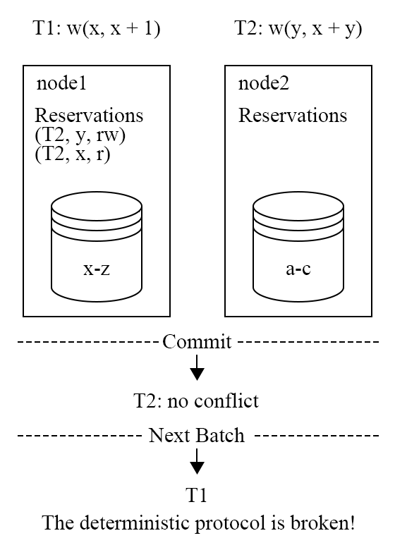

图 18 - Aria 的不确定性问题

那么容易想到的是 Aria 也可能会有如 Calvin 一样的不确定性问题。图 18 中，T1 和 T2 是存在冲突的，应该先执行 T1 在执行 T2，如果 T2 在 T1 尚未开始 reservation 之前就尝试提交，那么就不能够发现自己与 T1 存在冲突，执行顺序变为了 T2->T1，破坏了确定性的要求。为了解决这个问题，Aria 和 Calvin 一样存在 coordinator 的角色，利用 coordinator 来保证所有的节点处在相同的阶段，图 18 中，在 T1 所在的 node1 完成 reservation 之前，node2 不能够进入 commit 阶段。

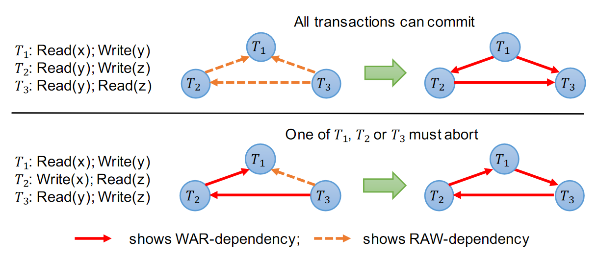

图 19 - Aria 的重排序

确定性数据库的优势之一就是能够根据输入事务进行重排序，Aria 也考虑了这一机制，首先 Aria 认为 WAR 依赖（写后读）是能够安全的并行的，进一步在 commit 阶段对 reservation 的结果进行冲突检测时，可以将读后写依赖转化为写后读依赖。在图 19 上方的图中，如果按照 T1 -> T2 -> T3 的顺序执行，那么这三个事务需要串行执行。但是在经过重排后并行执行的结果中，T2 和 T3 的所读取到的值都是 batch 开始之前的，换言之，执行顺序变为了 T3 -> T2 -> T1。而在图 19 的下方，即使将 RAW 依赖转化为了 WAR 依赖，因为依赖出现了环，依旧需要有一个事务被 abort。

相比于 Calvin，Aria 设计的优点在于执行和 reservation 的策略拥有更高的并行度，并且不需要额外的 OLLP 策略进行试探性读，并且 Aria 能够提供一个后备策略，在高冲突的场景下开其一个额外的冲突事务处理阶段，本文不再详细描述，感兴趣的同学可以看 Luyi 老师在知乎上写的[文章](https://zhuanlan.zhihu.com/p/196429643)。

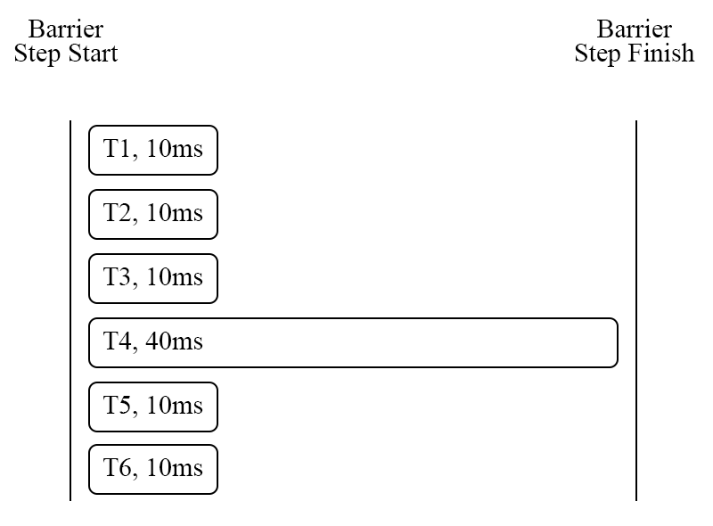

图 20 - Aria 的 barrier 限制

图 20 是 Aria 的 barrier 限制，具体表现为，如果一个 batch 中存在一个事务的执行过程很慢，例如大事务，那么这个事务会拖慢整个 batch，这是我们相当不愿意看到的，尤其是在大规模的分布式数据库中，很容易成为稳定性的破坏因素。
总结
确定性是一个很强的协议，但是它需要全局的事务信息来实现，对上述的确定性数据库的总结如下。

基于依赖分析的 BOHM 和 PWV：

- ↑ 充分利用 MVCC 的并发性能

- ↑ 能够防止冲突带来的性能回退

- ↓ 单节点扩展困难，不适合大规模数据库

分布式设计的 Calvin 和 Aria：

- ↑ 单版本，存储的数据简单

- ↓ 长事务、大事务可能拖慢整个集群

- ↓ barrier 机制需要 coordinator 进行实现，存在 overhead

- ↓ 如果一个节点出现故障，整个集群都将进入等待状态

相比之下，基于 Percolator 提交协议的分布式数据库，只需要单调递增的时钟就能够实现分布式事务，对事务的解耦做的更加好。

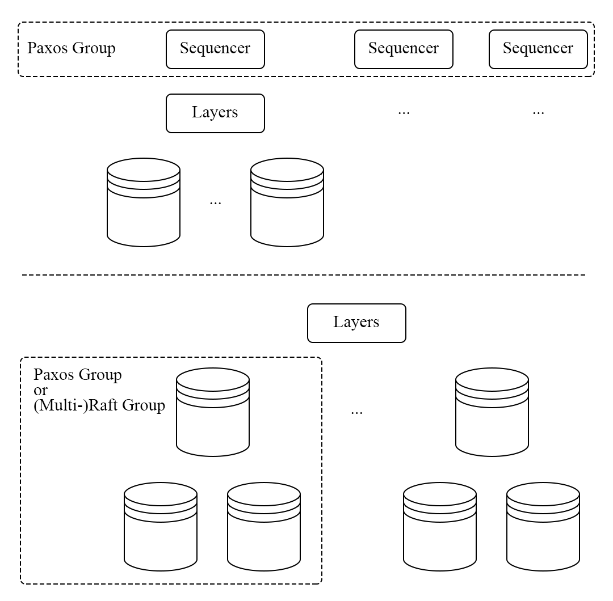

图 21 - 共识算法层次的对比

共识算法的层次是确定性数据库一个很重要的性能提升点，图 31 下方是我们经常接触的在存储引擎层面进行共识算法的做法，虽然系统对上层而言变得简单了，但是存在着写放大的问题。确定性协议能够保证一样的输入得到唯一的输出，因此使得共识算法能够存在于 sequencer 层，如图 21 上方所示，极大提升了一个副本内部的运行效率。

总结，确定性数据库目前主要面临的问题一是在 Calvin 和 Aria 中存在的 coordinator 角色对全局的影响，另一点是存储过程的使用方式不够友好；而优点则在于确定性协议是一个两阶段提交的替代方案，并且能够使用单版本的数据来提升性能。

