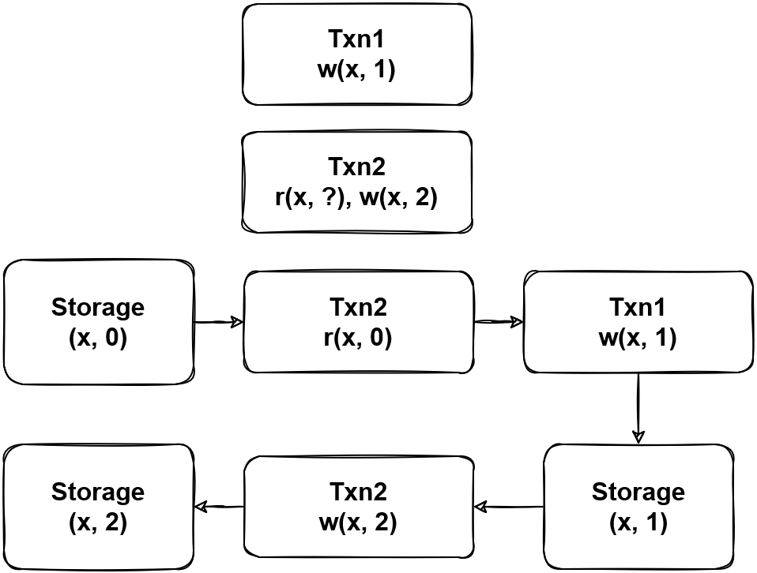
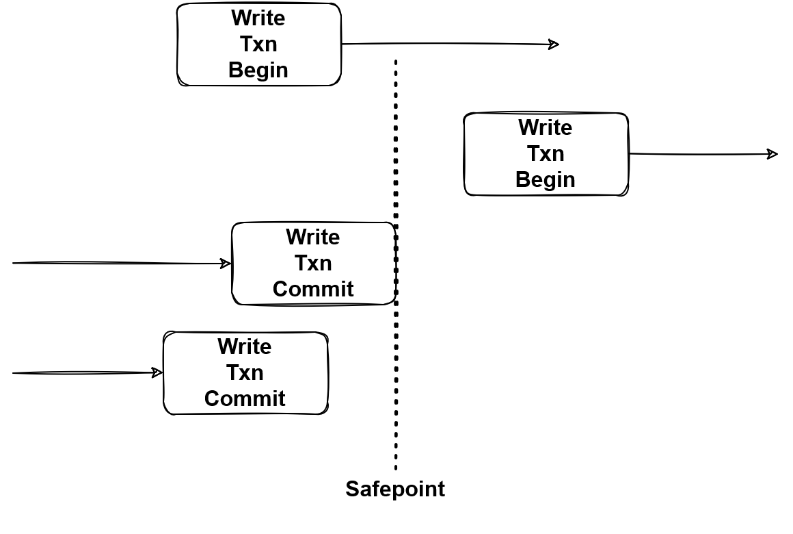
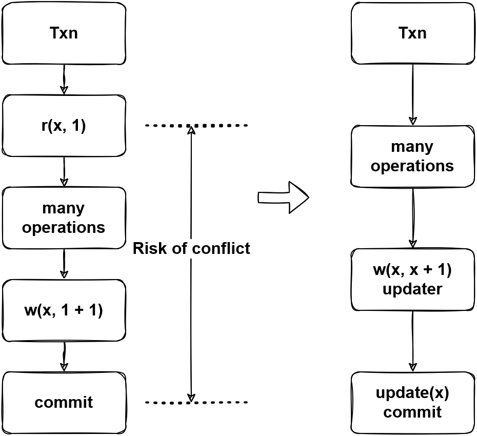
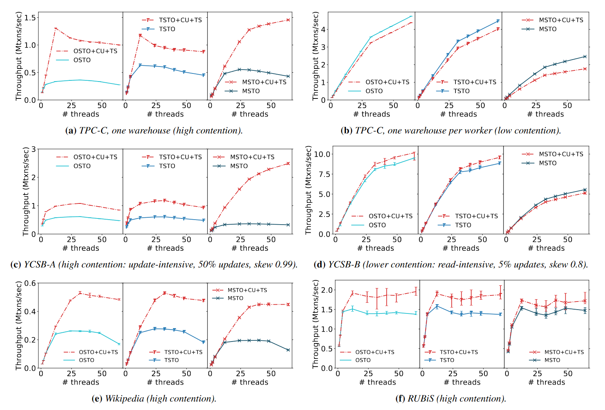

事务并发控制技术是数据库的核心之一，在确保隔离性的前提下提高事务执行的并行度是并发控制技术的目标，本次我们将学习一些常用的并发控制方法，最后对 VLDB 2020 的 best paper “Opportunities for Optimism in Contended Main-Memory Multicore Transactions” 进行解读，来看看有哪些办法能够提升事务的并行度。
## 绪论

首先我们要理解为什么需要并发控制技术，如果我们需要一些的事物输入产生可串行化的执行结果，那么通常有两个思路。

- 逐个执行这些事务，这样我们所获得的结果当然是可串行化的。
- 并行的执行这些事务，但是保证结果是可串行化的。

第一种方法会将数据库之中的并发降低到 1，这显然在大部分系统中都是不能够被接受的，那么如何在并行执行、保证所需隔离性的要求下尽可能的提升并行度就是并发控制方法的目标。

图 1 - 缺少并发控制方法导致的异常提交

图 1 展示了在缺少并发控制方法的情况下，并行执行事务可能会带来异常的结果，图中 Txn2 将 Txn1 的写入结果覆盖，产生了 Lost update。

通常，所要求的隔离级别越高，系统整体的性能越低。
两阶段锁
两阶段锁的两个阶段分别是锁的扩张（Expanding）和收缩（Shrinking）阶段，而锁的类型又分为读锁和写锁，和常用的读写锁的功能对应。

图2 - 两阶段锁的互斥表现

图 2 中展示了加锁和遇到锁的情况，Txn3 在遇到了 Txn2 在 y 上的读锁时需要等待到 Txn2 结束才能够继续进行，而 Txn1 在遇到 Txn3 在 y 上的写锁时则需要等待到 Txn3 结束才能够继续进行。

除了标准的两阶段锁（2PL），还有一些更加严格的变种。标准的两阶段锁只要求锁的收缩阶段在扩张阶段之后，即在收缩阶段中不再申请新的锁即可，但是事务可能中锁收缩的过程中或是收缩结束之后仍然处于执行的状态。

图 3 - 两阶段锁的互斥表现 bug

图 3 是 2PL 与其两种变体 Strict 2PL(2PL) 和 Strong Strict 2PL(SS2PL) 的对比，2PL 只要求在锁申请结束后就可以释放锁，而 S2PL 要求事务执行结束后才允许释放写锁，SS2PL 则要求事务执行结束后才能够释放读锁和写锁。SS2PL 虽然是 2PL 的变体，但因为事务的执行只在扩张阶段中进行，实际上是一种一阶段锁。

表 1 - ANSI SQL 隔离级别的加锁要求

表 1 是 ANSI SQL 隔离级别的加锁要求，对于脏写现象是否需要在读未提交的情况下被防止 ANSI SQL 中没有明确的说明，但是这一隔离级别在扩展的 ANSI SQL 中被列为最低的级别（ Degree 1），需要防止脏写，表中不作明确的说明。在读已提交下需要防止脏写，因此需要加写锁；而可重复读需要通过 item 上的读锁来防止读到的数据被其他事务所修改；可串行化则需要对 predicate 类型的查询添加读锁。

图 4 - Fuzzy Read(P2) 的现象

两阶段锁的实现简单，但是对 SQL 隔离级别的影响却很深远，ANSI SQL 隔离级别以及它的扩展都是在两阶段锁的前提下制定的，在 “A Critique of ANSI SQL Isolation Levels” 中提出了一些在高隔离级别下读必须加锁理由。图 4 是 Fuzzy Read 的现象，论文声称因为没有加读锁导致事务两次读取到读数据违反了约束。

但如果站在现在的研究上回首，不难发现两阶段锁并不是唯一的并发控制方法，尝试用不同的方式去考虑这个问题，我们还有一些不依赖读写锁的并发控制方法。
### 乐观并发控制方法 - OCC
两阶段锁在事务的执行过程中通过加锁来保证隔离性，但是加锁是有 overhead 的，乐观的并发控制方法使用一种 lazy check 的机制，在事务执行过程中不加锁，在事务提交时候检查是否产生冲突。

图5 - OCC 下的冲突

图 5 是 OCC 下产生冲突的例子，因为 x 被修改，所以冲突事务必须回滚。但是 OCC 带来的问题就是在高冲突的场景下，频繁的发生事务回滚，会大幅影响系统的性能。

图6 - OCC 下的高冲突场景

图 6 对比了 2PL 和 OCC 下的高冲突场景，可以看到高冲突场景下 2PL 的并发控制方法能够让事务逐个提交，但 OCC 会产生很多事务回滚，需要注意的是事务回滚也可能是有代价的，例如在 Percolator 的两阶段提交中，会在第一阶段发现事务冲突，因此在发现冲突的同时也会有一部分 prewrite 成功的数据，在清理这些数据的过程中，也需要消耗系统的性能。在冲突十分高的情况下，高频的回滚可能会阻塞系统的正常运行，因此 OCC 并不适用于这些使用场景。后文会详细讲述如何优化高冲突场景下的 OCC。
### 多版本并发控制方法 - MVCC
MVCC 是多版本并发控制方法，即对一份数据会存储多个版本，因此也需要一个 GC 去回收不再被使用的版本，释放系统的空间。

例 1 - MVCC 存储多版本的数据

图7 - MVCC 中的异常

图 7 是 MVCC 中的异常现象，在 MVCC 系统中，因为保存了历史数据，所以需要解决一个事务能读取到哪个。解决的常用办法是通过一个全局的版本分配器，版本会决定数据的可见性，在有些系统中，会将 timestamp 当作版本号，下文也用 ts 来代表版本，图中的 Txn2 使用 ts = 1 去读取，能读到 ts <= 1 的数据。即使在 Txn1 将数据写入之后，所写入到 ts = 2 的数据对于 Txn2 来说依旧是不可见的，所以 Txn2 不管使用 item read 还是 predicate read 都能够读到和之前相同的数据，防止了不可重复读或者幻读异常的发生。我们注意到在 2PL 的系统中，幻读被认为是不可重复读的延伸，存在两个原因，一是防止幻读需要范围读锁，比较难高效的实现（尤其是在分布式系统中）；二是防止幻读所需要的范围读锁，可能会严重影响系统的并发度。但是在多版本的系统中，只需要读取一个快照的数据，就能够同时防止不可重复读和幻读，因此将幻读列为不可重复读的延伸异常，就不是那么有道理了。

图8 - MVCC 中的一致性问题

MVCC 通过一个快照去读取相同的数据是一个很理想的想法，但是图 8 描述了 MVCC 中的一致性问题，如果一个事务在 Commit 过程中另一个事务用更新的 ts 进行读，那么对于尚未存在的数据，MVCC 无法正确处理，导致出现不可重复读的现象。

图9 - MVCC min_commit_ts 实现一致读

为了解决这个图 8 的问题，MVCC 有两种办法，图 9 在系统中加入了一个约束，也是 TiDB 所使用的方法，写事务的 ts 必须大于所有与之相交的读事务，在实现中会让读事务推高 key 上的 min_commit_ts = read_ts + 1，在提交时候需要计算 commit_ts = max{commit_ts, min_commit_ts}，图 9 中，ts=2 的第一次读取将 min_commit_ts 推高到 3，进而让写事务写入的版本不影响 ts=2 的重复读取。感兴趣的同学还可以思考一下在 Percolator 提交协议下，predicate 读对于尚未存在的数据是如何防止幻读的。

图10 - MVCC safepoint 实现一致读

图 10 是另一种解决方法，如果能知道全局的 safepoint，那么读事务只需要从 safepoint 进行读取，在 safepoint 之前的事务都已经被完整提交，这样就不会出现不一致的情况，后文的 MSTO 实现就是使用这个方式保证一致性的。

这两种方式的区别在于 min_commit_ts 不需要知道全局的事务信息，而 safepoint 需要但没有额外的开销，需要根据实际场景进行选择。

MVCC 最大的优点是读事务不需要阻塞写事务，相比于 2PL，在读写冲突的场景下，MVCC 能大幅提升并行度，但是 MVCC 自身也存在不可忽视的 overhead，在只需要单版本的场景下，会产生比较大的性能影响，同时 GC 可能会影响系统整体的稳定性，如带来延迟升高等。
# 高冲突场景优化
上文介绍了三种并发控制方法，两阶段锁、乐观并发控制方法和多版本并发控制方法，我们不难看出，实际上何种并发控制方法好是一种权衡，需要根据 workload 的类型以及能够事实上能够接受的隔离性进行选择。

在本节，我们将讨论如何对高冲突场景进行优化。“Opportunities for Optimism in Contended Main-Memory Multicore Transactions” 基于 in-mem DB 中的乐观并发控制方法，对这个问题在进行了扎实的研究，并获得了 VLDB 2020 best paper。
## in-mem DB vs disk-based DB
在开始说这个话题前，我们先得看一看 in-mem DB 和 disk-based DB 的共同点与区别。

共同点：

- 对于正确性、隔离性的要求是一样的。
- 整体的架构是相似的。

区别：

- 因为 in-mem DB 的延迟很小，所以在实现细节上会有所不同，例如在等锁时，有的 in-mem DB 使用自旋锁，虽然增加了 CPU 开销，但依旧能够提升性能。
- in-mem DB 能够使用随机访问的数据结构，例如 HashMap 和 Masstree。
- 系统的性能瓶颈不同，在 in-mem DB 中，时间戳申请也可能成为一个瓶颈。
## 研究对象
这篇文章采用了三个数据库作为研究对象，并将其在实验框架 STO 中进行了实现。

- OSTO，基于 Silo，使用单版本乐观事务并发控制方法，有多个时间戳分配器。
- TSTO，基于 TicToc，使用单版本乐观事务并发控制方法，不使用时间戳分配器，通过事务关系计算时间戳。
- MSTO，基于 Cicada，使用多版本并发控制。
### OSTO

图11 - OSTO 中的冲突事务

图 11 是 OSTO 处理冲突事务的方式，与传统的 OCC 不同，OSTO 加写锁不加读锁，但是在提交时进行检测，要求读到的数据在提交前不产生变化，否则需要 abort。在 OSTO 中，每条数据上有版本信息用于检测读到的数据是否变化。

图 12 - OSTO 的时间戳分配方式

OSTO 为了解决单点的时间戳分配瓶颈，使用了多分配器，但是会定期进行同步，图 12 是同步的过程，在一个 epoch 中，不同线程的分配器递增的分配时间戳，而在 epoch 之间，则会让所有的分配器同步自身的递增量。
### TSTO
基于 TicToc 的 TSTO 与 OSTO 基本相同，但时间戳是根据一个 epoch 中事务的读写关系进行计算的，这里存在了一个隐式的事务重排序，会在下文进行介绍。
### MSTO
MSTO 的实现是多版本的，论文中的结构非分布式数据库，所以采用 safepoint 的策略来保证一致性。

图13 - TSTO 和 MSTO 中的事务重排序

图 13 是 TSTO 和 MSTO 的事务重排序，在 OSTO 中，因为 t2 所读到的 x 产生了变化，为了防止 lost update 发生，t2 需要 abort。但是我们注意到 t2 和 t1 并没有发生写冲突，所以在 MSTO 中并不会检测到冲突，假设 t2 是根据所读取到的 x 的值对 y 进行了更新，那么这两个事务执行的顺序就是 t2 -> t1，TSTO 对读写关系的分析能够得到同样的结果，但是 OSTO 只尝试以 t1 -> t2 的顺序去执行，所以 t2 被 abort 了。
## 基本参数
论文在介绍他们的研究成果之前，先对系统的基本参数做了总结，并且通过实验说明了基本参数对系统存在质的影响。
### 冲突管控
当事务发生冲突时，需要回滚并重试，但如果重试时与之冲突当事务尚未提交完毕，会导致第二次冲突发生，造成性能浪费。

图14 - Contention Regulation

图 14 是使用冲突管理前后的对比图，在使用冲突管理后，当发生事务冲突时，会等待一段时间再进行重试，将系统资源暂时让给其他事务。但是关于等待时间的问题论文没有展开研究，大概的：

- 过快的开始重试可能会导致数据库因为冲突崩溃。
- 等待过长时间可能造成处理器的性能浪费。
### 内存分配
内存分配器对任何系统都有密切的性能影响，在 in-mem DB 系统中，内存分配的影响远大于比 disk-based DB，所以我们不展开讨论这个话题。论文中使用了 rpmalloc 替换 glibc malloc 之后获得了 1.6 倍的性能提升。
### 防止竞争索引
在一些系统中，可能会出现 false-positive 的冲突，减少这种冲突也能够提升系统的性能。

图15 - false-positive 冲突

图 15 所展示的就是一个 false-positive 的冲突一个事务尝试插入一个一条 (1, 1, 999) 的记录，但另一个事务扫了所有 wid = 1 & did = 2 的记录，这两个事务之间不存在冲突，但是因为一些数据结构的设计，范围锁会锁住两端的临界点，导致和新插入的 (1, 1, 999) 的记录产生了误判的冲突。如果一个系统能够避免这种冲突，我们就称它实现了防止竞争的索引。
### 死锁检测/规避
对于死锁，我们通常有两种解决思路，防止死锁出现和检测出出现的死锁。上一讲所研究的确定性数据库一般就采用防止死锁出现的思路。然而很多数据库没有办法防止死锁的出现，如何高效的进行检测就成了主要问题。因为 in-mem DB 的低延迟特性，论文中使用了一种等待一定时间即判断事务处于死锁的事务，可能会造成一些误判，但对于整体的性能有正面效果。
### 性能测试

图16 - 基本参数的性能测试

图 16 是对基本参数的性能测试，蓝线的 OSTO Baseline 是使用 OSTO 实现了上述的和论文中额外提及的一些优化后的结果，可以发现数据库实现的基本参数对于性能存在着重大的影响。如果缺少大于一个基本参数的实现，在冲突 workload 下数据库的性能可能直接归零。

图17 - 研究对象的性能测试

图 17 是对研究对象的性能测试，可以看出来在高冲突场景下事务重排序能够体现出一定的性能优势，然而在不需要多版本的 workload 下 MVCC 的优势难以充分体现，多版本 overhead 成为了性能的阻碍。
## 优化高冲突 workload
对于乐观并发控制方法，最容易想到的优化性能的方法就是减少系统中出现的冲突。论文提出了两个优化方法，但是需要使用数据库的客户端也进行一些改动。
- Commit-time Update(CU)，在提交时进行更新数据的写入操作。
- Timestamp Splitting(TS)，将一行数据分割为不同的时间戳进行管理，类似于 Column Family（非 RocksDB 的 CF）。
### Commit-time Update

图18 - 冲突出现的风险

Commit-time Update(CU) 可以降低冲突出现的风险。图 18 描述了可能出现冲突的时间，如果事务读取了一个值并且对这个值进行了更新，如果在此期间这个值被其他事务所修改，就有出现 lost update 的风险，为了防止 lost update，事务必须因为冲突而回滚。

为了降低事务中读操作产生冲突的风险，我们必须尽可能短的持有读锁或尽可能缩短从读到提交的时间间隔。CU 设计了一个更新器，在运行更新器的时候不会对数据库做任何操作，在事务提交时，这些更新器才会被应用，避免了读到的数据被客户端所持有。从另一个角度理解，避免将数据读到客户端为数据库系统提供了额外的对事务重排序的可能性。

图19 - CU 的使用条件

图 19 是 CU 的使用条件，T1 能够使用 CU 是因为所读到的 read set(y) 没有与 write set(x) 产生重合；而 T2 的 read set(x, y) 与 write set(x) 产生了重合，客户端要求立即读取到 x.col1，所以不能够使用 CU。
### Timestamp Splitting
Timestamp Splitting(TS) 的思想类似于 Column Family，注意这里不是 RocksDB 的 Column Family，是将 Columns 分割为多个 families 分别进行存储。一般情况下，TP 数据库系统一个 key 会指向一行数据，所以加锁也是以行为单位的，因此带来了一些不必要的冲突。TS 尝试减少这种冲突。

图20 - TS 要解决的问题

图 20 中，一个事务写了 col3 和 col4，另一个事务读取了 col1，这两个事务实际上并没有产生冲突，但是在以行为单位的冲突检测下，会被判定为冲突，而导致 Txn1 被 abort。

图21 - TS 的解决方式

TS 并没有将一行数据分割为多个 families 进行存储，但是在一行数据内设计了多个 timestamp，以图 21 为例，让 col1 和 col2 使用一个不频繁更新的时间戳，让 col3 和 col4 使用一个频繁更新的时间戳，这样 col3 和 col4 上的修改操作就不应影响到 col1 和 col2 上的读取操作。

图 22 - 不能使用 CU 但是可以使用 TS 的情况

图 22 中的例子因为对 x 同时进行了读写，所以 CU 策略不能够使用，但是仍然可以通过 TS 来避免它与 x.col3 和 x.col4 上写入所产生的冲突。
### 性能测试

图 23 - CU 和 TS 的性能测试

图 23 是 CU 与 TS 的性能测试，可以看到这些策略在 b 的低冲突的场景下存在一定的 overhead，但是在 a, c, e, f 的高冲突场景下起到了良好的效果，通过降低冲突发生的概率提升了系统整体的性能。
# 总结
本次我们回顾了一些常用的并发控制方法，并且解读了 “Opportunities for Optimism in Contended Main-Memory Multicore Transactions”，这篇论文对乐观并发控制在高冲突下的性能优化做了扎实的研究，并且其中一些减少冲突的思想同样受益于非乐观或是分布式的系统。

