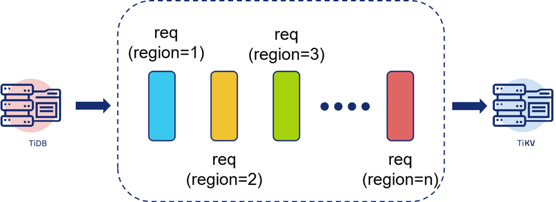
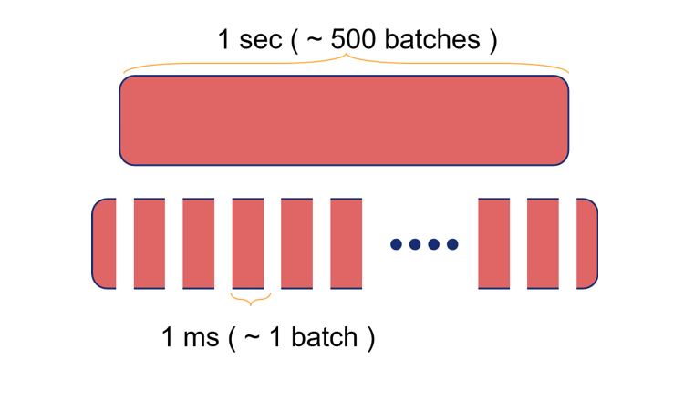

>本文由逊馁队的成员夏锐航同学主笔，介绍 Unified Thread Pool 项目的设计与实现过程。该项目实现了在 TiKV 中使用一个统一的自适应线程池处理读请求，能够显著提升性能，并可预测性地限制大查询对小请求的干扰，最终在 TiDB Hackathon 2019 中斩获一等奖。

这次 TiDB Hackathon 主题为 “Improve”，即提升 TiDB 及相关项目的性能、易用性等。我们设计的切入点是： 

* TiKV 现有的线程池在大小查询混合场景下的表现不太优秀。

* 需要针对不同的环境、场景配置线程池数量，使用和学习成本较高。

于是我和奕霖尝试为 TiKV 重新实现一个线程池来解决这个问题，以达到 Improve 整体表现的效果。除了优化读请求的线程池外，我们计划将这个线程池来代替 TiKV 中其他线程池，最后就产生了我们本次的参赛作品 Unified Thread Pool。

## 项目设计

在 TiKV 现行的线程池方案中有 Coprocessor、Storage 和 Scheduler 三套线程池。这些线程池原本是设计来分隔不同的任务，减少它们之间的相互影响。这种方式简单粗暴，缺点也很明显，如：

* 由于多个线程池共存，每个线程池都被限制至无法使用系统的全部资源。

* 每套任务中又对应二至三个不同优先级的线程池，但是从实际效果来讲这个隔离也没能很好的发挥用处。

* 在目前的 TiKV 中需要对每个线程池单独配置，如 [Scheduler](https://pingcap.com/docs-cn/v3.0/reference/configuration/tikv-server/configuration-file/#scheduler-worker-pool-size)、[Storage](https://pingcap.com/docs-cn/v3.0/reference/configuration/tikv-server/configuration-file/#readpoolstorage)、[Coprocessor](https://pingcap.com/docs-cn/v3.0/reference/configuration/tikv-server/configuration-file/#readpoolcoprocessor)。

我们的 Unified Thread Pool 是一个在用户态模拟多级反馈队列调度的线程池，能较好的解决上述现行线程池方案的几个缺点。两者具体的对比如下表所示：

| 现行线程池方案 | 我们的改进 |
|:--------|:--------| 
| 多个线程池共存，每个线程池都不能分配所有的资源 | 一个统一的线程池，可以分配尽量多的资源|
| 通过分配到不同的线程池来实现优先级，但效果不佳 | 内部实现按时间的调度 |
| 大请求对小请求的影响不可控 | 可预测的大请求对系统的影响 |

表 1 与现行线程池的对比

Unified Thread Pool 的调度方案参考自多级反馈队列算法，在 Unified Thread Pool 中一共有三个队列，worker 每次以不同的数量从不同的队列里面拿任务执行来表示优先级。不同于 OS 场景下的调度是以每个任务为单位，在这里一个 TiDB query 可能因为跨越多个 Region 而产生多个 TiKV task，如图 1 所示：

图 1 TiDB query 与 TiKV task 的关系

因此在这里我们需要以 TiDB 的 query 为单位进行调度。为了实现这一点我们让 TiDB 在发送 query 的时候带上一个 token 来作为标识，在线程池内我们也以 token（query）为整体来调整优先级。

另一点很重要的改动是，现在 TiKV 中可能会出现一些大的 Coprocessor 请求，这些请求按batch执行，一个请求可能包含数百个batches，执行一次就需要秒级的时间，使得对它们的调度无法进行。关于Coprocessor 向量化执行的内容PingCAP后续也会有相关文章进行介绍。因此我们使用 Rust 最新的 async/await 协程机制，在 Coprocessor batches 之间手动埋点移交执行权，如下图所示，一个原本需要约一秒钟，包含约 500 个 batch 的任务在现在将会变为许多个时间约为一毫秒的小任务，在每个小任务之间会主动移交执行权。

图 2 将请求分成多次执行

至此，Unified Thread Pool 已经基本能够通过动态调节队列的参数来实现资源对大小任务的分配，并且需要设置的参数非常简单，仅有一个表示当出现大小任务混杂的情形时小任务应占的计算资源的百分数。通过测试我们看到这个的分配的效果比较精确，如下图所示。

图 3 Configurable

## 比赛过程

### Hacking Time

在 10 月 26 日上午拿到 UCloud 提供的机器（8C16G）后，我们开始部署 TiDB 集群便于测试。第一次部署方案是 3TiDB + 3TiKV，但是当集群运行起来之后我们发现当请求压来时瓶颈似乎在 TiDB 上，于是我们将 TiKV 集群 down 掉一台，情况虽然有所好转但还是无法将 TiKV 跑到满负荷。一番挣扎无果后我们将整个集群铲掉重新部署，第二次按照 4TiDB + 1TiKV + 1Tester 部署完之后终于让瓶颈出现在 TiKV 上。

详细的测试方案是使用 Tester 机器向四台 TiDB 发送请求然后检测延时和 QPS，sysbench 测试数据三十二张表，每张 10,000,000 条数据，总计容量约 80G。我们模拟了大小两种规格的请求，小请求是使用 sysbench 的 point_select 和 read_only，大请求则是使用四个 clients 不断地 SELECT COUNT(*) FROM .. 来扫表。下图是我们在上述测试环境中对 Unified Thread Pool 与 TiKV master 版本所做的对比，可以看到在单纯的小请求情况下吞吐量提高了20%~50%。

图 4 fully utilize

### 睁眼吃喝闭眼睡

众所周知 Hackathon 不变的主题就是吃吃喝喝，这一次也一样。PingCAP 为选手们提供了丰富的三餐，配上广州 office 的装潢简直像在度假。午餐有超多口味可以选，到了晚上一会议桌的虾蟹的确是太有视觉冲击力。除了正餐之外，还有不限量供应的零食咖啡快乐水，实在是太幸福了。

在比赛开始之前就有一件非常好奇的事情，就是据说现场晚上有三张床垫，不知道会出现怎样难上加难的场景。结果真的到了犯困的时候才发现原来其他人是根本不睡的……

晚上两点左右感觉刚跑完的测试效果还行，就找了间放了床的小会议室准备做梦。可是充气床垫的气已经漏完了，在茶水间里面翻到充气装置之后打算给它重新重启，但是插头插上之后气泵的声音在深夜里面真是大得不行，不知道之前工作人员是怎样悄无声息地把三个床垫给充起来的。为了防止噪音扰民，我们把床垫卷到大楼下一层（洗手间旁边）的小房间里面充气，期间还引来了两位像是保安的叔叔来看看发生了什么。接下来和 yilin 两个人扛着两米的床垫走过会议室走过茶水间走过工位，走进小卧室的那一段路，实在是令人印象非常深刻。

这栋楼的空调效果真是非常强劲，虽然不是第一次在这里被冷到，但是这一回来的时候依旧没有带外套。即使睡觉之前已经把空调关掉了，还是和带了外套但没拿出来的奕霖在床上缩成了两团。

## 写在 Hackathon 之后

比赛最后 Demo Time 的时候看别人的项目都好优秀，看得有点想提前跑路了，还好不是我上去做 presentation，能夺魁事实上挺让我感到意外的，现在 Hackathon 虽然已经结束了，但还想继续完善这个作品。现在它虽然能提升最大吞吐量，但是在延时方面的表现还能更进一步。在比赛时我们的线程池是基于比较简单的 juliex 来设计的，后续计划参考一些比如 tokio 之类的成熟的线程池来进行优化，希望能够将它完善合进 master。大家可以在 [TiDB 性能挑战赛](https://pingcap.com/community-cn/tidb-performance-challenge/) 中继续一起鼓捣这个项目，该项目对应的 [PCP 链接](https://github.com/tikv/tikv/issues/5765)。

最后感谢奕霖老师这么强还愿意带我玩，感谢 PingCAP 让我蹭吃蹭喝的辛苦付出 :D 
