>**作者介绍**：李坤，PingCAP 互联网架构师，TUG Ambassador，前美团、去哪儿数据库专家。

## 一、概述

使用 TiDB Ansible 部署 TiDB 集群，会同时部署一套 Grafana + Prometheus 的监控平台，这套监控用来收集和展示 TiDB 集群各个组件和机器的 metric 信息，这些 metric 信息非常丰富，可以帮助使用者分析 TiDB 集群的状态以及 Trouble shooting。随着使用经验的增多，我们积累了一些监控使用上的技巧，在这里分享给大家。

## 二、监控架构

Prometheus 是一个拥有多维度数据模型的、灵活的查询语句的时序数据库。Grafana 是一个开源的 metric 分析及可视化系统。

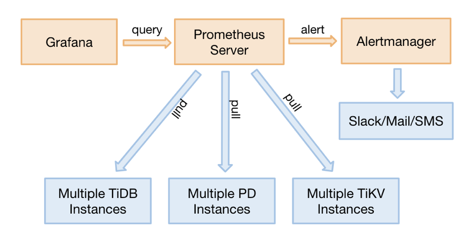

<div class="caption-center">图 1 TiDB 监控整体架构</div>

从 TiDB 2.1.3 版本开始，监控采用 pull 的方式，而之前采用的是 push 的方式，这是一个非常好的调整，它解决了几个问题：

* 之前如果 Prometheus 需要迁移，需要重启整个集群，因为组件要调整 push 的目标地址。

* 现在可以部署 2 套 Prometheus，防止监控的单点，因为 pull 的 source 端是可以多个。

* 去掉了 `PushGateWay` 这个单点组件。

## 三、监控数据的来源与展示

TiDB 的 3 个核心组件（TiDB，TiKV，PD）可以通过 http 接口来获取 metric 数据，这些指标都是从程序代码中统计上传的，端口如下：

| 组件 | 端口 |
|:-----|:-----|
| tidb-server | 10080 |
| tikv-server | 20181 |
| pd-server | 2379 |

用 tidb-server 举例，我们通过 http 接口，看一个 statement QPS 的 metric：

```
# 可以看到实时 qps 的数据，区分不同的 type，value 是 counter 类型的累计值（科学计数法）

curl http://__tidb_ip__:10080/metrics |grep tidb_executor_statement_total
tidb_executor_statement_total{type="Delete"} 520197
tidb_executor_statement_total{type="Explain"} 1
tidb_executor_statement_total{type="Insert"} 7.20799402e+08
tidb_executor_statement_total{type="Select"} 2.64983586e+08
tidb_executor_statement_total{type="Set"} 2.399075e+06
tidb_executor_statement_total{type="Show"} 500531
tidb_executor_statement_total{type="Use"} 466016
```

这个数据会在 Prometheus 存储下来，然后在 Grafana 展示，我们在面板上点击右键会出现 `Edit` 按钮（或直接按 e），如下图所示：

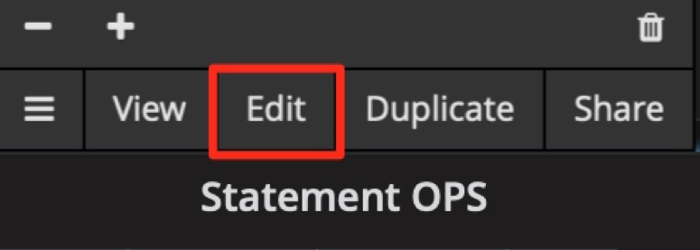

<div class="caption-center">图 2 metric 面板的编辑入口</div>

我们可以在 `Metric` 面板上，看到利用该 metric 的 query 表达式。

面板上一些细节的含义：

1. `rate[1m]`：表示 1 分钟的增长速率，只能用于 counter 类型的数据。

2. `sum`：表示 value 求和。

3. `by type`：表示将求和后的数据按 metric 的原始值中的 type 进行分组。

4. `Legend format`：表示指标名称的格式。

5. `Resolution`：默认打点步长是 15s，`Resolution` 表示是否分解。

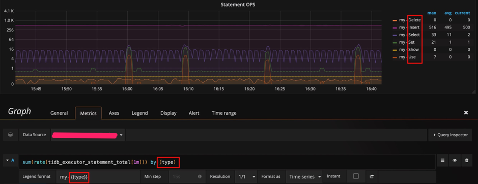

<div class="caption-center">图 3 metric 面板中的表达式</div>

Prometheus 支持很多表达式与函数，更多表达式请参考 [官网页面](https://prometheus.io/docs/prometheus/latest/querying)。

## 四、Grafana 使用技巧

### 技巧 1：查看所有维度并编辑表达式

如上一小节的例子，是按照 type 进行分组，是否还能用其他维度分组？如何能快速得知还有哪些维度呢？这里推荐的技巧是，在 query 的表达式上只用指标名称，不做任何计算，format 也留空，这样就能显示出原始的 metric 数据，比如下图能看到有 3 个维度（`instance`、`job`、`type`）。

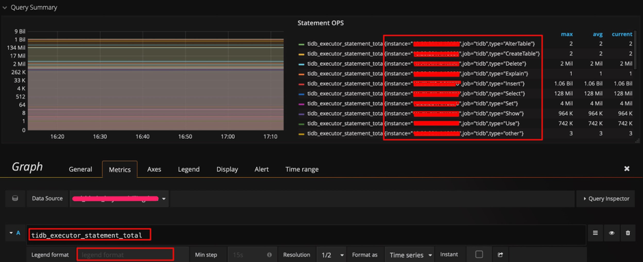

<div class="caption-center">图 4 编辑表达式并查看所有维度</div>

得到 `instance` 这个维度后，我们调整表达式，在原有的 type 后面加上 `instance` 这个维度，调整 `legend format` 格式增加 `{{instance}}`，就可以看到每个 tidb-server 上执行的不同类型 SQL 的 QPS 了。如下图：

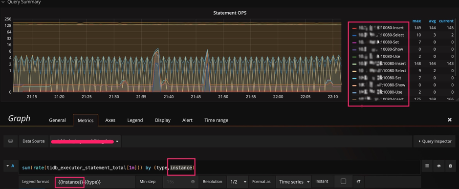

<div class="caption-center">图 5 给表达式增加一个 instance 维度</div>

### 技巧 2：调整 Y 轴标尺的计算方式

以 `query duration` 指标为例，默认的比例尺采用 2 的对数计算，显示上会将差距缩小。为了观察明显的变化，可以将比例尺改为线性，通过下面两张图，可以看到显示上的区别，明显的发现那个时刻有个 SQL 运行较慢。

当然也不是所有场景都适合用线性，比如观察 1 个月的性能趋势，用线性可能就会有很多噪点，不好观察。

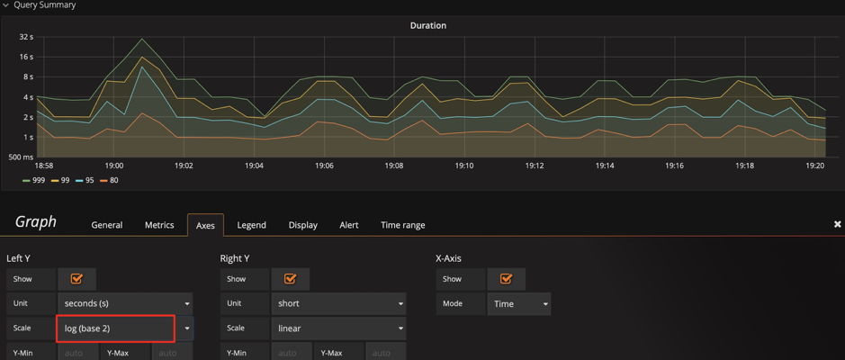

<div class="caption-center">图 6 标尺默认的比例尺为 2 的对数</div>

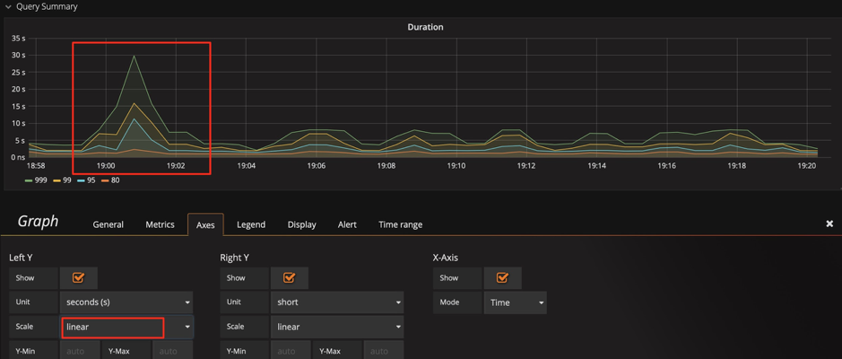

<div class="caption-center">图 7 调整标尺的比例尺为线性</div>

>提示：我们可以结合技巧 1，发现这里还有一个 `sql_type` 的维度，可以立刻分析出是 select 慢还是 update 慢，并且可以分析出是在哪个 instance 上慢。

### 技巧 3：调整 Y 轴基线，放大变化

有一种情况：已经用了线性显示，还是看不出变化趋势。比如下图中，我们在扩容后想观察 `Store size` 的实时变化效果，由于基数较大，微弱的变化观察不到。 这时我们可以将 Y 轴最小值从 `0` 改为 `auto`，将上部放大，观察下面两张图的区别，可以观察到数据已开始迁移了。

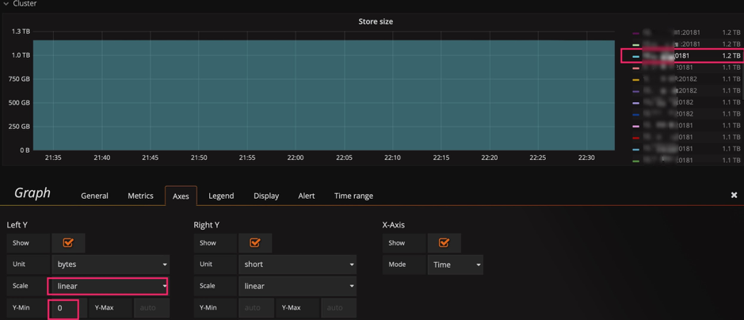

<div class="caption-center">图 8 基线默认为 0</div>

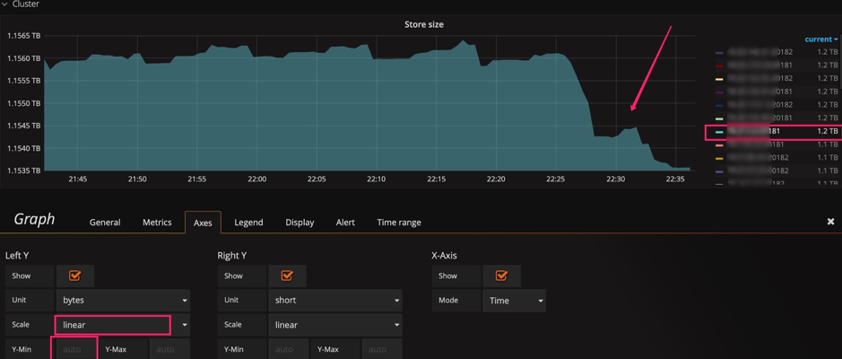

<div class="caption-center">图 9 调整基线为 auto</div>

### 技巧 4：标尺联动

在 Setting 面板中，有 `Graph Tooltip` 的设置，默认使用 `Default`。

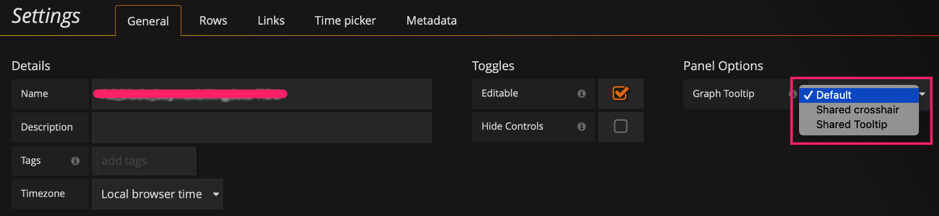

<div class="caption-center">图 10 图形展示工具</div>

我们调整为 `Shared crosshair` 和 `Shared Tooltip` 分别试一下效果： 可以看到标尺可以联动展示了，方便排查问题时，确认 2 个指标的关联性。

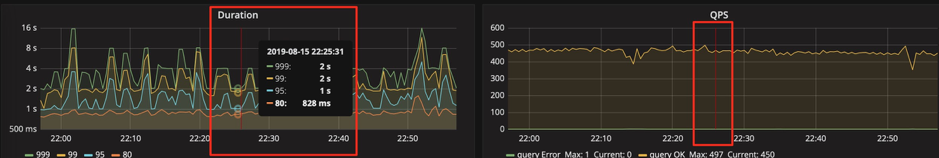

<div class="caption-center">图 11 调整图形展示工具为 Shared crosshair</div>

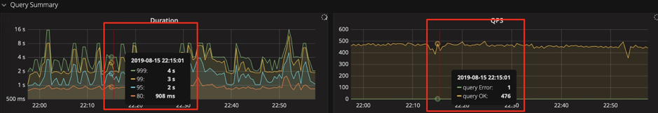

<div class="caption-center">图 12 调整图形展示工具为 Shared Tooltip</div>

### 技巧 5：调整过滤项

PD 的 Dashboard，只展示当前 leader 的 metric 信息，有时候会想看一下历史上 pd-leader 当时的状况，但是 instance 下拉列表中不存在这个成员了，我们也可以手动输入 `ip:2379` 来看到当时的数据。

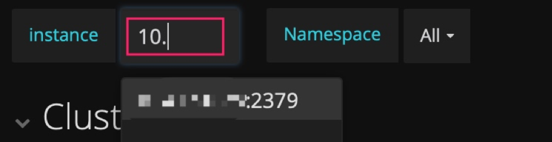

<div class="caption-center">图 13 手动输入并查看 metric</div>

### 技巧 6：巧用 `Avg` 函数

通常默认图例中只有 `Max` 和 `Current`，但有时指标波动较大时，我们可以增加 `Avg` 等其他汇总函数的图例，可以看一段时间的整体趋势。


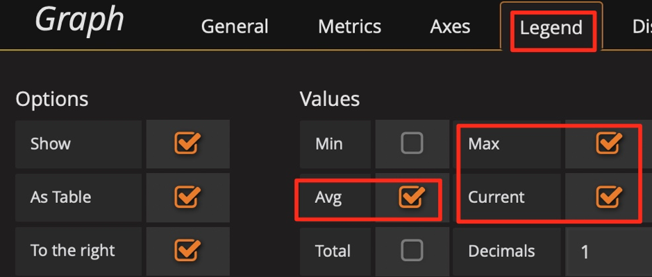

<div class="caption-center">图 14 增加 Avg 等汇总函数</div>

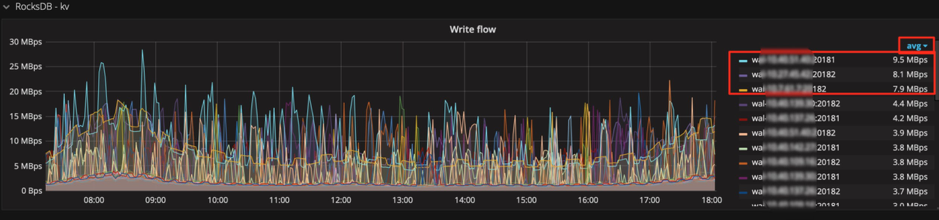

<div class="caption-center">图 15 增加 Avg 函数</div>


### 技巧 7：使用 Prometheus 的 API 接口获得表达式的结果

Grafana 通过 Prometheus 的接口获取数据，我们也可以用该接口获取数据，这个用法可以扩散出很多功能：

* 自动化平台获取集群规模、状态等信息。

* 对表达式稍加改动给报表提供数据，如统计每天的 QPS 总量、每天的 QPS 峰值、每天响应时间的汇总。

* 将重要的指标进行定期健康巡检。

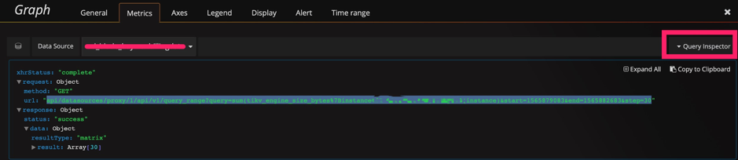

<div class="caption-center">图 16 Prometheus 的 API 接口</div>

```
curl -u user:pass 'http://__grafana_ip__:3000/api/datasources/proxy/1/api/v1/query_range?query=sum(tikv_engine_size_bytes%7Binstancexxxxxxxxx20181%22%7D)%20by%20(instance)&start=1565879269&end=1565882869&step=30' |python -m json.tool
{
    "data": {
        "result": [
            {
                "metric": {
                    "instance": "xxxxxxxxxx:20181"
                },
                "values": [
                    [
                        1565879269,
                        "1006046235280"
                    ],
                    [
                        1565879299,
                        "1006057877794"
                    ],
                    [
                        1565879329,
                        "1006021550039"
                    ],
                    [
                        1565879359,
                        "1006021550039"
                    ],
                    [
                        1565882869,
                        "1006132630123"
                    ]
                ]
            }
        ],
        "resultType": "matrix"
    },
    "status": "success"
}
```

## 五、总结

Grafana + Prometheus 是一套非常强大的组合，用好他们可以为我们的分析节省很多时间，提高效率，更重要的是能增加发现问题的可能性。在运维 TiDB 集群时，尤其数据量大的时候，这套工具能派上大用场。这里抛砖引玉，也希望大家也能提供一些技巧，一起共同学习。
