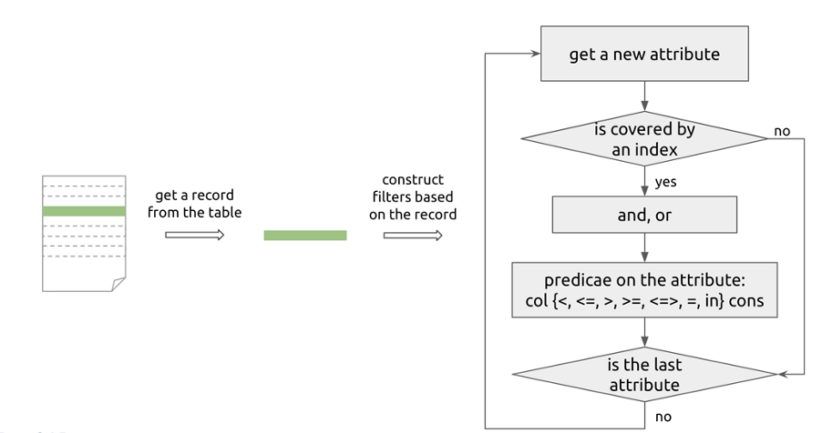
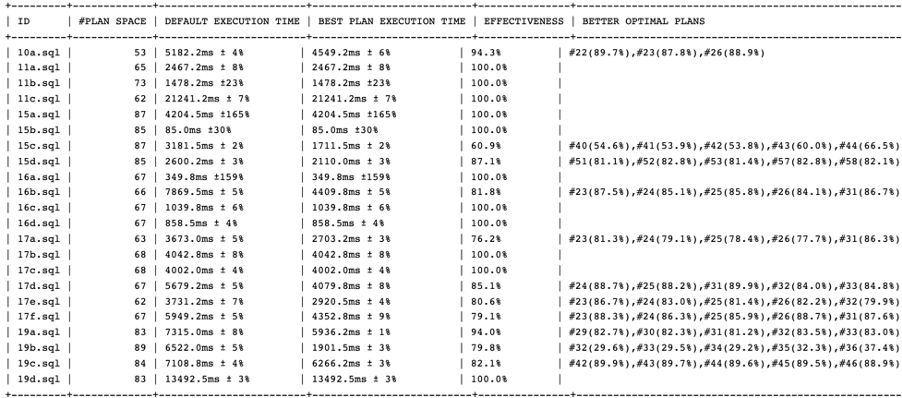
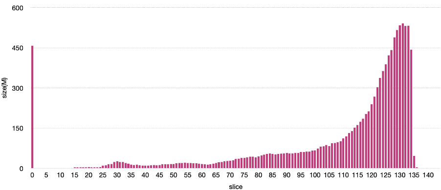
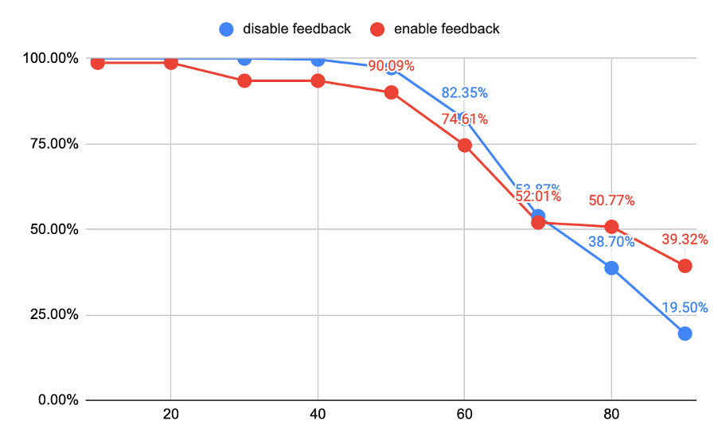
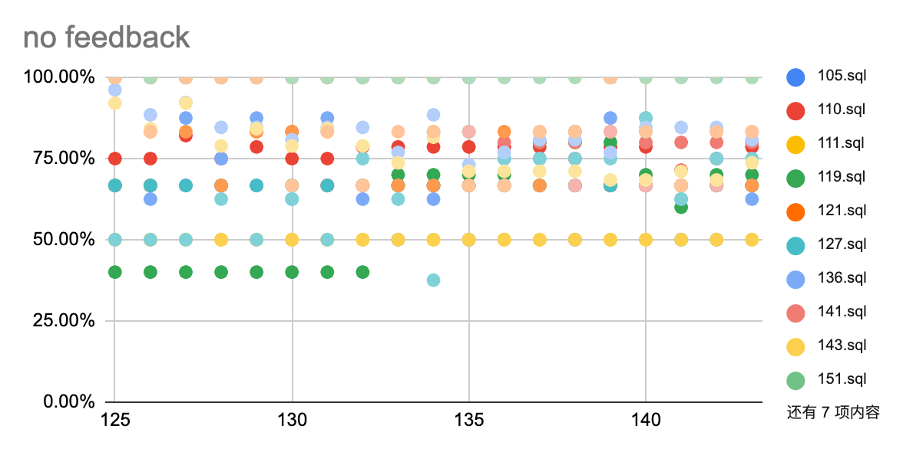
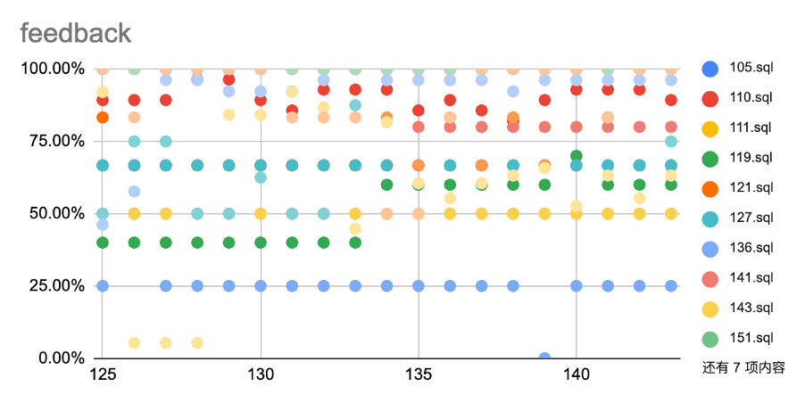

优化器在数据库中一直位于至关重要的位置，性能调优也常常需要围绕优化器来进行。作为数据库厂商，我们希望在各类复杂的业务场景中，TiDB 都能够给出比较理想的执行计划，因此在优化器和执行器上做了非常多的工作和努力，但是选错执行计划或者索引的情况仍然是日常中最为常见的一个问题。

优化器有关的问题可以简单归结为两种：

1. 统计信息准确的情况下给出了错误的执行计划。

2. 另一类则是在统计信息过期的情况下给错了执行计划。

选错索引是其中比较常见的一种情况，用户希望添加索引来加速查询速度，某些情况下，优化器可能会走到全表扫的物理执行计划或者选错索引使得实际执行效果退化成全表扫的情况。

针对上述情况，我们需要从更微观的层面来度量优化器的执行计划和索引选择的性能，评估在优化器上做的改进工作能否切实起到期望的效果。

## 为什么我们要开发 Horoscope?

为了测量优化器和执行器，从去年开始我们构建了daily benchmark 平台 perf.pingcap.com，覆盖常见的几种复杂查询的测试场景，包含 TPC-H、TPC-DS、Star Schema Benchmark 等，跟踪每天开发分支上这些查询的执行速度情况。

90天曲线图.png)

<div class="caption-center">图 1 TPC-H(SF=50) 90 天曲线图</div>

通过 daily benchmark，我们观测和定位到了若干次性能提升以及性能回退的情况。有些提升或者回退是优化器组件上的优化导致的，有些则是 TiDB 其他组件，或者存储层引发的。

虽然 daily benchmark 能够观测到性能改进或者回退，但是对于以下几个问题它却束手无策：

1. 当前选择的执行计划是否最优？选择率估计是否准确？

2. 是否选择到了正确的索引？

3. 现有的启发算法能否应对统计信息一定程度的过期？

因此，我们需要另外一种更系统的测试工具，用于优化器的测量。

## Horoscope 是如何做的?

要测量优化器，我们需要：

1. 定义优化器的性能指标

2. 遍历执行计划空间

3. 数据集以及查询生成

### 定义优化器的性能指标

这里我们参考“OptMark: A Toolkit for Benchmarking Query Optimizers”给出的方法来度量优化器有效性。简单地讲某个查询的有效性指标，是指在可遍历的执行计划空间中，优化器选出的默认执行计划的执行时间比其他的执行计划的执行时间更快的比例。

例如 100% 可以解释为默认执行计划的执行时间比其他执行计划的执行时间都更快，50% 解释为有一半的执行计划要比默认执行计划更快。

### 遍历执行计划空间

由于需要一种方式能够让 TiDB 按照我们所指定的物理执行计划来实际执行查询，为此我们在 TiDB 中添加了 `nth_plan(n)` 这个 SQL hint。

当查询语句提交到 TiDB 后，TiDB 会为搜索空间中的每个执行计划绑定一个固定的序号，通过这个序号我们就能指定优化器去选择哪一个执行计划。

nth_plan 的序号从 1 开始递增，当其超出优化器对该条查询的搜索空间时，查询返回会产生一个 warning 来提示当前已经完成了搜索空间上的遍历。

```
TiDB(root@127.0.0.1:test) > explain select /*+ nth_plan(1) */ * from t where a = 1 and b > 0 and b < 10;
+-------------------------+----------+-----------+---------------+----------------------------------------------------+
| id                      | estRows  | task      | access object | operator info                                      |
+-------------------------+----------+-----------+---------------+----------------------------------------------------+
| TableReader_7           | 0.25     | root      |               | data:Selection_6                                   |
| └─Selection_6           | 0.25     | cop[tikv] |               | eq(hehe.t.a, 1), gt(hehe.t.b, 0), lt(hehe.t.b, 10) |
|   └─TableFullScan_5     | 10000.00 | cop[tikv] | table:t       | keep order:false, stats:pseudo                     |
+-------------------------+----------+-----------+---------------+----------------------------------------------------+
3 rows in set (0.00 sec)

TiDB(root@127.0.0.1:test) > explain select /*+ nth_plan(2) */ * from t where a = 1 and b > 0 and b < 10;
+-------------------------------+---------+-----------+-------------------------+---------------------------------------------+
| id                            | estRows | task      | access object           | operator info                               |
+-------------------------------+---------+-----------+-------------------------+---------------------------------------------+
| IndexLookUp_11                | 0.25    | root      |                         |                                             |
| ├─IndexRangeScan_8(Build)     | 10.00   | cop[tikv] | table:t, index:idx_a(a) | range:[1,1], keep order:false, stats:pseudo |
| └─Selection_10(Probe)         | 0.25    | cop[tikv] |                         | gt(hehe.t.b, 0), lt(hehe.t.b, 10)           |
|   └─TableRowIDScan_9          | 10.00   | cop[tikv] | table:t                 | keep order:false, stats:pseudo              |
+-------------------------------+---------+-----------+-------------------------+---------------------------------------------+
4 rows in set (0.00 sec)
```

### 数据集以及查询生成

互联网上有很多开放的数据集，也有一些 benchmark 提供了 dbgen 工具用来随机构造数据集，我们比较倾向于选择真实数据集，因此我们选择了 IMDB 数据集来进行测试。

有了数据集，我们需要在其上构造一些查询。为了测试索引选择问题，参考 Manuel Rigger 的 “Testing Database Engines via Pivoted Query Synthesis” 论文中的思路，Horoscope 会在某些表中随机选择一行数据作为 pivot row 去构建查询，使得查询返回的结果会包含这些选择的行。通过这种方式，我们能保证生成的查询是更具意义。

例如针对索引选择问题，查询构造的流程如下所示，通过在有索引覆盖的列上构造条件来测试是否选对了索引。



<div class="caption-center">图 2 测试索引选择的查询生成流程</div>

例如会生成如下的查询：


<div class="caption-center">图 3 生成的查询示例</div>

## 开始测量

我们预先导入了一份 IMDB 数据集到 imdb 数据库中，可以通过如下命令使用 Join Order Benchmark 的查询度量有效性指标。

```
git clone https://github.com/chaos-mesh/horoscope.git 
cd horoscope && make 
./bin/horo --round 4 -d root:@tcp(localhost:4000)/imdb?charset=utf8 bench -p -w benchmark/job
```

经过漫长的等待，在测量结束时 Horoscope 会出入一份测试报告：



<div class="caption-center">图 4 Horoscope 的报告</div>

`ID` 列标识查询的名称，`#PLAN SPACE` 是这条查询当前 TiDB 的搜索空间，`DEFAULT EXECUTION TIME` 记录了默认执行计划的执行时间（通过中值以及上下界偏差比例给出），`BEST PLAN EXECUTION TIME` 给出最优的执行计划的执行时间，`EFFECTIVENESS` 算出该条查询优化器的有效性，`BETTER OPTIMAL PLANS` 给出更优的执行计划的 ID 以及对应执行时间和默认执行计划执行时间的占比。

我们使用 Horoscope 测量了不同数量级的 TPC-H，并且 IMDB 数据集上针对索引选择生成了一些查询来测试。我们也在 Github 上创建了一个项目来跟踪这些问题的进展：[https://github.com/orgs/pingcap/projects/29](https://github.com/orgs/pingcap/projects/29)

相比于 TPC-H，Horoscope 在 IMDB 的数据集和查询上发现了更多更优的执行计划，但因为 IMDB 数据是静态的，当想验证统计信息过期场景下优化器的情况时比较困难。

为此 Horoscope 提供了将数据按照某个字段进行切分然后导出的功能，通过分批次插入数据，提供了数据更新情况下的优化器测试场景。

### 数据切片和按切片更新数据

真实数据集上的数据分布往往具备倾斜的特征，而这种倾斜的性质对于优化器也更有挑战。

以 IMDB 为例，数据在 title.produciton_year 上发生了倾斜，越靠后的年份，所关联的数据行数越多。我们通过对数据集在 title.prodution_year 上将数据集切分成一块块不均等的切片，再进行分批导入，可以模拟数据修改所引发的统计信息过期对于优化器的影响。

切分的过程如下：

1. 将各个表之间的关系通过主外键进行关联，构造出一张无向图；

2. 选择某个表上的字段，查询出其上不同的值；

3. 以这个字段的值作为线索，构造查询语句，在无向图上串联不同表上能关联到的数据，导出到切片文件中；

4. 标记串联过的数据，后续切片忽略已标记过的数据。

在 IMDB 上，我们选择 title.produciton_year 进行数据切分，切分后每个切片文件的大小如下图所示。



<div class="caption-center">图 5 IMDB 数据集分批的大小分布</div>

约有一半的数据集中在最后 20 份切片中，越往后导入数据的修改行增速越快，统计信息的过期速度也愈快。

我们设计了 2 个对照试验，实验开始之前预先导入切片 0 到切片 124 的数据，并从切片 125 开始，每导入一个切片，测量一轮各查询的有效性指标。

在第一组试验中我们关闭了 auto analyze 和 feedback，第二组关闭了 auto analyze 但会打开 feedback。然后让 Horoscope 随机生成一批简单查询，在得到数据后我们分别绘制了有效性指标的比例曲线以及散点图。



<div class="caption-center">图 6 关闭和开启 feedback 情况下查询有效性的比例曲线</div>

曲线上的点表示有效性指标大于横坐标数值的查询的比例。从数据上看，当打开 feedback 时，有 50.77% 查询的有效性指标超过了 80%，即对于一半以上的查询优化器选择到了较优的执行计划。而当关闭 feedback 时，这个比例只有 38.70%。这和我们通常所认为的 feedback 能够一定程度抵抗统计信息过期相符。

另外从散点图上看会发现打开 feedback 也有可能会让优化器选择到更差的执行计划。例如下面的这条 SQL，feedback 机制反而使优化器选择到了更差的执行计划，这些可以作为 bad case 来具体分析。

```SQL
SELECT *
FROM title
WHERE (title.id IS NOT NULL
       AND title.title!="(#1.69)"
       AND title.imdb_index IS NULL
       AND title.kind_id<8
       AND title.production_year!=1974
       AND title.imdb_id IS NULL
       AND title.phonetic_code IS NULL
       AND title.episode_of_id>184590
       AND title.season_nr IS NULL
       AND title.episode_nr IS NULL
       AND title.series_years IS NULL
       AND title.md5sum<="7cf95ddbd379fdb3e530e0721ff61494")
LIMIT 100
```



<div class="caption-center">图 7 关闭 feedback 查询有效性的散点图</div>



<div class="caption-center">图 8 打开 feedback 查询有效性的散点图</div>

## 后记

Horoscope 还可以做更多的事情，例如当版本升级时，可以用 Horoscope 来测试执行计划会不会变化，如果变化了，是否发生了回退。

用户线上的数据通常十分敏感，我们内部积累了比较多的有统计信息和 schema 但无实际数据的用例集，通过 Horoscope 我们现在希望能够将这些用例集利用起来，扩充优化器测试用例，来帮助优化器的开发者们决策一些优化策略是否要合并到下一版本中。

此外，Horoscope 也提供了一种测试优化器正确性的途径。我们正在计划让 Horoscope 生成更复杂的查询，通过比对每个物理执行计划的结果来验证优化器实现的正确性。

优化器的工作是个长期且难度非常大的事情，优化器的测试也是如此，如果您有更多更好的关于优化器或者其他组件的优化以及测试的方法或者思路，欢迎在 TiDB 社区中和我们进行交流。
