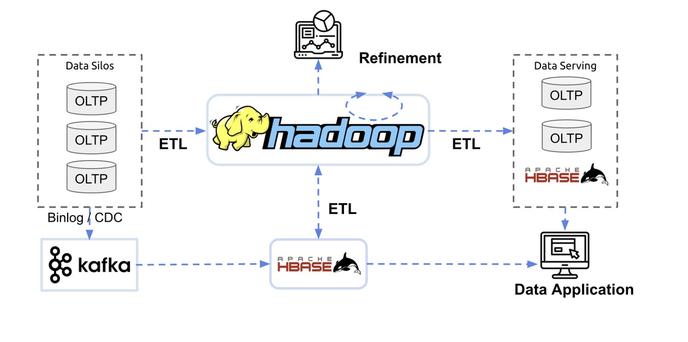
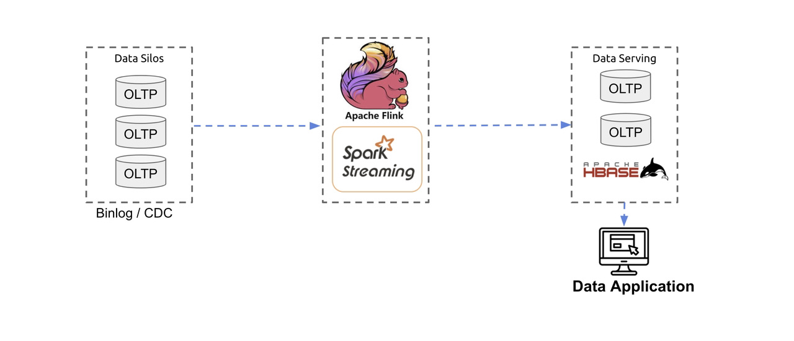
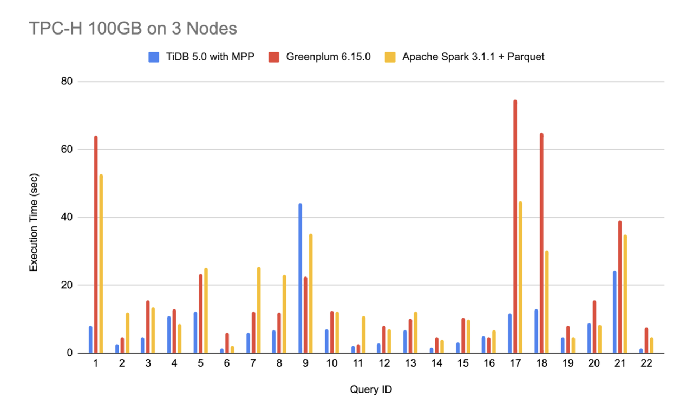
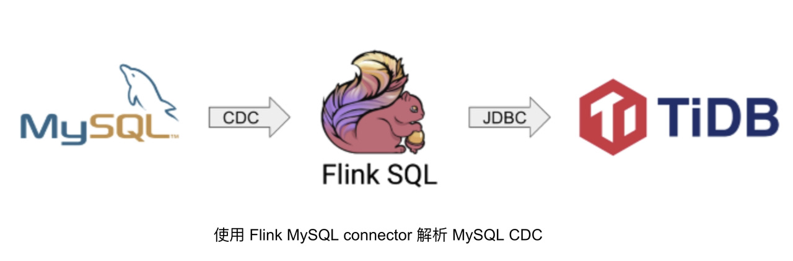
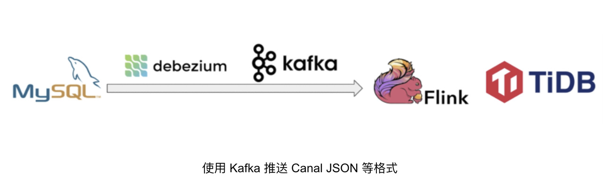
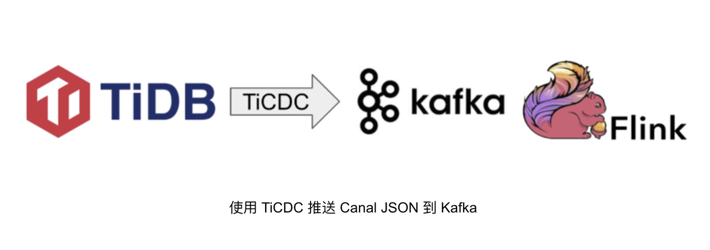
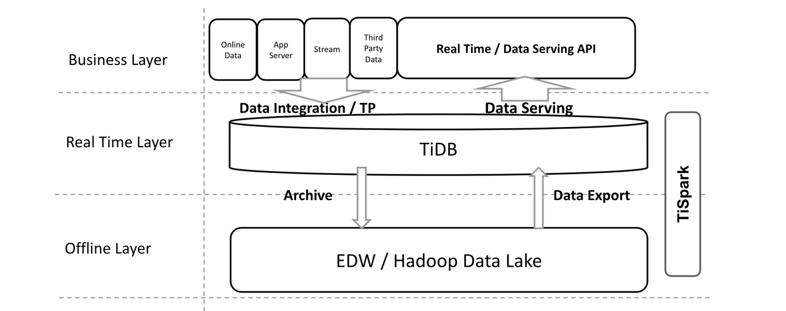
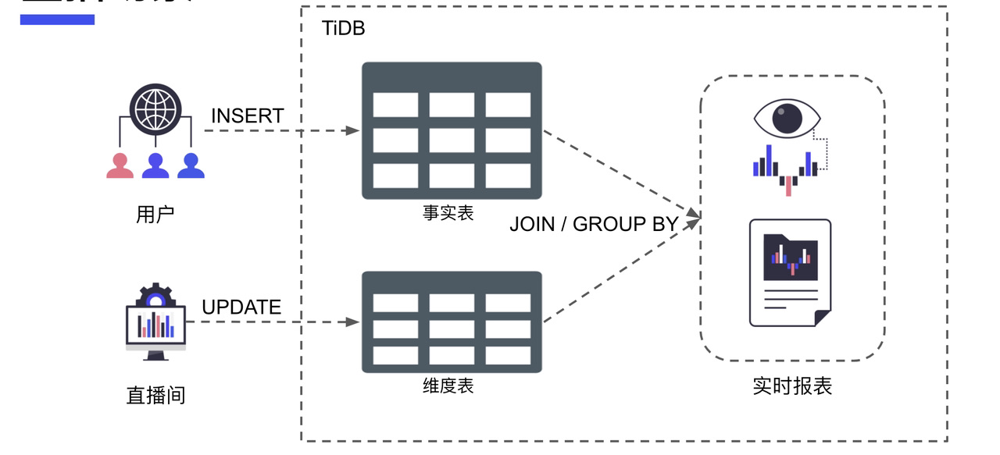

**本文由 PingCAP 研发工程师雷宇分享，主要从宏观角度分析 TiDB 究竟能做什么，创造什么样的价值，以及研发过程中的一些设计立足点。** 文章将从四个部分分享：

- 首先，数据管理技术的演进；
    
- 其次，TiDB 能做什么？
    
- 第三，大家是怎么用 TiDB 的？
    
- 第四，TiDB HTAP 的未来。
    
## 数据管理技术的演进

首先，简单的回顾一下数据管理技术的演进。

- 上个世纪 70 年代，IBM 研发了世界上第一个关系型数据库 System R，是第一个使用 SQL 作为查询语言的数据库，也为后来的关系型数据库的设计奠定了基础。
    
- 到了 80 和 90 年代，关系型数据库开始野蛮生长，涌现出一大批商业关系型数据库，比如当前知名的 Oracle、IBM 的 DB2、微软的 SQL Server，以及现在比较流行的开源关系型数据库 PostgreSQL、MySQL 等。这个时期，技术上的重点主要是数据库的功能完善，比如存储过程、触发器、各种各样的索引，以满足不同的业务需求。
    
- 2000 年代初期，全世界都进入了互联网时代，数据开始呈现指数型增长，传统的关系型数据库无法容纳如此庞大的数据。此时，一些互联网公司开始牵头，将内部处理海量数据的方案进行开源。2004 年左右，由谷歌牵头发表了三篇论文，分别是他们的**分布式文件系统 GFS、分布式计算系统 MapReduce、分布式存储系统 BigTable**。在这三篇论文的指导下，Hadoop 生态社区繁荣发展。同时，分布式 KV 数据库 Cassandra、MongoDB 等也在这个时期出现；传统的关系型数据库也在发展，出现了一些非常关键的技术，比如 MySQL 的 InnoDB 引擎、Oracle RAC 分析引擎。单一的数据库产品已无法满足用户的需求，整个数据处理领域的技术方向出现了严重的分化。OLTP 领域依然被传统关系型数据库占领，OLAP 领域则成为了后来的大数据技术主战场。
    
- Pre - 2010s，得益于硬件的发展，内存的容量和网络的带宽与延迟有了极大提升，数据库架构迎来变革。内存数据库和分布式数据库大规模投入生产。代表产品：Google Spanner、SAP HANA、SQL Server Hekaton、Amazon Aurora。这个时期 OLTP 的概念和 OLAP 的概念逐渐开始模糊，并有人提出了 HTAP，将 OLTP 和 OLAP 混合在一起，在同一个数据库上同时处理这两种负载，回到了数据库产品的初衷。
    
- Post - 2010s，延续了 2010 年代初期的辉煌，各种 NewSQL 数据库出现，可以承载更加复杂的负载。代表产品：CockroachDB、TiDB、VoltDB、Azure Cosmos DB，各种技术开始走向不同的方向。
    
整体来看，从 2000 年开始，大数据的技术就迈入了互联网生态，使用大数据技术来建立数据仓库已较为普遍。尽管数据仓库的理念在 90 年代就已经出现了，但各个数据仓库的产品都尚未开源，业界缺乏共识。而 Hadoop 开源之后，基于**Hadoop 的数仓架构逐渐成为主流**，也即传统的数仓架构。

### 传统数仓架构

如上图所示，左边是 OLTP 在线业务所使用的数据库，因为无法直接在上面进行分析，所以一般会通过 MySQL 的 Binlog CDC 或直接读写数据库 ETL 的方式，将数据变更或全量的数据导至 Hadoop 平台，然后在 Hadoop 中使用 Hive 等软件进行数据分析，并且生成报表，将结果写入到另一个 OLTP 的数据库中，也就是右边用来做离线分析的结果呈现的 Data Serving 层。最后再由 Data Serving 层将数据展现给应用。

由于这一整套链路非常长，还有 Hadoop 中各种各样实现的原因，所以这一架构在最开始只能做到 T+1 的程度，即当天的数据写入后第二天才能计算出来。

虽然解决了海量存储与计算的问题，但是失去了数据处理的实时性。近年来，随着实时性的需求越来越多，为了保证数据处理的实时性，出现了一种新的架构：**Lambda**架构。

### Lambda 实时数仓

Lambda 架构的特点在于为离线的 Hadoop 加了一个实时计算层，一般称之为 Speed Layer，早期主要使用 Spark Streaming 或 Storm 流式计算引擎来直接采集 OLTP 的数据，将其计算为实时的数据，然后和离线的 T+1 的数据混合在一起，提供给应用。如此，应用即可得到一个相对来说比较实时的数据。

传统数仓时代只能做到 T+1，有了 Lambda 的架构后，就可以实现 T 加零点几，昨天的数据和今天半天的数据合并在一起处理。不过，在此基础上能否实现更实时的数据分析？

### Kappa 实时数仓

Kappa 架构应运而生。之前 Lambda 架构的痛点在于需要做非常复杂的维护，因为同时要把数据写到 T+0，也要把数据写到实时的部分，然后再将两部分的结果整合起来。有了 Kappa 架构之后，只要通过实时的计算层，按需拉取 OLTP 业务的变更，然后将计算结果数据呈现出来即可。但是这一套体系因为性能方面的原因，暂时还没有得到特别广泛的应用。

可以看到，在数仓架构演讲的过程中，数据实时性已经变成了大家普遍的需求，同时海量的数据处理能力也必不可少。在这种情况下，我们来看看 TiDB 能做什么。

## TiDB 能做什么？

### TiDB 4.0 之前

TiDB 1.0 发布时，架构图如下，这也是很多人对 TiDB 的第一印象。

TiDB 的架构非常简单，首先是 Load Balancer，可以将用户的 SQL 请求打散，发送到 TiDB Server 中。TiDB Server 是一个无状态的计算层，可以随意扩展，实际的数据存储在分布式 KV 存储 TiKV 中。此外，还有一个 PD 组件来对这些数据进行调度以及规整。

这一套架构最突出的部分是扩容，以扩容作为第一要义。扩容体现在两个方面，一是存储扩容，传统的单机数据库无法承载的数据量，TiDB 可以将其存储到分布式存储中。二是计算上，传统数据库单机无法承受较高的 QPS， 通过这种扩容的方式，QPS 可以打散到不同的计算节点上。

在 TiDB 4.0 之前，我们一直延续这套架构。以下是 TiDB 4.0 之前我们能做到什么的总结：

- 兼容 MySQL 协议及特性的关系型数据库；
    
- 存储天生具备水平扩展能力，无需分库分表；
    
- 承载千万级 QPS 在线业务；
    
- 计算存储分离，可进行弹性的资源配置；
    
- 数仓 Serving 层的优质载体（数据中台）。
    
首先，TiDB 的立足点是一个**兼容 MySQL 协议以及 MySQL 特性的关系型数据库**，具备水平扩展能力，包括存储和计算都可以进行水平扩展，并且不需要分库分表。在此基础上，因为支持计算的水平扩展，所以能承载高 QPS 的在线业务，并且存储、计算分离，为弹性资源配置提供了基础。

但超乎我们想象的是，许多开源社区用户将 TiDB 作为数仓的优质载体。TiDB 可以接受海量数据的存储，同时也可以提供比较方便的访问接口，所以很多用户自然地将其作为数仓的中间层。

在 TiDB 4.0 之前，设计上完全没有考虑到这种用法，所以存在很多问题，比如计算是单节点，无法进行分布式扩容，一些比较重的计算任务也不支持。同时，TiDB 的存储引擎 TiKV 使用的是行存的存储格式，行存的优势在于 OLTP 场景下可以较好的处理并发事务，但是在 OLAP 场景下的性能不太理想。

因为收到了各种各样的用户需求，所以我们专门研发了 TiDB 的列存引擎 TiFlash，来承载 TiDB 的 OLAP 负载。在 TiDB 4.0 中，TiFlash 正式成为了 TiDB 家族的一名成员。

### TiDB 4.0 之后

在 4.0 之前，社区已经提供了一套 TiSpark。TiSpark 本质上是一个 Spark 插件，通过 TiSpark，我们可以在 Spark 中访问 TiDB 集群中的数据，并对其进行读写。但是使用 Spark 访问 TiDB 的数据会存在一定问题，因为它是一个高并发的扫表请求，会导致 TiKV 本身 OLTP 的负载受到影响。

在有了 TiFlash 之后，就可以完全隔离到 OLAP 和 OLTP 的负载，也能保证一致性。TiFlash 的一致性是通过 Raft 的同步协议来做的，熟悉 Raft 的同学应该知道，它是一个同步复制协议，所有的数据都是以 log 的形式来呈现。每一条 log 都有一个全局一致的 ID，也是其位置的 index。假如两条 log，一个是 4，一个是 5，那么 Raft 协议可以保证 5 一定是在 4 之后才会写入，当 5 进行写入时所有的 Client(TiDB) 均能读到 4，从而满足线性一致性。

一般来说，在 Raft 中只有 leader 可以进行读写操作，但如果对此进行优化，实现一个 learner 或者 follower 的状态即可满足读取 leader 上同样一个 index 的条件，就可以直接从 learner 上读取数据。TiFlash 就是利用这样一种机制从 TiKV 集群中同步数据，并且达到线性一致性的。这样做的优点在于：

首先，假设用 binlog 等方式来将数据同步到列式分析引擎中，中间会有额外的传输开销或者类似于中间件的处理开销。而直接通过 Raft 协议来进行写入，在一条数据写到 leader 时，会走 Raft 的 quorum 确认流程，此时数据已经被发送到 TiFlash 进行写入了。另外，虽然 TiFlash 的写入确认不需要同步，但是它的数据和 TiKV 内部的高可用优先级是一样的，这是达到一致性的关键。

总体而言，在有了 TiDB 4.0之后，**分析能力上了一个台阶**。此时，我们可以自豪说 TiDB 是一个真正意义上的 HTAP 数据库了。**TiDB 的特点**如下：

- 真正意义上的 HTAP 数据库；
    
- 互相隔离的 OLAP 和 OLTP 负载；
    
- 分析友好，强实时性、强一致性的列存；
    
- 一体化部署运维体系，优化器智能选择存储引擎；
    
- ALTER TABLE \`db\`.\`table\` SET TIFLASH REPLICA 1，一句简单的 SQL 即可体验 TiFlash 带来的增强。
    
### TiDB 5.0 HTAP

在 5.0 的时候，为了解决上述痛点，我们研发了 TiDB 的 MPP。先了解一下 MPP 究竟是什么。

在执行 SQL 时，使用的是一套  Volcano 的模型，其优势在于算子之间是可以解耦的，缺点在于上下游之间的调用有耦合，即必须是上游找下游要数据，然后下游才会将数据算出来提供给上游。每一个算子之间的消费能力和生产能力非常不匹配。尽管 TiDB 本身也做了非常多的优化，在算子内部通过并行计算来加快其计算速度。但归根结底它也只是一个单机的计算引擎，上限非常低。为了解决这个问题，我们充分利用了 TiFlash 节点。

首先，看看如何实现。

一条 SQL 从 TiDB 进来，经过 Parser 和 Planner 生成一个 TiDB Logical Plan，然后 Logical Plan 经过 TiDB 的优化器之后，会判断是否是 OLAP 请求。

如果是 OLAP 的请求，需要根据代价估算来选择从 TiKV 进行读写，还是 TiFlash 进行读写。在此过程中，我们还会为这些 join 的算子加上 exchange，也就是  **Volcano 论文**中提到的并行化的方式，生成一个并行的执行计划，再将这些执行计划的片段给推送到对应的 TiFlash 节点执行。

来看一个实际的例子。

上述是来自于 TPCH 数据集的数据。TPCH 数据集中有一个叫做 lineitem 的表，lineitem 的表中存取的是所有的商品的信息，一般来说是6亿行左右。此外，还有 orders 表，orders 表是商品订单的事实表，我们在做简单的 Join 之后，加上一个 Count Star 的聚合。此时的 Plan 在 MPP 架构下则有所不同。以前，通常情况下 Join 下面是两个 Table Scan，如果是在 TiDB 中进行计算，两个 Table Scan 之后可以直接放到 Join 的算子中。但在 MPP 之后，我们会先对 Scan 出来的 Table 进行一个根据 Join Key 的 Shuffle，然后将数据推送到对应的计算节点，整体计算完成之后，再推到 TiDB 中返回给用户。

这样的**好处有两点**，一方面如果使用单个 TiDB 节点来进行计算，当数据量超过 TiDB 节点的内存容量时，就必须将其落到磁盘上，计算效率非常低。但是通过 shuffle 分区之后，每个计算节点上需要计算的数据量变小，可以全部容纳在内存中，实现加速的效果。另外，MPP 可以同时利用多台机器的 CPU，理论上可以实现非常强的扩展性。

为了验证 TiDB MPP 的性能，我们对比了其他产品，集群是三个节点的集群，每个节点上面使用的都是 NVMe 的 SSD，尽可能地排除存储上读取对于整个计算速度的影响。

如上图，可以看到蓝色的是 TiFlash MPP 的执行时间，这项指标越短越好。图中可以看出，对比 Greenplum 和 Apache Spark，TiFlash MPP 在绝大多数的查询下都处于优势地位。原因在于：一，TiDB 5.0 的列式存储引擎读取性能非常好；二，TiDB 5.0 集成了一套向量化列式计算引擎，性能非常强大；三，MPP 架构下所有计算（包括任务间的 shuffle）都是完全不落盘的，计算效率更高。这套 MPP 架构的缺点在于无法支持过于庞大的数据量（PB 级别），不过在绝大多数的场景下已经非常够用了。

总结一下**TiDB 的 MPP**。

- 支持多种并行执行算法：
    
    - Broadcast Join。
        
    - Repartition(Shuffle) Join；
        
    - Two Phase Aggregation；
        
    - One Phase Aggregation；
        
- 可扩展复杂的查询处理能力；
    
- TiDB 高度集成，优化器自动选择；
    
- 升级到 TiDB 5.0 后，仅需开启开关 SET tidb\_allow\_mpp=ON 即可使用。
    
TiDB 5.0 新引入的几个 Feature，使 TiDB 的 HTAP 能力得到了极大的提升：

- **OLTP**:
    
    - Async Commit，1PC 提供更低的事务延迟。
        
    - Clustered Index 强化特定负载下的延迟和吞吐量。
        
- **OLAP**:
    
    - MPP 大幅提升 TiDB 处理复杂查询的能力。
        
以上分享了 TiDB 不同阶段的功能特性和产品能力，下面将具体说明大家是怎么用 TiDB 的。

## 大家是怎么用 TiDB 的

根据用户反馈以及我们自己的整理，发现了当前 TiDB 最常用的几个场景。

### 交易/分析一体化

首先，交易分析的一体化，这种场景下数据量级一般处于中等程度，即 TB 级别。

如果单纯使用 MySQL，无法比较好地进行数据计算，所以一般需要将这些数据导入到分析型数据库中进行计算，比如 ClickHouse、GreenPlum 等，再将计算出来的报表呈现出来。有了 TiDB 之后，可以将这两部分相结合，**TP 直接写 TiDB，AP 也直接在 TiDB 上进行计算**，然后呈现结果，这样可以**极大节省了运维成本，并且可能实现性能上的提升**。

交易分析一体化的场景比较常见的，如：CRM 系统、ERP 系统等，也是我们非常推崇的最完整的 HTAP 的场景。但是互联网公司一般无法使用，必须也有离线的部分来处理海量的数据。

因此，在这套体系中，TiDB 主要被用于实时分析。

### 实时分析

业务数据通过 Kafka + Flink 的方式，在 Flink 中做预聚合或拼宽表，然后再将这个结果写入到 TiDB 中，供应用查询。这是常见的实时分析架构。而如果应用的线上业务已经用了 TiDB，整套架构就更自然了，可以直接使用 TiDB 的 CDC 功能，将数据导入到 Flink 中进行处理。

由于整套架构非常实用，目前已广泛应用于多个业务场景，后面将举例说明。

### 实时分析：Flink 架构

实时分析中使用 Flink 也有几种常见的架构。

- **使用 Flink MySQL connector 解析 MySQL CDC**
    

第一种架构，前端业务使用的是 MySQL，比如分库分表方案，通过 Flink MySQL Connector 获取MySQL 的数据变更，然后再将数据写入 TiDB。

- **使用 Kafka 推送 Canal JSON 等格式**
    

第二种架构，通过 MySQL binlog 处理的中间件，比如 Canal 等处理数据，然后写入到 Kafka 供 Flink 消费，最后再写进 TiDB，这种方式比较常见。

- **使用 TiCDC 推送 Canal JSON 到 Kafka**
    

第三种架构，用户前端已经使用了 TiDB，通过 TiDB 的 CDC 功能，输出 Canal JSON 格式到 Kafka 中供消费，Flink 再将数据写入到 TiDB 类似的数据库或者其他 sink 中。

- **数仓加速层 / ODS 层**
    

还有一种常见的方案，数据仓库的加速层或者说 ODS 层。

最常见的用法一般数据仓库会将加速层分开，有了 TiDB 之后，两部分是可以合起来的，用户的数据可以通过各种各样的方式写进 TiDB，在 TiDB 里面在进行一些 ETL 之类的操作然后写入到离线计算中，最后再将结果反馈到 TiDB。TiDB 可以直接对外提供实时数据分析的服务，这也是非常流行的架构之一。

### 应用案例

接下来，将分享一些现实中公司的案例。

#### 中通快递物流

首先是大家都比较熟悉的中通快递，中通快递是全球业务规模最大的快递企业之一。近几年，他们开始尝试使用 TiDB 来支持包裹追踪管理的业务。在早期的架构中，他们会定期使用 Spark 进行批处理，将来自在线业务的数据拼成宽表写入到 TiDB 中以提供数据分析服务。这套架构可以满足当时他们的业务需求，但是无法实现强实时的数据分析。

- **中通快递**
    
    - 全球业务规模最大快递企业。
        
- **物流全链路生命周期管理**
    
    - 同一套 TiDB 平台服务包裹追踪管理与实时报表。
        
    - QPS 峰值 12万+。
        
    - 实时统计分析。
        
    - 通过 TiSpark 衔接离线平台。
        

中通快递的架构如上。首先，包裹追踪是线上业务，通过 Spark Streaming 训练方式写入到 TiDB 中，同时进行实时分析，然后 TiDB 的归档数据将发送到中通的大数据平台进行计算，最后大数据平台的计算的结果再写回到 TiDB。在这个结构中，TiDB 是整个实时计算的整合层。

#### 小红书

小红书是一个内容同时做垂直电商相关的平台，目前用户量和访问量都也非常大。

小红书的早期架构是业务使用 MySQL 分库分表的方案，业务数据通过 ETL 写入到离线产品，进行 T+1 的计算后，再写回到另一个 MySQL 的分库分表集群中，对外提供数据服务。同时，也会利用离线数仓来做风控相关的业务。

上述架构的痛点在于 T+1，业务和运维都非常难受。在尝试 TiDB 之后，将架构进行了升级。

目前业务在线层仍然使用分库分表，但业务数据会直接通过一些简单的方式写到 TiDB 中，同时 TiDB 将数据反馈给离线层，做完离线数据的处理再写回到 TiDB。

上述结构直接使用 TiDB 进行数据分析或风控服务，整体架构从 T+1 变成了 T+0，并且据小红书工程师反馈，用了 TiDB 之后，**节省了很多 MySQL 分库分表的运维精力**，这也是 TiDB 的优点之一。

#### 智慧芽

智慧芽是提供 SaaS 服务的厂商，为全球 50 多个国家超 10000 家科技公司、高校、科研与金融机构提供大数据情报服务。

- **智慧芽**
    
    - 高速发展的科技创新 SaaS 服务商，为全球 50 多个国家超 10000 家科技公司、高校、科研与金融机构提供大数据情报服务。
        
- **实时数仓**
    
    - 部署于 AWS 云环境。
        
- **通过 AWS Kinesis / AWS EMR Flink 进行数仓建模**。
    

智慧芽的所有业务都部署在 AWS 之上。早期，智慧芽通过 AWS 的 Redshift 来进行数据分析，但是 Redshift 本身的速度并不特别理想，因此为了获得更好的实时性，智慧芽开始尝试使用 TiDB 构建实时数仓。在数仓架构上跟其他公司非常相似，也是使用 Flink 进行实时数据处理，然后将各种各样的数据写入到 TiDB，最后直接呈现给数据应用。

以上几个案例是非常典型的使用 TiDB 来做实时数据分析的场景，其中也有相对偏向于 HTAP 的业务如小红书的架构，其线上业务数据会直接写到 TiDB 中，可以充分利用 TiDB 的 OLTP 能力。

看了这么多案例之后，我们也可以想象一下 TiDB HTAP 的未来。

## TiDB HTAP 的未来

首先，最重要的一点，5.0之后，TiDB 已经**可以用来做复杂计算了，同时我们可以提供更加实时的场景来验证**。

### SQL MPP 意味着什么？

有了 MPP 之后，TiDB 拥有了更快的计算速度和更大的计算容量，因此可以承载更复杂的计算任务；再加上强实时性的数据，以及强一致性保证，让人不禁想象：使用 TiDB 5.0，我们可以做到什么？

### 直播场景

在直播场景中，当某个大主播开播时，用户会直接就涌进来，此时用户的信息会插入到访问的事实表中，主播的直播间也会对其维度表进行更新。这一套架构如果按照传统的方式来，可能会使用 Flink 对数据进行处理，但同时也存在一个问题，操作的并发度将会非常高，并且需要在短时间内完成。因此，如果要 Flink 进行处理，需要维护一些比较复杂的 Watermark 等，并且在进行预处理后，可能也会带来一些延迟。

如果直接使用 TiDB 来承载这些负载，当数据写进来时可以马上对它进行分析，生成分析报表，及时反馈到平台或主播，以便及时进行业务上的调整。当然，直播场景的应用目前还是假设，我们期待着 TiDB 在直播场景的落地。

### 实时风控场景

另外一个场景，以实时风控为例。部分在线平台经常会产生交易和转账类业务，但新闻中经常报道的诈骗事件也与此相关。事实上，金融或其他交易平台一般存在风控业务来检测和规避类似事件的发生。

之前的风控可能存在的问题之一是作案过程非常迅速，以至于风控规则还未触发但诈骗的流程已经结束了。不仅造成用户的经济损失，也影响警察办案效率。

如果将 TiDB 应用于风控业务中，在违规交易发生的瞬间，可以直接进行分析，触发风控策略。整个链路延迟将极大降低，也有助于相关部门能更快破案。

其他更多 TiDB HTAP 的应用场景也欢迎大家来帮助我们想象，共同畅想 TiDB 的未来。
