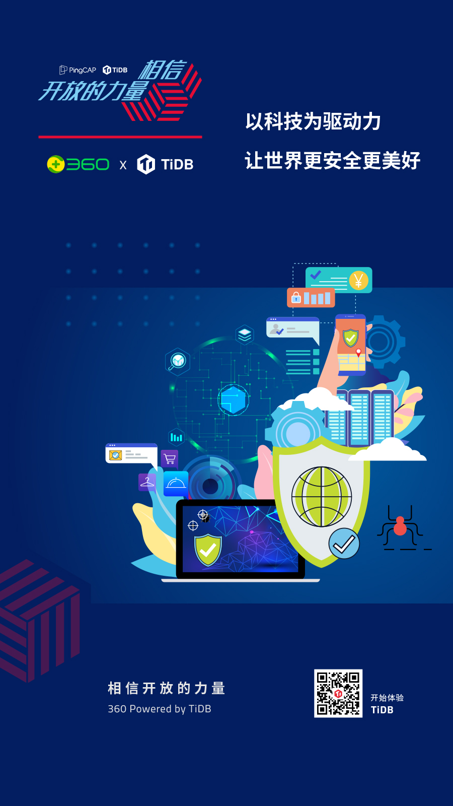
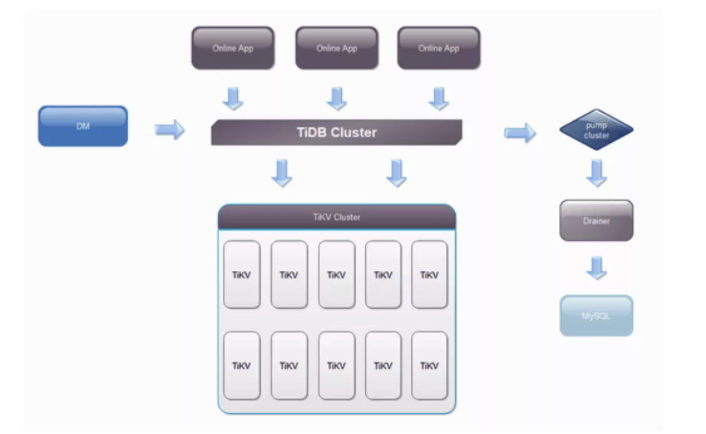
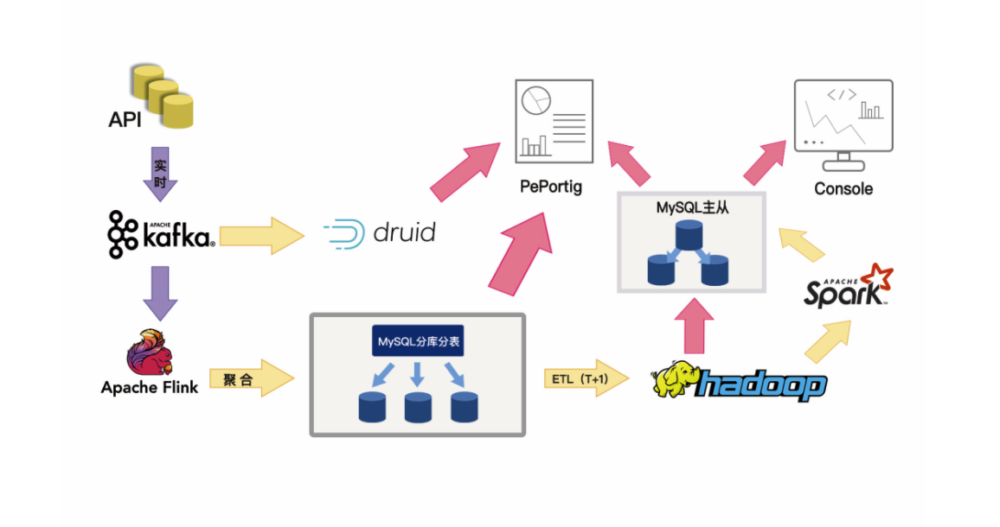
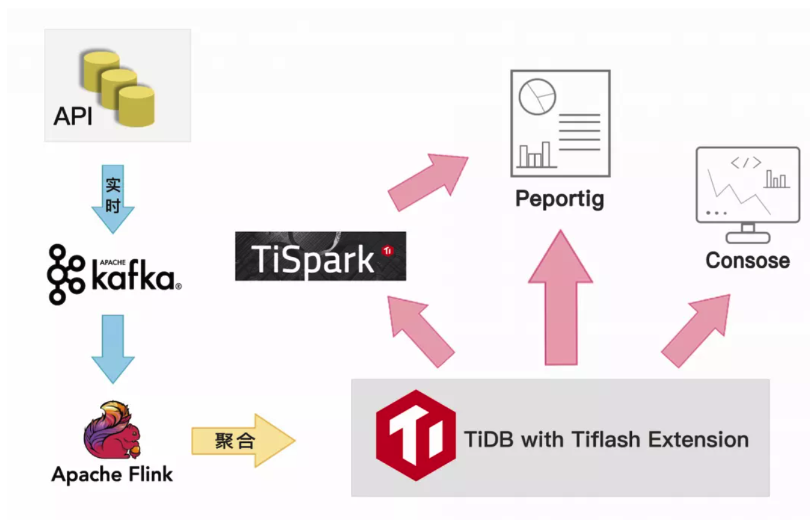

**「我们已经用起来了」**，是我们最喜欢听到的话，简简单单几个字的背后代表着沉甸甸的信任和托付。从今天开始，我们将通过 **「相信开放的力量」** 系列深度案例分享，从业务的角度，看看一个数据库为各行业用户带来的业务价值。 **本篇文章将介绍 TiDB 在 360 网盾业务、智慧商业业务、广告物料数据业务等核心场景的应用与实践。**

>以科技为驱动力
>
>让世界更安全更美好

360 公司创立于 2005 年，是中国领先的互联网和安全服务提供商，先后推出 360 安全卫士、360 手机卫士、360 安全浏览器等安全产品。

随着全社会、全行业数字化程度的深化，“大安全”时代加速到来，360 以“让世界更安全更美好”为使命，致力于实现“不断创造黑科技，做全方位守护者”的愿景，随之而来的业务发展也更加全面，包括：政企服务、金融科技、直播、个人服务、智能穿戴等多方面业务。

## 业务挑战

### 网盾业务

360 网盾是一款免费的上网保护软件，可以拦截木马、欺诈网站等等保护消费者不受到病毒及虚假网站的欺诈。它的运行机制是会针对每一条 URL 进行分析，经过网址检测系统判别后，能够精准识别出该 URL 属于哪个类别。对有问题的 URL 发布到云，其他安全服务商就可以通过订阅云服务，来检测相关的 URL 是否安全，以向自己用户提供更加安全的网页内容服务。

目前整个网盾业务核心场景可以分为以下四个部分：

- 网址威胁监测：每天入库 1 亿条数据，8 亿多资源链接数据；

- 关联分析场景：进行大规模恶意网址、黄赌毒等网站的关联分析；

- 高速返回：897 亿条数据表，每个场景 100+ 条数的查询需要在 5 秒内返回；

- 人工运营分析：每天每个人不断反复查询统计、分析。

针对业务爆发式增长的数据量，读写上 MySQL 已经出现瓶颈。例如磁盘空间，虽然可以通过分库分表的方式，拆分出来，但这对业务和 DBA 来说都是不小的工作量；最痛苦的无异于这些大表的改表，对一张大表执行 DDL 的代价是非常大的。总的来说，MySQL 已经无法满足网盾业务需求，这对负责底层数据平台支撑的 360 云平台技术团队提出了新的选型需求。

360 云平台负责对 360 集团各大业务线提供服务支持，涉及的数据库支持方案有：MySQL、Redis、MongoDB、ElasticSearch、Greenplum、PiKA。在经过充分的市场调研后，360 云平台团队决定引入 TiDB 来满足业务这一需求。

360 云平台 TiDB 整体架构

整体架构如上，使用 TiDB 的业务主要有两种：

- **原有 MySQL 业务迁移**。因单机磁盘受限，导致单实例磁盘无法支撑爆炸式增长的数据量，数据比较重要，需要备份和支持 7*24 小时的恢复。这类业务通过 DM 套件来实现无障碍迁移，1TB 的导入时间在 16 小时，如果是比较大的数据源，且 TiDB 是全新集群，可以使用 TiDB Lightning 进行数据导入，速度可以达到 100G/小时。

- **全新的业务**。全新的业务目前全部都会放到 TiDB 中，这种业务数据量一般都会比较大，目前网盾业务有多张表都过 10 亿级别，其中有张表到达了 100亿+。

### 智慧商业业务

360 智慧商业依托覆盖用户全场景的互联网产品，为企业提供全生命周期服务。通过智能营销、企业服务、创新平台等多元业务布局，满足多维增长需求，全面连接用户与企业，打造共生共长的智慧商业生态，其中互联网广告是流量商业变现的重要途径之一，也是 360 集团重要的营收来源，其中涉及企业服务平台、广告主投放、算法策略、数据工程等多个方向。广告投放过程中实时/离线报表业务以及广告物料投放对广告主来说是最重要、最核心的业务。

#### 广告主实时 & 离线报表业务

广告主的实时报表业务流程：业务数据入 Kafka，一条处理链路是通过 Druid 获取 Kafka 的数据提供实时分析，另一条链路通过 Flink 进行聚合后写入 MySQL 分库分表数据库，然后通过广告主维度提供实时查询需求。

广告主的离线报表业务流程：每天凌晨，数仓从 MySQL 分库分表中抽取前一天的所有数据入 Hive，通过 Spark 或者业务程序统计聚合后将结果数据写入 MySQL 结果表，提供给离线报表平台或者 Console 平台查询。

报表作为广告平台的核心业务，面临的问题如下：

- 数据量大：总数据千亿级别，单表数据量 1.2~1.5 亿。

- 响应延时低：需要对用户的任意周期及关键词的查询进行实时反馈。

- 查询复杂：时间维度、地域、行业、关键词等等，同时满足多样化的展示。

- 架构复杂：基于 MySQL 的分库分表无法进行全局统计，只能基于广告主 UID 来出明细报表，全局的统计需要引入 Druid 来辅助处理；离线报表需要 Hive 数仓抽取全量数据来实现。

#### 数据库选型：MySQL or TiDB?

MySQL 分库分表架构图

在部署 TiDB 之前，360 曾经尝试过单实例 MySQL 去应对业务需求，测试完后发现单实例 MySQL 压力较大，为了分散写压力，又必须走 MySQL 分库、分表这条老路，而且大数据量下的分库分表，经常需要变动拆分规则，每次规则变动都可能涉及到数据的重新搬迁，并且业务端还需要投入大量的人力去维护路由规则，并且要满足广告主的报表需求需要引入其他的数据库，离线 ETL 每天凌晨对 MySQL 的抽取造成网卡满载，也会影响了凌晨的其他业务操作。

TiDB HTAP 架构图

部署 TiDB 后，TiDB 良好的扩展性完全解决了分库分表的问题，同时经过性能压测，2 小时 1.5 亿的数据存储(TPS：2W/s)，整个系统负载完全满足业务需求，通过搭配 TiFlash （TiDB 的实时分析引擎插件），我们可以对合并后的单表进行各种维度的全局以及明细的实时分析，并且实现了离线报表的在线统计，免去了离线数仓这种 T+1 的时效和同步流程，同时还提供金融级别的强一致性保证。

### 广告物料数据业务

对于广告主而言，在搜索推广中，基于安全、精准、可信赖的新一代搜索引擎360搜索，通过关键词技术匹配，定位目标网民，精准展现企业推广信息，物料创意的作用则是帮助广告主吸引潜客，进而产生转化行为，比如注册、在线提交订单、电话咨询、上门访问等等。

目前 360 广告的物料平台会承载客户制作图片、文字、视频等的信息，支持对推广账户、推广计划、推广组、关键词、推广创意、高级样式各个层级的物料进行上传、下载、导入、导 出、添加、编辑、删除等操作。

在使用 TiDB 之前，点睛物料数据底层使用了 16 套分库 * 4 的 MySQL 架构，每套分库 MySQL 单表已经到达 10 亿，单表数据规模在 370G，对于单库 QPS 过万的 SQL 请求，MySQL 表已经到达性能瓶颈，高峰期频繁抖动，并且新业务想对大表新增字段，由于硬盘空间不足，也不能支持新业务上线。如果继续使用 MySQL ，则需要将目前的 16 套分库拆分成 64 套分库(需要新增约上百服务器)，除了新增服务器，迁移和运维成本也非常高。

360 商业化业务线技术团队通过技术选型调研，最终确定了以 TiDB 作为物料平台底层的数据库。**目前支撑物料平台的 TiDB 集群规模为 63 个节点，日 SQL请求在 70 亿次以上，在刚刚过去的双十一 QPS 最高达 25 W/s，工作日 99% 的 SQL 请求都在 15ms 以内，响应快、稳定性、扩展性都达到预期。**

通过部署 TiDB 收益如下：

- 成本节约

  - 相较之前 MySQL 部署模式，节约了 40% 的服务器成本。

  - 之前是业务维护的分库分表路由规则，现在对于业务来说都是一张表，提升了业务的开发效率，让研发更多的关注在业务上。

  - 运维成本降低，TiDB 提供丰富的工具链生态，覆盖数据迁移、同步、备份等多种场景，提升了运维效率。

- 性能提升

  - 618、双十一 QPS 最高能到 25 W/s，工作日 99% 的 SQL 请求都在 15 ms。

  - 相对于基于 VIP 切换的 MySQL 主从架构，TiDB 的可用性超过 99.95%。

  - 纯分布式架构，拥有良好的扩展性，支持弹性的扩缩容，吞吐跟存储都可以在线平滑扩容，数据库扩展能力提升了 1~2 个数据量级。

未来，360 技术团队也计划将 TiDB 推上 360 HULK 云平台，为 360 集团安全大脑、360 游戏、核心安全服务平台等更多业务线提供稳定可靠的数据库服务。

## 与客户同行，相信开放的力量

每次数据库架构改善与落地，无论是 TB 级还是 PB 级，都需要付出努力，但这也值得每一个企业去实践。在当下这个时代，不管企业的规模如何，都要学会借助开源的力量，避免去重复的造轮子。

每一个看似轻松的背后都有不为人知的努力，每一个看似光鲜亮丽的背后，都有不为人知的付出。分布式数据库建设之路道阻且长，TiDB 愿与 360 及每个客户一起，携手并肩把事情做好。
