>**作者介绍**：代晓磊，现 360 商业化数据库运维专家，TiDB User Group Ambassador，负责整个智能商业业务线数据库运维，解决各种数据库疑难问题，推广 TiDB 等新开源数据库应用。

360 智能商业业务线从 2019 年 3 月份开始使用 TiDB，目前线上有 5 套 TiDB 集群，数据总容量 20T，主要应用在数据分析平台、广告主实时报表、物料库、实时监控平台等核心业务中。

在使用 TiDB 的过程中，我们也遇到过一些问题，积攒了一些经验。由于篇幅有限，下面主要分享写热点问题现象和对应的解决方案，希望能够能对其他 TiDB 用户有所帮助。

## 业务简介以及数据库选型

### 360 智能商业业务线广告主实时报表业务简介

广告主关键词实时统计报表业务的流程是：业务数据首先进入 Kafka，每 30 秒会有程序读 Kafka 数据，并进行聚合，然后存储到 TiDB 中，存储到 TiDB 的过程每批次会有几十万的写入，单表数据量1.2~1.5 亿。

业务写入 SQL 主要是：insert on duplicate key update，Batch 为 100，并发为 300，并且每天创建一张新表进行写入。写入初期由于没有重复的 `uniq_key`，所以主要是 insert 。随着数据量到达 2000 多万，update 的操作也越来越多。

表结构如下：

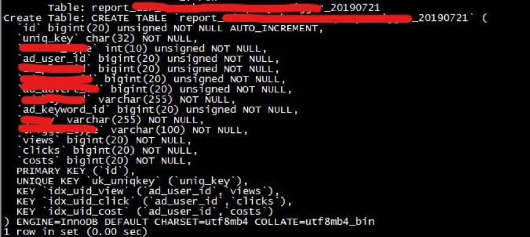

### 数据库选型：MySQL or TiDB?

说到 TiDB 不得不提其架构。下面结合架构图简单介绍一下 TiDB 对于我们来说最有吸引力的特性。

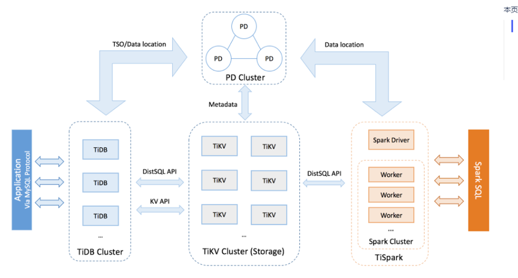

1.  可在线扩展：TiDB Server/PD/TiKV 这 3 大核心模块各司其职，并且支持在线扩容，region 自动 balance，迁移过程对业务无感知。

2.  高可用：基于 Raft 的多数派选举协议实现了金融级别的数据强一致性保证，且在不丢失大多数副本的前提下，可以实现故障的自动恢复 (auto-failover)，无需人工介入。

3.  无缝迁移：支持 MySQL 协议，业务迁移无需修改代码。

4.  丰富的监控+运维工具：
    - 监控：基于 Prometheus + Grafana 的丰富监控模板；
    - 运维工具：TiDB Ansible 部署+运维；
    - TiDB Data Migration(DM)：将数据从 MySQL 迁移+同步的工具；
    - TiDB Lightning：可以从 CSV 文件或者第三方数据源将数据直接导入到 TiKV；
    - TiDB Binlog：备份工具，也可以重放到 Kafka/MySQL/TiDB 等数据库。

TiDB 最核心的应用场景是：大数据量下的分库分表，比如经常需要 1 拆 4，4 拆 8 等数据库无限制拆分情况，并且业务端还需要自己维护路由规则，TiDB 良好的扩展性解决了这些问题。

为了能满足这么大的写入量，我们其实曾经尝试过单实例 MySQL 去抗请求，测试完后发现单实例 MySQL 压力较大，如果要分散写压力且不改变架构，那么又要走 MySQL 分库分表这种老路，TiDB 3.0 GA 发布之后，我们拿离线数据进行了压测，2 小时 1.5 亿的数据存储 (tps:2W/s)，整个系统负载良好，所以我们最终决定使用 TiDB。

### 系统配置及部署架构

**服务器硬件配置**

+ CPU:E5-2630v2*2
+ Mem:16G DDR3*8
+ Disk：
    - Intel S3500 300G*1
    - flash:宝存1.6T*1
+ Net:1000M*2

**服务器系统版本** ：CentOS Linux release 7.4.1708 (Core) 

**TiDB 的版本** ：tidb-ansible-3.0.0

**规模** ：2.8 亿/天

**存储** ：3.8T

**TiDB 部署架构图** ：

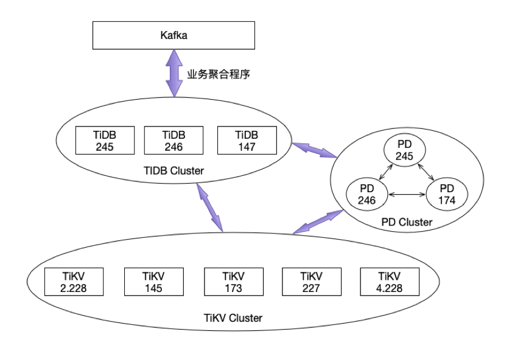

>注：PD 跟 TiDB 共用服务器

## 写热点问题优化实践

### 热点现象描述

业务方向我们反馈从 7 月份开始， Kafka 队列里面有大量的数据累积，等待写入TiDB。Kafka 高峰期的待写入 lag 有 3000 多万，接口的调用时间由之前的 1s 变成现在的 3s-5s。我们登录 TiDB 发现，单表的数据量由之前的 7000 飙升到 1.2-1.5 亿，虽然数据量几乎翻了一倍，但单条 insert 的性能应该不至于这么差，于是开始着手定位问题。

下图是 Kafka 当时的待写入的 lag 情况：

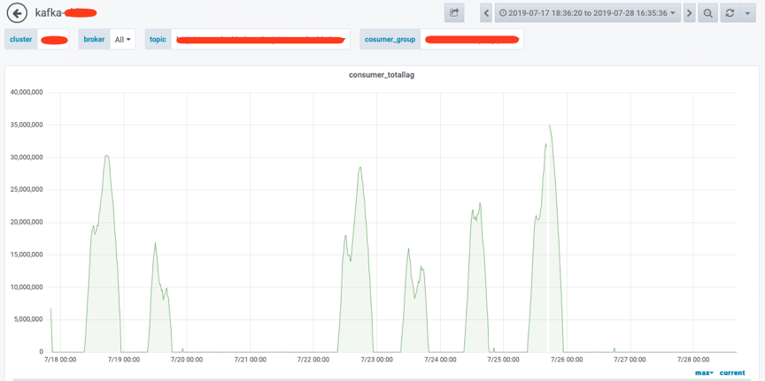

查看 Grafana Overview 监控，通过 TiKV 监控项 “scheduler pending commands”，发现 TiKV 227 节点大量等待的命令。

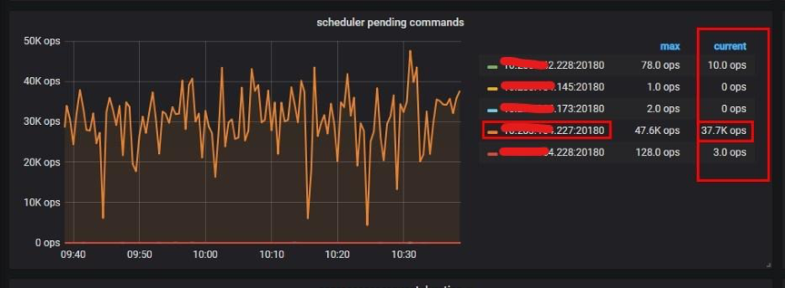

通过 TiKV 监控项“CPU 使用”也可以看出热点都集中在 227 这个 TiKV 节点上。

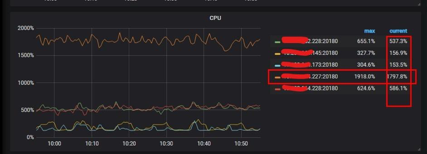

### 解决方案

一般来说有三个优化方法：手动 split 热点、参数优化、表结构优化，大家可以根据线上写热点表的表结构不同而采用不同的优化方案。

对于 PK 非整数或没有 PK 的表，数据在 Insert 时，TiDB 会使用一个隐式的自增 rowid，大量的 Insert 会把数据集中写入单个 Region，造成写热点。

此时可以使用 `SHARD_ROW_ID_BITS` 来打散热点，如果业务表可以新建的话(比如我们的报表业务是按天分表)，可以结合 pre-split-regions 属性一起在建表阶段就将 Region 打散。如果不满足上面的表结构（比如就是以自增 ID 为主键的表），可以使用手动 split region 功能。上面的两种方法都需要 PD 的参数调整来加快热点 Region 的调度。

#### 手动 split 热点

因为我们的表结构是 ID 自增主键，所以我们先使用手动 split 热点。

1\. 找出热点 TiKV 的 Store Number

在 tidb-ansible 的 scripts 目录下 table-regions.py 脚本可以查看热点表和索引 Region 分布情况：
	
```
python table-regions.py --host=tidb_host –port=10080 db_name tb_name
[RECORD – db_name.tb_name] - Leaders Distribution:
total leader count: 282
store: 1, num_leaders: 1, percentage: 0.35%
store: 4, num_leaders: 13, percentage: 4.61%
store: 5, num_leaders: 16, percentage: 5.67%
store: 7, num_leaders: 252, percentage: 89.36%
~~~~~~~~~~~~~~~~~~~~~~~~~~~
```
	
通过执行上面的命令，能查看热点表都在 store 7(227 服务器) 这个 TiKV 节点。

2\. 查看热点的表 Regions 分布 

```
curl http:// ${tidb_host}:10080/tables/db_name/tb_name/regions > regions.log
```

3\. 手动切分 Region

切分命令如下：

```
pd-ctl -u http:// ${pd_host}:2379 operator add split-region region_id
```
	
使用命令找出 Store7 的 Region ID：
	
```
grep -B 3 ": 7" regions.log |grep "region_id"|awk -F': ' '{print $2}'|awk -F',' '{print "pd-ctl -u http://pd_host:2379 operator add split-region",$1}' > split_region.sh
```

4\. 执行切分脚本就实现了 Region 切分

```
sh split_region.sh
```

**参数优化**

1\. 调整 PD 调度参数

```
pd-ctl -u http://pd_host:2379 config set 参数值
    "hot-region-schedule-limit": 8  
"leader-schedule-limit": 8,     
"region-schedule-limit": 16
```

上面 3 个参数分别是控制进行 hot-region\leader\region 调度的任务个数。这个值主要影响相应 Region balance 的速度，值越大调度得越快，但是也不宜过大，可以先增加一倍看效果。

2\. TiKV 参数之：sync-log

跟 MySQL 的 `innodb_flush_log_at_trx_commit(0,1,2)` 类似，TiDB 也有一个 sync-log 参数，该参数控制数据、log 落盘是否 sync。注意：如果是非金融安全级别的业务场景，可以考虑设置成 false，以便获得更高的性能，但可能会丢数据。

该参数是 TiKV 参数，需要调整 tidb-ansible 下 conf 目录中 tikv.yml，然后使用下面的命令，只滚动升级 TiKV 节点。

```
ansible-playbook rolling_update.yml --tags=tikv
```

>注：本次优化保持默认 `true`。

**下面介绍几个查看参数优化效果的方式：**

1\. 通过命令查看 Leader 调度情况

```
pd-ctl -u http:// ${pd_host}:2379 operator show leader
```

2\. 通过 Grafana 监控图查看

在 PD 监控模块中找到 Scheduler 模块->Scheduler is running->balance-hot-region-scheduler，balance-hot-region-scheduler 有值，则代表有热点 Region 调度，如下图所示：

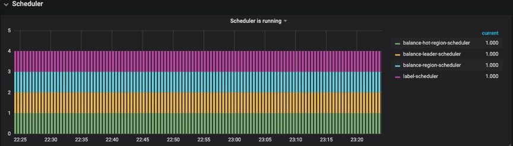

在 PD 监控模板中找到 Operator->Schedule operator create->balance-leader，这个参数代表如下图所示：

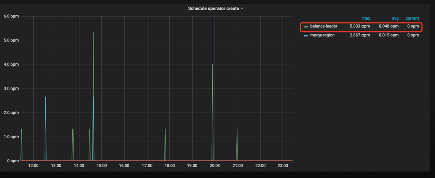

然后从 Overview 中，查看 TiKV 模块的 Leader、Region，CPU、Scheduler Pending Commands 等变化情况，对优化效果进行综合分析。

#### 终极大招之表结构优化

我们发现通过手 split 的方式并没有较好地解决业务的写热点问题，所以又采用了`SHARD_ROW_ID_BITS` 结合 `PRE_SPLIT_REGION` 的方式来打散热点。

对于 PK 非整数或没有 PK 的表，在 insert 的时候 TiDB 会使用一个隐式的自增 rowid，大量 INSERT 会把数据集中写入单个 Region，造成写入热点。通过设置 `SHARD_ROW_ID_BITS` 来适度分解 Region 分片，以达到打散 Region 热点的效果。使用方式：

```
ALTER TABLE t SHARD_ROW_ID_BITS = 4;  #值为 4 表示 16 个分片
```

由于我们每天都会新建表，所以为了更好的效果，也使用了 `PRE_SPLIT_REGIONS` 建表预切分功能，通过配置可以预切分 `2^(pre_split_regions-1)` 个 Region。

下面是最新的表结构，其中最重要的优化是删除了自增主键 ID，建表时添加了 `SHARD_ROW_ID_BITS` 结合 `PRE_SPLIT_REGION` 配置。

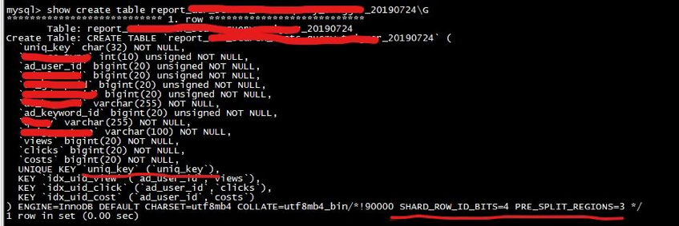

该建表语句会对这个表 t 预切分出 4 + 1 个 Region。4 *(2^(3-1)) 个 Region 来存 table 的行数据，1 个 Region 是用来存索引的数据。

关于 `SHARD_ROW_ID_BITS` 和 `PRE_SPLIT_REGION` 这 2 个参数使用详情参见官方文档：

* [https://pingcap.com/docs-cn/v3.0/faq/tidb/#6-1-2-如何打散热点](https://pingcap.com/docs-cn/stable/faq/tidb/#6-1-2-%E5%A6%82%E4%BD%95%E6%89%93%E6%95%A3%E7%83%AD%E7%82%B9)

* [https://pingcap.com/docs-cn/v3.0/reference/sql/statements/split-region/#pre-split-region](https://pingcap.com/docs-cn/v3.0/reference/sql/statements/split-region/#pre-split-region)

此外，针对自增主键 ID 造成写入热点的问题，TiDB 将会在 4.0 版本为提供一个新的列属性：`Auto_Random`。这个属性类似于 `Auto_Increment`，可以定义在整型主键上，由 TiDB 自动分配一个保证不重复的随机 ID。有了这个特性后，上面的例子可以做到不删除主键 ID，同时避免写入热点。

### 最终优化效果

从监控上看，TiKV 的 CPU 使用非常均衡：

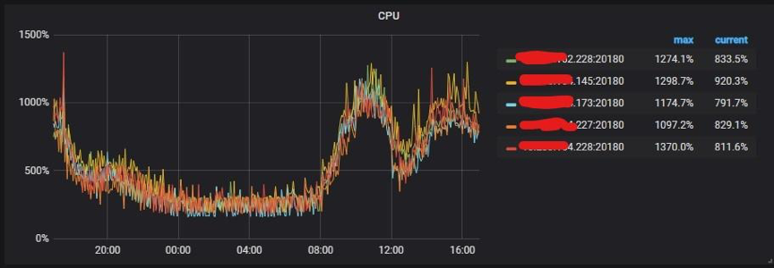

从命令调度的结果来看也比较均衡：

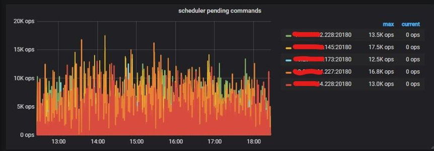

## 总结

本文只是拿 360 智能商业业务线的一个业务场景分享了热点 Region 的打散方法，目的是提供写热点优化的思路，希望能对大家有一定的帮助。本文调优过程中得到了 PingCAP 公司技术人员的大力支持，在此表示衷心的感谢。

TiDB 的存储和计算分离的架构，结合高可用、高性能、易扩展、易运维等特性，给大数据量的数据拆分带来了曙光，未来会在 360 智能商业业务线有更多的项目落地。在未来，我们期望用 TiFlash 解决 TiDB 下游数据治理问题，并做到跨数据中心部署的方案。


