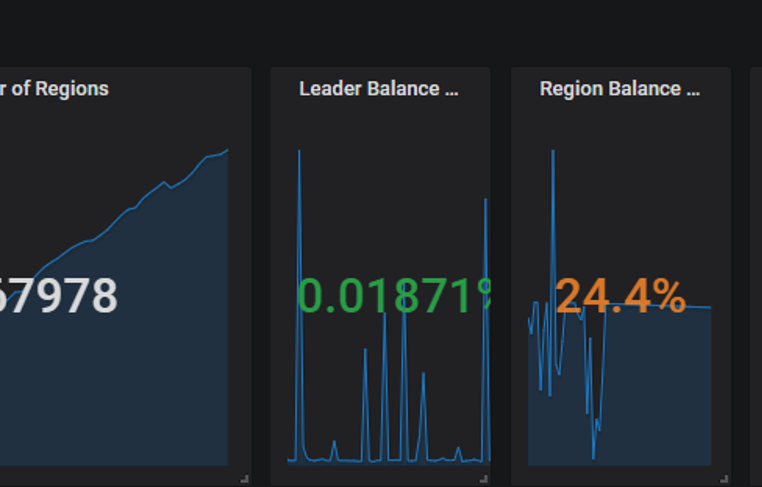

>**作者介绍**：贺磊，360 数据库运维资深工程师，《MongoDB 运维实战作者》，知名论坛 MySQL 版主，51CTO 博客之星，闲暇之余，喜欢将部分案例写成博客，累计访问量过百万。

**我先说几个最让你兴奋和开心的点吧：**

* 在 TiDB 里，你完全不用担心磁盘容量的问题。

* 在 TiDB 里，原生支持 Online DDL，你完全不用担心第三方改表工具改表出现各种 Bug 的问题，相信用开源工具改过上 T 级别表的同学都遇到过或多或少的各类 error。

* 在 TiDB 里，加列、主键扩容字段都是秒级的，比如我刚刚就刚对一张 19 亿的表加完了字段，1 秒完事，这在 MySQL 里要 8.0 才可以，而且还要求列在最后才行。

* 在 TiDB 里，你会发现 count(\*) 惊人的快，一张近 20 亿的表 coun(\*) 大概在 1 分钟完事儿，当然，这取决于你的 KV 数量和磁盘性能。

* 在 TiDB 里，从 MySQL 迁移将变得简单，图形化一键迁移，爽不爽？

* 在 TiDB 里，绝大多数情况你会发现比单机 MySQL 有更好的性能，当然也不排除一些例外，例如 enum 这样奇葩的字段类型。

* 在 TiDB 里......您且往下看，我慢慢和您说。

## 使用背景

60 云平台对 360 集团各大业务线均有提供服务支持，涉及的数据库支持方案有：MySQL、Redis、MongoDB、ES、GP、PiKA。

其中 MySQL 至今已有过万的实例，目前，对于一些写入量大的业务，已经出现瓶颈。

例如磁盘空间，虽然我们可以通过分库分表的方式，拆分出来，但这对业务和 DBA 来说都是不小的工作量，最痛苦的无异于这些大表的改表。

无论是单表上 T，还是分库分表，对一张大表执行 DDL 的代价是非常大的。

针对业务爆发式增长的数据量，我们开始调研选型是否有其他数据库可以代替传统的 MySQL。

**通过调研我们了解到 TiDB，迁移平滑，基本上无需业务变动代码，完全的事务 ACID 支持，分布式的架构，自带高可用、Online DDL。**

**截止目前，360 云平台这边有三套 TiDB 集群，总节点数在 50+。有 9 个业务线接入使用，有过百亿级表 Online 加索引的案例，总数据量目前在 80T。**

版本上，我们从 3.0.1 一路跟随到 3.0.5，DM 版本从内测到 1.0.2 GA 版本，共计提出 9 个 Bug 或改进项反馈。

后续我们计划将 TiDB 上到 360 HULK 云平台上，并定制化开发一些功能为业务提供可视化的服务，以便让 360 集团更多的业务线接触到 TiDB、使用 TiDB。

版本的选择我们之所以从大版本 3 开始，也是看到了一些 2.X 版本的社区反馈，尤其是索引执行计划这块，3.X 版本较之前的版本会好很多。DM 版本我们是直接选取的最新版，后一路跟随新版本升级。

## 集群架构


整体架构上，我们除了 TiDB 集群外，还用到了 DM 和 Pump、Drainer 套件。

**这块主要是由于我们使用 TiDB 的业务有两种：**

#### 1. 老的 MySQL 业务

老得 MySQL 业务因单机磁盘受限，导致单实例磁盘无法支撑爆炸式增长的数据量，数据比较重要，需要备份和支持 7*24 小时的恢复。

这类业务我们用到 DM 套件来实现无障碍迁移，1TB 的导入时间在 16 小时，这里如果是比较大的数据源，且 TiDB 是全新集群，可以使用 TiDB Lightning，速度可以更快。

Lightning 的实测导入速度，37 分钟，导完 2 张大表共计 54G 的数据，符合 100G/H 预估，是 loader 的 3 倍速度，loader 用时 2 小时 4 分钟。

**说起 DM 使用这块文章后面会单独分享下这块需要注意的问题，如下图所示：**


#### 2. 全新的业务

全新的业务，或者由业务自行导入到 TiDB 集群中，这种业务数据量一般都会比较大，也是看中了 TiDB 支持 ACID 和分布式的特点。

目前网盾业务有多张表都过 10 亿级别，其中有张表到达了 100 亿+，建索引花了近 10 天（这块其实我们应当注意，不是分布式就一张表就完事儿了，因为表量级过大，清理老旧数据都是个问题）。

TiDB 现在支持分区表，但我们在使用过程中发现性能上和普通表有差距，期待后续版本能够让分区表功能和性能更加的完善。

## TiDB 在 360 云平台的使用情况

对于这一全新的数据库，我们本着大胆用，不拘泥于传统的态度进行使用。
我们的 MySQL 现在也正在适配 8.0 版本，MongoDB、ES 也都是时刻关注着新版本情况来评估是否适合云平台。

因此 TiDB 的上线也是从离线业务→边缘业务→核心业务来过渡的。

**经过大量的测试、也参考了其他公司的使用情况，我们计划将 TiDB 纳入 360 HULK 云平台，并计划后期对其不断完善在云平台中的功能，对全公司业务线开放使用。**

定制化开发一些 MySQL 已经具备的，例如 SQL 审核、慢查统计、冗余索引检测、自增索引阈值等各项基础功能等等。

虽然在使用过程中遇到了一些小问题，例如索引的选取、参数的调优，因为一些配置导致的性能抖动，但都得到了 PingCAP 同学快速的响应和回复，这对我们推进 TiDB 有重大的帮助。

### 一键迁移工具 DM 干货分享

**DM 使用经验如下：**

#### 1. 权限

官网手册上只说明需要如下权限：

**TiDB Lightning 需要以下权限：**

* SELECT

* UPDATE

* ALTER

* CREATE

* DROP

**存储断点的数据库额外需要以下权限：**

* INSERT

* DELETE

**但实测过程中发现还需要如下权限：**

* 上游 （REPLICATION SLAVE 权限必须具备，要不增量同步会 access deny）。

* 下游 （不加 super 会导致 checksum table 无法执行）。

#### 2. TiKV Rezcore

PD 监控中 -Statistics-balance 中，有 Store-region-score 监控项，这里记录的是各个节点的 Score 得分，正常情况下，我们期望的结果是得分接近的，这说明无需进行 Region 大规模迁移。

#### 3. PD 调度原理

Region 负载均衡调度主要依赖 balance-leader 和 balance-region 两个调度器。

**二者的调度目标是将 Region 均匀地分散在集群中的所有 Store 上，但它们各有侧重：**

* balance-leader 关注 Region 的 Leader，目的是分散处理客户端请求的压力。

* balance-region 关注 Region 的各个 Peer，目的是分散存储的压力，同时避免出现爆盘等状况。

我们这里重点关注的是 balance-region，当它出现不均衡的时候，我们可以直接在监控中看到类似下图所示：



调度期间，不可避免的会出现 IO 争用、磁盘的 lantency，都会出现不同程度的上涨，从业务上的反馈看，就会出现积压，响应不及时等等。而当 Region Balance 完成后， Duration 等都会恢复正常水平。

**因此，我们要关注的地方有两点：**

* 如何控制或减小 Region Balance 大规模迁移时对业务的影响；

* 如何提前规避因磁盘导致的大规模 Region Balance。

对于第一点，我们迁移的时候是有参数可以控制的。这里无论是磁盘空间阈值，还是 Region Balance 调度速度，或者 Drop 大量表后调整空 Region Merge 的速度，其实都是可以通过 pd-ctl 的 config set 命令来实时调节。

**例如：**

* **high-space-ratio 0.7 #设置空间充裕阈值为 0.7**。当节点的空间占用比例小于指定值时，PD 调度时会忽略剩余空间这个指标，主要针对实际数据量进行均衡。

* **region-schedule-limit 8 #最多同时进行 8 个 Region 调度**。这个值主要影响 Region Balance 的速度，值越大调度得越快，设置为 0 则关闭调度。Region 调度的开销较大，所以这个值不宜调得太大。也可以通过减小该值来限制调度region对集群产生的影响。

* **merge-schedule-limit 12 #最多同时进行 12 个 merge 调度**。设置为 0 则关闭 Region Merge。Merge 调度的开销较大，所以这个值不宜调得过大。

* **leader-schedule-limit 8 #最多同时进行 8 个 leader 调度**。这个值主要影响 Leader Balance 的速度，值越大调度得越快，设置为 0 则关闭调度。Leader 调度的开销较小，需要的时候可以适当调大。

* **max-merge-region-keys 50000 #设置 Region Merge 的 keyCount 上限为 50k**。当 Region KeyCount 大于指定值时 PD 不会将其与相邻的 Region 合并。

* **max-merge-region-size 16 #设置 Region Merge 的 size 上限为 16M**。当 Region Size 大于指定值时 PD 不会将其与相邻的 Region 合并。设置为 0 表示不开启 Region Merge 功能。

**TIPS**：理解了作用和原理，上述参数都可以根据需求自行控制。

**例如当我们在 Drop 大量的表后，会产生很多的空 Region**。在 Region 数量较多的情况下，Raftstore 需要花费一些时间去处理大量 Region 的心跳，从而带来一些延迟，导致某些读写请求得不到及时处理。

如果读写压力较大，Raftstore 线程的 CPU 使用率容易达到瓶颈，导致延迟进一步增加，进而影响性能表现。

因此我们会希望尽快的进行 Region Merge，来避免过多的 Region 对集群造成性能损耗时，我们可以同时调小 max-merge-region-keys、max-merge-region-size，来让其更快的触发 Merge 操作，同时调大 merge-schedule-limit 提高并发度。

**例如当我们发现某台 KV 磁盘空间剩余 40% 开始大量调度时**，我们可以将 high-space-ratio 调整到 0.7，以临时避免调度对业务产生的影响。

我们也可以控制调度的并发度，来减少对业务产生的影响，实测这都是立竿见影的参数，大家如果遇到这些问题可供参考。

对于第二点，尤其是使用 DM 期间，将 DM-worker 和 TiKV 混合部署的情况下，要注意清理全量备份留下的文件和 Relaylog。


默认调度策略是当磁盘剩余的有效空间不足 40%，处于中间态时则同时考虑数据量和剩余空间两个因素做加权和当作得分，当得分出现比较大的差异时，就会开始调度。

所以 DM 导入完成后，要记得删除全量备份。就是 dumped_data.task_xxx 文件夹，这个全量备份一般都会比较大，如果 dm-worker 和 TiKV 混部，就会出现某个 TiKV 节点磁盘已使用率高于其他。

这时 PD 的 store region score 就会相比其他节点出现异常，引起性能抖动和 Duration 升高。


**一直等待其追上后，才会像下图这样：**


**此时，balancer 已达平衡状态：**


**Duration 恢复正常水平，如下图 16:54 分时的情况：**


**QPS 也不再积压，恢复正常水准：**


关于 relay-log，默认是不清理的，就和 MySQL 的 expire_logs_days 一样，这块可以通过 dm-worker 的配置文件来进行配置。

**例如将 Expires 配置为 7，代表 7 天后删除：**

```
[purge]
interval = 3600
expires = 7
remain-space = 15
```

Expires 来控制保留天数。默认 expires=0，即没有过期时间，而 remain-space=15 意思是当磁盘只剩于 15G 的时候开始尝试清理，这种情况我们极少会碰到，因此这个清理方式其实基本上是用不到的。

所以建议有需要删除过期 relay-log 的小伙伴，直接配置 Expires 保留天数就可以了。

DM 导入完成后，应该提供是否在完成后自动删除全备文件的选项，可以默认不删，由使用者决定是否删除。

从使用者角度来说，全量备份目录无论是全量一次性导入还是 all 增量同步，后续都不会再使用到。

如果 dm-worker 和 TiKV 混部，会导致全备文件占据大量磁盘空间，引起 TiKV Region 评分出现异常，导致性能下降，已转化为 PRM 产品需求。

#### 4. 关于 DM 使用期间出现数据丢失的问题

在早期还没有 dm-portal 自动化生成 task 时，我们都是自行编写 DM 的 task 同步文件。后来有了 dm-portal 自动化生成工具，只要图形页面点点点就可以了。


但该工具目前有一个问题是，没有全库正则匹配，即便你只勾选一个库，他底层是默认把每张表都给你配置一遍。

这就会出现当上层 MySQL 新创建某张表的时候，下游会被忽略掉，例如当你使用改表工具 gh-ost 或者 pt-online-schema-change，你的临时表都会被当做为不在白名单内而被忽略，这个问题使用者需要注意。

我们也已经反馈给了官方。未来不久的版本估计就可以修复。

```
["skip event"] [task=task_20357] [unit="binlog replication"] [event=query] [statement="ALTER TABLE `360`.`_data_201910_gho` ADD COLUMN `raw_url_md5` CHAR(32) NOT NULL DEFAULT '' COMMENT 'raw_url md5'"]
["skip event"] [task=task_20357] [unit="binlog replication"] [event=query] [statement="ALTER TABLE `360`.`_data_201910_gho` ADD INDEX `idx_rawurl_md5`(`raw_url_md5`)"] [schema=flow]
["skip event"] [task=task_20357] [unit="binlog replication"] [event=query] [statement="ALTER TABLE `360`.`_data_201910_gho` DROP INDEX `idx_raw_url`"] [schema=flow]
```

这里日志可以看到 event 被 skip 了。

#### 5. 关于 DM 使用期间偶发性 1062 主键冲突的问题

query-error task 能看到具体的报错信息，下游看都没有该值：

```sql
mysql> select * from client where clientid='82b51e6f6eb64955487f978dd94a2c81e492f6170xxxxxxxxxxxxxxxxxxxxxxxxx';
Empty set (0.00 sec)
```

再去上游看，结果发现也没有值，业务逻辑应该是后来 delete 了：

```sql
mysql> select * from client where clientid='82b51e6f6eb64955487f978dd94a2c81e492f6170xxxxxxxxxxxxxxxxxxxxxxxxx';
Empty set (0.00 sec)
```

**因为上游也没有值，去上游看 Binlog 后分析如下：**

是先写入，再删除，所以上游没值是可以预期的，但是下游还没有同步到这块，此时也是没有值的，不应该存在 1062 的问题。

当集群有大规模 kv:1062 报错时，或者集群写入压力大时，DM 从结果看无法保证 Binlog 的有序落盘，需确认 DM能不能保证 LVS 下的多个 TiDB Binlog 的每一个 Event 是有序执行的。

只从现象看，只要集群没有大量的 1062 报错，PD 相关的监控值都比较低，DM 也不会出现任何同步报错，反之就出现。

从 Binlog 看就像是第一条 Insert了，还没来得及 Delete，直接 Insert 产生的报错，但报错后那个 Delete 的也完成了，所以这时候我再怎么快也快不到毫秒级，下游看不到所有记录。

解决的办法是将 1062 大量冲突的业务拆分出集群，或 DM 直接写 TiDB 的真实 IP 而不是 LVS。

#### 6. DM 同步异常

有业务反馈 Drop 分区和 Drop 列时出现同步异常。补充下分区表相关的测试的结果，DM 更多的无法拆分的情况还是在 Drop 这块，普通的 add，modify 没问题的。

**一次删除多个分区的操作则会报错：**

```
alter table dsp_group_media_report drop partition p202006 ,p202007 ;
```

**Drop 含有索引的列操作会报错：**

```
Alter table dsp_group drop column test_column;
```

40 亿表添加 DDL 添加索引导致的 Duration 升高：


定位到是：

```
mysql> show global variables like 'tidb_ddl_reorg_worker_cnt';
+---------------------------+-------+
| Variable_name             | Value |
+---------------------------+-------+
| tidb_ddl_reorg_worker_cnt | 16    |
+---------------------------+-------+
1 row in set (0.11 sec)

mysql> show global variables like 'tidb_ddl_reorg_batch_size';
+---------------------------+-------+
| Variable_name             | Value |
+---------------------------+-------+
| tidb_ddl_reorg_batch_size | 1024  |
+---------------------------+-------+
```

上述两个参数对已有非 pcie 集群压力比较大导致。通过 set global 调节（3.0.3 后，默认从 256 涨到了 1000 和 16）：

```
tidb_ddl_reorg_batch_size 1000-256
tidb_ddl_reorg_worker_cnt 16-4
```

同时，提高 Compaction 相关：

```
max-background-jobs: 8-10-12
max-sub-compactions: 1-2-4
defaultcf.compression-per-level: ["lz4", "lz4", "lz4", "lz4", "lz4", "zstd", "zstd"]
writecf.compression-per-level: ["lz4", "lz4", "lz4", "lz4", "lz4", "zstd", "zstd"]
```

最终的优化结果是，QPS 稳定在 3K 左右：


#### 7. 静默 Region 开启

在实际情况中，读写请求并不会均匀分布到每个 Region 上，而是集中在少数的 Region 上。

那么可以尽量减少暂时空闲的 Region 的消息数量，这也就是 Hibernate Region 的功能。

无必要时可不进行 raft-base-tick，即不驱动空闲 Region 的 Raft 状态机，那么就不会触发这些 Region 的 Raft 产生心跳信息，极大地减小了 Raftstore 的工作负担。

截至 TiDB v3.0.5，Hibernate Region 仍是一个实验功能，在 TiKV master 分支上已经默认开启。可根据实际情况和需求来开启该功能。

**参数如下：**

```
raftstore.hibernate-regions: true
```


#### 8. DM 导入期间 Duration 升高

在 DM 导入集群期间，确实会因为写热点的问题导致集群整体 Duration 更高，因为 IO 争用会更明显。这里其实也是可以通过一些参数来让集群运行的更快的。


**如下参数从原值调到-新值：**

```
raftstore:
apply-pool-size: 3-4
store-pool-size: 3-4

storage:
scheduler-worker-pool-size: 4-6

server:
grpc-concurrency: 4-6

rocksdb:
max-background-jobs: 8-10
max-sub-compactions: 1-2
```

可以看到效果如下：QPS 不再抖动，Duration 也恢复到正常的水平。


#### 9. DM Debug 相关
DM 还有个注意点就是 dm-worker.toml 配置文件里的配置 log-level=“debug” 是不生效的，启动的时候默认有个 -L=info 选项，会覆盖掉配置文件里的，默认 -L 优先级高于配置文件，人工排查时自行启动。

也就是说当需要对 dm-worker 开启 debug 模式，要人工拉起进程并指定 -L 选项=debug。

#### 10. TiDB load data 速度不理想

TiDB 目前 load data 的导入速度不及 MySQL，如果依赖 load data 的话，这块可以调优一下参数。

我们的场景是 TiKV 上没有明显的瓶颈，主要慢在了 scheduler latch wait duration，可以调下参数看看：

```
storage:
scheduler-concurrency: 204800000

raftstore:
raft-max-inflight-msgs: 4096
```


调优完成后是有提升，但提升不大，我们得知新版本的 TiDB 在 Load data 这块又有速度提升，比较期待新版本。

### 其他干货打包分享

#### 1. TiDB 列数超限

MySQL 是 1024，TiDB 目前限制是 512 列。如果你的表有非常多的列，那么这块要提前注意下是不是可以拆分出去。

#### 2. GC can not work

GC 的数据包括两部分，一部分是 DML 和 DDL ，DDL 的 GC 的对象信息包含在 mysql.gc_delete_range 和 mysql.gc_delete_range_done ，分别记录的是待 GC 的对象以及已经 GC 的对象。mysql.gc_delete_range_done表里面没有数据不代表 GC 异常。

官方建议更换规则：

```
sum(increase(tikv_gcworker_gc_tasks_vec{task="gc"}[1d]))
```

#### 3. TiDB or 条件优化

**在 TiDB 中，如下查询是不能用到索引的：**

```
select * from manual_domain where host_md5  = '55fbea39965484a61xxxxxxxxxx'  or domain_md5 = '55fbea39965484a61xxxxxxxxxx';
```

MySQL 中用到了 index_merge，TiDB 计划 4.0 支持，可以先用 union all 来处理这种 a or b。

#### 4. Coprocessor CPU 消耗过大

业务反馈查询变慢，发现是另外一个业务全表扫 insert into select 导数据导致的。


去 CPU 占用率高的这台机器上搜索对应的 log，关键字 slow，发现如下情况：

```
[2019/09/18 10:04:37.339 +08:00] [INFO] [tracker.rs:150] [slow-query] [internal_key_skipped_count=46649] [internal_delete_skipped_count=0] [block_cache_hit_count=1596] [block_read_count=9] [block_read_byte=31933] [scan_first_range="Some(start: 7480000000000002285F72800000000021E9BD end: 7480000000000002285F72800000000024199A)"] [scan_ranges=1] [scan_iter_processed=46650] [scan_iter_ops=46652] [scan_is_desc=false] [tag=select] [table_id=552] [txn_start_ts=411244239493267464] [wait_time=2ms] [total_process_time=1.41s] [peer_id=ipv4:192.168.1.248:45686] [region_id=835437]
```

根据 table_id 去通过 information_schema.tables 表查一下，可以通过上述方式来定位到是哪张表导致的问题。

TiDB enum 导致的性能问题：

enum 在 TiDB 3.0.2 进行 where 条件查找时，发现不能下推到 TiKV。官方说4.0GA 修复。临时办法是修改到其他类型。

enum modify 为 tinyint 发现内容出现变化，原本的’'变成了 default 值，‘1’ 变成了 2，经测试 varchar 正常，因此不要尝试去变更 DM 备份出来的 Schema 文件来实现表结构变更，应该从上游 MySQL 解决。

#### 5. 分区表元数据无法获取

没有视图可以查询当前已建分区信息。在 TiDB 中目前没有视图支持查询分区表已建分区信息，那么用户那边没有办法直观的判断当前已建的分区，以及当前是否需要及时的添加新分区。目前已转化为 PRM 产品需求，相信新版本不久会实现。

**分区表 - 部分分区 - limit 未下推**：分区表出现 limit 未下推的现象，表 content_info_p 其中只有分区 p201911 有数据。该问题已在 3.0.6 版本修复。

**mysql.tidb 表权限异常**：使用 use db_name 或者 mysql 客户端指定 DB name 后，可以对该表进行查询或更新操作。计划 3.1 版本修复。

**事物的限制**：单个事物的 SQL statement 不超过 5000（stmt-count-limit 参数可调）；每个键值对不超过 6M；键值对的总数不超过 300000；键值对的总大小不超过 100M。

注：键值对是指一张表里有 2 个索引，那么一共就是数值 +2 个索引，总共 3 个键值对，那么每个键值对的总是不能超过 30 万/3=10 万。

一行数据会映射为一个 KV entry，每多一个索引，也会增加一个 KV entry，所以这个限制反映在 SQL 层面是：总的行数*(1+索引个数)<30w。

**官方提供内部 batch 的方法，来绕过大事务的限制，分别由三个参数来控制：**

* tidb_batch_insert

* tidb_batch_delete

* tidb_dml_batch_size

**写热点的处理**：如果可以去掉 MySQL 自增主键，就可以通过建表时指定 SHARD_ROW_ID_BITS、PRE_SPLIT_REGION 来实现预切分，避免单调自增引发的只往某个 KV 上写数据引起的热点问题。

详情可参考官网 TiDB 专用系统变量和语法中 SHARD_ROW_ID_BITS 的介绍。

#### 6. TiDB 监控和 DM 监控 Ansible 部署数据冲突

这块可以通过将 TiDB 和 DM 监控部署到不同的机器上来绕过解决，否则就会出现通过 Ansible 安装后，ansible-playbook rolling_update_monitor.yml --tags=prometheus 时，两者只有一个是正常的。

**磁盘已使用不建议超过 50%**：数据量太多 LSM 过大， compaction 成本会很高，并且内存命中率下降，同时单机恢复时间很长，50% 左右最好，使用率太高，如果突然写入爆增，region 来不及调度会写满磁盘，有风险。

因此建议 SSD 不要使用超过 2T 的，采用更多的机器会有更好的性能。

#### 7. Mydumper 导致的内存和网卡打满

在使用 Mydumper 备份大时，会打满 TiDB 网卡，同时会消耗 TiDB、TiKV 更多的内存。

```
TiDB ERR】[emergency]TiDB_schema_error:192.168.1.1:10080,[add_dba_mysql]【360】
【TiDB ERR】[critical]NODE_memory_used_more_than_80%:192.168.1.2:9100,[add_dba_mysql]【360】
```

**去抓取慢日志会看到如下内容：**

```
grep Query_time tidb_slow_query-2019-12-24T04-53-14.111.log|awk -F : '$2>10'
# Time: 2019-12-24T03:18:49.685904971+08:00
# Txn_start_ts: 413433784152621060
# User: backup@192.168.1.3
# Conn_ID: 4803611
# Query_time: 4002.295099802
SELECT /*!40001 SQL_NO_CACHE */ * FROM `360`.`t_d` ;
```

期待后续的版本物理备份，逻辑备份看起来目前是可以备份，但会比较消耗资源，同时恢复时间也会更久。

## 展望

从 TiDB 2.x 开始我们就已经开始进行测试了，最终选择的版本是 3.0.2，后续升级到 3.0.5。

上述文章总结和一些案例希望能够帮助到已使用或打算使用 TiDB 的朋友。

360 云平台 DBA 团队也计划将 TiDB 推上 360 HULK 云平台，为 360 集团更多的业务线提供丰富多彩和稳定可靠的数据库服务。

在这里首先要感谢 PingCAP 同学及时的技术支持，帮助我们尽快的解决了一些技术问题。

同时，我自己也通读了 TiDB 的官方手册。从 Ansible 部署、二进制部署、升级、DM、Lighting、Pump、Drainer、调优、排障、迁移、备份，这一路打怪下来，切身感受到了 TiDB 越来越好的过程。

我相信未来随着 3.1 和 4.0 版本的推出，有更多人加入使用 TiDB 的这个队伍中来。

从业务给我们的反馈也是对 TiDB 的使用情况表示满意，我们相信，TiDB 会在大家共同的努力下，越来越好。

>本文转载自公众号 [51CTO技术栈](https://mp.weixin.qq.com/s/8d7aUr32tOWCCMihpIqZ-A)。
