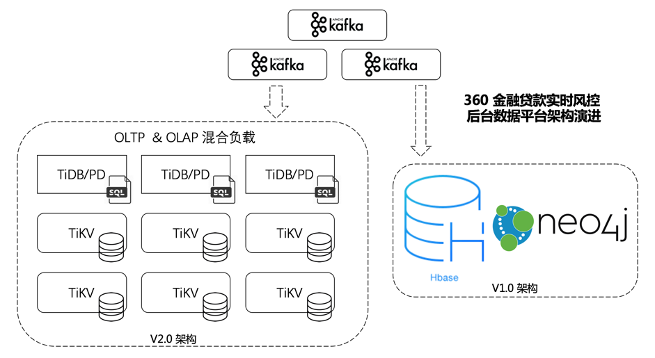

> 作者：金中浩，360 金融 / 数据智能部 / 部门总监

## 背景

近几年来基于互联网渠道的现金贷业务发展十分迅猛，无论是新兴的互联网企业还是传统的金融机构，都想在这个领域快速占领市场，攫取客户。然而在线贷款业务与其他互联网业务有着明显的不同，源自金融的基因决定了重视风险的必要性，这不仅关系到产品的收益，也直接影响了产品是否可以成功。

将业务推到线上意味着无法准确的获取客户信息，只能通过有限的渠道验证客户的真实性和偿还能力，极大的增加了风险成本。如果申请步骤过于繁琐则降低了用户体验，不利于产品的推广和客户的使用。因此对于互联网贷款风控的一项挑战就是能够在尽可能短的时间内，有限数据的情况下，给出明确的风险判断。

## 应用

建立风险策略的过程中，使用各种风险变量以及相关的衍生变量，通过专家模型进行评分，是一种较为典型的方法。实际应用中，我们发现除了已经被广泛使用的消费行为数据，基本收入数据等，基于特定维度的用户间社交关系也是比较有效的模型变量。

在使用这些变量的过程中，我们面临最直接的问题是数据量。如果考虑将用户手机通讯录中出现的电话号码作为一项关系关联的形式，假设每位用户通讯录中联系人的个数平均为 100 个，那 100 万个注册用户就有对应大约 1 亿个联系人。事实上，在系统上线大约 1 年不到的时间内，我们几张存储社交关系的表已经达到了大约 50 亿左右的规模。

相对于数据存储，变量的衍生加工和查询匹配是个更加有挑战性的工作。一个人的社交关系是个很典型的「图」数据结构。而很多专家模型中的规则是需要匹配某个用户 3 层以上关系的，最简单的就是匹配用户通过联系人关系，跃进 3 层后，命中系统黑名单的人数。我们还是按照平均 100 个联系人来估算，跃进 3 层后，需要匹配的关联人数为 100 *100* 100，即 100 万。而类似计算量的规则不在少数，需要调用这些计算规则的业务场景也较为频繁，同时对响应时间的要求也高。

## V1.0 版本的解决方案

在评估阶段，我们考虑了几种方案，各有利弊。首先被淘汰的是使用 MySQL 的解决方案。使用关系型数据库的优势是在查询方面的便捷性。在开发效率上，SQL 是开发人员和数据分析人员的必备技能，能够较快的在功能上实现需求。但是在数据存储和计算层面，MySQL 的表现则差强人意。在面对大数据量时，MySQL 能采取的水平扩展策略无非是分库分表，这样的后果就是查询逻辑变的非常复杂，不易维护，且性能下降的较为严重。

另一个方案是把 HBase 作为数据存储的解决方案。它的优点很明显，可以水平扩展，数据量不再是瓶颈。但是它的缺点也同样明显，即对开发人员不友好，查询的 API 功能性较差，只能通过 key 来获取单条数据，或是通过 scan API 来批量读取。更关键的是 HBase 对图这样的数据结构支持的不好，只能通过使用 tall table 和存储冗余数据的形式来模拟。

第三个方案是使用纯粹的图数据库。首先我们考察了开源的 Titan，发现这个项目已经废弃了，主力团队貌似研发了一个新的商业图数据库，并成立了公司。而且 Titan 的存储引擎也是使用了 HBase 和 Cassandra(根据需求两者选一)，性能并不能满足我们的要求。接着我们考察了两款开源的商业产品 Neo4j 和 OrientDB。他们两者都提供了免费的社区版本，当然在功能上比商业版少了些。其中 Neo4j 的社区版不支持 HA，只能在单机上运行。而 OrientDB 的数据版支持 HA 和 Sharding。在编程接口上两者都支持各种主流的编程语言。Neo4j 提供了自家独创的，基于模式匹配的查询语言 cypher。OrientDB 则提供了类 SQL 的语法 API，可谓各有所长。

最终上线的方案是混用了 HBase 和 Neo4j 两种存储。HBase 使用了 9 台 32G 内存，16 核的服务器集群，主要负责存储业务对象的基本信息，和第一层的关联信息。Neo4j 则负责图数据结构的存储，使用了单台 256G 内存 2T SSD 的服务器。上线后，相关实时分析接口的 TPS 大约为 300，90% 的相应时间保持在 200ms。部分表的数据量保持在 3000 万 ～ 6 亿的规模，部分核心表大约在 30 亿左右。

## V2.0 版本 - 引入 TiDB 和优化

系统上线后总体较为稳定，但是仍然存在一些亟需解决的问题。Neo4j 作为存储图数据的系统，在社区版本的功能上只能支持单节点，无法进行水平扩展，虽然现阶段来看无论是性能上还是功能上都可以满足业务的需求，但是可以预见在不久的将来就会有瓶颈。而 HBase 的缺点在于数据结构过于简单，无法给 OLAP 的系统和分析人员提供易用的数据接口，只能通过批量的 ETL 来同步数据至数据仓库，实时性较弱。

在和 PingCAP 的技术团队进行交流后，了解到了 TiDB 这个由国人自己研发的分布式数据库。TiDB 中吸引我们的特点有很多，其中能帮助我们解决现有问题的主要集中于两点。其一是能够在近似无限的水平扩展的同时保证事务特性。这样不仅避免了分库，分表的繁琐，也让海量数据能够以关系模型进行存储变为可能。其次是能够高度兼容 MySQL 协议，不仅为开发人员及数据人员都提供了良好的应用接口。基于这些特性，我们发现线上 OLTP 和 OLAP 的界限已经非常模糊，在某些业务场景已经可以完全的融为一体。

与 PingCAP 的技术同事沟通后，我们很快的设计了一套新的技术方案（V2.0）。为了考虑到技术方案迁移的稳定性，我们先使用 Kafka 作为一条数据旁路，将所有的基础数据在 TiDB 集群中存储一份。同时将 Neo4j 中大约 70 亿个 vertex 和相关 edge 数据迁出，移入 TiDB 中存储。然后我们基于关系模型的 SQL 接口实现了功能所需的部分图算法，包括最短路径，多节点连通性检查等。虽然在实现过程中要比使用 Neo4j 工作量多一些，但是在性能上，特别是吞吐量上有不少提升。原先 Neo4j 的事务模型较为笨重，在更新 vertex 时较多，且并发量大的时候很容易造成长时间的事务锁，严重降低系统的吞吐性能。

最终上线时，我们为 TiDB 部署了 9 台服务器的集群。其中 3 台作为 PD 和 TiDB 的服务器，6 台作为 TiKV 的存储服务器。在运行一段时间后，除了一些业务逻辑上的 bug，表现一直很稳定，从未出过一次问题。而且随着业务量的增大，TPS 指标 也提升至 5000 左右，整个数据库平台的峰值计算能力提升了10 倍左右，但是平台整体的吞吐量和响应时间都没有特别的抖动，一直稳定在可接受范围内。

对于风险分析人员，最大的提升就是就是可以用他们熟悉的 SQL 工具直接连接生产的 TiDB 库进行分析工作。不仅实时性大大增加，工作效率得到了质的提升，也省却了部分 ETL 的工作。

## Next Step

在对 TiDB 有了实际的认识和应用经验后，我们计划使用 TiDB 来取代 HBase，存储用户风险模型的相关数据。同时尝试在 TiDB 中慢慢迁入 Neo4j 的数据，最终回到关系模型的架构下，只是我们手中不再是日渐老去的 MySQL，而是新一代的分布式数据库 TiDB。
